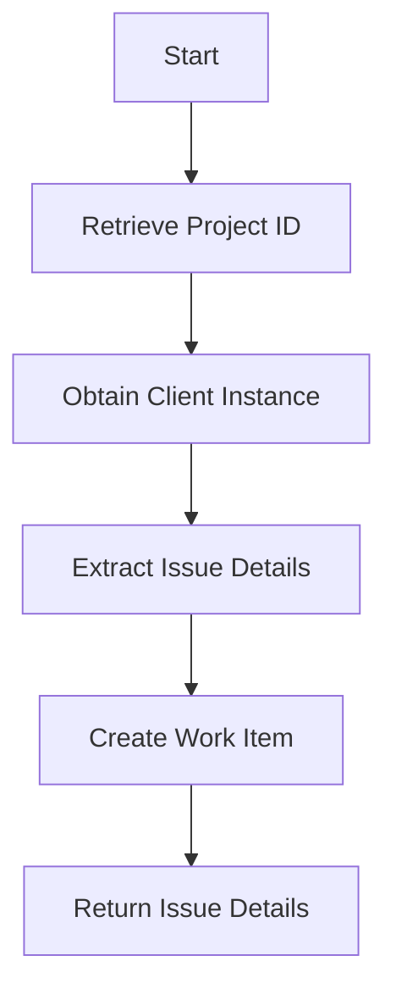

This document will cover the process of creating an issue in Azure DevOps. We'll cover:

1. Retrieving the project ID
2. Obtaining a client instance
3. Extracting issue details
4. Creating the work item
5. Returning the issue details

Technical document: <SwmLink doc-title="Creating an Issue">[Creating an Issue](/.swm/creating-an-issue.t5juouxz.sw.md)</SwmLink>

# [Retrieving the Project ID](https://app.swimm.io/repos/Z2l0aHViJTNBJTNBc2VudHJ5LWRlbW8tMSUzQSUzQVN3aW1tLURlbW8=/docs/t5juouxz#retrieving-the-project-id)

The process begins by retrieving the project ID from the provided data. This step is essential because the project ID uniquely identifies the project within Azure DevOps where the issue will be created. If the project ID is not found in the provided data, an error is raised. This ensures that the issue is always associated with a valid project, preventing any orphaned issues that are not linked to a project.

# [Obtaining a Client Instance](https://app.swimm.io/repos/Z2l0aHViJTNBJTNBc2VudHJ5LWRlbW8tMSUzQSUzQVN3aW1tLURlbW8=/docs/t5juouxz#getting-the-client)

Next, the system obtains a client instance using the `get_client` function. This client instance is necessary to interact with Azure DevOps. The function checks the current silo mode and retrieves the default identity if necessary. It also ensures that the domain name is correctly set by calling the `_check_domain_name` function. Finally, it returns a new `VstsApiClient` instance configured with the base URL, OAuth redirect URL, organization integration ID, and identity ID. This step is crucial for establishing a secure and authenticated connection to Azure DevOps.

# [Extracting Issue Details](https://app.swimm.io/repos/Z2l0aHViJTNBJTNBc2VudHJ5LWRlbW8tMSUzQSUzQVN3aW1tLURlbW8=/docs/t5juouxz#extracting-issue-details)

The function then extracts the title, description, and work item type from the provided data. These details are essential for creating a meaningful and descriptive issue in Azure DevOps. The title provides a brief summary of the issue, the description offers more detailed information, and the work item type categorizes the issue (e.g., bug, task, feature). This step ensures that all necessary information is gathered before attempting to create the issue.

# [Creating the Work Item](https://app.swimm.io/repos/Z2l0aHViJTNBJTNBc2VudHJ5LWRlbW8tMSUzQSUzQVN3aW1tLURlbW8=/docs/t5juouxz#creating-an-issue)

Using the client instance, the function attempts to create a work item in Azure DevOps with the extracted information. This involves sending a request to Azure DevOps with the project ID, work item type, title, and description. If the creation is successful, Azure DevOps returns a response containing the details of the newly created work item. This step is critical as it actually creates the issue in the Azure DevOps project, making it visible and actionable for the team.

# [Returning the Issue Details](https://app.swimm.io/repos/Z2l0aHViJTNBJTNBc2VudHJ5LWRlbW8tMSUzQSUzQVN3aW1tLURlbW8=/docs/t5juouxz#returning-the-issue-details)

If the work item is successfully created, the function returns a dictionary containing the issue ID, title, description, and metadata. This information is useful for tracking and referencing the issue within the application. It allows users to see the details of the created issue and provides a way to link back to the issue in Azure DevOps. This final step ensures that the application has all the necessary information about the newly created issue.

&nbsp;

*This is an auto-generated document by Swimm AI 🌊 and has not yet been verified by a human*

<SwmMeta version="3.0.0" repo-id="Z2l0aHViJTNBJTNBc2VudHJ5LWRlbW8tMSUzQSUzQVN3aW1tLURlbW8=" repo-name="sentry-demo-1" doc-type="product-flows">Powered by [Swimm](/)</SwmMeta>
