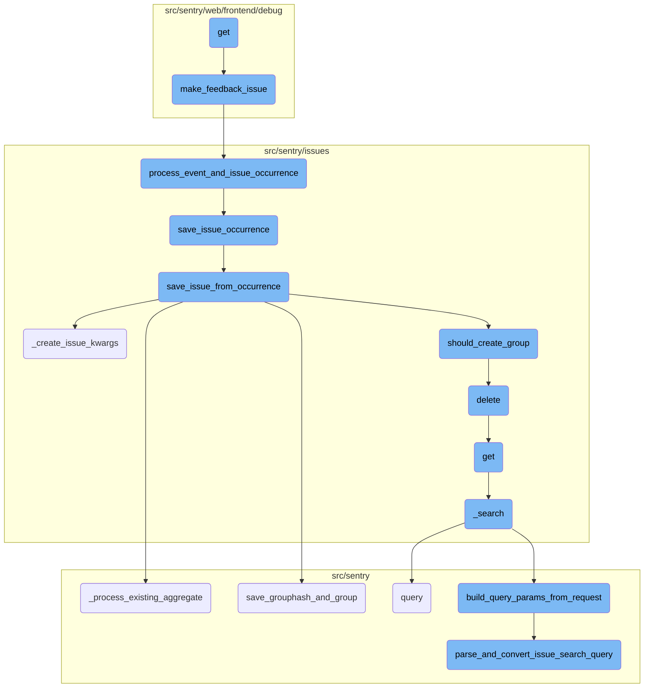
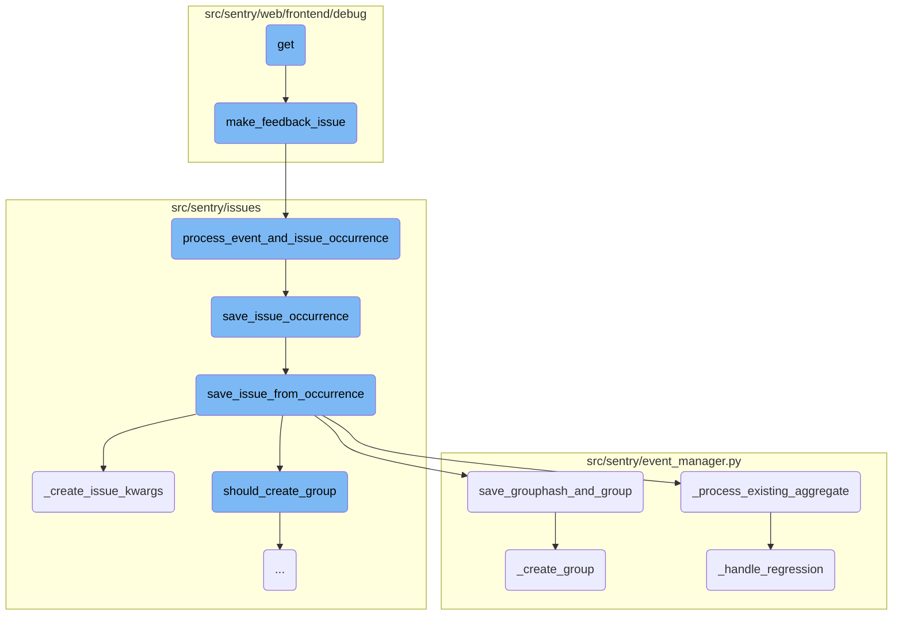
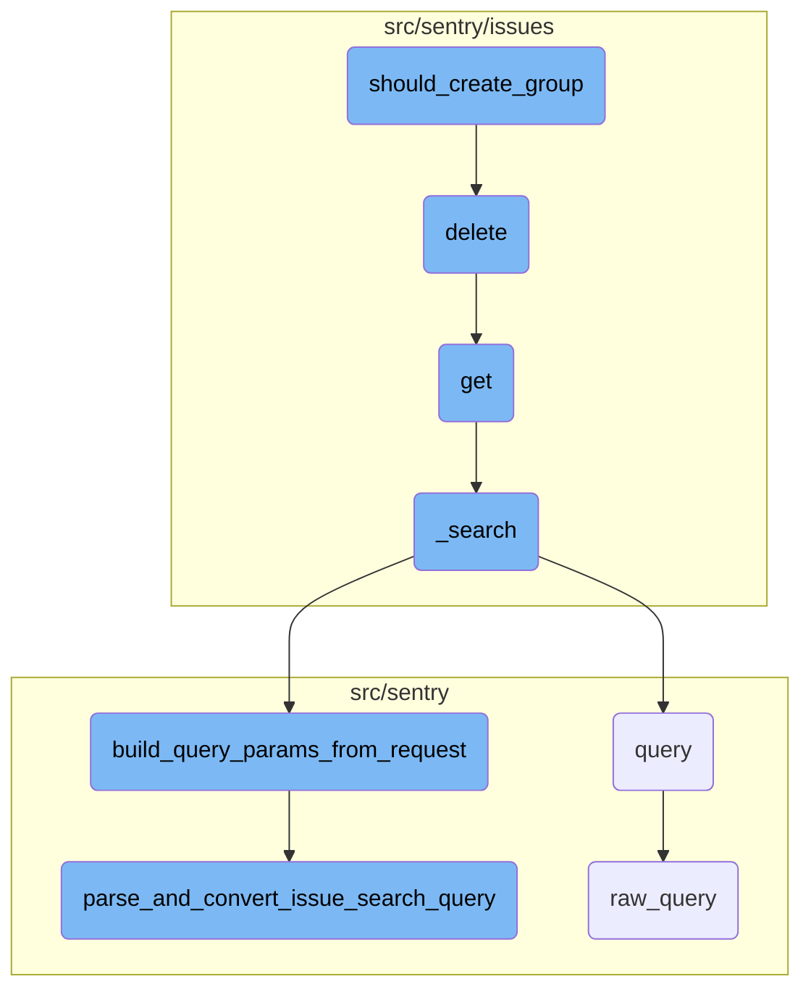

This document explains the flow of creating and processing feedback issues. It covers the initialization of an organization and project, the creation of a feedback issue, and the subsequent processing of the event and issue occurrence.

The flow starts with initializing an organization and project. Then, a feedback issue is created, which involves generating a unique event ID and processing the event and issue occurrence. The event is validated, saved, and associated with a release. Finally, the issue is further processed and saved, including handling any potential regressions.

Here is a high level diagram of the flow, showing only the most important functions:



# Flow drill down

First, we'll zoom into this section of the flow:



<SwmSnippet path="/src/sentry/web/frontend/debug/debug_feedback_issue.py" line="15">

---

## Creating a Feedback Issue

The <SwmToken path="src/sentry/web/frontend/debug/debug_feedback_issue.py" pos="15:3:3" line-data="    def get(self, request):">`get`</SwmToken> function initializes an organization and project, then creates a feedback issue by calling <SwmToken path="src/sentry/web/frontend/debug/debug_feedback_issue.py" pos="19:5:5" line-data="        event = make_feedback_issue(project)">`make_feedback_issue`</SwmToken>. It prepares the context for rendering an email preview, including details about the issue, rules, and project.

```python
    def get(self, request):
        org = Organization(id=1, slug="example", name="Example")
        project = Project(id=1, slug="example", name="Example", organization=org)

        event = make_feedback_issue(project)
        group = event.group

        rule = Rule(id=1, label="An example rule")

        generic_issue_data_html = get_generic_data(event)
        section_header = "Issue Data" if generic_issue_data_html else ""
        return MailPreview(
            html_template="sentry/emails/feedback.html",
            text_template="sentry/emails/feedback.txt",
            context={
                "rule": rule,
                "rules": get_rules([rule], org, project),
                "group": group,
                "event": event,
                "timezone": settings.SENTRY_DEFAULT_TIME_ZONE,
                "link": get_group_settings_link(group, None, get_rules([rule], org, project), 1337),
```

---

</SwmSnippet>

<SwmSnippet path="/src/sentry/web/frontend/debug/mail.py" line="256">

---

## Making a Feedback Issue

The <SwmToken path="src/sentry/web/frontend/debug/mail.py" pos="256:2:2" line-data="def make_feedback_issue(project):">`make_feedback_issue`</SwmToken> function generates a unique event ID and processes the event and issue occurrence using <SwmToken path="src/sentry/web/frontend/debug/mail.py" pos="263:8:8" line-data="    occurrence, group_info = process_event_and_issue_occurrence(">`process_event_and_issue_occurrence`</SwmToken>. It ensures a group is found and returns the latest event for the feedback issue.

```python
def make_feedback_issue(project):
    event_id = uuid.uuid4().hex
    occurrence_data = TEST_FEEDBACK_ISSUE_OCCURENCE.to_dict()
    occurrence_data["event_id"] = event_id
    occurrence_data["fingerprint"] = [
        md5(part.encode("utf-8")).hexdigest() for part in occurrence_data["fingerprint"]
    ]
    occurrence, group_info = process_event_and_issue_occurrence(
        occurrence_data,
        {
            "event_id": event_id,
            "project_id": project.id,
            "timestamp": before_now(minutes=1).isoformat(),
            "tags": [("logger", "javascript"), ("environment", "prod"), ("replayId", REPLAY_ID)],
        },
    )
    if not group_info:
        raise ValueError("No group found")
    feedback_issue = group_info.group
    return feedback_issue.get_latest_event()
```

---

</SwmSnippet>

<SwmSnippet path="/src/sentry/issues/occurrence_consumer.py" line="116">

---

## Processing Event and Issue Occurrence

The <SwmToken path="src/sentry/issues/occurrence_consumer.py" pos="116:2:2" line-data="def process_event_and_issue_occurrence(">`process_event_and_issue_occurrence`</SwmToken> function validates the event ID, saves the event, and then calls <SwmToken path="src/sentry/issues/occurrence_consumer.py" pos="126:6:6" line-data="        &quot;occurrence_consumer._process_message.save_issue_occurrence&quot;,">`save_issue_occurrence`</SwmToken> to handle the occurrence data and event.

```python
def process_event_and_issue_occurrence(
    occurrence_data: IssueOccurrenceData, event_data: dict[str, Any]
) -> tuple[IssueOccurrence, GroupInfo | None]:
    if occurrence_data["event_id"] != event_data["event_id"]:
        raise ValueError(
            f"event_id in occurrence({occurrence_data['event_id']}) is different from event_id in event_data({event_data['event_id']})"
        )

    event = save_event_from_occurrence(event_data)
    with metrics.timer(
        "occurrence_consumer._process_message.save_issue_occurrence",
        tags={"method": "process_event_and_issue_occurrence"},
    ):
        return save_issue_occurrence(occurrence_data, event)
```

---

</SwmSnippet>

<SwmSnippet path="/src/sentry/issues/ingest.py" line="43">

---

## Saving Issue Occurrence

The <SwmToken path="src/sentry/issues/ingest.py" pos="43:2:2" line-data="def save_issue_occurrence(">`save_issue_occurrence`</SwmToken> function converts the occurrence data, saves it, and associates it with a release. It then calls <SwmToken path="src/sentry/issues/ingest.py" pos="60:5:5" line-data="    group_info = save_issue_from_occurrence(occurrence, event, release)">`save_issue_from_occurrence`</SwmToken> to further process and save the issue.

```python
def save_issue_occurrence(
    occurrence_data: IssueOccurrenceData, event: Event
) -> tuple[IssueOccurrence, GroupInfo | None]:
    # Convert occurrence data to `IssueOccurrence`
    occurrence = IssueOccurrence.from_dict(occurrence_data)
    if occurrence.event_id != event.event_id:
        raise ValueError("IssueOccurrence must have the same event_id as the passed Event")
    # Note: For now we trust the project id passed along with the event. Later on we should make
    # sure that this is somehow validated.
    occurrence.save()

    try:
        release = Release.get(event.project, event.release)
    except Release.DoesNotExist:
        # The release should always exist here since event has been ingested at this point, but just
        # in case it has been deleted
        release = None
    group_info = save_issue_from_occurrence(occurrence, event, release)
    if group_info:
        environment = event.get_environment()
        _get_or_create_group_environment(environment, release, [group_info])
```

---

</SwmSnippet>

<SwmSnippet path="/src/sentry/issues/ingest.py" line="166">

---

## Saving Issue from Occurrence

The <SwmToken path="src/sentry/issues/ingest.py" pos="166:2:2" line-data="def save_issue_from_occurrence(">`save_issue_from_occurrence`</SwmToken> function creates or retrieves a group for the issue, checks rate limits, and saves the group hash and group. It also processes existing aggregates and handles regressions if necessary.

```python
def save_issue_from_occurrence(
    occurrence: IssueOccurrence, event: Event, release: Release | None
) -> GroupInfo | None:
    project = event.project
    issue_kwargs = _create_issue_kwargs(occurrence, event, release)
    # We need to augment the message with occurrence data here since we can't build a `GroupEvent`
    # until after we have created a `Group`.
    issue_kwargs["message"] = augment_message_with_occurrence(issue_kwargs["message"], occurrence)

    # TODO: For now we will assume a single fingerprint. We can expand later if necessary.
    # Note that additional fingerprints won't be used to generated additional issues, they'll be
    # used to map the occurrence to a specific issue.
    new_grouphash = occurrence.fingerprint[0]
    existing_grouphash = (
        GroupHash.objects.filter(project=project, hash=new_grouphash)
        .select_related("group")
        .first()
    )

    if not existing_grouphash:
        cluster_key = settings.SENTRY_ISSUE_PLATFORM_RATE_LIMITER_OPTIONS.get("cluster", "default")
```

---

</SwmSnippet>

<SwmSnippet path="/src/sentry/event_manager.py" line="2279">

---

### Processing Existing Aggregate

The <SwmToken path="src/sentry/event_manager.py" pos="2279:2:2" line-data="def _process_existing_aggregate(">`_process_existing_aggregate`</SwmToken> function updates the group's last seen time, merges new data, and handles potential regressions by calling <SwmToken path="src/sentry/event_manager.py" pos="2095:2:2" line-data="def _handle_regression(group: Group, event: BaseEvent, release: Release | None) -&gt; bool | None:">`_handle_regression`</SwmToken>.

```python
def _process_existing_aggregate(
    group: Group,
    event: BaseEvent,
    incoming_group_values: Mapping[str, Any],
    release: Release | None,
) -> bool:
    last_seen = max(event.datetime, group.last_seen)
    updated_group_values: dict[str, Any] = {"last_seen": last_seen}
    # Unclear why this is necessary, given that it's also in `updated_group_values`, but removing
    # it causes unrelated tests to fail. Hard to say if that's the tests or the removal, though.
    group.last_seen = updated_group_values["last_seen"]

    if (
        event.search_message
        and event.search_message != group.message
        and not _is_placeholder_title(event.search_message)
        and event.get_event_type() != TransactionEvent.key
    ):
        updated_group_values["message"] = event.search_message
    if group.level != incoming_group_values["level"]:
        updated_group_values["level"] = incoming_group_values["level"]
```

---

</SwmSnippet>

<SwmSnippet path="/src/sentry/event_manager.py" line="2989">

---

### Saving Group Hash and Group

The <SwmToken path="src/sentry/event_manager.py" pos="2989:2:2" line-data="def save_grouphash_and_group(">`save_grouphash_and_group`</SwmToken> function creates or retrieves a group hash and associates it with a group. If the group is newly created, it calls <SwmToken path="src/sentry/event_manager.py" pos="2999:5:5" line-data="            group = _create_group(project, event, **group_kwargs)">`_create_group`</SwmToken>.

```python
def save_grouphash_and_group(
    project: Project,
    event: Event,
    new_grouphash: str,
    **group_kwargs: Any,
) -> tuple[Group, bool]:
    group = None
    with transaction.atomic(router.db_for_write(GroupHash)):
        group_hash, created = GroupHash.objects.get_or_create(project=project, hash=new_grouphash)
        if created:
            group = _create_group(project, event, **group_kwargs)
            group_hash.update(group=group)

    if group is None:
        # If we failed to create the group it means another worker beat us to
        # it. Since a GroupHash can only be created in a transaction with the
        # Group, we can guarantee that the Group will exist at this point and
        # fetch it via GroupHash
        group = Group.objects.get(grouphash__project=project, grouphash__hash=new_grouphash)
    return group, created
```

---

</SwmSnippet>

<SwmSnippet path="/src/sentry/issues/ingest.py" line="95">

---

### Creating Issue Arguments

The <SwmToken path="src/sentry/issues/ingest.py" pos="95:2:2" line-data="def _create_issue_kwargs(">`_create_issue_kwargs`</SwmToken> function prepares the arguments needed to create an issue, including platform, message, level, culprit, and other metadata.

```python
def _create_issue_kwargs(
    occurrence: IssueOccurrence, event: Event, release: Release | None
) -> IssueArgs:
    kwargs: IssueArgs = {
        "platform": event.platform,
        # TODO: Figure out what message should be. Or maybe we just implement a platform event and
        # define it in `search_message` there.
        "message": event.search_message,
        "level": LOG_LEVELS_MAP.get(occurrence.level),
        "culprit": occurrence.culprit,
        "last_seen": event.datetime,
        "first_seen": event.datetime,
        "active_at": event.datetime,
        "type": occurrence.type.type_id,
        "first_release": release,
        "data": materialize_metadata(occurrence, event),
        "priority": (
            occurrence.initial_issue_priority
            if occurrence.initial_issue_priority is not None
            else occurrence.type.default_priority
        ),
```

---

</SwmSnippet>

<SwmSnippet path="/src/sentry/event_manager.py" line="1921">

---

### Creating Group

The <SwmToken path="src/sentry/event_manager.py" pos="1921:2:2" line-data="def _create_group(">`_create_group`</SwmToken> function creates a new group for the issue, assigns metadata, and handles any potential errors during group creation.

```python
def _create_group(
    project: Project,
    event: Event,
    *,
    first_release: Release | None = None,
    **group_creation_kwargs: Any,
) -> Group:
    # Temporary log to debug events seeming to disappear after being sent to Seer
    if event.data.get("seer_similarity"):
        logger.info(
            "seer.similarity.pre_create_group",
            extra={
                "event_id": event.event_id,
                "hash": event.get_primary_hash(),
                "project": project.id,
            },
        )

    short_id = _get_next_short_id(project)

    # it's possible the release was deleted between
```

---

</SwmSnippet>

<SwmSnippet path="/src/sentry/event_manager.py" line="2095">

---

### Handling Regression

The <SwmToken path="src/sentry/event_manager.py" pos="2095:2:2" line-data="def _handle_regression(group: Group, event: BaseEvent, release: Release | None) -&gt; bool | None:">`_handle_regression`</SwmToken> function checks if the group is resolved and determines if the issue is a regression. If it is, it updates the group's status and records the regression.

```python
def _handle_regression(group: Group, event: BaseEvent, release: Release | None) -> bool | None:
    if not group.is_resolved():
        return None

    # we only mark it as a regression if the event's release is newer than
    # the release which we originally marked this as resolved
    elif GroupResolution.has_resolution(group, release):
        return None

    elif has_pending_commit_resolution(group):
        return None

    if not plugin_is_regression(group, event):
        return None

    # we now think its a regression, rely on the database to validate that
    # no one beat us to this
    date = max(event.datetime, group.last_seen)
    is_regression = bool(
        Group.objects.filter(
            id=group.id,
```

---

</SwmSnippet>

Now, lets zoom into this section of the flow:



<SwmSnippet path="/src/sentry/issues/grouptype.py" line="603">

---

## Determining group creation based on noise configuration

The function <SwmToken path="src/sentry/issues/grouptype.py" pos="613:4:4" line-data="        &quot;noise_reduction.should_create_group.threshold&quot;,">`should_create_group`</SwmToken> determines whether a new group should be created based on the noise configuration of the <SwmToken path="src/sentry/issues/grouptype.py" pos="605:5:5" line-data="    noise_config = grouptype.noise_config">`grouptype`</SwmToken>. It increments a counter for the group hash and checks if the number of occurrences exceeds a predefined threshold. If the threshold is exceeded, the group hash is deleted, and the function returns `True`, indicating that a new group should be created. Otherwise, it sets an expiration for the counter and returns `False`.

```python
    key = f"grouphash:{grouphash}:{project.id}"
    times_seen = client.incr(key)
    noise_config = grouptype.noise_config

    if not noise_config:
        return True

    over_threshold = times_seen >= noise_config.ignore_limit

    metrics.incr(
        "noise_reduction.should_create_group.threshold",
        tags={
            "over_threshold": over_threshold,
            "group_type": grouptype.slug,
        },
        sample_rate=1.0,
    )

    if over_threshold:
        client.delete(grouphash)
        return True
```

---

</SwmSnippet>

&nbsp;

*This is an auto-generated document by Swimm AI 🌊 and has not yet been verified by a human*

<SwmMeta version="3.0.0" repo-id="Z2l0aHViJTNBJTNBc2VudHJ5LWRlbW8tMSUzQSUzQVN3aW1tLURlbW8=" repo-name="sentry-demo-1" doc-type="flows"><sup>Powered by [Swimm](/)</sup></SwmMeta>
