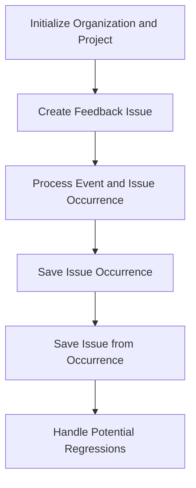

This document will cover the process of creating and processing feedback issues. We'll cover:

1. Initializing an organization and project
2. Creating a feedback issue
3. Processing the event and issue occurrence
4. Saving the issue occurrence
5. Saving the issue from occurrence
6. Handling potential regressions

Technical document: <SwmLink doc-title="Creating and Processing Feedback Issues">[Creating and Processing Feedback Issues](/.swm/creating-and-processing-feedback-issues.b5jbdvxz.sw.md)</SwmLink>

# [Initializing an organization and project](https://app.swimm.io/repos/Z2l0aHViJTNBJTNBc2VudHJ5LWRlbW8tMSUzQSUzQVN3aW1tLURlbW8=/docs/b5jbdvxz#creating-a-feedback-issue)

The process begins by initializing an organization and project. This step sets up the necessary context for creating a feedback issue. The organization and project are identified by unique IDs and slugs, which are used to ensure that the feedback issue is correctly associated with the right context. This initialization is crucial for maintaining the integrity and traceability of the feedback issue within the system.

# [Creating a feedback issue](https://app.swimm.io/repos/Z2l0aHViJTNBJTNBc2VudHJ5LWRlbW8tMSUzQSUzQVN3aW1tLURlbW8=/docs/b5jbdvxz#making-a-feedback-issue)

Once the organization and project are initialized, a feedback issue is created. This involves generating a unique event ID to ensure that each feedback issue can be uniquely identified. The feedback issue is then processed to associate it with the correct project and timestamp. This step ensures that the feedback issue is accurately recorded and can be tracked over time.

# [Processing the event and issue occurrence](https://app.swimm.io/repos/Z2l0aHViJTNBJTNBc2VudHJ5LWRlbW8tMSUzQSUzQVN3aW1tLURlbW8=/docs/b5jbdvxz#processing-event-and-issue-occurrence)

The next step is to process the event and issue occurrence. This involves validating the event ID to ensure it matches the expected format and is unique. The event is then saved, and the occurrence data is processed to associate it with the correct event. This step is essential for ensuring that the feedback issue is accurately recorded and can be analyzed for further action.

# [Saving the issue occurrence](https://app.swimm.io/repos/Z2l0aHViJTNBJTNBc2VudHJ5LWRlbW8tMSUzQSUzQVN3aW1tLURlbW8=/docs/b5jbdvxz#saving-issue-occurrence)

After processing the event and issue occurrence, the issue occurrence is saved. This involves converting the occurrence data into a format that can be stored in the system. The occurrence is then associated with a release, ensuring that it is linked to the correct version of the project. This step is crucial for maintaining the traceability of the feedback issue and ensuring that it can be accurately analyzed in the context of the project's development lifecycle.

# [Saving the issue from occurrence](https://app.swimm.io/repos/Z2l0aHViJTNBJTNBc2VudHJ5LWRlbW8tMSUzQSUzQVN3aW1tLURlbW8=/docs/b5jbdvxz#saving-issue-from-occurrence)

The next step is to save the issue from the occurrence. This involves creating or retrieving a group for the issue, which helps in organizing and categorizing the feedback issues. The system checks for rate limits to ensure that the feedback issues are processed efficiently. The group hash and group are then saved, ensuring that the feedback issue is correctly categorized and can be easily retrieved for further analysis.

# [Handling potential regressions](https://app.swimm.io/repos/Z2l0aHViJTNBJTNBc2VudHJ5LWRlbW8tMSUzQSUzQVN3aW1tLURlbW8=/docs/b5jbdvxz#handling-regression)

The final step in the process is to handle any potential regressions. This involves checking if the group is resolved and determining if the issue is a regression. If it is, the group's status is updated, and the regression is recorded. This step is essential for ensuring that any recurring issues are identified and addressed promptly, helping to maintain the quality and reliability of the project.

&nbsp;

*This is an auto-generated document by Swimm AI 🌊 and has not yet been verified by a human*

<SwmMeta version="3.0.0" repo-id="Z2l0aHViJTNBJTNBc2VudHJ5LWRlbW8tMSUzQSUzQVN3aW1tLURlbW8=" repo-name="sentry-demo-1" doc-type="product-flows">Powered by [Swimm](/)</SwmMeta>
