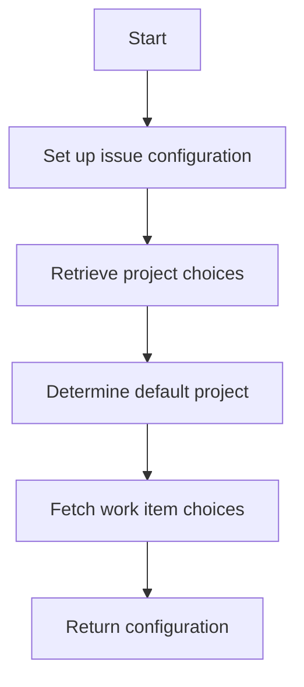

This document will cover the process of creating issue configurations without a group in the VSTS integration. We'll cover:

1. Setting up the issue configuration
2. Retrieving project choices
3. Determining default projects
4. Fetching work item choices.

Technical document: <SwmLink doc-title="Creating Issue Configurations Without a Group">[Creating Issue Configurations Without a Group](/.swm/creating-issue-configurations-without-a-group.qep6p6vj.sw.md)</SwmLink>

# [Setting up the issue configuration](https://app.swimm.io/repos/Z2l0aHViJTNBJTNBc2VudHJ5LWRlbW8tMSUzQSUzQVN3aW1tLURlbW8=/docs/qep6p6vj#get_create_issue_config_no_group)

The process begins by setting up the issue configuration without a group. This involves initializing the configuration setup and preparing to retrieve necessary project and work item details. The absence of a group means that the configuration will be more general and not tied to any specific group context.

# [Retrieving project choices](https://app.swimm.io/repos/Z2l0aHViJTNBJTNBc2VudHJ5LWRlbW8tMSUzQSUzQVN3aW1tLURlbW8=/docs/qep6p6vj#get_project_choices)

Next, we retrieve the available project choices. This step involves calling the VSTS client to fetch a list of projects. These projects are then formatted into a list of tuples containing project IDs and names. This list will be used to present the user with options for selecting a project when creating an issue.

# [Determining default projects](https://app.swimm.io/repos/Z2l0aHViJTNBJTNBc2VudHJ5LWRlbW8tMSUzQSUzQVN3aW1tLURlbW8=/docs/qep6p6vj#get_project_choices)

After retrieving the project choices, we determine a default project. This is done by checking if a specific project is provided or if there is a default project associated with the group. If neither is available, the first project in the list is selected as the default. This ensures that there is always a pre-selected project for the user, streamlining the issue creation process.

# [Fetching work item choices](https://app.swimm.io/repos/Z2l0aHViJTNBJTNBc2VudHJ5LWRlbW8tMSUzQSUzQVN3aW1tLURlbW8=/docs/qep6p6vj#get_work_item_choices)

Once the default project is determined, we fetch the available work item choices for that project. This involves using the VSTS client to retrieve work item categories and processing them to create a list of unique work item types. A default work item type is also determined based on previous usage or the first item in the list. This step ensures that users have relevant work item types to choose from when creating an issue.

&nbsp;

*This is an auto-generated document by Swimm AI 🌊 and has not yet been verified by a human*

<SwmMeta version="3.0.0" repo-id="Z2l0aHViJTNBJTNBc2VudHJ5LWRlbW8tMSUzQSUzQVN3aW1tLURlbW8=" repo-name="sentry-demo-1" doc-type="product-flows">Powered by [Swimm](/)</SwmMeta>
