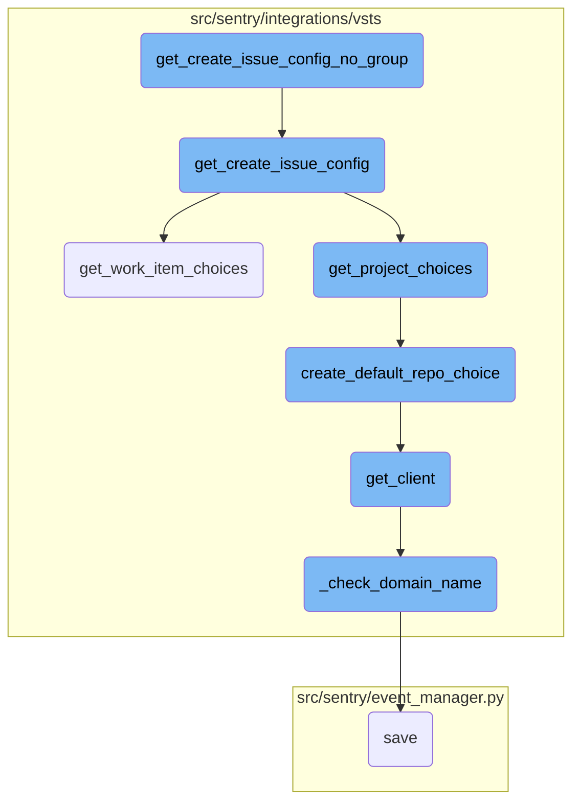

In this document, we will explain the process of creating issue configurations without a group in the VSTS integration. This involves several steps, including retrieving project choices, determining default projects, and fetching work item choices.

The flow starts by calling a function that sets up the issue configuration without a group. This function then calls another function to get the issue configuration, which involves setting a link referrer and initializing fields. If a group is provided, it populates fields by calling a superclass method. Next, it retrieves project choices and determines a default project. If a default project is found, it retrieves work item choices and determines a default work item. Finally, it returns a list of configuration dictionaries for the project and work item type, along with any additional fields.

Here is a high level diagram of the flow, showing only the most important functions:



# Flow drill down

First, we'll zoom into this section of the flow:

```mermaid
graph TD;
      subgraph src/sentry/integrations/vsts/issues.py
0734d4d1763a43ce6ed51a33434a6134f16e74eff117a830328122a71d9e45e7(get_create_issue_config_no_group):::mainFlowStyle --> 8ac8477a6f1df31e8875fa4c67a5b4bd1b7efae5cf9fd674e9b9bb46bd665c2b(get_create_issue_config):::mainFlowStyle
end

subgraph src/sentry/integrations/vsts/issues.py
8ac8477a6f1df31e8875fa4c67a5b4bd1b7efae5cf9fd674e9b9bb46bd665c2b(get_create_issue_config):::mainFlowStyle --> f09bccced689455b16fe469c2d11e12a204f55294bf6d4e76ca0aa5b82e95f97(get_work_item_choices)
end

subgraph src/sentry/integrations/vsts/issues.py
8ac8477a6f1df31e8875fa4c67a5b4bd1b7efae5cf9fd674e9b9bb46bd665c2b(get_create_issue_config):::mainFlowStyle --> 59a13a3b2c5b51c2714e5fdbace49644403ffccbe10407047dfe915c81ee1a3f(get_project_choices):::mainFlowStyle
end

subgraph src/sentry/integrations/vsts/issues.py
59a13a3b2c5b51c2714e5fdbace49644403ffccbe10407047dfe915c81ee1a3f(get_project_choices):::mainFlowStyle --> l7g9u(...)
end


      classDef mainFlowStyle color:#000000,fill:#7CB9F4
classDef rootsStyle color:#000000,fill:#00FFF4
classDef Style1 color:#000000,fill:#00FFAA
classDef Style2 color:#000000,fill:#FFFF00
classDef Style3 color:#000000,fill:#AA7CB9

%% Swimm:
%% graph TD;
%%       subgraph <SwmPath>[src/sentry/integrations/vsts/issues.py](src/sentry/integrations/vsts/issues.py)</SwmPath>
%% 0734d4d1763a43ce6ed51a33434a6134f16e74eff117a830328122a71d9e45e7(get_create_issue_config_no_group):::mainFlowStyle --> 8ac8477a6f1df31e8875fa4c67a5b4bd1b7efae5cf9fd674e9b9bb46bd665c2b(get_create_issue_config):::mainFlowStyle
%% end
%% 
%% subgraph <SwmPath>[src/sentry/integrations/vsts/issues.py](src/sentry/integrations/vsts/issues.py)</SwmPath>
%% 8ac8477a6f1df31e8875fa4c67a5b4bd1b7efae5cf9fd674e9b9bb46bd665c2b(get_create_issue_config):::mainFlowStyle --> f09bccced689455b16fe469c2d11e12a204f55294bf6d4e76ca0aa5b82e95f97(get_work_item_choices)
%% end
%% 
%% subgraph <SwmPath>[src/sentry/integrations/vsts/issues.py](src/sentry/integrations/vsts/issues.py)</SwmPath>
%% 8ac8477a6f1df31e8875fa4c67a5b4bd1b7efae5cf9fd674e9b9bb46bd665c2b(get_create_issue_config):::mainFlowStyle --> 59a13a3b2c5b51c2714e5fdbace49644403ffccbe10407047dfe915c81ee1a3f(get_project_choices):::mainFlowStyle
%% end
%% 
%% subgraph <SwmPath>[src/sentry/integrations/vsts/issues.py](src/sentry/integrations/vsts/issues.py)</SwmPath>
%% 59a13a3b2c5b51c2714e5fdbace49644403ffccbe10407047dfe915c81ee1a3f(get_project_choices):::mainFlowStyle --> l7g9u(...)
%% end
%% 
%% 
%%       classDef mainFlowStyle color:#000000,fill:#7CB9F4
%% classDef rootsStyle color:#000000,fill:#00FFF4
%% classDef Style1 color:#000000,fill:#00FFAA
%% classDef Style2 color:#000000,fill:#FFFF00
%% classDef Style3 color:#000000,fill:#AA7CB9
```



<SwmSnippet path="/src/sentry/integrations/vsts/issues.py" line="111">

---

## <SwmToken path="src/sentry/integrations/vsts/issues.py" pos="111:3:3" line-data="    def get_create_issue_config_no_group(self, project: str) -&gt; Sequence[Mapping[str, Any]]:">`get_create_issue_config_no_group`</SwmToken>

The function <SwmToken path="src/sentry/integrations/vsts/issues.py" pos="111:3:3" line-data="    def get_create_issue_config_no_group(self, project: str) -&gt; Sequence[Mapping[str, Any]]:">`get_create_issue_config_no_group`</SwmToken> is a simple wrapper that calls <SwmToken path="src/sentry/integrations/vsts/issues.py" pos="112:5:5" line-data="        return self.get_create_issue_config(None, None, project=project)">`get_create_issue_config`</SwmToken> with `None` values for <SwmToken path="src/sentry/integrations/vsts/issues.py" pos="53:3:3" line-data="        if group:">`group`</SwmToken> and <SwmToken path="src/sentry/integrations/vsts/issues.py" pos="116:15:15" line-data="        self, group: Optional[&quot;Group&quot;], user: RpcUser | None, **kwargs: Any">`user`</SwmToken>, and passes the <SwmToken path="src/sentry/integrations/vsts/issues.py" pos="111:8:8" line-data="    def get_create_issue_config_no_group(self, project: str) -&gt; Sequence[Mapping[str, Any]]:">`project`</SwmToken> parameter.

```python
    def get_create_issue_config_no_group(self, project: str) -> Sequence[Mapping[str, Any]]:
        return self.get_create_issue_config(None, None, project=project)
```

---

</SwmSnippet>

<SwmSnippet path="/src/sentry/integrations/vsts/issues.py" line="115">

---

## <SwmToken path="src/sentry/integrations/vsts/issues.py" pos="115:3:3" line-data="    def get_create_issue_config(">`get_create_issue_config`</SwmToken>

The function <SwmToken path="src/sentry/integrations/vsts/issues.py" pos="115:3:3" line-data="    def get_create_issue_config(">`get_create_issue_config`</SwmToken> constructs the configuration needed to create an issue. It first sets a <SwmToken path="src/sentry/integrations/vsts/issues.py" pos="118:4:4" line-data="        kwargs[&quot;link_referrer&quot;] = &quot;vsts_integration&quot;">`link_referrer`</SwmToken> and initializes an empty <SwmToken path="src/sentry/integrations/vsts/issues.py" pos="119:1:1" line-data="        fields = []">`fields`</SwmToken> list. If a <SwmToken path="src/sentry/integrations/vsts/issues.py" pos="116:4:4" line-data="        self, group: Optional[&quot;Group&quot;], user: RpcUser | None, **kwargs: Any">`group`</SwmToken> is provided, it populates <SwmToken path="src/sentry/integrations/vsts/issues.py" pos="119:1:1" line-data="        fields = []">`fields`</SwmToken> by calling a superclass method. It then retrieves project choices and default project using <SwmToken path="src/sentry/integrations/vsts/issues.py" pos="124:10:10" line-data="        default_project, project_choices = self.get_project_choices(group, **kwargs)">`get_project_choices`</SwmToken>. If a default project is found, it retrieves work item choices and default work item using <SwmToken path="src/sentry/integrations/vsts/issues.py" pos="129:10:10" line-data="            default_work_item, work_item_choices = self.get_work_item_choices(">`get_work_item_choices`</SwmToken>. Finally, it returns a list of configuration dictionaries for the project and work item type, along with any additional fields.

```python
    def get_create_issue_config(
        self, group: Optional["Group"], user: RpcUser | None, **kwargs: Any
    ) -> Sequence[Mapping[str, Any]]:
        kwargs["link_referrer"] = "vsts_integration"
        fields = []
        if group:
            fields = super().get_create_issue_config(group, user, **kwargs)
            # Azure/VSTS has BOTH projects and repositories. A project can have many repositories.
            # Workitems (issues) are associated with the project not the repository.
        default_project, project_choices = self.get_project_choices(group, **kwargs)

        work_item_choices: Sequence[tuple[str, str]] = []
        default_work_item: str | None = None
        if default_project:
            default_work_item, work_item_choices = self.get_work_item_choices(
                default_project, group
            )

        return [
            {
                "name": "project",
```

---

</SwmSnippet>

<SwmSnippet path="/src/sentry/integrations/vsts/issues.py" line="80">

---

### <SwmToken path="src/sentry/integrations/vsts/issues.py" pos="80:3:3" line-data="    def get_work_item_choices(">`get_work_item_choices`</SwmToken>

The function <SwmToken path="src/sentry/integrations/vsts/issues.py" pos="80:3:3" line-data="    def get_work_item_choices(">`get_work_item_choices`</SwmToken> retrieves available work item types for a given project. It uses a client to fetch work item categories and processes them to create a list of unique work item types. It also attempts to determine a default work item type based on previous usage or the first item in the list.

```python
    def get_work_item_choices(
        self, project: str, group: Optional["Group"] = None
    ) -> tuple[str | None, Sequence[tuple[str, str]]]:
        client = self.get_client()
        try:
            item_categories = client.get_work_item_categories(project)["value"]
        except (ApiError, ApiUnauthorized, KeyError) as e:
            self.raise_error(e)

        item_type_map = {}
        for item in item_categories:
            for item_type_object in item["workItemTypes"]:
                # the type is the last part of the url
                item_type = item_type_object["url"].split("/")[-1]
                # we can have duplicates so need to dedupe
                if item_type not in item_type_map:
                    item_type_map[item_type] = item_type_object["name"]

        item_tuples = list(item_type_map.items())

        # try to get the default from either the last value used or from the first item on the list
```

---

</SwmSnippet>

Now, lets zoom into this section of the flow:

```mermaid
graph TD;
      subgraph src/sentry/integrations/vsts
59a13a3b2c5b51c2714e5fdbace49644403ffccbe10407047dfe915c81ee1a3f(get_project_choices):::mainFlowStyle --> 998c84125b0ccd15527e000078ccb4889ac088a2da4fed55e1ef6401ee58af94(create_default_repo_choice):::mainFlowStyle
end

subgraph src/sentry/integrations/vsts
998c84125b0ccd15527e000078ccb4889ac088a2da4fed55e1ef6401ee58af94(create_default_repo_choice):::mainFlowStyle --> 0929df67669e089b92a784392a4caa0c21baeadfd85263fa34c49a09c193b3d1(get_client):::mainFlowStyle
end

subgraph src/sentry/integrations/vsts
0929df67669e089b92a784392a4caa0c21baeadfd85263fa34c49a09c193b3d1(get_client):::mainFlowStyle --> 7f10adeb955518d0b9ce9a18ae73cf60c8e87d6b2b7bc87f5b2addc217981d21(_check_domain_name):::mainFlowStyle
end


      classDef mainFlowStyle color:#000000,fill:#7CB9F4
classDef rootsStyle color:#000000,fill:#00FFF4
classDef Style1 color:#000000,fill:#00FFAA
classDef Style2 color:#000000,fill:#FFFF00
classDef Style3 color:#000000,fill:#AA7CB9

%% Swimm:
%% graph TD;
%%       subgraph <SwmPath>[src/sentry/integrations/vsts/](src/sentry/integrations/vsts/)</SwmPath>
%% 59a13a3b2c5b51c2714e5fdbace49644403ffccbe10407047dfe915c81ee1a3f(get_project_choices):::mainFlowStyle --> 998c84125b0ccd15527e000078ccb4889ac088a2da4fed55e1ef6401ee58af94(create_default_repo_choice):::mainFlowStyle
%% end
%% 
%% subgraph <SwmPath>[src/sentry/integrations/vsts/](src/sentry/integrations/vsts/)</SwmPath>
%% 998c84125b0ccd15527e000078ccb4889ac088a2da4fed55e1ef6401ee58af94(create_default_repo_choice):::mainFlowStyle --> 0929df67669e089b92a784392a4caa0c21baeadfd85263fa34c49a09c193b3d1(get_client):::mainFlowStyle
%% end
%% 
%% subgraph <SwmPath>[src/sentry/integrations/vsts/](src/sentry/integrations/vsts/)</SwmPath>
%% 0929df67669e089b92a784392a4caa0c21baeadfd85263fa34c49a09c193b3d1(get_client):::mainFlowStyle --> 7f10adeb955518d0b9ce9a18ae73cf60c8e87d6b2b7bc87f5b2addc217981d21(_check_domain_name):::mainFlowStyle
%% end
%% 
%% 
%%       classDef mainFlowStyle color:#000000,fill:#7CB9F4
%% classDef rootsStyle color:#000000,fill:#00FFF4
%% classDef Style1 color:#000000,fill:#00FFAA
%% classDef Style2 color:#000000,fill:#FFFF00
%% classDef Style3 color:#000000,fill:#AA7CB9
```



<SwmSnippet path="/src/sentry/integrations/vsts/issues.py" line="43">

---

## <SwmToken path="src/sentry/integrations/vsts/issues.py" pos="124:10:10" line-data="        default_project, project_choices = self.get_project_choices(group, **kwargs)">`get_project_choices`</SwmToken>

The function <SwmToken path="src/sentry/integrations/vsts/issues.py" pos="124:10:10" line-data="        default_project, project_choices = self.get_project_choices(group, **kwargs)">`get_project_choices`</SwmToken> is responsible for retrieving a list of project choices from the VSTS client. It first calls <SwmToken path="src/sentry/integrations/vsts/issues.py" pos="43:7:7" line-data="        client = self.get_client()">`get_client`</SwmToken> to obtain the client instance and then fetches the projects using <SwmToken path="src/sentry/integrations/vsts/issues.py" pos="45:5:9" line-data="            projects = client.get_projects()">`client.get_projects()`</SwmToken>. The projects are then formatted into a list of tuples containing project IDs and names. The function also determines a default project based on the provided parameters or the first project in the list. If the default project is not in the list of project choices, it uses <SwmToken path="src/sentry/integrations/vsts/issues.py" pos="35:3:3" line-data="    def create_default_repo_choice(self, default_repo: str) -&gt; tuple[str, str]:">`create_default_repo_choice`</SwmToken> to add it.

```python
        client = self.get_client()
        try:
            projects = client.get_projects()
        except (ApiError, ApiUnauthorized, KeyError) as e:
            self.raise_error(e)

        project_choices = [(project["id"], project["name"]) for project in projects]

        params = kwargs.get("params", {})
        project = kwargs.get("project")
        if group:
            default_project_id = group.project_id
        elif project:
            default_project_id = project.id
        else:
            default_project_id = projects[0]["id"]
        defaults = self.get_project_defaults(default_project_id)
        try:
            default_project = params.get(
                "project", defaults.get("project") or project_choices[0][0]
            )
```

---

</SwmSnippet>

<SwmSnippet path="/src/sentry/integrations/vsts/issues.py" line="37">

---

### <SwmToken path="src/sentry/integrations/vsts/issues.py" pos="35:3:3" line-data="    def create_default_repo_choice(self, default_repo: str) -&gt; tuple[str, str]:">`create_default_repo_choice`</SwmToken>

The function <SwmToken path="src/sentry/integrations/vsts/issues.py" pos="35:3:3" line-data="    def create_default_repo_choice(self, default_repo: str) -&gt; tuple[str, str]:">`create_default_repo_choice`</SwmToken> is used within <SwmToken path="src/sentry/integrations/vsts/issues.py" pos="124:10:10" line-data="        default_project, project_choices = self.get_project_choices(group, **kwargs)">`get_project_choices`</SwmToken> to create a default repository choice if the selected project is not in the initial list of project choices. It fetches the project details using the client and returns a tuple of the project's ID and name.

```python
        project = self.get_client().get_project(default_repo)
        return (project["id"], project["name"])
```

---

</SwmSnippet>

<SwmSnippet path="/src/sentry/integrations/vsts/integration.py" line="135">

---

### <SwmToken path="src/sentry/integrations/vsts/issues.py" pos="37:7:7" line-data="        project = self.get_client().get_project(default_repo)">`get_client`</SwmToken>

The function <SwmToken path="src/sentry/integrations/vsts/issues.py" pos="37:7:7" line-data="        project = self.get_client().get_project(default_repo)">`get_client`</SwmToken> is called within <SwmToken path="src/sentry/integrations/vsts/issues.py" pos="124:10:10" line-data="        default_project, project_choices = self.get_project_choices(group, **kwargs)">`get_project_choices`</SwmToken> to obtain an instance of <SwmToken path="src/sentry/integrations/vsts/integration.py" pos="145:3:3" line-data="        return VstsApiClient(">`VstsApiClient`</SwmToken>. It ensures that the necessary authentication and domain checks are performed before returning the client instance.

```python
        base_url = self.instance
        if SiloMode.get_current_mode() != SiloMode.REGION:
            if self.default_identity is None:
                self.default_identity = self.get_default_identity()
            self._check_domain_name(self.default_identity)

        if self.org_integration is None:
            raise Exception("self.org_integration is not defined")
        if self.org_integration.default_auth_id is None:
            raise Exception("self.org_integration.default_auth_id is not defined")
        return VstsApiClient(
            base_url=base_url,
            oauth_redirect_url=VstsIntegrationProvider.oauth_redirect_url,
            org_integration_id=self.org_integration.id,
            identity_id=self.org_integration.default_auth_id,
        )
```

---

</SwmSnippet>

<SwmSnippet path="/src/sentry/integrations/vsts/integration.py" line="359">

---

### <SwmToken path="src/sentry/integrations/vsts/integration.py" pos="139:3:3" line-data="            self._check_domain_name(self.default_identity)">`_check_domain_name`</SwmToken>

The function <SwmToken path="src/sentry/integrations/vsts/integration.py" pos="139:3:3" line-data="            self._check_domain_name(self.default_identity)">`_check_domain_name`</SwmToken> is used within <SwmToken path="src/sentry/integrations/vsts/issues.py" pos="37:7:7" line-data="        project = self.get_client().get_project(default_repo)">`get_client`</SwmToken> to validate and update the domain name in the integration's metadata. It ensures that the domain name is correctly formatted and updates it if necessary.

```python
        if re.match("^https://.+/$", self.model.metadata["domain_name"]):
            return

        base_url = VstsIntegrationProvider.get_base_url(
            default_identity.data["access_token"], self.model.external_id
        )
        self.model.metadata["domain_name"] = base_url
        self.model.save()
```

---

</SwmSnippet>

&nbsp;

*This is an auto-generated document by Swimm AI 🌊 and has not yet been verified by a human*

<SwmMeta version="3.0.0" repo-id="Z2l0aHViJTNBJTNBc2VudHJ5LWRlbW8tMSUzQSUzQVN3aW1tLURlbW8=" repo-name="sentry-demo-1" doc-type="flows"><sup>Powered by [Swimm](/)</sup></SwmMeta>
