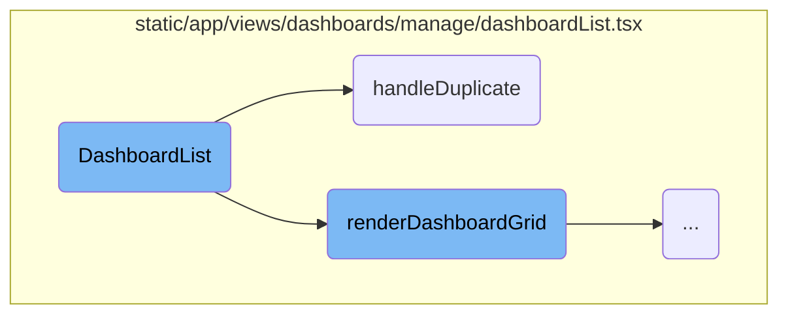

```mermaid
graph TD;
      subgraph static/app/views/dashboards/manage/dashboardList.tsx
61b458475a8669424e25e6c25df87958c1fc8fb50555ae5b091d57a3ee8b3770(renderDashboardGrid):::mainFlowStyle --> a26c9580bed24edb2ef6b5a7f3168e99755421f1d2c223f71d70fbb31d507407(renderMiniDashboards):::mainFlowStyle
end

subgraph static/app/views/dashboards/manage/dashboardList.tsx
a26c9580bed24edb2ef6b5a7f3168e99755421f1d2c223f71d70fbb31d507407(renderMiniDashboards):::mainFlowStyle --> 5acdc653783056820e9b8be38401c8093d528ab58b043bef0e42e80353568c2c(renderDropdownMenu):::mainFlowStyle
end

subgraph static/app/views/dashboards/manage/dashboardList.tsx
5acdc653783056820e9b8be38401c8093d528ab58b043bef0e42e80353568c2c(renderDropdownMenu):::mainFlowStyle --> b38cc72eaca22f2a05dd69b6154a9ef59834e30e8998e0984b1b590aeeabc664(handleDuplicate)
end

subgraph static/app/views/dashboards/manage/dashboardList.tsx
5acdc653783056820e9b8be38401c8093d528ab58b043bef0e42e80353568c2c(renderDropdownMenu):::mainFlowStyle --> cbc9d31ddebc8d49a715bcc403c852dadcd83b836d83edd976e53bae83dcb2b6(handleDelete):::mainFlowStyle
end

subgraph static/app/views/dashboards/manage/dashboardList.tsx
cbc9d31ddebc8d49a715bcc403c852dadcd83b836d83edd976e53bae83dcb2b6(handleDelete):::mainFlowStyle --> 2q83x(...)
end


      classDef mainFlowStyle color:#000000,fill:#7CB9F4
classDef rootsStyle color:#000000,fill:#00FFF4
classDef Style1 color:#000000,fill:#00FFAA
classDef Style2 color:#000000,fill:#FFFF00
classDef Style3 color:#000000,fill:#AA7CB9

%% Swimm:
%% graph TD;
%%       subgraph <SwmPath>[static/app/views/dashboards/manage/dashboardList.tsx](static/app/views/dashboards/manage/dashboardList.tsx)</SwmPath>
%% 61b458475a8669424e25e6c25df87958c1fc8fb50555ae5b091d57a3ee8b3770(renderDashboardGrid):::mainFlowStyle --> a26c9580bed24edb2ef6b5a7f3168e99755421f1d2c223f71d70fbb31d507407(renderMiniDashboards):::mainFlowStyle
%% end
%% 
%% subgraph <SwmPath>[static/app/views/dashboards/manage/dashboardList.tsx](static/app/views/dashboards/manage/dashboardList.tsx)</SwmPath>
%% a26c9580bed24edb2ef6b5a7f3168e99755421f1d2c223f71d70fbb31d507407(renderMiniDashboards):::mainFlowStyle --> 5acdc653783056820e9b8be38401c8093d528ab58b043bef0e42e80353568c2c(renderDropdownMenu):::mainFlowStyle
%% end
%% 
%% subgraph <SwmPath>[static/app/views/dashboards/manage/dashboardList.tsx](static/app/views/dashboards/manage/dashboardList.tsx)</SwmPath>
%% 5acdc653783056820e9b8be38401c8093d528ab58b043bef0e42e80353568c2c(renderDropdownMenu):::mainFlowStyle --> b38cc72eaca22f2a05dd69b6154a9ef59834e30e8998e0984b1b590aeeabc664(handleDuplicate)
%% end
%% 
%% subgraph <SwmPath>[static/app/views/dashboards/manage/dashboardList.tsx](static/app/views/dashboards/manage/dashboardList.tsx)</SwmPath>
%% 5acdc653783056820e9b8be38401c8093d528ab58b043bef0e42e80353568c2c(renderDropdownMenu):::mainFlowStyle --> cbc9d31ddebc8d49a715bcc403c852dadcd83b836d83edd976e53bae83dcb2b6(handleDelete):::mainFlowStyle
%% end
%% 
%% subgraph <SwmPath>[static/app/views/dashboards/manage/dashboardList.tsx](static/app/views/dashboards/manage/dashboardList.tsx)</SwmPath>
%% cbc9d31ddebc8d49a715bcc403c852dadcd83b836d83edd976e53bae83dcb2b6(handleDelete):::mainFlowStyle --> 2q83x(...)
%% end
%% 
%% 
%%       classDef mainFlowStyle color:#000000,fill:#7CB9F4
%% classDef rootsStyle color:#000000,fill:#00FFF4
%% classDef Style1 color:#000000,fill:#00FFAA
%% classDef Style2 color:#000000,fill:#FFFF00
%% classDef Style3 color:#000000,fill:#AA7CB9
```

```mermaid
graph TD;
      subgraph static/app/views/dashboards/manage
cbc9d31ddebc8d49a715bcc403c852dadcd83b836d83edd976e53bae83dcb2b6(handleDelete):::mainFlowStyle --> bc02b71c059510ce7c5e83bdefd53c931a3561fa23ad3823d460369f58a58e5a(onDashboardsChange):::mainFlowStyle
end

subgraph static/app/components
bc02b71c059510ce7c5e83bdefd53c931a3561fa23ad3823d460369f58a58e5a(onDashboardsChange):::mainFlowStyle --> 48d711add31350b0c0ec25041fe60683e0a935f28377142e51bafda6ea97b8e2(reloadData):::mainFlowStyle
end

subgraph static/app/components
48d711add31350b0c0ec25041fe60683e0a935f28377142e51bafda6ea97b8e2(reloadData):::mainFlowStyle --> 35bb4ecc096b62033f73ab43af3d2c029572e350ef8fa34d0c16d88ee9564e44(fetchData):::mainFlowStyle
end

subgraph static/app
35bb4ecc096b62033f73ab43af3d2c029572e350ef8fa34d0c16d88ee9564e44(fetchData):::mainFlowStyle --> 4f5a67a71dfb71654db327ed24d5e8187187a49b58963a473eec18ecb0aef026(request):::mainFlowStyle
end

subgraph static/app
4f5a67a71dfb71654db327ed24d5e8187187a49b58963a473eec18ecb0aef026(request):::mainFlowStyle --> 4b2faee236c2e651d9932fa234f72966df49f7aa0f85eb9909d65f4b6d8ce1a6(parse):::mainFlowStyle
end

subgraph static/app
4b2faee236c2e651d9932fa234f72966df49f7aa0f85eb9909d65f4b6d8ce1a6(parse):::mainFlowStyle --> b2b47f6077e96a1ff47606d77c3fe70b18a84edc0ab0fa1349f7face4165d2ea(parseWidget):::mainFlowStyle
end

subgraph static/app
b2b47f6077e96a1ff47606d77c3fe70b18a84edc0ab0fa1349f7face4165d2ea(parseWidget):::mainFlowStyle --> 05bf2ddeab316943d2187e10bc3886949b4b03ae946f68d4f27a5bfc0025e132(mapToMetricsQuery):::mainFlowStyle
end

subgraph static/app
05bf2ddeab316943d2187e10bc3886949b4b03ae946f68d4f27a5bfc0025e132(mapToMetricsQuery):::mainFlowStyle --> 635bb507b11255a8fd7c2375dac3b6c46b736470cf89007061c6861fc973e73b(fetchAvailableTags):::mainFlowStyle
end

subgraph static/app
635bb507b11255a8fd7c2375dac3b6c46b736470cf89007061c6861fc973e73b(fetchAvailableTags):::mainFlowStyle --> 1025c11ff078741e3a52849e4dc81510d630800b045c60aea951683433a1c993(requestPromise):::mainFlowStyle
end


      classDef mainFlowStyle color:#000000,fill:#7CB9F4
classDef rootsStyle color:#000000,fill:#00FFF4
classDef Style1 color:#000000,fill:#00FFAA
classDef Style2 color:#000000,fill:#FFFF00
classDef Style3 color:#000000,fill:#AA7CB9

%% Swimm:
%% graph TD;
%%       subgraph <SwmPath>[static/app/views/dashboards/manage/](static/app/views/dashboards/manage/)</SwmPath>
%% cbc9d31ddebc8d49a715bcc403c852dadcd83b836d83edd976e53bae83dcb2b6(handleDelete):::mainFlowStyle --> bc02b71c059510ce7c5e83bdefd53c931a3561fa23ad3823d460369f58a58e5a(onDashboardsChange):::mainFlowStyle
%% end
%% 
%% subgraph <SwmPath>[static/app/components/](static/app/components/)</SwmPath>
%% bc02b71c059510ce7c5e83bdefd53c931a3561fa23ad3823d460369f58a58e5a(onDashboardsChange):::mainFlowStyle --> 48d711add31350b0c0ec25041fe60683e0a935f28377142e51bafda6ea97b8e2(reloadData):::mainFlowStyle
%% end
%% 
%% subgraph <SwmPath>[static/app/components/](static/app/components/)</SwmPath>
%% 48d711add31350b0c0ec25041fe60683e0a935f28377142e51bafda6ea97b8e2(reloadData):::mainFlowStyle --> 35bb4ecc096b62033f73ab43af3d2c029572e350ef8fa34d0c16d88ee9564e44(fetchData):::mainFlowStyle
%% end
%% 
%% subgraph <SwmPath>[static/app/](static/app/)</SwmPath>
%% 35bb4ecc096b62033f73ab43af3d2c029572e350ef8fa34d0c16d88ee9564e44(fetchData):::mainFlowStyle --> 4f5a67a71dfb71654db327ed24d5e8187187a49b58963a473eec18ecb0aef026(request):::mainFlowStyle
%% end
%% 
%% subgraph <SwmPath>[static/app/](static/app/)</SwmPath>
%% 4f5a67a71dfb71654db327ed24d5e8187187a49b58963a473eec18ecb0aef026(request):::mainFlowStyle --> 4b2faee236c2e651d9932fa234f72966df49f7aa0f85eb9909d65f4b6d8ce1a6(parse):::mainFlowStyle
%% end
%% 
%% subgraph <SwmPath>[static/app/](static/app/)</SwmPath>
%% 4b2faee236c2e651d9932fa234f72966df49f7aa0f85eb9909d65f4b6d8ce1a6(parse):::mainFlowStyle --> b2b47f6077e96a1ff47606d77c3fe70b18a84edc0ab0fa1349f7face4165d2ea(parseWidget):::mainFlowStyle
%% end
%% 
%% subgraph <SwmPath>[static/app/](static/app/)</SwmPath>
%% b2b47f6077e96a1ff47606d77c3fe70b18a84edc0ab0fa1349f7face4165d2ea(parseWidget):::mainFlowStyle --> 05bf2ddeab316943d2187e10bc3886949b4b03ae946f68d4f27a5bfc0025e132(mapToMetricsQuery):::mainFlowStyle
%% end
%% 
%% subgraph <SwmPath>[static/app/](static/app/)</SwmPath>
%% 05bf2ddeab316943d2187e10bc3886949b4b03ae946f68d4f27a5bfc0025e132(mapToMetricsQuery):::mainFlowStyle --> 635bb507b11255a8fd7c2375dac3b6c46b736470cf89007061c6861fc973e73b(fetchAvailableTags):::mainFlowStyle
%% end
%% 
%% subgraph <SwmPath>[static/app/](static/app/)</SwmPath>
%% 635bb507b11255a8fd7c2375dac3b6c46b736470cf89007061c6861fc973e73b(fetchAvailableTags):::mainFlowStyle --> 1025c11ff078741e3a52849e4dc81510d630800b045c60aea951683433a1c993(requestPromise):::mainFlowStyle
%% end
%% 
%% 
%%       classDef mainFlowStyle color:#000000,fill:#7CB9F4
%% classDef rootsStyle color:#000000,fill:#00FFF4
%% classDef Style1 color:#000000,fill:#00FFAA
%% classDef Style2 color:#000000,fill:#FFFF00
%% classDef Style3 color:#000000,fill:#AA7CB9
```

This document provides an overview of the <SwmToken path="static/app/views/dashboards/manage/dashboardList.tsx" pos="42:2:2" line-data="function DashboardList({">`DashboardList`</SwmToken> component, which is responsible for rendering a list of dashboards. It includes functionalities such as rendering the dashboard grid, mini dashboards, and dropdown menus for each dashboard item. Additionally, it covers the processes of duplicating and deleting dashboards, as well as handling changes and fetching data.

The <SwmToken path="static/app/views/dashboards/manage/dashboardList.tsx" pos="42:2:2" line-data="function DashboardList({">`DashboardList`</SwmToken> component starts by rendering a grid of dashboards. If there are no dashboards, it shows a message indicating that no dashboards match the filters. Each dashboard is displayed as a mini dashboard with details like title, creation date, and the number of widgets. There is also a dropdown menu for each dashboard with options to duplicate or delete it. When a dashboard is duplicated, its details are fetched, cloned, and a new dashboard is created. When a dashboard is deleted, it is removed from the list, and the data is refreshed to reflect the changes.

Here is a high level diagram of the flow, showing only the most important functions:

```mermaid
graph TD;
      subgraph static/app/views/dashboards/manage
16bad0f17ceb1ba4866c134baa330254fe9f0abbb24973b988fdeaafd668fb8b(DashboardList):::mainFlowStyle --> b38cc72eaca22f2a05dd69b6154a9ef59834e30e8998e0984b1b590aeeabc664(handleDuplicate)
end

subgraph static/app/views/dashboards/manage
16bad0f17ceb1ba4866c134baa330254fe9f0abbb24973b988fdeaafd668fb8b(DashboardList):::mainFlowStyle --> 61b458475a8669424e25e6c25df87958c1fc8fb50555ae5b091d57a3ee8b3770(renderDashboardGrid):::mainFlowStyle
end

subgraph static/app/views/dashboards/manage
61b458475a8669424e25e6c25df87958c1fc8fb50555ae5b091d57a3ee8b3770(renderDashboardGrid):::mainFlowStyle --> a26c9580bed24edb2ef6b5a7f3168e99755421f1d2c223f71d70fbb31d507407(renderMiniDashboards):::mainFlowStyle
end

subgraph static/app/views/dashboards/manage
a26c9580bed24edb2ef6b5a7f3168e99755421f1d2c223f71d70fbb31d507407(renderMiniDashboards):::mainFlowStyle --> 5acdc653783056820e9b8be38401c8093d528ab58b043bef0e42e80353568c2c(renderDropdownMenu):::mainFlowStyle
end

subgraph static/app/views/dashboards/manage
5acdc653783056820e9b8be38401c8093d528ab58b043bef0e42e80353568c2c(renderDropdownMenu):::mainFlowStyle --> b38cc72eaca22f2a05dd69b6154a9ef59834e30e8998e0984b1b590aeeabc664(handleDuplicate)
end

subgraph static/app/views/dashboards/manage
5acdc653783056820e9b8be38401c8093d528ab58b043bef0e42e80353568c2c(renderDropdownMenu):::mainFlowStyle --> cbc9d31ddebc8d49a715bcc403c852dadcd83b836d83edd976e53bae83dcb2b6(handleDelete):::mainFlowStyle
end

subgraph static/app/views/dashboards/manage
cbc9d31ddebc8d49a715bcc403c852dadcd83b836d83edd976e53bae83dcb2b6(handleDelete):::mainFlowStyle --> bc02b71c059510ce7c5e83bdefd53c931a3561fa23ad3823d460369f58a58e5a(onDashboardsChange):::mainFlowStyle
end

subgraph static/app/components
bc02b71c059510ce7c5e83bdefd53c931a3561fa23ad3823d460369f58a58e5a(onDashboardsChange):::mainFlowStyle --> 48d711add31350b0c0ec25041fe60683e0a935f28377142e51bafda6ea97b8e2(reloadData):::mainFlowStyle
end

subgraph static/app/components
48d711add31350b0c0ec25041fe60683e0a935f28377142e51bafda6ea97b8e2(reloadData):::mainFlowStyle --> 35bb4ecc096b62033f73ab43af3d2c029572e350ef8fa34d0c16d88ee9564e44(fetchData):::mainFlowStyle
end

subgraph static/app
35bb4ecc096b62033f73ab43af3d2c029572e350ef8fa34d0c16d88ee9564e44(fetchData):::mainFlowStyle --> 4f5a67a71dfb71654db327ed24d5e8187187a49b58963a473eec18ecb0aef026(request):::mainFlowStyle
end

subgraph static/app
4f5a67a71dfb71654db327ed24d5e8187187a49b58963a473eec18ecb0aef026(request):::mainFlowStyle --> 4b2faee236c2e651d9932fa234f72966df49f7aa0f85eb9909d65f4b6d8ce1a6(parse):::mainFlowStyle
end

subgraph static/app
4b2faee236c2e651d9932fa234f72966df49f7aa0f85eb9909d65f4b6d8ce1a6(parse):::mainFlowStyle --> b2b47f6077e96a1ff47606d77c3fe70b18a84edc0ab0fa1349f7face4165d2ea(parseWidget):::mainFlowStyle
end

subgraph static/app
b2b47f6077e96a1ff47606d77c3fe70b18a84edc0ab0fa1349f7face4165d2ea(parseWidget):::mainFlowStyle --> 05bf2ddeab316943d2187e10bc3886949b4b03ae946f68d4f27a5bfc0025e132(mapToMetricsQuery):::mainFlowStyle
end

subgraph static/app
05bf2ddeab316943d2187e10bc3886949b4b03ae946f68d4f27a5bfc0025e132(mapToMetricsQuery):::mainFlowStyle --> 635bb507b11255a8fd7c2375dac3b6c46b736470cf89007061c6861fc973e73b(fetchAvailableTags):::mainFlowStyle
end

subgraph static/app
635bb507b11255a8fd7c2375dac3b6c46b736470cf89007061c6861fc973e73b(fetchAvailableTags):::mainFlowStyle --> 1025c11ff078741e3a52849e4dc81510d630800b045c60aea951683433a1c993(requestPromise):::mainFlowStyle
end


      classDef mainFlowStyle color:#000000,fill:#7CB9F4
classDef rootsStyle color:#000000,fill:#00FFF4
classDef Style1 color:#000000,fill:#00FFAA
classDef Style2 color:#000000,fill:#FFFF00
classDef Style3 color:#000000,fill:#AA7CB9

%% Swimm:
%% graph TD;
%%       subgraph <SwmPath>[static/app/views/dashboards/manage/](static/app/views/dashboards/manage/)</SwmPath>
%% 16bad0f17ceb1ba4866c134baa330254fe9f0abbb24973b988fdeaafd668fb8b(DashboardList):::mainFlowStyle --> b38cc72eaca22f2a05dd69b6154a9ef59834e30e8998e0984b1b590aeeabc664(handleDuplicate)
%% end
%% 
%% subgraph <SwmPath>[static/app/views/dashboards/manage/](static/app/views/dashboards/manage/)</SwmPath>
%% 16bad0f17ceb1ba4866c134baa330254fe9f0abbb24973b988fdeaafd668fb8b(DashboardList):::mainFlowStyle --> 61b458475a8669424e25e6c25df87958c1fc8fb50555ae5b091d57a3ee8b3770(renderDashboardGrid):::mainFlowStyle
%% end
%% 
%% subgraph <SwmPath>[static/app/views/dashboards/manage/](static/app/views/dashboards/manage/)</SwmPath>
%% 61b458475a8669424e25e6c25df87958c1fc8fb50555ae5b091d57a3ee8b3770(renderDashboardGrid):::mainFlowStyle --> a26c9580bed24edb2ef6b5a7f3168e99755421f1d2c223f71d70fbb31d507407(renderMiniDashboards):::mainFlowStyle
%% end
%% 
%% subgraph <SwmPath>[static/app/views/dashboards/manage/](static/app/views/dashboards/manage/)</SwmPath>
%% a26c9580bed24edb2ef6b5a7f3168e99755421f1d2c223f71d70fbb31d507407(renderMiniDashboards):::mainFlowStyle --> 5acdc653783056820e9b8be38401c8093d528ab58b043bef0e42e80353568c2c(renderDropdownMenu):::mainFlowStyle
%% end
%% 
%% subgraph <SwmPath>[static/app/views/dashboards/manage/](static/app/views/dashboards/manage/)</SwmPath>
%% 5acdc653783056820e9b8be38401c8093d528ab58b043bef0e42e80353568c2c(renderDropdownMenu):::mainFlowStyle --> b38cc72eaca22f2a05dd69b6154a9ef59834e30e8998e0984b1b590aeeabc664(handleDuplicate)
%% end
%% 
%% subgraph <SwmPath>[static/app/views/dashboards/manage/](static/app/views/dashboards/manage/)</SwmPath>
%% 5acdc653783056820e9b8be38401c8093d528ab58b043bef0e42e80353568c2c(renderDropdownMenu):::mainFlowStyle --> cbc9d31ddebc8d49a715bcc403c852dadcd83b836d83edd976e53bae83dcb2b6(handleDelete):::mainFlowStyle
%% end
%% 
%% subgraph <SwmPath>[static/app/views/dashboards/manage/](static/app/views/dashboards/manage/)</SwmPath>
%% cbc9d31ddebc8d49a715bcc403c852dadcd83b836d83edd976e53bae83dcb2b6(handleDelete):::mainFlowStyle --> bc02b71c059510ce7c5e83bdefd53c931a3561fa23ad3823d460369f58a58e5a(onDashboardsChange):::mainFlowStyle
%% end
%% 
%% subgraph <SwmPath>[static/app/components/](static/app/components/)</SwmPath>
%% bc02b71c059510ce7c5e83bdefd53c931a3561fa23ad3823d460369f58a58e5a(onDashboardsChange):::mainFlowStyle --> 48d711add31350b0c0ec25041fe60683e0a935f28377142e51bafda6ea97b8e2(reloadData):::mainFlowStyle
%% end
%% 
%% subgraph <SwmPath>[static/app/components/](static/app/components/)</SwmPath>
%% 48d711add31350b0c0ec25041fe60683e0a935f28377142e51bafda6ea97b8e2(reloadData):::mainFlowStyle --> 35bb4ecc096b62033f73ab43af3d2c029572e350ef8fa34d0c16d88ee9564e44(fetchData):::mainFlowStyle
%% end
%% 
%% subgraph <SwmPath>[static/app/](static/app/)</SwmPath>
%% 35bb4ecc096b62033f73ab43af3d2c029572e350ef8fa34d0c16d88ee9564e44(fetchData):::mainFlowStyle --> 4f5a67a71dfb71654db327ed24d5e8187187a49b58963a473eec18ecb0aef026(request):::mainFlowStyle
%% end
%% 
%% subgraph <SwmPath>[static/app/](static/app/)</SwmPath>
%% 4f5a67a71dfb71654db327ed24d5e8187187a49b58963a473eec18ecb0aef026(request):::mainFlowStyle --> 4b2faee236c2e651d9932fa234f72966df49f7aa0f85eb9909d65f4b6d8ce1a6(parse):::mainFlowStyle
%% end
%% 
%% subgraph <SwmPath>[static/app/](static/app/)</SwmPath>
%% 4b2faee236c2e651d9932fa234f72966df49f7aa0f85eb9909d65f4b6d8ce1a6(parse):::mainFlowStyle --> b2b47f6077e96a1ff47606d77c3fe70b18a84edc0ab0fa1349f7face4165d2ea(parseWidget):::mainFlowStyle
%% end
%% 
%% subgraph <SwmPath>[static/app/](static/app/)</SwmPath>
%% b2b47f6077e96a1ff47606d77c3fe70b18a84edc0ab0fa1349f7face4165d2ea(parseWidget):::mainFlowStyle --> 05bf2ddeab316943d2187e10bc3886949b4b03ae946f68d4f27a5bfc0025e132(mapToMetricsQuery):::mainFlowStyle
%% end
%% 
%% subgraph <SwmPath>[static/app/](static/app/)</SwmPath>
%% 05bf2ddeab316943d2187e10bc3886949b4b03ae946f68d4f27a5bfc0025e132(mapToMetricsQuery):::mainFlowStyle --> 635bb507b11255a8fd7c2375dac3b6c46b736470cf89007061c6861fc973e73b(fetchAvailableTags):::mainFlowStyle
%% end
%% 
%% subgraph <SwmPath>[static/app/](static/app/)</SwmPath>
%% 635bb507b11255a8fd7c2375dac3b6c46b736470cf89007061c6861fc973e73b(fetchAvailableTags):::mainFlowStyle --> 1025c11ff078741e3a52849e4dc81510d630800b045c60aea951683433a1c993(requestPromise):::mainFlowStyle
%% end
%% 
%% 
%%       classDef mainFlowStyle color:#000000,fill:#7CB9F4
%% classDef rootsStyle color:#000000,fill:#00FFF4
%% classDef Style1 color:#000000,fill:#00FFAA
%% classDef Style2 color:#000000,fill:#FFFF00
%% classDef Style3 color:#000000,fill:#AA7CB9
```



# Flow drill down

First, we'll zoom into this section of the flow:



<SwmSnippet path="/static/app/views/dashboards/manage/dashboardList.tsx" line="42">

---

## <SwmToken path="static/app/views/dashboards/manage/dashboardList.tsx" pos="42:2:2" line-data="function DashboardList({">`DashboardList`</SwmToken>

The <SwmToken path="static/app/views/dashboards/manage/dashboardList.tsx" pos="42:2:2" line-data="function DashboardList({">`DashboardList`</SwmToken> function is responsible for rendering the list of dashboards. It includes various functionalities such as rendering the dashboard grid, mini dashboards, and dropdown menus for each dashboard item.

```tsx
function DashboardList({
```

---

</SwmSnippet>

<SwmSnippet path="/static/app/views/dashboards/manage/dashboardList.tsx" line="65">

---

## Duplicating a Dashboard

The <SwmToken path="static/app/views/dashboards/manage/dashboardList.tsx" pos="65:5:5" line-data="  async function handleDuplicate(dashboard: DashboardListItem) {">`handleDuplicate`</SwmToken> function is used to duplicate an existing dashboard. It fetches the details of the selected dashboard, clones it, and then creates a new dashboard with the cloned details. It also tracks the duplication event and updates the dashboard list.

```tsx
  async function handleDuplicate(dashboard: DashboardListItem) {
    try {
      const dashboardDetail = await fetchDashboard(api, organization.slug, dashboard.id);
      const newDashboard = cloneDashboard(dashboardDetail);
      newDashboard.widgets.map(widget => (widget.id = undefined));
      await createDashboard(api, organization.slug, newDashboard, true);
      trackAnalytics('dashboards_manage.duplicate', {
        organization,
        dashboard_id: parseInt(dashboard.id, 10),
      });
      onDashboardsChange();
      addSuccessMessage(t('Dashboard duplicated'));
    } catch (e) {
      addErrorMessage(t('Error duplicating Dashboard'));
    }
  }
```

---

</SwmSnippet>

Now, lets zoom into this section of the flow:



<SwmSnippet path="/static/app/views/dashboards/manage/dashboardList.tsx" line="161">

---

## Rendering the Dashboard Grid

The <SwmToken path="static/app/views/dashboards/manage/dashboardList.tsx" pos="161:3:3" line-data="  function renderDashboardGrid() {">`renderDashboardGrid`</SwmToken> function is responsible for rendering the main grid of dashboards. If there are no dashboards available, it displays an empty state message. Otherwise, it renders the dashboards using the <SwmToken path="static/app/views/dashboards/manage/dashboardList.tsx" pos="169:4:4" line-data="    return &lt;DashboardGrid&gt;{renderMiniDashboards()}&lt;/DashboardGrid&gt;;">`DashboardGrid`</SwmToken> component, which internally calls <SwmToken path="static/app/views/dashboards/manage/dashboardList.tsx" pos="169:7:7" line-data="    return &lt;DashboardGrid&gt;{renderMiniDashboards()}&lt;/DashboardGrid&gt;;">`renderMiniDashboards`</SwmToken> to render each individual dashboard.

```tsx
  function renderDashboardGrid() {
    if (!dashboards?.length) {
      return (
        <EmptyStateWarning>
          <p>{t('Sorry, no Dashboards match your filters.')}</p>
        </EmptyStateWarning>
      );
    }
    return <DashboardGrid>{renderMiniDashboards()}</DashboardGrid>;
  }
```

---

</SwmSnippet>

<SwmSnippet path="/static/app/views/dashboards/manage/dashboardList.tsx" line="139">

---

## Rendering Mini Dashboards

The <SwmToken path="static/app/views/dashboards/manage/dashboardList.tsx" pos="139:3:3" line-data="  function renderMiniDashboards() {">`renderMiniDashboards`</SwmToken> function maps over the list of dashboards and renders each one using the <SwmToken path="static/app/views/dashboards/manage/dashboardList.tsx" pos="142:2:2" line-data="        &lt;DashboardCard">`DashboardCard`</SwmToken> component. This function provides details such as the dashboard title, creation date, and the number of widgets. It also includes methods to render a preview of the widgets and a context menu for additional actions.

```tsx
  function renderMiniDashboards() {
    return dashboards?.map((dashboard, index) => {
      return (
        <DashboardCard
          key={`${index}-${dashboard.id}`}
          title={dashboard.title}
          to={{
            pathname: `/organizations/${organization.slug}/dashboard/${dashboard.id}/`,
            ...queryLocation,
          }}
          detail={tn('%s widget', '%s widgets', dashboard.widgetPreview.length)}
          dateStatus={
            dashboard.dateCreated ? <TimeSince date={dashboard.dateCreated} /> : undefined
          }
          createdBy={dashboard.createdBy}
          renderWidgets={() => renderGridPreview(dashboard)}
          renderContextMenu={() => renderDropdownMenu(dashboard)}
        />
      );
    });
  }
```

---

</SwmSnippet>

<SwmSnippet path="/static/app/views/dashboards/manage/dashboardList.tsx" line="82">

---

## Rendering Dropdown Menu

The <SwmToken path="static/app/views/dashboards/manage/dashboardList.tsx" pos="82:3:3" line-data="  function renderDropdownMenu(dashboard: DashboardListItem) {">`renderDropdownMenu`</SwmToken> function creates a dropdown menu for each dashboard with options to duplicate or delete the dashboard. It uses the <SwmToken path="static/app/views/dashboards/manage/dashboardList.tsx" pos="14:15:15" line-data="import type {MenuItemProps} from &#39;sentry/components/dropdownMenu&#39;;">`dropdownMenu`</SwmToken> component to display the menu items and handles user actions such as confirming the deletion of a dashboard.

```tsx
  function renderDropdownMenu(dashboard: DashboardListItem) {
    const menuItems: MenuItemProps[] = [
      {
        key: 'dashboard-duplicate',
        label: t('Duplicate'),
        onAction: () => handleDuplicate(dashboard),
      },
      {
        key: 'dashboard-delete',
        label: t('Delete'),
        priority: 'danger',
        onAction: () => {
          openConfirmModal({
            message: t('Are you sure you want to delete this dashboard?'),
            priority: 'danger',
            onConfirm: () => handleDelete(dashboard),
          });
        },
      },
    ];

```

---

</SwmSnippet>

Now, lets zoom into this section of the flow:



<SwmSnippet path="/static/app/views/dashboards/manage/dashboardList.tsx" line="51">

---

## Handling Dashboard Deletion

The <SwmToken path="static/app/views/dashboards/manage/dashboardList.tsx" pos="97:9:9" line-data="            onConfirm: () =&gt; handleDelete(dashboard),">`handleDelete`</SwmToken> function is responsible for deleting a dashboard. It calls <SwmToken path="static/app/views/dashboards/manage/dashboardList.tsx" pos="51:1:1" line-data="    deleteDashboard(api, organization.slug, dashboard.id)">`deleteDashboard`</SwmToken> with the necessary parameters and handles the promise returned. On success, it tracks the deletion event, triggers a change in dashboards, and shows a success message. On failure, it shows an error message.

```tsx
    deleteDashboard(api, organization.slug, dashboard.id)
      .then(() => {
        trackAnalytics('dashboards_manage.delete', {
          organization,
          dashboard_id: parseInt(dashboard.id, 10),
        });
        onDashboardsChange();
        addSuccessMessage(t('Dashboard deleted'));
      })
      .catch(() => {
        addErrorMessage(t('Error deleting Dashboard'));
      });
```

---

</SwmSnippet>

<SwmSnippet path="/static/app/views/dashboards/manage/index.tsx" line="100">

---

## Triggering Dashboard Change

The <SwmToken path="static/app/views/dashboards/manage/index.tsx" pos="100:1:1" line-data="  onDashboardsChange() {">`onDashboardsChange`</SwmToken> function is called after a dashboard is deleted. It triggers the <SwmToken path="static/app/views/dashboards/manage/index.tsx" pos="101:3:3" line-data="    this.reloadData();">`reloadData`</SwmToken> function to refresh the dashboard data.

```tsx
  onDashboardsChange() {
    this.reloadData();
```

---

</SwmSnippet>

<SwmSnippet path="/static/app/components/deprecatedAsyncComponent.tsx" line="251">

---

## Reloading Data

The <SwmToken path="static/app/components/deprecatedAsyncComponent.tsx" pos="251:1:1" line-data="  reloadData() {">`reloadData`</SwmToken> function calls <SwmToken path="static/app/components/deprecatedAsyncComponent.tsx" pos="252:3:3" line-data="    this.fetchData({reloading: true});">`fetchData`</SwmToken> with a reloading flag to fetch the latest data from the server.

```tsx
  reloadData() {
    this.fetchData({reloading: true});
```

---

</SwmSnippet>

<SwmSnippet path="/static/app/components/resultGrid.tsx" line="237">

---

## Fetching Data

The <SwmToken path="static/app/components/resultGrid.tsx" pos="237:1:1" line-data="  fetchData() {">`fetchData`</SwmToken> function constructs the query parameters and makes an API request to fetch the data. It updates the component's state based on the success or failure of the request.

```tsx
  fetchData() {
    // TODO(dcramer): this should explicitly allow filters/sortBy/cursor/perPage
    const queryParams = {
      ...this.props.defaultParams,
      sortBy: this.state.sortBy,
      ...this.query,
    };

    this.props.api.request(this.props.endpoint!, {
      method: this.props.method,
      data: queryParams,
      success: (data, _, resp) => {
        this.setState({
          loading: false,
          error: false,
          rows: data,
          pageLinks: resp?.getResponseHeader('Link') ?? null,
        });
      },
      error: () => {
        this.setState({
```

---

</SwmSnippet>

&nbsp;

*This is an auto-generated document by Swimm AI 🌊 and has not yet been verified by a human*

<SwmMeta version="3.0.0" repo-id="Z2l0aHViJTNBJTNBc2VudHJ5LWRlbW8tMSUzQSUzQVN3aW1tLURlbW8=" repo-name="sentry-demo-1" doc-type="flows"><sup>Powered by [Swimm](/)</sup></SwmMeta>
