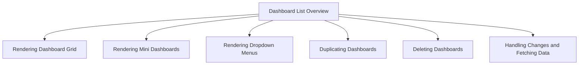

This document will cover the Dashboard List Overview, which includes:

1. Rendering the dashboard grid
2. Rendering mini dashboards
3. Rendering dropdown menus
4. Duplicating dashboards
5. Deleting dashboards
6. Handling changes and fetching data.

Technical document: <SwmLink doc-title="Dashboard List Overview">[Dashboard List Overview](/.swm/dashboard-list-overview.9qliw58c.sw.md)</SwmLink>

# [Rendering the Dashboard Grid](https://app.swimm.io/repos/Z2l0aHViJTNBJTNBc2VudHJ5LWRlbW8tMSUzQSUzQVN3aW1tLURlbW8=/docs/9qliw58c#rendering-the-dashboard-grid)

The dashboard grid is the main area where all dashboards are displayed. If there are no dashboards available, an empty state message is shown to inform the user that no dashboards match the current filters. This ensures that users are aware of the absence of dashboards and can adjust their filters accordingly. When dashboards are available, they are displayed in a structured grid format, making it easy for users to view and manage multiple dashboards at once.

# [Rendering Mini Dashboards](https://app.swimm.io/repos/Z2l0aHViJTNBJTNBc2VudHJ5LWRlbW8tMSUzQSUzQVN3aW1tLURlbW8=/docs/9qliw58c#rendering-mini-dashboards)

Each dashboard in the grid is represented as a mini dashboard. These mini dashboards provide key details such as the title, creation date, and the number of widgets contained within the dashboard. This allows users to quickly scan through their dashboards and identify the one they need. Additionally, mini dashboards include a preview of the widgets and a context menu for further actions, enhancing the user experience by providing quick access to important information and functionalities.

# [Rendering Dropdown Menus](https://app.swimm.io/repos/Z2l0aHViJTNBJTNBc2VudHJ5LWRlbW8tMSUzQSUzQVN3aW1tLURlbW8=/docs/9qliw58c#rendering-dropdown-menu)

Each mini dashboard includes a dropdown menu with options to duplicate or delete the dashboard. This menu is designed to provide users with easy access to these common actions. When a user selects the duplicate option, the dashboard is cloned, and a new dashboard is created with the same details. When the delete option is selected, a confirmation modal is displayed to ensure that the user wants to proceed with the deletion. This helps prevent accidental deletions and ensures that users can manage their dashboards efficiently.

# [Duplicating Dashboards](https://app.swimm.io/repos/Z2l0aHViJTNBJTNBc2VudHJ5LWRlbW8tMSUzQSUzQVN3aW1tLURlbW8=/docs/9qliw58c#duplicating-a-dashboard)

Duplicating a dashboard involves fetching the details of the selected dashboard, cloning it, and creating a new dashboard with the cloned details. This process allows users to quickly create a new dashboard based on an existing one, saving time and effort. The duplication event is tracked, and the dashboard list is updated to reflect the new dashboard. This ensures that users can see the newly created dashboard immediately and continue their work without interruption.

# [Deleting Dashboards](https://app.swimm.io/repos/Z2l0aHViJTNBJTNBc2VudHJ5LWRlbW8tMSUzQSUzQVN3aW1tLURlbW8=/docs/9qliw58c#handling-dashboard-deletion)

Deleting a dashboard involves removing it from the list and refreshing the data to reflect the changes. When a user confirms the deletion, the dashboard is removed, and a success message is displayed to inform the user that the deletion was successful. If the deletion fails, an error message is shown. This process ensures that users can manage their dashboards effectively and are informed of the outcome of their actions.

# [Handling Changes and Fetching Data](https://app.swimm.io/repos/Z2l0aHViJTNBJTNBc2VudHJ5LWRlbW8tMSUzQSUzQVN3aW1tLURlbW8=/docs/9qliw58c#triggering-dashboard-change)

After a dashboard is deleted or duplicated, the `onDashboardsChange` function is triggered to refresh the dashboard data. This function calls `reloadData`, which fetches the latest data from the server. This ensures that the dashboard list is always up-to-date and reflects the most recent changes. By keeping the data current, users can trust that they are working with the latest information and can make informed decisions based on accurate data.

&nbsp;

*This is an auto-generated document by Swimm AI 🌊 and has not yet been verified by a human*

<SwmMeta version="3.0.0" repo-id="Z2l0aHViJTNBJTNBc2VudHJ5LWRlbW8tMSUzQSUzQVN3aW1tLURlbW8=" repo-name="sentry-demo-1" doc-type="product-flows">Powered by [Swimm](/)</SwmMeta>
