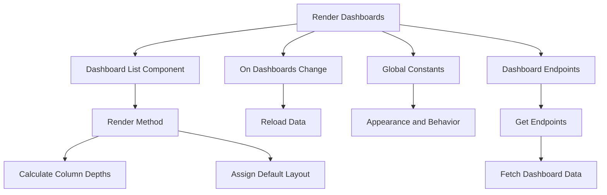

<SwmSnippet path="/static/app/views/dashboards/manage/index.tsx" line="100">

---

# Rendering Dashboards

The <SwmToken path="static/app/views/dashboards/manage/index.tsx" pos="100:1:1" line-data="  onDashboardsChange() {">`onDashboardsChange`</SwmToken> method is called to reload data when there are changes to the dashboards, ensuring the displayed information is up-to-date.

```tsx
  onDashboardsChange() {
    this.reloadData();
  }
```

---

</SwmSnippet>

<SwmSnippet path="/static/app/views/dashboards/dashboard.tsx" line="59">

---

# Global Constants

Global constants such as <SwmToken path="static/app/views/dashboards/dashboard.tsx" pos="59:4:4" line-data="export const DRAG_HANDLE_CLASS = &#39;widget-drag&#39;;">`DRAG_HANDLE_CLASS`</SwmToken>, <SwmToken path="static/app/views/dashboards/dashboard.tsx" pos="63:4:4" line-data="export const NUM_DESKTOP_COLS = 6;">`NUM_DESKTOP_COLS`</SwmToken>, and <SwmToken path="static/app/views/dashboards/dashboard.tsx" pos="65:2:2" line-data="const ROW_HEIGHT = 120;">`ROW_HEIGHT`</SwmToken> are defined to manage the appearance and behavior of the dashboard layout.

```tsx
export const DRAG_HANDLE_CLASS = 'widget-drag';
const DRAG_RESIZE_CLASS = 'widget-resize';
const DESKTOP = 'desktop';
const MOBILE = 'mobile';
export const NUM_DESKTOP_COLS = 6;
const NUM_MOBILE_COLS = 2;
const ROW_HEIGHT = 120;
const WIDGET_MARGINS: [number, number] = [16, 16];
const BOTTOM_MOBILE_VIEW_POSITION = {
  x: 0,
  y: Number.MAX_SAFE_INTEGER,
};
const MOBILE_BREAKPOINT = parseInt(theme.breakpoints.small, 10);
const BREAKPOINTS = {[MOBILE]: 0, [DESKTOP]: MOBILE_BREAKPOINT};
const COLUMNS = {[MOBILE]: NUM_MOBILE_COLS, [DESKTOP]: NUM_DESKTOP_COLS};
export const DASHBOARD_CHART_GROUP = 'dashboard-group';

type Props = {
  api: Client;
  dashboard: DashboardDetails;
  handleAddCustomWidget: (widget: Widget) => void;
```

---

</SwmSnippet>

<SwmSnippet path="/static/app/views/dashboards/orgDashboards.tsx" line="63">

---

# Dashboard Endpoints

The <SwmToken path="static/app/views/dashboards/orgDashboards.tsx" pos="63:1:1" line-data="  getEndpoints(): ReturnType&lt;DeprecatedAsyncComponent[&#39;getEndpoints&#39;]&gt; {">`getEndpoints`</SwmToken> function defines the endpoints used to fetch dashboard data. It constructs the URL for fetching the list of dashboards and, if a specific dashboard ID is provided, it adds an endpoint for fetching the details of that specific dashboard.

```tsx
  getEndpoints(): ReturnType<DeprecatedAsyncComponent['getEndpoints']> {
    const {organization, params} = this.props;
    const url = `/organizations/${organization.slug}/dashboards/`;
    const endpoints: ReturnType<DeprecatedAsyncComponent['getEndpoints']> = [
      ['dashboards', url],
    ];

    if (params.dashboardId) {
      endpoints.push(['selectedDashboard', `${url}${params.dashboardId}/`]);
      this.props.setEventNames('dashboards2.view', 'Dashboards2: View dashboard');
      this.props.setRouteAnalyticsParams({
        dashboard_id: params.dashboardId,
      });
    }

    return endpoints;
  }
```

---

</SwmSnippet>

&nbsp;

*This is an auto-generated document by Swimm AI 🌊 and has not yet been verified by a human*

<SwmMeta version="3.0.0" repo-id="Z2l0aHViJTNBJTNBc2VudHJ5LWRlbW8tMSUzQSUzQVN3aW1tLURlbW8=" repo-name="sentry-demo-1" doc-type="overview"><sup>Powered by [Swimm](/)</sup></SwmMeta>
