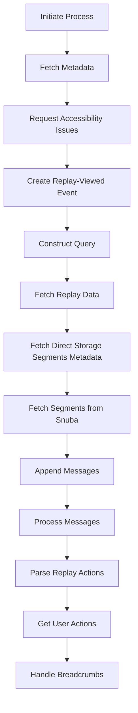

This document will cover the Data Fetching and Analysis Flow, which includes:

 1. Initiating the process
 2. Fetching metadata
 3. Requesting accessibility issues
 4. Creating replay-viewed event
 5. Constructing query
 6. Fetching replay data
 7. Fetching direct storage segments metadata
 8. Fetching segments from Snuba
 9. Appending messages
10. Processing messages
11. Parsing replay actions
12. Getting user actions
13. Handling breadcrumbs.

Technical document: <SwmLink doc-title="Data Fetching and Analysis Flow">[Data Fetching and Analysis Flow](/.swm/data-fetching-and-analysis-flow.oknwwqnq.sw.md)</SwmLink>

# [Initiating the Process](https://app.swimm.io/repos/Z2l0aHViJTNBJTNBc2VudHJ5LWRlbW8tMSUzQSUzQVN3aW1tLURlbW8=/docs/oknwwqnq#initiating-the-process)

The process begins with the `get_result` function, which is responsible for initiating the data fetching process. It uses an offset and limit to fetch the required data and returns a `CursorResult` containing the fetched data and pagination information. This step ensures that the data fetching process is initiated correctly and that the necessary data is available for further analysis.

# [Fetching Metadata](https://app.swimm.io/repos/Z2l0aHViJTNBJTNBc2VudHJ5LWRlbW8tMSUzQSUzQVN3aW1tLURlbW8=/docs/oknwwqnq#fetching-metadata)

The `data_fn` function is responsible for fetching metadata for storage segments based on the provided offset and limit. If no timestamp is provided, it fetches a default number of segments. This step ensures that the necessary metadata is available for analyzing the fetched segments.

# [Requesting Accessibility Issues](https://app.swimm.io/repos/Z2l0aHViJTNBJTNBc2VudHJ5LWRlbW8tMSUzQSUzQVN3aW1tLURlbW8=/docs/oknwwqnq#requesting-accessibility-issues)

The `request_accessibility_issues` function sends a POST request to an external service to analyze the accessibility issues of the provided filenames. It handles the response and raises an error if the analysis fails. This step ensures that any accessibility issues in the fetched segments are identified and reported.

# [Creating Replay-Viewed Event](https://app.swimm.io/repos/Z2l0aHViJTNBJTNBc2VudHJ5LWRlbW8tMSUzQSUzQVN3aW1tLURlbW8=/docs/oknwwqnq#creating-replay-viewed-event)

The `post` function handles the creation of a replay-viewed event. It checks if the user has the necessary permissions and ensures the user is part of the same organization as the replay. It then publishes the replay-viewed event. This step ensures that the replay-viewed event is created and published correctly, and that the necessary permissions are checked.

# [Constructing Query](https://app.swimm.io/repos/Z2l0aHViJTNBJTNBc2VudHJ5LWRlbW8tMSUzQSUzQVN3aW1tLURlbW8=/docs/oknwwqnq#constructing-query)

The `make_full_aggregation_query` function constructs a query to fetch replay data. It selects fields based on the provided parameters and applies conditions to filter the data. This step ensures that the query is constructed correctly and that the necessary data is fetched.

# [Fetching Replay Data](https://app.swimm.io/repos/Z2l0aHViJTNBJTNBc2VudHJ5LWRlbW8tMSUzQSUzQVN3aW1tLURlbW8=/docs/oknwwqnq#fetching-replay-data)

The `get` function is responsible for handling the request to fetch replay data. It first checks if the necessary features are enabled and then validates the `replay_id`. Depending on the presence of a timestamp, it either fetches a fixed number of segments or segments up to the given timestamp. The fetched segments are then passed to the `request_accessibility_issues` function to get the accessibility issues. This step ensures that the replay data is fetched correctly and that the necessary features are enabled.

# [Fetching Direct Storage Segments Metadata](https://app.swimm.io/repos/Z2l0aHViJTNBJTNBc2VudHJ5LWRlbW8tMSUzQSUzQVN3aW1tLURlbW8=/docs/oknwwqnq#fetching-direct-storage-segments-metadata)

The `fetch_direct_storage_segments_meta` function retrieves metadata for direct storage segments. If the segments are not archived, it calls `_fetch_segments_from_snuba` to get the data from Snuba. This step ensures that the metadata for direct storage segments is fetched correctly.

# [Fetching Segments from Snuba](https://app.swimm.io/repos/Z2l0aHViJTNBJTNBc2VudHJ5LWRlbW8tMSUzQSUzQVN3aW1tLURlbW8=/docs/oknwwqnq#fetching-segments-from-snuba)

The `_fetch_segments_from_snuba` function constructs a Snuba query to fetch replay segments based on the project ID, replay ID, and other conditions. The response is then processed to convert the data into `RecordingSegmentStorageMeta` objects. This step ensures that the segments are fetched correctly from Snuba.

# [Appending Messages](https://app.swimm.io/repos/Z2l0aHViJTNBJTNBc2VudHJ5LWRlbW8tMSUzQSUzQVN3aW1tLURlbW8=/docs/oknwwqnq#appending-messages)

The `append` function adds a message to the buffer and calls `process_message` to handle the message payload. This step ensures that the messages are appended correctly to the buffer.

# [Processing Messages](https://app.swimm.io/repos/Z2l0aHViJTNBJTNBc2VudHJ5LWRlbW8tMSUzQSUzQVN3aW1tLURlbW8=/docs/oknwwqnq#processing-messages)

The `process_message` function decodes the Kafka message, processes the headers, and appends the recording data to the buffer. It also handles decompression and parsing of the recording data, and logs relevant metrics. This step ensures that the messages are processed correctly and that the necessary data is appended to the buffer.

# [Parsing Replay Actions](https://app.swimm.io/repos/Z2l0aHViJTNBJTNBc2VudHJ5LWRlbW8tMSUzQSUzQVN3aW1tLURlbW8=/docs/oknwwqnq#parsing-replay-actions)

The `parse_replay_actions` function parses the RRWeb payload to create a `ReplayActionsEvent`. It calls `get_user_actions` to extract user actions from the segment data. This step ensures that the replay actions are parsed correctly and that the necessary user actions are extracted.

# [Getting User Actions](https://app.swimm.io/repos/Z2l0aHViJTNBJTNBc2VudHJ5LWRlbW8tMSUzQSUzQVN3aW1tLURlbW8=/docs/oknwwqnq#getting-user-actions)

The `get_user_actions` function iterates over custom events in the segment data to extract user actions. It handles different types of events, such as breadcrumbs and performance spans, and logs relevant metrics. This step ensures that the user actions are extracted correctly from the segment data.

# [Handling Breadcrumbs](https://app.swimm.io/repos/Z2l0aHViJTNBJTNBc2VudHJ5LWRlbW8tMSUzQSUzQVN3aW1tLURlbW8=/docs/oknwwqnq#handling-breadcrumbs)

The `_handle_breadcrumb` function processes breadcrumb events to create `ReplayActionsEventPayloadClick` objects. It handles different categories of breadcrumbs, such as slow clicks and hydration errors, and logs relevant metrics. This step ensures that the breadcrumb events are processed correctly and that the necessary data is logged.

&nbsp;

*This is an auto-generated document by Swimm AI 🌊 and has not yet been verified by a human*

<SwmMeta version="3.0.0" repo-id="Z2l0aHViJTNBJTNBc2VudHJ5LWRlbW8tMSUzQSUzQVN3aW1tLURlbW8=" repo-name="sentry-demo-1" doc-type="product-flows">Powered by [Swimm](/)</SwmMeta>
