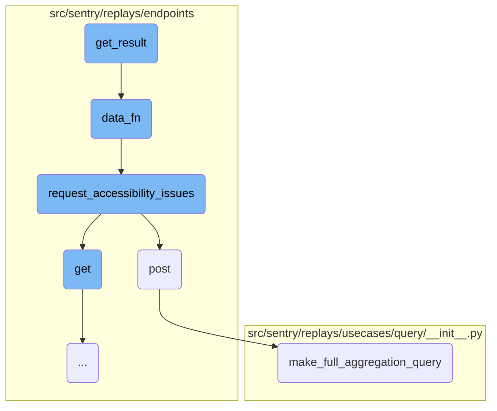
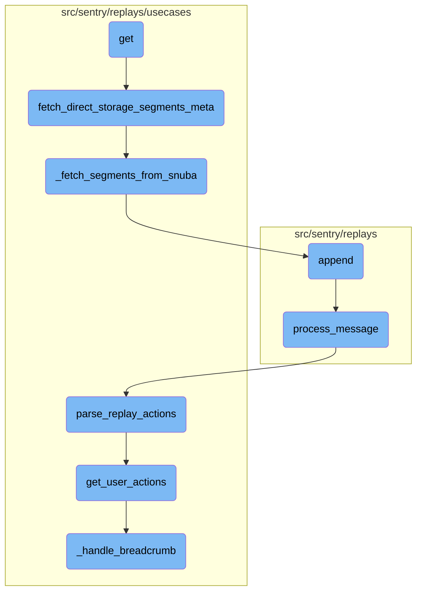

This document explains the process initiated by the <SwmToken path="src/sentry/replays/endpoints/project_replay_accessibility_issues.py" pos="135:3:3" line-data="    def get_result(self, limit, cursor=None):">`get_result`</SwmToken> function. It outlines the steps involved in fetching data, analyzing accessibility issues, and handling replay events.

The process starts with the <SwmToken path="src/sentry/replays/endpoints/project_replay_accessibility_issues.py" pos="135:3:3" line-data="    def get_result(self, limit, cursor=None):">`get_result`</SwmToken> function, which fetches data using an offset and limit. This data is then analyzed for accessibility issues. If any issues are found, they are reported. The flow also includes handling replay events and ensuring the user has the necessary permissions to view the replay.

Here is a high level diagram of the flow, showing only the most important functions:

```mermaid
graph TD;
      subgraph src/sentry/replays/endpoints
287bc26371a48a4bc807ebd4d58e5994981537bd0ead1039ffcdde02a9fe50e5(get_result):::mainFlowStyle --> dca575758ca5b1a7925d6831f4a9027f27a93bb9dcd4290f1f9cac3505f12540(data_fn):::mainFlowStyle
end

subgraph src/sentry/replays/endpoints
dca575758ca5b1a7925d6831f4a9027f27a93bb9dcd4290f1f9cac3505f12540(data_fn):::mainFlowStyle --> bd5dff2ccf5d23eb66e0411126a4cfa70820f49db2568140c587424f1bcf083c(request_accessibility_issues):::mainFlowStyle
end

subgraph src/sentry/replays/endpoints
bd5dff2ccf5d23eb66e0411126a4cfa70820f49db2568140c587424f1bcf083c(request_accessibility_issues):::mainFlowStyle --> 7b767f8ba5f4d5f32ce6ee135b32a5a1fd655871cdc3a49d108573bd18cd33b3(post)
end

subgraph src/sentry/replays/endpoints
bd5dff2ccf5d23eb66e0411126a4cfa70820f49db2568140c587424f1bcf083c(request_accessibility_issues):::mainFlowStyle --> ff7f700e4165ffdbdd30262b69f85d73b9c577f996a55f08635fd765f0f8cace(get):::mainFlowStyle
end

subgraph src/sentry/replays/usecases/reader.py
ff7f700e4165ffdbdd30262b69f85d73b9c577f996a55f08635fd765f0f8cace(get):::mainFlowStyle --> 3a522a634627e87f56da396f7abf36e47221fce16ce7eb90d00f361ef5300af1(fetch_direct_storage_segments_meta):::mainFlowStyle
end

subgraph src/sentry/replays/usecases/reader.py
3a522a634627e87f56da396f7abf36e47221fce16ce7eb90d00f361ef5300af1(fetch_direct_storage_segments_meta):::mainFlowStyle --> 34029c22c428c71611471b6a6eb6e4c59076f995616470be33c3c8944ac57ef0(_fetch_segments_from_snuba):::mainFlowStyle
end

subgraph src/sentry/replays/consumers/recording_buffered.py
34029c22c428c71611471b6a6eb6e4c59076f995616470be33c3c8944ac57ef0(_fetch_segments_from_snuba):::mainFlowStyle --> e8180dd1487e3ce108f37a5d31494c6d455b17868ab7a67e3b48db380c1b3c98(append):::mainFlowStyle
end

subgraph src/sentry/replays/consumers/recording_buffered.py
e8180dd1487e3ce108f37a5d31494c6d455b17868ab7a67e3b48db380c1b3c98(append):::mainFlowStyle --> cc3e85653bed81c9ae282de594596043aedea568dc339dce6f078b06e0ab5b04(process_message):::mainFlowStyle
end

subgraph src/sentry/replays/usecases/ingest
cc3e85653bed81c9ae282de594596043aedea568dc339dce6f078b06e0ab5b04(process_message):::mainFlowStyle --> d62f99fa8fbea3e750b40546c8593d1ccd1ce1b18dd2db1987aa378960a894c2(parse_replay_actions):::mainFlowStyle
end

subgraph src/sentry/replays/usecases/ingest
d62f99fa8fbea3e750b40546c8593d1ccd1ce1b18dd2db1987aa378960a894c2(parse_replay_actions):::mainFlowStyle --> da16a2f1064468142a8ab3c700af8cbfd7641293461d643061e0b5f81ff1d002(get_user_actions):::mainFlowStyle
end

subgraph src/sentry/replays/usecases/ingest
da16a2f1064468142a8ab3c700af8cbfd7641293461d643061e0b5f81ff1d002(get_user_actions):::mainFlowStyle --> 92a09ed224033563bb07c0b082ca92195958a360e1a9afada649b30ccdf7c8f7(_handle_breadcrumb):::mainFlowStyle
end

subgraph src/sentry/replays/usecases/ingest
92a09ed224033563bb07c0b082ca92195958a360e1a9afada649b30ccdf7c8f7(_handle_breadcrumb):::mainFlowStyle --> 02e4553f44543b8899d1557a10f93921a83d457a8779cfebef30953fe2a87dc0(report_rage_click_issue_with_replay_event)
end

subgraph src/sentry/replays/usecases/ingest
92a09ed224033563bb07c0b082ca92195958a360e1a9afada649b30ccdf7c8f7(_handle_breadcrumb):::mainFlowStyle --> 0f7bbfd67ffdbf0860b9d4cf6e424362cd33cdc05ec0ef9d45957ab161fb5925(report_hydration_error_issue_with_replay_event)
end


      classDef mainFlowStyle color:#000000,fill:#7CB9F4
classDef rootsStyle color:#000000,fill:#00FFF4
classDef Style1 color:#000000,fill:#00FFAA
classDef Style2 color:#000000,fill:#FFFF00
classDef Style3 color:#000000,fill:#AA7CB9

%% Swimm:
%% graph TD;
%%       subgraph <SwmPath>[src/sentry/replays/endpoints/](src/sentry/replays/endpoints/)</SwmPath>
%% 287bc26371a48a4bc807ebd4d58e5994981537bd0ead1039ffcdde02a9fe50e5(get_result):::mainFlowStyle --> dca575758ca5b1a7925d6831f4a9027f27a93bb9dcd4290f1f9cac3505f12540(data_fn):::mainFlowStyle
%% end
%% 
%% subgraph <SwmPath>[src/sentry/replays/endpoints/](src/sentry/replays/endpoints/)</SwmPath>
%% dca575758ca5b1a7925d6831f4a9027f27a93bb9dcd4290f1f9cac3505f12540(data_fn):::mainFlowStyle --> bd5dff2ccf5d23eb66e0411126a4cfa70820f49db2568140c587424f1bcf083c(request_accessibility_issues):::mainFlowStyle
%% end
%% 
%% subgraph <SwmPath>[src/sentry/replays/endpoints/](src/sentry/replays/endpoints/)</SwmPath>
%% bd5dff2ccf5d23eb66e0411126a4cfa70820f49db2568140c587424f1bcf083c(request_accessibility_issues):::mainFlowStyle --> 7b767f8ba5f4d5f32ce6ee135b32a5a1fd655871cdc3a49d108573bd18cd33b3(post)
%% end
%% 
%% subgraph <SwmPath>[src/sentry/replays/endpoints/](src/sentry/replays/endpoints/)</SwmPath>
%% bd5dff2ccf5d23eb66e0411126a4cfa70820f49db2568140c587424f1bcf083c(request_accessibility_issues):::mainFlowStyle --> ff7f700e4165ffdbdd30262b69f85d73b9c577f996a55f08635fd765f0f8cace(get):::mainFlowStyle
%% end
%% 
%% subgraph <SwmPath>[src/sentry/replays/usecases/reader.py](src/sentry/replays/usecases/reader.py)</SwmPath>
%% ff7f700e4165ffdbdd30262b69f85d73b9c577f996a55f08635fd765f0f8cace(get):::mainFlowStyle --> 3a522a634627e87f56da396f7abf36e47221fce16ce7eb90d00f361ef5300af1(fetch_direct_storage_segments_meta):::mainFlowStyle
%% end
%% 
%% subgraph <SwmPath>[src/sentry/replays/usecases/reader.py](src/sentry/replays/usecases/reader.py)</SwmPath>
%% 3a522a634627e87f56da396f7abf36e47221fce16ce7eb90d00f361ef5300af1(fetch_direct_storage_segments_meta):::mainFlowStyle --> 34029c22c428c71611471b6a6eb6e4c59076f995616470be33c3c8944ac57ef0(_fetch_segments_from_snuba):::mainFlowStyle
%% end
%% 
%% subgraph <SwmPath>[src/sentry/replays/consumers/recording_buffered.py](src/sentry/replays/consumers/recording_buffered.py)</SwmPath>
%% 34029c22c428c71611471b6a6eb6e4c59076f995616470be33c3c8944ac57ef0(_fetch_segments_from_snuba):::mainFlowStyle --> e8180dd1487e3ce108f37a5d31494c6d455b17868ab7a67e3b48db380c1b3c98(append):::mainFlowStyle
%% end
%% 
%% subgraph <SwmPath>[src/sentry/replays/consumers/recording_buffered.py](src/sentry/replays/consumers/recording_buffered.py)</SwmPath>
%% e8180dd1487e3ce108f37a5d31494c6d455b17868ab7a67e3b48db380c1b3c98(append):::mainFlowStyle --> cc3e85653bed81c9ae282de594596043aedea568dc339dce6f078b06e0ab5b04(process_message):::mainFlowStyle
%% end
%% 
%% subgraph <SwmPath>[src/sentry/replays/usecases/ingest/](src/sentry/replays/usecases/ingest/)</SwmPath>
%% cc3e85653bed81c9ae282de594596043aedea568dc339dce6f078b06e0ab5b04(process_message):::mainFlowStyle --> d62f99fa8fbea3e750b40546c8593d1ccd1ce1b18dd2db1987aa378960a894c2(parse_replay_actions):::mainFlowStyle
%% end
%% 
%% subgraph <SwmPath>[src/sentry/replays/usecases/ingest/](src/sentry/replays/usecases/ingest/)</SwmPath>
%% d62f99fa8fbea3e750b40546c8593d1ccd1ce1b18dd2db1987aa378960a894c2(parse_replay_actions):::mainFlowStyle --> da16a2f1064468142a8ab3c700af8cbfd7641293461d643061e0b5f81ff1d002(get_user_actions):::mainFlowStyle
%% end
%% 
%% subgraph <SwmPath>[src/sentry/replays/usecases/ingest/](src/sentry/replays/usecases/ingest/)</SwmPath>
%% da16a2f1064468142a8ab3c700af8cbfd7641293461d643061e0b5f81ff1d002(get_user_actions):::mainFlowStyle --> 92a09ed224033563bb07c0b082ca92195958a360e1a9afada649b30ccdf7c8f7(_handle_breadcrumb):::mainFlowStyle
%% end
%% 
%% subgraph <SwmPath>[src/sentry/replays/usecases/ingest/](src/sentry/replays/usecases/ingest/)</SwmPath>
%% 92a09ed224033563bb07c0b082ca92195958a360e1a9afada649b30ccdf7c8f7(_handle_breadcrumb):::mainFlowStyle --> 02e4553f44543b8899d1557a10f93921a83d457a8779cfebef30953fe2a87dc0(report_rage_click_issue_with_replay_event)
%% end
%% 
%% subgraph <SwmPath>[src/sentry/replays/usecases/ingest/](src/sentry/replays/usecases/ingest/)</SwmPath>
%% 92a09ed224033563bb07c0b082ca92195958a360e1a9afada649b30ccdf7c8f7(_handle_breadcrumb):::mainFlowStyle --> 0f7bbfd67ffdbf0860b9d4cf6e424362cd33cdc05ec0ef9d45957ab161fb5925(report_hydration_error_issue_with_replay_event)
%% end
%% 
%% 
%%       classDef mainFlowStyle color:#000000,fill:#7CB9F4
%% classDef rootsStyle color:#000000,fill:#00FFF4
%% classDef Style1 color:#000000,fill:#00FFAA
%% classDef Style2 color:#000000,fill:#FFFF00
%% classDef Style3 color:#000000,fill:#AA7CB9
```



# Flow drill down

First, we'll zoom into this section of the flow:



<SwmSnippet path="/src/sentry/replays/endpoints/project_replay_accessibility_issues.py" line="135">

---

## Initiating the Process

The <SwmToken path="src/sentry/replays/endpoints/project_replay_accessibility_issues.py" pos="135:3:3" line-data="    def get_result(self, limit, cursor=None):">`get_result`</SwmToken> function initiates the process by calling <SwmToken path="src/sentry/replays/endpoints/project_replay_accessibility_issues.py" pos="138:7:7" line-data="        data = self.data_fn(offset=offset, limit=limit)">`data_fn`</SwmToken> with an offset and limit. It then returns a <SwmToken path="src/sentry/replays/endpoints/project_replay_accessibility_issues.py" pos="140:3:3" line-data="        return CursorResult(">`CursorResult`</SwmToken> containing the fetched data and pagination information.

```python
    def get_result(self, limit, cursor=None):
        offset = cursor.offset if cursor is not None else 0

        data = self.data_fn(offset=offset, limit=limit)

        return CursorResult(
            data,
            hits=data.pop("meta")["total"],
            prev=Cursor(0, max(0, offset - limit), True, offset > 0),
            next=Cursor(0, max(0, offset + limit), False, False),
        )
```

---

</SwmSnippet>

<SwmSnippet path="/src/sentry/replays/endpoints/project_replay_accessibility_issues.py" line="85">

---

## Fetching Metadata

The <SwmToken path="src/sentry/replays/endpoints/project_replay_accessibility_issues.py" pos="85:3:3" line-data="        def data_fn(offset, limit):">`data_fn`</SwmToken> function fetches metadata for storage segments based on the provided offset and limit. If no timestamp is provided, it fetches a default number of segments. It then calls <SwmToken path="src/sentry/replays/endpoints/project_replay_accessibility_issues.py" pos="148:2:2" line-data="def request_accessibility_issues(filenames: list[str]) -&gt; Any:">`request_accessibility_issues`</SwmToken> to analyze the fetched segments.

```python
        def data_fn(offset, limit):
            # Increment a counter for every call to the accessibility service.
            metrics.incr("session-replay-accessibility-issues-count")

            # We only support direct-storage. Filestore is deprecated and should be removed
            # from the driver.
            if timestamp is None:
                # If no timestamp is provided we render 5 segments by convention.
                segments = fetch_direct_storage_segments_meta(
                    project.id,
                    replay_id,
                    offset,
                    limit=5,
                )
            else:
                # If a timestamp was provided we fetch every segment that started prior to the
                # timestamp value.
                results = query_segment_storage_meta_by_timestamp(
                    project.organization.id,
                    project.id,
                    replay_id,
```

---

</SwmSnippet>

<SwmSnippet path="/src/sentry/replays/endpoints/project_replay_accessibility_issues.py" line="148">

---

## Requesting Accessibility Issues

The <SwmToken path="src/sentry/replays/endpoints/project_replay_accessibility_issues.py" pos="148:2:2" line-data="def request_accessibility_issues(filenames: list[str]) -&gt; Any:">`request_accessibility_issues`</SwmToken> function sends a POST request to an external service to analyze the accessibility issues of the provided filenames. It handles the response and raises an error if the analysis fails.

```python
def request_accessibility_issues(filenames: list[str]) -> Any:
    try:
        response = requests.post(
            f"{options.get('replay.analyzer_service_url')}/api/0/analyze/accessibility",
            json={"data": {"filenames": filenames}},
        )

        content = response.content
        status_code = response.status_code

        if status_code == 201:
            return response.json()
        else:
            raise ValueError(f"An error occurred: {content.decode('utf-8')}")
    except Exception:
        logger.exception("replay accessibility analysis failed")
        raise ParseError("Could not analyze accessibility issues at this time.")
```

---

</SwmSnippet>

<SwmSnippet path="/src/sentry/replays/endpoints/project_replay_viewed_by.py" line="96">

---

## Creating <SwmToken path="src/sentry/replays/endpoints/project_replay_viewed_by.py" pos="97:8:10" line-data="        &quot;&quot;&quot;Create a replay-viewed event.&quot;&quot;&quot;">`replay-viewed`</SwmToken> Event

The <SwmToken path="src/sentry/replays/endpoints/project_replay_viewed_by.py" pos="96:3:3" line-data="    def post(self, request: Request, project: Project, replay_id: str) -&gt; Response:">`post`</SwmToken> function handles the creation of a <SwmToken path="src/sentry/replays/endpoints/project_replay_viewed_by.py" pos="97:8:10" line-data="        &quot;&quot;&quot;Create a replay-viewed event.&quot;&quot;&quot;">`replay-viewed`</SwmToken> event. It checks if the user has the necessary permissions and ensures the user is part of the same organization as the replay. It then publishes the <SwmToken path="src/sentry/replays/endpoints/project_replay_viewed_by.py" pos="97:8:10" line-data="        &quot;&quot;&quot;Create a replay-viewed event.&quot;&quot;&quot;">`replay-viewed`</SwmToken> event.

```python
    def post(self, request: Request, project: Project, replay_id: str) -> Response:
        """Create a replay-viewed event."""
        if not features.has(
            "organizations:session-replay", project.organization, actor=request.user
        ):
            return Response(status=404)

        try:
            replay_id = str(uuid.UUID(replay_id))
        except ValueError:
            return Response(status=404)

        user_orgs = user_service.get_organizations(user_id=request.user.id)
        if project.organization.id not in [org.id for org in user_orgs]:
            # If the user is not in the same organization as the replay, we don't need to do anything.
            return Response(status=204)

        # make a query to avoid overwriting the `finished_at` column
        filter_params = self.get_filter_params(request, project, date_filter_optional=False)
        finished_at_response = execute_query(
            query=make_full_aggregation_query(
```

---

</SwmSnippet>

<SwmSnippet path="/src/sentry/replays/usecases/query/__init__.py" line="409">

---

## Constructing Query

The <SwmToken path="src/sentry/replays/usecases/query/__init__.py" pos="409:2:2" line-data="def make_full_aggregation_query(">`make_full_aggregation_query`</SwmToken> function constructs a query to fetch replay data. It selects fields based on the provided parameters and applies conditions to filter the data.

```python
def make_full_aggregation_query(
    fields: list[str],
    replay_ids: list[str],
    project_ids: list[int],
    period_start: datetime,
    period_end: datetime,
    request_user_id: int | None,
) -> Query:
    """Return a query to fetch every replay in the set.

    Arguments:
        fields -- if non-empty, used to query a subset of fields. Corresponds to the keys in QUERY_ALIAS_COLUMN_MAP.
    """
    from sentry.replays.query import QUERY_ALIAS_COLUMN_MAP, compute_has_viewed, select_from_fields

    def _select_from_fields() -> list[Column | Function]:
        if fields:
            return select_from_fields(list(set(fields)), user_id=request_user_id)
        else:
            return list(QUERY_ALIAS_COLUMN_MAP.values()) + [compute_has_viewed(request_user_id)]

```

---

</SwmSnippet>

Now, lets zoom into this section of the flow:



<SwmSnippet path="/src/sentry/replays/endpoints/project_replay_accessibility_issues.py" line="51">

---

## Fetching Replay Data

The <SwmToken path="src/sentry/replays/endpoints/project_replay_accessibility_issues.py" pos="51:3:3" line-data="    def get(self, request: Request, project: Project, replay_id: str) -&gt; Response:">`get`</SwmToken> function is responsible for handling the request to fetch replay data. It first checks if the necessary features are enabled and then validates the <SwmToken path="src/sentry/replays/endpoints/project_replay_accessibility_issues.py" pos="51:20:20" line-data="    def get(self, request: Request, project: Project, replay_id: str) -&gt; Response:">`replay_id`</SwmToken>. Depending on the presence of a timestamp, it either fetches a fixed number of segments or segments up to the given timestamp. The fetched segments are then passed to the <SwmToken path="src/sentry/replays/endpoints/project_replay_accessibility_issues.py" pos="148:2:2" line-data="def request_accessibility_issues(filenames: list[str]) -&gt; Any:">`request_accessibility_issues`</SwmToken> function to get the accessibility issues.

```python
    def get(self, request: Request, project: Project, replay_id: str) -> Response:
        if not features.has(
            "organizations:session-replay", project.organization, actor=request.user
        ):
            return Response(status=404)

        if not features.has(
            "organizations:session-replay-accessibility-issues",
            project.organization,
            actor=request.user,
        ):
            metrics.incr("session-replay-accessibility-issues-flag-disabled")
            return Response(status=404)

        if options.get("organizations:session-replay-accessibility-issues-enabled") is False:
            metrics.incr("session-replay-accessibility-issues-option-disabled")
            return Response(status=404)

        try:
            replay_id = str(uuid.UUID(replay_id)).replace("-", "")
        except ValueError:
```

---

</SwmSnippet>

<SwmSnippet path="/src/sentry/replays/usecases/reader.py" line="138">

---

## Fetching Direct Storage Segments Metadata

The <SwmToken path="src/sentry/replays/usecases/reader.py" pos="138:2:2" line-data="def fetch_direct_storage_segments_meta(">`fetch_direct_storage_segments_meta`</SwmToken> function retrieves metadata for direct storage segments. If the segments are not archived, it calls <SwmToken path="src/sentry/replays/usecases/reader.py" pos="146:3:3" line-data="        return _fetch_segments_from_snuba(project_id, replay_id, offset, limit)">`_fetch_segments_from_snuba`</SwmToken> to get the data from Snuba.

```python
def fetch_direct_storage_segments_meta(
    project_id: int,
    replay_id: str,
    offset: int,
    limit: int,
) -> list[RecordingSegmentStorageMeta]:
    """Return direct-storage metadata derived from our Clickhouse table."""
    if not has_archived_segment(project_id, replay_id):
        return _fetch_segments_from_snuba(project_id, replay_id, offset, limit)
    return []
```

---

</SwmSnippet>

<SwmSnippet path="/src/sentry/replays/usecases/reader.py" line="196">

---

### Fetching Segments from Snuba

The <SwmToken path="src/sentry/replays/usecases/reader.py" pos="196:2:2" line-data="def _fetch_segments_from_snuba(">`_fetch_segments_from_snuba`</SwmToken> function constructs a Snuba query to fetch replay segments based on the project ID, replay ID, and other conditions. The response is then processed to convert the data into <SwmToken path="src/sentry/replays/usecases/reader.py" pos="202:6:6" line-data=") -&gt; list[RecordingSegmentStorageMeta]:">`RecordingSegmentStorageMeta`</SwmToken> objects.

```python
def _fetch_segments_from_snuba(
    project_id: int,
    replay_id: str,
    offset: int,
    limit: int,
    segment_id: int | None = None,
) -> list[RecordingSegmentStorageMeta]:
    conditions = []
    if segment_id:
        conditions.append(Condition(Column("segment_id"), Op.EQ, segment_id))
    else:
        conditions.append(Condition(Column("segment_id"), Op.IS_NOT_NULL, None))

    snuba_request = Request(
        dataset="replays",
        app_id="replay-backend-web",
        query=Query(
            match=Entity("replays"),
            select=[Column("segment_id"), Column("retention_days"), Column("timestamp")],
            where=[
                Condition(Column("project_id"), Op.EQ, project_id),
```

---

</SwmSnippet>

<SwmSnippet path="/src/sentry/replays/consumers/recording_buffered.py" line="205">

---

## Appending Messages

The <SwmToken path="src/sentry/replays/consumers/recording_buffered.py" pos="205:3:3" line-data="    def append(self, message: BaseValue[KafkaPayload]) -&gt; None:">`append`</SwmToken> function adds a message to the buffer and calls <SwmToken path="src/sentry/replays/consumers/recording_buffered.py" pos="206:1:1" line-data="        process_message(self, message.payload.value)">`process_message`</SwmToken> to handle the message payload.

```python
    def append(self, message: BaseValue[KafkaPayload]) -> None:
        process_message(self, message.payload.value)
```

---

</SwmSnippet>

<SwmSnippet path="/src/sentry/replays/consumers/recording_buffered.py" line="219">

---

### Processing Messages

The <SwmToken path="src/sentry/replays/consumers/recording_buffered.py" pos="219:2:2" line-data="def process_message(buffer: RecordingBuffer, message: bytes) -&gt; None:">`process_message`</SwmToken> function decodes the Kafka message, processes the headers, and appends the recording data to the buffer. It also handles decompression and parsing of the recording data, and logs relevant metrics.

```python
def process_message(buffer: RecordingBuffer, message: bytes) -> None:
    with sentry_sdk.start_span(op="replays.consumer.recording.decode_kafka_message"):
        try:
            decoded_message: ReplayRecording = RECORDINGS_CODEC.decode(message)
        except ValidationError:
            # TODO: DLQ
            logger.exception("Could not decode recording message.")
            return None

    try:
        headers, recording_data = process_headers(cast_payload_bytes(decoded_message["payload"]))
    except Exception:
        # TODO: DLQ
        logger.exception(
            "Recording headers could not be extracted %s", decoded_message["replay_id"]
        )
        return None

    recording_segment = RecordingSegmentStorageMeta(
        project_id=decoded_message["project_id"],
        replay_id=decoded_message["replay_id"],
```

---

</SwmSnippet>

<SwmSnippet path="/src/sentry/replays/usecases/ingest/dom_index.py" line="84">

---

## Parsing Replay Actions

The <SwmToken path="src/sentry/replays/usecases/ingest/dom_index.py" pos="84:2:2" line-data="def parse_replay_actions(">`parse_replay_actions`</SwmToken> function parses the <SwmToken path="src/sentry/replays/usecases/ingest/dom_index.py" pos="91:6:6" line-data="    &quot;&quot;&quot;Parse RRWeb payload to ReplayActionsEvent.&quot;&quot;&quot;">`RRWeb`</SwmToken> payload to create a <SwmToken path="src/sentry/replays/usecases/ingest/dom_index.py" pos="90:4:4" line-data=") -&gt; ReplayActionsEvent | None:">`ReplayActionsEvent`</SwmToken>. It calls <SwmToken path="src/sentry/replays/usecases/ingest/dom_index.py" pos="92:5:5" line-data="    actions = get_user_actions(project_id, replay_id, segment_data, replay_event)">`get_user_actions`</SwmToken> to extract user actions from the segment data.

```python
def parse_replay_actions(
    project_id: int,
    replay_id: str,
    retention_days: int,
    segment_data: list[dict[str, Any]],
    replay_event: dict[str, Any] | None,
) -> ReplayActionsEvent | None:
    """Parse RRWeb payload to ReplayActionsEvent."""
    actions = get_user_actions(project_id, replay_id, segment_data, replay_event)
    if len(actions) == 0:
        return None

    payload = create_replay_actions_payload(replay_id, actions)
    return create_replay_actions_event(replay_id, project_id, retention_days, payload)
```

---

</SwmSnippet>

<SwmSnippet path="/src/sentry/replays/usecases/ingest/dom_index.py" line="155">

---

### Getting User Actions

The <SwmToken path="src/sentry/replays/usecases/ingest/dom_index.py" pos="155:2:2" line-data="def get_user_actions(">`get_user_actions`</SwmToken> function iterates over custom events in the segment data to extract user actions. It handles different types of events, such as breadcrumbs and performance spans, and logs relevant metrics.

```python
def get_user_actions(
    project_id: int,
    replay_id: str,
    events: list[dict[str, Any]],
    replay_event: dict[str, Any] | None,
) -> list[ReplayActionsEventPayloadClick]:
    """Return a list of ReplayActionsEventPayloadClick types.

    The node object is a partially destructured HTML element with an additional RRWeb
    identifier included. Node objects are not recursive and truncate their children. Text is
    extracted and stored on the textContent key.

    For example, the follow DOM element:

        <div id="a" class="b c">Hello<span>, </span>world!</div>

    Would be destructured as:

        {
            "id": 217,
            "tagName": "div",
```

---

</SwmSnippet>

<SwmSnippet path="/src/sentry/replays/usecases/ingest/dom_index.py" line="394">

---

### Handling Breadcrumbs

The <SwmToken path="src/sentry/replays/usecases/ingest/dom_index.py" pos="394:2:2" line-data="def _handle_breadcrumb(">`_handle_breadcrumb`</SwmToken> function processes breadcrumb events to create <SwmToken path="src/sentry/replays/usecases/ingest/dom_index.py" pos="396:4:4" line-data=") -&gt; ReplayActionsEventPayloadClick | None:">`ReplayActionsEventPayloadClick`</SwmToken> objects. It handles different categories of breadcrumbs, such as slow clicks and hydration errors, and logs relevant metrics.

```python
def _handle_breadcrumb(
    event: dict[str, Any], project_id: int, replay_id: str, replay_event: dict[str, Any] | None
) -> ReplayActionsEventPayloadClick | None:

    click = None

    payload = event["data"].get("payload", {})
    if not isinstance(payload, dict):
        return None

    category = payload.get("category")
    if category == "ui.slowClickDetected":
        is_timeout_reason = payload["data"].get("endReason") == "timeout"
        is_target_tagname = payload["data"].get("node", {}).get("tagName") in (
            "a",
            "button",
            "input",
        )
        timeout = payload["data"].get("timeAfterClickMs", 0) or payload["data"].get(
            "timeafterclickms", 0
        )
```

---

</SwmSnippet>

&nbsp;

*This is an auto-generated document by Swimm AI 🌊 and has not yet been verified by a human*

<SwmMeta version="3.0.0" repo-id="Z2l0aHViJTNBJTNBc2VudHJ5LWRlbW8tMSUzQSUzQVN3aW1tLURlbW8=" repo-name="sentry-demo-1" doc-type="flows"><sup>Powered by [Swimm](/)</sup></SwmMeta>
