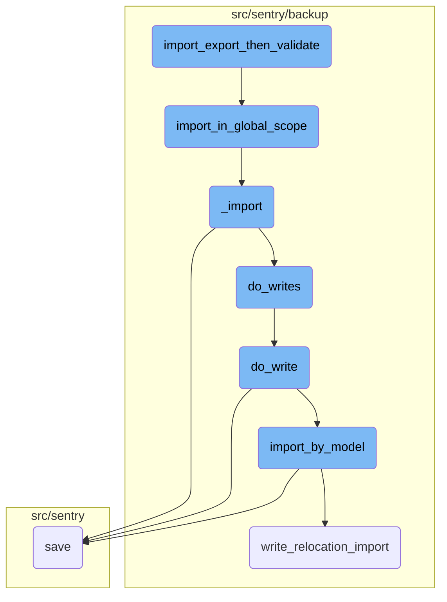
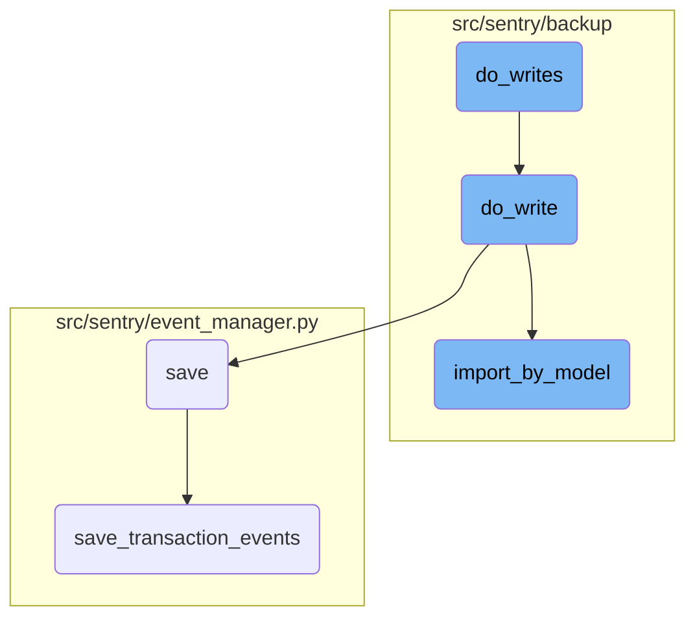

This document explains the process of validating data imported from an export of the current state of the test database. The process involves exporting the current state, clearing the database, importing the data back, and validating the expected and actual data.

The flow starts by exporting the current state of the database to a temporary file. Then, the database is cleared to ensure a clean state. The exported data is then imported back into the database. Finally, the imported data is validated against the expected data to ensure they match.

Here is a high level diagram of the flow, showing only the most important functions:



# Flow drill down

First, we'll zoom into this section of the flow:

```mermaid
graph TD;
      subgraph src/sentry
7a81722afc7e22e390551bb546d96ee130d06ff17c884f83030df539af9cafe2(import_export_then_validate):::mainFlowStyle --> c6eeb0b4305c767497cbf5bad6465c4c3b4ca5b6c9688d8b028c5b52a6264365(import_in_global_scope):::mainFlowStyle
end

subgraph src/sentry
c6eeb0b4305c767497cbf5bad6465c4c3b4ca5b6c9688d8b028c5b52a6264365(import_in_global_scope):::mainFlowStyle --> e51390835e25abe9700c58ce684275b91c592cbc3798916fccfb8d5e98213501(_import):::mainFlowStyle
end

subgraph src/sentry
e51390835e25abe9700c58ce684275b91c592cbc3798916fccfb8d5e98213501(_import):::mainFlowStyle --> 5086692df24257d76a0adf892eba843feac14033d92b4a32022b125d5a725f9b(save)
end

subgraph src/sentry
e51390835e25abe9700c58ce684275b91c592cbc3798916fccfb8d5e98213501(_import):::mainFlowStyle --> 26207a08d7fb570302a7c1ba260755115f33628088a15b2009f16110f8f0dae8(do_writes):::mainFlowStyle
end

subgraph src/sentry
26207a08d7fb570302a7c1ba260755115f33628088a15b2009f16110f8f0dae8(do_writes):::mainFlowStyle --> 8i51g(...)
end

subgraph src/sentry
5086692df24257d76a0adf892eba843feac14033d92b4a32022b125d5a725f9b(save) --> b8052a0e9cf4dd2783dd9f9b401321908e36ff05fa95ad9dd7944757173348b4(save_transaction_events)
end


      classDef mainFlowStyle color:#000000,fill:#7CB9F4
classDef rootsStyle color:#000000,fill:#00FFF4
classDef Style1 color:#000000,fill:#00FFAA
classDef Style2 color:#000000,fill:#FFFF00
classDef Style3 color:#000000,fill:#AA7CB9

%% Swimm:
%% graph TD;
%%       subgraph <SwmPath>[src/sentry/](src/sentry/)</SwmPath>
%% 7a81722afc7e22e390551bb546d96ee130d06ff17c884f83030df539af9cafe2(import_export_then_validate):::mainFlowStyle --> c6eeb0b4305c767497cbf5bad6465c4c3b4ca5b6c9688d8b028c5b52a6264365(import_in_global_scope):::mainFlowStyle
%% end
%% 
%% subgraph <SwmPath>[src/sentry/](src/sentry/)</SwmPath>
%% c6eeb0b4305c767497cbf5bad6465c4c3b4ca5b6c9688d8b028c5b52a6264365(import_in_global_scope):::mainFlowStyle --> e51390835e25abe9700c58ce684275b91c592cbc3798916fccfb8d5e98213501(_import):::mainFlowStyle
%% end
%% 
%% subgraph <SwmPath>[src/sentry/](src/sentry/)</SwmPath>
%% e51390835e25abe9700c58ce684275b91c592cbc3798916fccfb8d5e98213501(_import):::mainFlowStyle --> 5086692df24257d76a0adf892eba843feac14033d92b4a32022b125d5a725f9b(save)
%% end
%% 
%% subgraph <SwmPath>[src/sentry/](src/sentry/)</SwmPath>
%% e51390835e25abe9700c58ce684275b91c592cbc3798916fccfb8d5e98213501(_import):::mainFlowStyle --> 26207a08d7fb570302a7c1ba260755115f33628088a15b2009f16110f8f0dae8(do_writes):::mainFlowStyle
%% end
%% 
%% subgraph <SwmPath>[src/sentry/](src/sentry/)</SwmPath>
%% 26207a08d7fb570302a7c1ba260755115f33628088a15b2009f16110f8f0dae8(do_writes):::mainFlowStyle --> 8i51g(...)
%% end
%% 
%% subgraph <SwmPath>[src/sentry/](src/sentry/)</SwmPath>
%% 5086692df24257d76a0adf892eba843feac14033d92b4a32022b125d5a725f9b(save) --> b8052a0e9cf4dd2783dd9f9b401321908e36ff05fa95ad9dd7944757173348b4(save_transaction_events)
%% end
%% 
%% 
%%       classDef mainFlowStyle color:#000000,fill:#7CB9F4
%% classDef rootsStyle color:#000000,fill:#00FFF4
%% classDef Style1 color:#000000,fill:#00FFAA
%% classDef Style2 color:#000000,fill:#FFFF00
%% classDef Style3 color:#000000,fill:#AA7CB9
```



<SwmSnippet path="/src/sentry/testutils/helpers/backups.py" line="293">

---

## <SwmToken path="src/sentry/testutils/helpers/backups.py" pos="293:2:2" line-data="def import_export_then_validate(method_name: str, *, reset_pks: bool = True) -&gt; Any:">`import_export_then_validate`</SwmToken>

The function <SwmToken path="src/sentry/testutils/helpers/backups.py" pos="293:2:2" line-data="def import_export_then_validate(method_name: str, *, reset_pks: bool = True) -&gt; Any:">`import_export_then_validate`</SwmToken> validates that data imported from an export of the current state of the test database correctly matches the actual outputted export data. It exports the current state of the database, clears the database, imports the data back, and then validates that the expected and actual data match.

```python
def import_export_then_validate(method_name: str, *, reset_pks: bool = True) -> Any:
    """
    Test helper that validates that data imported from an export of the current state of the test
    database correctly matches the actual outputted export data.
    """

    with tempfile.TemporaryDirectory() as tmpdir:
        tmp_expect = Path(tmpdir).joinpath(f"{method_name}.expect.json")
        tmp_actual = Path(tmpdir).joinpath(f"{method_name}.actual.json")

        # Export the current state of the database into the "expected" temporary file, then
        # parse it into a JSON object for comparison.
        expect = export_to_file(tmp_expect, ExportScope.Global)
        clear_database(reset_pks=reset_pks)

        # Write the contents of the "expected" JSON file into the now clean database.
        with open(tmp_expect, "rb") as tmp_file:
            import_in_global_scope(tmp_file, printer=NOOP_PRINTER)

        # Validate that the "expected" and "actual" JSON matches.
        actual = export_to_file(tmp_actual, ExportScope.Global)
```

---

</SwmSnippet>

<SwmSnippet path="/src/sentry/backup/imports.py" line="584">

---

## <SwmToken path="src/sentry/backup/imports.py" pos="584:2:2" line-data="def import_in_global_scope(">`import_in_global_scope`</SwmToken>

The function <SwmToken path="src/sentry/backup/imports.py" pos="584:2:2" line-data="def import_in_global_scope(">`import_in_global_scope`</SwmToken> performs an import in the Global scope, meaning that all models will be imported from the provided source file. This method is useful when restoring to a fresh Sentry instance and involves serializing and deserializing a snapshot of the database state.

```python
def import_in_global_scope(
    src: IO[bytes],
    *,
    decryptor: Decryptor | None = None,
    flags: ImportFlags | None = None,
    printer: Printer,
):
    """
    Perform an import in the `Global` scope, meaning that all models will be imported from the
    provided source file. Because a `Global` import is really only useful when restoring to a fresh
    Sentry instance, some behaviors in this scope are different from the others. In particular,
    superuser privileges are not sanitized. This method can be thought of as a "pure"
    backup/restore, simply serializing and deserializing a (partial) snapshot of the database state.
    """

    return _import(
        src,
        ImportScope.Global,
        decryptor=decryptor,
        flags=flags,
        printer=printer,
```

---

</SwmSnippet>

<SwmSnippet path="/src/sentry/backup/imports.py" line="87">

---

## \_import

The function <SwmToken path="src/sentry/backup/imports.py" pos="87:2:2" line-data="def _import(">`_import`</SwmToken> handles the core logic of importing data. It includes yielding JSON models from the content and writing them to the database. The function also resolves organization slugs from the primary key map.

```python
def _import(
    src: IO[bytes],
    scope: ImportScope,
    *,
    decryptor: Decryptor | None = None,
    flags: ImportFlags | None = None,
    filter_by: Filter | None = None,
    printer: Printer,
):
    """
    Imports core data for a Sentry installation.

    It is generally preferable to avoid calling this function directly, as there are certain
    combinations of input parameters that should not be used together. Instead, use one of the other
    wrapper functions in this file, named `import_in_XXX_scope()`.
    """

    # Import here to prevent circular module resolutions.
    from sentry.models.organization import Organization
    from sentry.models.organizationmember import OrganizationMember
    from sentry.users.models.email import Email
```

---

</SwmSnippet>

<SwmSnippet path="/src/sentry/event_manager.py" line="448">

---

## save

The function <SwmToken path="src/sentry/event_manager.py" pos="448:3:3" line-data="    def save(">`save`</SwmToken> normalizes and processes an event, saving adjacent models such as releases and environments to Postgres and writing the event into eventstream. It handles deduplication of events and increments counters and frequencies.

```python
    def save(
        self,
        project_id: int | None,
        raw: bool = False,
        assume_normalized: bool = False,
        start_time: float | None = None,
        cache_key: str | None = None,
        skip_send_first_transaction: bool = False,
        has_attachments: bool = False,
    ) -> Event:
        """
        After normalizing and processing an event, save adjacent models such as
        releases and environments to postgres and write the event into
        eventstream. From there it will be picked up by Snuba and
        post-processing.

        We re-insert events with duplicate IDs into Snuba, which is responsible
        for deduplicating events. Since deduplication in Snuba is on the primary
        key (based on event ID, project ID and day), events with same IDs are only
        deduplicated if their timestamps fall on the same day. The latest event
        always wins and overwrites the value of events received earlier in that day.
```

---

</SwmSnippet>

<SwmSnippet path="/src/sentry/event_manager.py" line="3040">

---

## <SwmToken path="src/sentry/event_manager.py" pos="3040:2:2" line-data="def save_transaction_events(jobs: Sequence[Job], projects: ProjectsMapping) -&gt; Sequence[Job]:">`save_transaction_events`</SwmToken>

The function <SwmToken path="src/sentry/event_manager.py" pos="3040:2:2" line-data="def save_transaction_events(jobs: Sequence[Job], projects: ProjectsMapping) -&gt; Sequence[Job]:">`save_transaction_events`</SwmToken> handles the saving of transaction events. It sets cached field values, creates releases, derives tags, materializes metadata, records metrics, and inserts events into eventstream.

```python
def save_transaction_events(jobs: Sequence[Job], projects: ProjectsMapping) -> Sequence[Job]:
    organization_ids = {project.organization_id for project in projects.values()}
    organizations = {o.id: o for o in Organization.objects.get_many_from_cache(organization_ids)}

    for project in projects.values():
        try:
            project.set_cached_field_value("organization", organizations[project.organization_id])
        except KeyError:
            continue

    set_measurement(measurement_name="jobs", value=len(jobs))
    set_measurement(measurement_name="projects", value=len(projects))

    _get_or_create_release_many(jobs, projects)
    _get_event_user_many(jobs, projects)
    _derive_plugin_tags_many(jobs, projects)
    _derive_interface_tags_many(jobs)
    _calculate_span_grouping(jobs, projects)
    _materialize_metadata_many(jobs)
    _get_or_create_environment_many(jobs, projects)
    _get_or_create_release_associated_models(jobs, projects)
```

---

</SwmSnippet>

Now, lets zoom into this section of the flow:



<SwmSnippet path="/src/sentry/backup/imports.py" line="399">

---

## Handling deferred organization authentication tokens

The <SwmToken path="src/sentry/backup/imports.py" pos="396:3:3" line-data="    def do_writes(pk_map: PrimaryKeyMap) -&gt; None:">`do_writes`</SwmToken> function iterates over JSON models and defers organization authentication tokens for later processing. This ensures that these tokens are handled separately from other models.

```python
        for model_name, json_data, offset in yield_json_models(content):
            if model_name == org_auth_token_model_name:
                deferred_org_auth_tokens.append(json_data)
                continue
```

---

</SwmSnippet>

<SwmSnippet path="/src/sentry/backup/imports.py" line="404">

---

## Performing model writes

For each model that is not an organization authentication token, the <SwmToken path="src/sentry/backup/imports.py" pos="396:3:3" line-data="    def do_writes(pk_map: PrimaryKeyMap) -&gt; None:">`do_writes`</SwmToken> function calls <SwmToken path="src/sentry/backup/imports.py" pos="404:1:1" line-data="            do_write(import_write_context, pk_map, model_name, json_data, offset)">`do_write`</SwmToken> to perform the actual write operation.

```python
            do_write(import_write_context, pk_map, model_name, json_data, offset)
```

---

</SwmSnippet>

<SwmSnippet path="/src/sentry/backup/imports.py" line="320">

---

### Importing by model

The <SwmToken path="src/sentry/backup/imports.py" pos="404:1:1" line-data="            do_write(import_write_context, pk_map, model_name, json_data, offset)">`do_write`</SwmToken> function uses the <SwmToken path="src/sentry/backup/imports.py" pos="320:5:5" line-data="        result = import_by_model(">`import_by_model`</SwmToken> service to import the model data. This involves passing various parameters such as the model name, scope, flags, and primary key map.

```python
        result = import_by_model(
            import_model_name=model_name_str,
            scope=import_write_context.scope,
            flags=import_write_context.flags,
            filter_by=import_write_context.filter_by,
            pk_map=RpcPrimaryKeyMap.into_rpc(pk_map.partition(dep_models)),
            json_data=json_data,
            min_ordinal=min_ordinal,
        )
```

---

</SwmSnippet>

<SwmSnippet path="/src/sentry/backup/imports.py" line="330">

---

### Handling import errors

If an import error occurs, the <SwmToken path="src/sentry/backup/imports.py" pos="404:1:1" line-data="            do_write(import_write_context, pk_map, model_name, json_data, offset)">`do_write`</SwmToken> function logs the error and raises an <SwmToken path="src/sentry/backup/imports.py" pos="335:3:3" line-data="            raise ImportingError(result)">`ImportingError`</SwmToken> to halt the process.

```python
        if isinstance(result, RpcImportError):
            printer.echo(result.pretty(), err=True)
            if result.get_kind() == RpcImportErrorKind.IntegrityError:
                warningText = ">> Are you restoring from a backup of the same version of Sentry?\n>> Are you restoring onto a clean database?\n>> If so then this IntegrityError might be our fault, you can open an issue here:\n>> https://github.com/getsentry/sentry/issues/new/choose"
                printer.echo(warningText, err=True)
            raise ImportingError(result)
```

---

</SwmSnippet>

<SwmSnippet path="/src/sentry/backup/imports.py" line="337">

---

### Extending primary key map

After a successful import, the <SwmToken path="src/sentry/backup/imports.py" pos="404:1:1" line-data="            do_write(import_write_context, pk_map, model_name, json_data, offset)">`do_write`</SwmToken> function extends the primary key map with the new mappings returned by the <SwmToken path="src/sentry/backup/imports.py" pos="320:5:5" line-data="        result = import_by_model(">`import_by_model`</SwmToken> service.

```python
        out_pk_map: PrimaryKeyMap = result.mapped_pks.from_rpc()
        pk_map.extend(out_pk_map)
```

---

</SwmSnippet>

<SwmSnippet path="/src/sentry/backup/imports.py" line="344">

---

### Creating control import chunk replica

If the imported model lives in the control silo, the <SwmToken path="src/sentry/backup/imports.py" pos="404:1:1" line-data="            do_write(import_write_context, pk_map, model_name, json_data, offset)">`do_write`</SwmToken> function creates a replica of the <SwmToken path="src/sentry/backup/imports.py" pos="342:23:23" line-data="        # the RPC divide, we create a replica of the `ControlImportChunk` that successful import">`ControlImportChunk`</SwmToken> to ensure consistency across RPC divides.

```python
        if result.min_ordinal is not None and SiloMode.CONTROL in deps[model_name].silos:
            # Maybe we are resuming an import on a retry. Check to see if this
            # `ControlImportChunkReplica` already exists, and only write it if it does not. There
            # can't be races here, since there is only one celery task running at a time, pushing
            # updates in a synchronous manner.
            existing_control_import_chunk_replica = ControlImportChunkReplica.objects.filter(
                import_uuid=flags.import_uuid, model=model_name_str, min_ordinal=result.min_ordinal
            ).first()
            if existing_control_import_chunk_replica is not None:
                logger.info("import_by_model.control_replica_already_exists", extra=extra)
            else:
                # If `min_ordinal` is not null, these values must not be either.
                assert result.max_ordinal is not None
                assert result.min_source_pk is not None
                assert result.max_source_pk is not None

                inserted = out_pk_map.partition({model_name}, {ImportKind.Inserted}).mapping[
                    model_name_str
                ]
                existing = out_pk_map.partition({model_name}, {ImportKind.Existing}).mapping[
                    model_name_str
```

---

</SwmSnippet>

<SwmSnippet path="/src/sentry/backup/services/import_export/impl.py" line="117">

---

## Validating and importing models

The <SwmToken path="src/sentry/backup/imports.py" pos="320:5:5" line-data="        result = import_by_model(">`import_by_model`</SwmToken> function validates the minimum ordinal and retrieves the model to be imported. If the model is not found, it returns an error.

```python
        if min_ordinal < 1:
            return RpcImportError(
                kind=RpcImportErrorKind.InvalidMinOrdinal,
                on=InstanceID(import_model_name),
                reason=f"The model `{import_model_name}` was offset with an invalid `min_ordinal` of `{min_ordinal}`",
            )

        batch_model_name = NormalizedModelName(import_model_name)
        model = get_model(batch_model_name)
        if model is None:
```

---

</SwmSnippet>

<SwmSnippet path="/src/sentry/backup/services/import_export/impl.py" line="133">

---

### Handling silo mode

The <SwmToken path="src/sentry/backup/imports.py" pos="320:5:5" line-data="        result = import_by_model(">`import_by_model`</SwmToken> function checks if the current silo mode is appropriate for the model being imported. If not, it returns an error.

```python
        silo_mode = SiloMode.get_current_mode()
        model_modes = model._meta.silo_limit.modes  # type: ignore[attr-defined]
        if silo_mode != SiloMode.MONOLITH and silo_mode not in model_modes:
            return RpcImportError(
                kind=RpcImportErrorKind.IncorrectSiloModeForModel,
                on=InstanceID(import_model_name),
                reason=f"The model `{import_model_name}` was forwarded to the incorrect silo (it cannot be imported from the {silo_mode} silo)",
            )
```

---

</SwmSnippet>

<SwmSnippet path="/src/sentry/backup/services/import_export/impl.py" line="211">

---

### Deserializing JSON data

The <SwmToken path="src/sentry/backup/imports.py" pos="320:5:5" line-data="        result = import_by_model(">`import_by_model`</SwmToken> function deserializes the JSON data into Django model instances and performs various checks to ensure the data is valid.

```python
                for deserialized_object in deserialize("json", json_data, use_natural_keys=False):
                    model_instance = deserialized_object.object
                    inst_model_name = get_model_name(model_instance)

                    if not isinstance(model_instance, BaseModel):
                        return RpcImportError(
                            kind=RpcImportErrorKind.UnexpectedModel,
                            on=InstanceID(model=str(inst_model_name), ordinal=None),
                            left_pk=model_instance.pk,
                            reason=f"Received non-sentry model of kind `{inst_model_name}`",
                        )
```

---

</SwmSnippet>

<SwmSnippet path="/src/sentry/backup/services/import_export/impl.py" line="258">

---

### Writing model instances

The <SwmToken path="src/sentry/backup/imports.py" pos="320:5:5" line-data="        result = import_by_model(">`import_by_model`</SwmToken> function writes the deserialized model instances to the database and updates the primary key map with the new mappings.

```python
                                    # Perform the actual database write.
                                    written = model_instance.write_relocation_import(
                                        import_scope, import_flags
                                    )
                                    if written is None:
                                        continue

                                    # For models that may have circular references to themselves
                                    # (unlikely), keep track of the new pk in the input map as well.
                                    last_seen_ordinal += 1
                                    new_pk, import_kind = written
                                    slug = getattr(model_instance, "slug", None)
                                    in_pk_map.insert(
                                        inst_model_name, old_pk, new_pk, import_kind, slug
                                    )
                                    out_pk_map.insert(
                                        inst_model_name, old_pk, new_pk, import_kind, slug
                                    )
```

---

</SwmSnippet>

&nbsp;

*This is an auto-generated document by Swimm AI 🌊 and has not yet been verified by a human*

<SwmMeta version="3.0.0" repo-id="Z2l0aHViJTNBJTNBc2VudHJ5LWRlbW8tMSUzQSUzQVN3aW1tLURlbW8=" repo-name="sentry-demo-1" doc-type="flows"><sup>Powered by [Swimm](/)</sup></SwmMeta>
