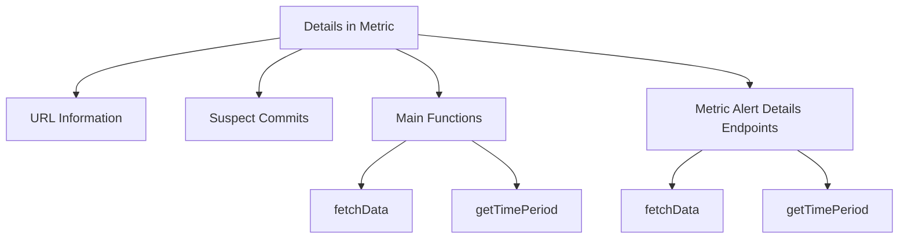

# Details in Metric

Details refer to specific information about an issue or alert in the Sentry platform. They include a URL that directs users to the issue or alert within the Sentry organization, and list suspect commits that might have introduced the issue, including commit messages and author information.

## URL Information

The URL in the Details section directs users to the specific issue or alert within the Sentry organization. It contains parameters such as the referrer, alert type, alert timestamp, and alert rule ID.

## Suspect Commits

Details also list suspect commits that might have introduced the issue. This includes commit messages and author information, which can help in identifying the root cause of the problem.

## Main Functions

The main functions involved in handling metric alert details include <SwmToken path="static/app/views/alerts/rules/metric/details/index.tsx" pos="169:1:1" line-data="  fetchData = async () =&gt; {">`fetchData`</SwmToken> and <SwmToken path="static/app/views/alerts/rules/metric/details/index.tsx" pos="96:1:1" line-data="  getTimePeriod(selectedIncident: Incident | null): TimePeriodType {">`getTimePeriod`</SwmToken>.

<SwmSnippet path="/static/app/views/alerts/rules/metric/details/index.tsx" line="169">

---

### <SwmToken path="static/app/views/alerts/rules/metric/details/index.tsx" pos="169:1:1" line-data="  fetchData = async () =&gt; {">`fetchData`</SwmToken>

The <SwmToken path="static/app/views/alerts/rules/metric/details/index.tsx" pos="169:1:1" line-data="  fetchData = async () =&gt; {">`fetchData`</SwmToken> function is responsible for fetching the necessary data for the metric alert details view. It retrieves the rule and incidents associated with the alert, sets the loading state, and handles any errors that occur during the data fetching process.

```tsx
  fetchData = async () => {
    const {
      api,
      organization,
      params: {ruleId},
      location,
    } = this.props;

    this.setState({isLoading: true, hasError: false});

    // Skip loading existing rule
    const rulePromise =
      ruleId === this.state.rule?.id
        ? Promise.resolve(this.state.rule)
        : fetchAlertRule(organization.slug, ruleId, {expand: 'latestIncident'});

    // Fetch selected incident, if it exists. We need this to set the selected date range
    let selectedIncident: Incident | null = null;
    if (location.query.alert) {
      try {
        selectedIncident = await fetchIncident(
```

---

</SwmSnippet>

<SwmSnippet path="/static/app/views/alerts/rules/metric/details/index.tsx" line="96">

---

### <SwmToken path="static/app/views/alerts/rules/metric/details/index.tsx" pos="96:1:1" line-data="  getTimePeriod(selectedIncident: Incident | null): TimePeriodType {">`getTimePeriod`</SwmToken>

The <SwmToken path="static/app/views/alerts/rules/metric/details/index.tsx" pos="96:1:1" line-data="  getTimePeriod(selectedIncident: Incident | null): TimePeriodType {">`getTimePeriod`</SwmToken> function determines the time period for the metric alert based on the selected incident or the query parameters in the URL. It returns an object containing the start and end dates, the period, and other relevant information for displaying the time range.

```tsx
  getTimePeriod(selectedIncident: Incident | null): TimePeriodType {
    const {location} = this.props;
    const period = (location.query.period as string) ?? TimePeriod.SEVEN_DAYS;

    if (location.query.start && location.query.end) {
      return {
        start: location.query.start as string,
        end: location.query.end as string,
        period,
        usingPeriod: false,
        label: t('Custom time'),
        display: (
          <Fragment>
            <DateTime date={moment.utc(location.query.start)} />
            {' — '}
            <DateTime date={moment.utc(location.query.end)} />
          </Fragment>
        ),
        custom: true,
      };
    }
```

---

</SwmSnippet>

## Metric Alert Details Endpoints

The Metric Alert Details Endpoints include the <SwmToken path="static/app/views/alerts/rules/metric/details/index.tsx" pos="169:1:1" line-data="  fetchData = async () =&gt; {">`fetchData`</SwmToken> and <SwmToken path="static/app/views/alerts/rules/metric/details/index.tsx" pos="96:1:1" line-data="  getTimePeriod(selectedIncident: Incident | null): TimePeriodType {">`getTimePeriod`</SwmToken> functions, which are crucial for fetching and displaying the metric alert details.

<SwmSnippet path="/static/app/views/alerts/rules/metric/details/index.tsx" line="96">

---

### <SwmToken path="static/app/views/alerts/rules/metric/details/index.tsx" pos="96:1:1" line-data="  getTimePeriod(selectedIncident: Incident | null): TimePeriodType {">`getTimePeriod`</SwmToken>

The <SwmToken path="static/app/views/alerts/rules/metric/details/index.tsx" pos="96:1:1" line-data="  getTimePeriod(selectedIncident: Incident | null): TimePeriodType {">`getTimePeriod`</SwmToken> function determines the time period for the metric alert details based on the selected incident or query parameters. It returns an object containing the start and end times, period, and other related information.

```tsx
  getTimePeriod(selectedIncident: Incident | null): TimePeriodType {
    const {location} = this.props;
    const period = (location.query.period as string) ?? TimePeriod.SEVEN_DAYS;

    if (location.query.start && location.query.end) {
      return {
        start: location.query.start as string,
        end: location.query.end as string,
        period,
        usingPeriod: false,
        label: t('Custom time'),
        display: (
          <Fragment>
            <DateTime date={moment.utc(location.query.start)} />
            {' — '}
            <DateTime date={moment.utc(location.query.end)} />
          </Fragment>
        ),
        custom: true,
      };
    }
```

---

</SwmSnippet>

&nbsp;

*This is an auto-generated document by Swimm AI 🌊 and has not yet been verified by a human*

<SwmMeta version="3.0.0" repo-id="Z2l0aHViJTNBJTNBc2VudHJ5LWRlbW8tMSUzQSUzQVN3aW1tLURlbW8=" repo-name="sentry-demo-1" doc-type="overview"><sup>Powered by [Swimm](/)</sup></SwmMeta>
