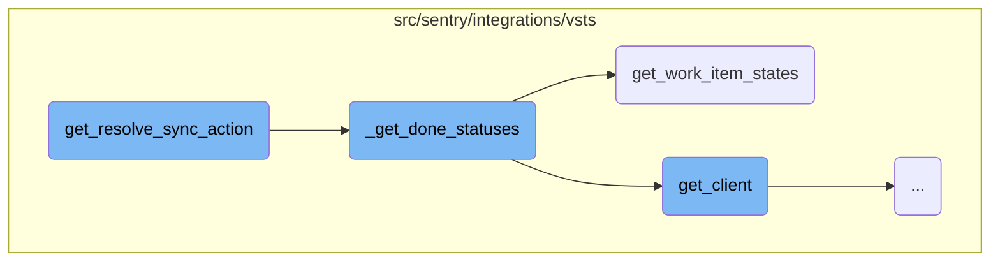
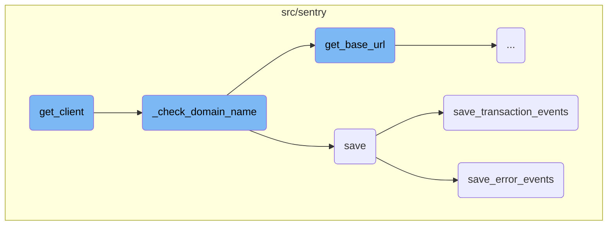
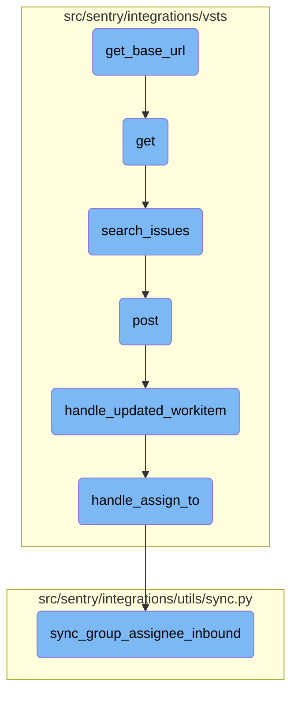

This document outlines the process of determining the resolution state of an issue. It involves fetching the 'done' statuses for a project, checking the old and new states of the issue, and deciding whether the issue should be resolved or unresolved.

The process starts by identifying the states that are considered 'done' for a project. Then, it checks the previous and current states of an issue. If the issue transitions from a non-done state to a done state, it should be marked as resolved. Conversely, if it transitions from a done state to a non-done state, it should be marked as unresolved.

Here is a high level diagram of the flow, showing only the most important functions:

```mermaid
graph TD;
      subgraph src/sentry/integrations/vsts
ca746fc66c0a2c5d9f70426eb97630b823a38a0156820ae41c222cf1bea7a57d(get_resolve_sync_action):::mainFlowStyle --> 8318cd948ef58476133ae8ba0bbd73b426c4d90021dbd02b5539909c5da4c5b2(_get_done_statuses):::mainFlowStyle
end

subgraph src/sentry/integrations/vsts
8318cd948ef58476133ae8ba0bbd73b426c4d90021dbd02b5539909c5da4c5b2(_get_done_statuses):::mainFlowStyle --> f114dfafa7f8cd05b9267aff317a754b0a77d80caa24c2218ab994742751ef38(get_work_item_states)
end

subgraph src/sentry/integrations/vsts
8318cd948ef58476133ae8ba0bbd73b426c4d90021dbd02b5539909c5da4c5b2(_get_done_statuses):::mainFlowStyle --> 0929df67669e089b92a784392a4caa0c21baeadfd85263fa34c49a09c193b3d1(get_client):::mainFlowStyle
end

subgraph src/sentry/integrations/vsts
0929df67669e089b92a784392a4caa0c21baeadfd85263fa34c49a09c193b3d1(get_client):::mainFlowStyle --> 7f10adeb955518d0b9ce9a18ae73cf60c8e87d6b2b7bc87f5b2addc217981d21(_check_domain_name):::mainFlowStyle
end

subgraph src/sentry/event_manager.py
7f10adeb955518d0b9ce9a18ae73cf60c8e87d6b2b7bc87f5b2addc217981d21(_check_domain_name):::mainFlowStyle --> 5086692df24257d76a0adf892eba843feac14033d92b4a32022b125d5a725f9b(save)
end

subgraph src/sentry/integrations/vsts
7f10adeb955518d0b9ce9a18ae73cf60c8e87d6b2b7bc87f5b2addc217981d21(_check_domain_name):::mainFlowStyle --> 3a40802301e1642b0a2d0ce06ddee674da6a7fd8353ad71b1c436be19e6563d6(get_base_url):::mainFlowStyle
end

subgraph src/sentry/integrations/vsts
3a40802301e1642b0a2d0ce06ddee674da6a7fd8353ad71b1c436be19e6563d6(get_base_url):::mainFlowStyle --> c9f1b6abd5b86b248deafac3aa63eb8d055350bf49cbe100c54a0d94ee13361a(get):::mainFlowStyle
end

subgraph src/sentry/integrations/vsts
c9f1b6abd5b86b248deafac3aa63eb8d055350bf49cbe100c54a0d94ee13361a(get):::mainFlowStyle --> fc4a2a7e5f1b5a9d6230778920f9b62f4b7f3caa80ebd97c89444e007895b382(search_issues):::mainFlowStyle
end

subgraph src/sentry/integrations/vsts
fc4a2a7e5f1b5a9d6230778920f9b62f4b7f3caa80ebd97c89444e007895b382(search_issues):::mainFlowStyle --> a0445eff32744589c21cfe40b46d7b4346893653994134be4a340aaaf32b3f6d(post):::mainFlowStyle
end

subgraph src/sentry/integrations/vsts
a0445eff32744589c21cfe40b46d7b4346893653994134be4a340aaaf32b3f6d(post):::mainFlowStyle --> 66e049c83c1ca3a7a23933e320651f77196243d817b62c1a401dfd7205f9a929(handle_updated_workitem):::mainFlowStyle
end

subgraph src/sentry/integrations/vsts
66e049c83c1ca3a7a23933e320651f77196243d817b62c1a401dfd7205f9a929(handle_updated_workitem):::mainFlowStyle --> 66c307c65db74ab637ed0ed1623cc34d22110f0911938f86a52ccb8f5e8009dd(handle_assign_to):::mainFlowStyle
end

subgraph src/sentry/integrations/utils/sync.py
66c307c65db74ab637ed0ed1623cc34d22110f0911938f86a52ccb8f5e8009dd(handle_assign_to):::mainFlowStyle --> dd6f2c6555a3ad00a0aed3ab34055c7026063e3a2a74b2537fcf2a1223ffa577(sync_group_assignee_inbound):::mainFlowStyle
end


      classDef mainFlowStyle color:#000000,fill:#7CB9F4
classDef rootsStyle color:#000000,fill:#00FFF4
classDef Style1 color:#000000,fill:#00FFAA
classDef Style2 color:#000000,fill:#FFFF00
classDef Style3 color:#000000,fill:#AA7CB9

%% Swimm:
%% graph TD;
%%       subgraph <SwmPath>[src/sentry/integrations/vsts/](src/sentry/integrations/vsts/)</SwmPath>
%% ca746fc66c0a2c5d9f70426eb97630b823a38a0156820ae41c222cf1bea7a57d(get_resolve_sync_action):::mainFlowStyle --> 8318cd948ef58476133ae8ba0bbd73b426c4d90021dbd02b5539909c5da4c5b2(_get_done_statuses):::mainFlowStyle
%% end
%% 
%% subgraph <SwmPath>[src/sentry/integrations/vsts/](src/sentry/integrations/vsts/)</SwmPath>
%% 8318cd948ef58476133ae8ba0bbd73b426c4d90021dbd02b5539909c5da4c5b2(_get_done_statuses):::mainFlowStyle --> f114dfafa7f8cd05b9267aff317a754b0a77d80caa24c2218ab994742751ef38(get_work_item_states)
%% end
%% 
%% subgraph <SwmPath>[src/sentry/integrations/vsts/](src/sentry/integrations/vsts/)</SwmPath>
%% 8318cd948ef58476133ae8ba0bbd73b426c4d90021dbd02b5539909c5da4c5b2(_get_done_statuses):::mainFlowStyle --> 0929df67669e089b92a784392a4caa0c21baeadfd85263fa34c49a09c193b3d1(get_client):::mainFlowStyle
%% end
%% 
%% subgraph <SwmPath>[src/sentry/integrations/vsts/](src/sentry/integrations/vsts/)</SwmPath>
%% 0929df67669e089b92a784392a4caa0c21baeadfd85263fa34c49a09c193b3d1(get_client):::mainFlowStyle --> 7f10adeb955518d0b9ce9a18ae73cf60c8e87d6b2b7bc87f5b2addc217981d21(_check_domain_name):::mainFlowStyle
%% end
%% 
%% subgraph <SwmPath>[src/sentry/event_manager.py](src/sentry/event_manager.py)</SwmPath>
%% 7f10adeb955518d0b9ce9a18ae73cf60c8e87d6b2b7bc87f5b2addc217981d21(_check_domain_name):::mainFlowStyle --> 5086692df24257d76a0adf892eba843feac14033d92b4a32022b125d5a725f9b(save)
%% end
%% 
%% subgraph <SwmPath>[src/sentry/integrations/vsts/](src/sentry/integrations/vsts/)</SwmPath>
%% 7f10adeb955518d0b9ce9a18ae73cf60c8e87d6b2b7bc87f5b2addc217981d21(_check_domain_name):::mainFlowStyle --> 3a40802301e1642b0a2d0ce06ddee674da6a7fd8353ad71b1c436be19e6563d6(get_base_url):::mainFlowStyle
%% end
%% 
%% subgraph <SwmPath>[src/sentry/integrations/vsts/](src/sentry/integrations/vsts/)</SwmPath>
%% 3a40802301e1642b0a2d0ce06ddee674da6a7fd8353ad71b1c436be19e6563d6(get_base_url):::mainFlowStyle --> c9f1b6abd5b86b248deafac3aa63eb8d055350bf49cbe100c54a0d94ee13361a(get):::mainFlowStyle
%% end
%% 
%% subgraph <SwmPath>[src/sentry/integrations/vsts/](src/sentry/integrations/vsts/)</SwmPath>
%% c9f1b6abd5b86b248deafac3aa63eb8d055350bf49cbe100c54a0d94ee13361a(get):::mainFlowStyle --> fc4a2a7e5f1b5a9d6230778920f9b62f4b7f3caa80ebd97c89444e007895b382(search_issues):::mainFlowStyle
%% end
%% 
%% subgraph <SwmPath>[src/sentry/integrations/vsts/](src/sentry/integrations/vsts/)</SwmPath>
%% fc4a2a7e5f1b5a9d6230778920f9b62f4b7f3caa80ebd97c89444e007895b382(search_issues):::mainFlowStyle --> a0445eff32744589c21cfe40b46d7b4346893653994134be4a340aaaf32b3f6d(post):::mainFlowStyle
%% end
%% 
%% subgraph <SwmPath>[src/sentry/integrations/vsts/](src/sentry/integrations/vsts/)</SwmPath>
%% a0445eff32744589c21cfe40b46d7b4346893653994134be4a340aaaf32b3f6d(post):::mainFlowStyle --> 66e049c83c1ca3a7a23933e320651f77196243d817b62c1a401dfd7205f9a929(handle_updated_workitem):::mainFlowStyle
%% end
%% 
%% subgraph <SwmPath>[src/sentry/integrations/vsts/](src/sentry/integrations/vsts/)</SwmPath>
%% 66e049c83c1ca3a7a23933e320651f77196243d817b62c1a401dfd7205f9a929(handle_updated_workitem):::mainFlowStyle --> 66c307c65db74ab637ed0ed1623cc34d22110f0911938f86a52ccb8f5e8009dd(handle_assign_to):::mainFlowStyle
%% end
%% 
%% subgraph <SwmPath>[src/sentry/integrations/utils/sync.py](src/sentry/integrations/utils/sync.py)</SwmPath>
%% 66c307c65db74ab637ed0ed1623cc34d22110f0911938f86a52ccb8f5e8009dd(handle_assign_to):::mainFlowStyle --> dd6f2c6555a3ad00a0aed3ab34055c7026063e3a2a74b2537fcf2a1223ffa577(sync_group_assignee_inbound):::mainFlowStyle
%% end
%% 
%% 
%%       classDef mainFlowStyle color:#000000,fill:#7CB9F4
%% classDef rootsStyle color:#000000,fill:#00FFF4
%% classDef Style1 color:#000000,fill:#00FFAA
%% classDef Style2 color:#000000,fill:#FFFF00
%% classDef Style3 color:#000000,fill:#AA7CB9
```



# Flow drill down

First, we'll zoom into this section of the flow:



<SwmSnippet path="/src/sentry/integrations/vsts/issues.py" line="319">

---

## Resolving Sync Actions

The function <SwmToken path="src/sentry/integrations/vsts/issues.py" pos="319:3:3" line-data="    def get_resolve_sync_action(self, data: Mapping[str, Any]) -&gt; ResolveSyncAction:">`get_resolve_sync_action`</SwmToken> determines whether an issue should be resolved or unresolved based on its state transition. It uses the <SwmToken path="src/sentry/integrations/vsts/issues.py" pos="320:7:7" line-data="        done_states = self._get_done_statuses(data[&quot;project&quot;])">`_get_done_statuses`</SwmToken> function to fetch the set of 'done' states for a given project and then checks the old and new states of the issue to decide the appropriate action.

```python
    def get_resolve_sync_action(self, data: Mapping[str, Any]) -> ResolveSyncAction:
        done_states = self._get_done_statuses(data["project"])
        return ResolveSyncAction.from_resolve_unresolve(
            should_resolve=(
                not data["old_state"] in done_states and data["new_state"] in done_states
            ),
            should_unresolve=(not data["new_state"] in done_states or data["old_state"] is None),
        )
```

---

</SwmSnippet>

<SwmSnippet path="/src/sentry/integrations/vsts/issues.py" line="328">

---

## Fetching Done Statuses

The function <SwmToken path="src/sentry/integrations/vsts/issues.py" pos="328:3:3" line-data="    def _get_done_statuses(self, project: str) -&gt; set[str]:">`_get_done_statuses`</SwmToken> retrieves the states that are considered 'done' for a given project. It calls <SwmToken path="src/sentry/integrations/vsts/issues.py" pos="329:7:7" line-data="        client = self.get_client()">`get_client`</SwmToken> to obtain a client instance and then uses this client to fetch all work item states for the project. It filters these states to include only those that fall into the 'done' categories.

```python
    def _get_done_statuses(self, project: str) -> set[str]:
        client = self.get_client()
        try:
            all_states = client.get_work_item_states(project)["value"]
        except ApiError as err:
            self.logger.info(
                "vsts.get-done-states.failed",
                extra={"integration_id": self.model.id, "exception": err},
            )
            return set()
        return {state["name"] for state in all_states if state["category"] in self.done_categories}
```

---

</SwmSnippet>

<SwmSnippet path="/src/sentry/integrations/vsts/client.py" line="297">

---

### Retrieving Work Item States

The function <SwmToken path="src/sentry/integrations/vsts/client.py" pos="297:3:3" line-data="    def get_work_item_states(self, project: str) -&gt; Response:">`get_work_item_states`</SwmToken> is responsible for fetching the states of work items for a specific project. It iterates through a predefined sequence of work item types <SwmToken path="src/sentry/event_manager.py" pos="2729:17:20" line-data="        # If the attachment is a crash report (e.g. minidump), we need to honor">`(e.g`</SwmToken>., 'Bug', 'Issue', 'Task') and makes an API call to retrieve the states. The function returns the response once it finds a match with a non-zero count of states.

```python
    def get_work_item_states(self, project: str) -> Response:
        # XXX: Until we add the option to enter the 'WorkItemType' for syncing status changes from
        # Sentry to Azure DevOps, we need will attempt to use the sequence below. There are certain
        # ADO configurations which don't have 'Bug' or 'Issue', hence iterating until we find a match.
        check_sequence = ["Bug", "Issue", "Task"]
        response = None
        for check_type in check_sequence:
            response = self.get(
                VstsApiPath.work_item_states.format(
                    instance=self.base_url,
                    project=project,
                    type=check_type,
                ),
                api_preview=True,
            )
            if response.get("count", 0) > 0:
                break
        return response
```

---

</SwmSnippet>

Now, lets zoom into this section of the flow:



<SwmSnippet path="/src/sentry/integrations/vsts/integration.py" line="135">

---

## Initializing <SwmToken path="src/sentry/integrations/vsts/integration.py" pos="145:3:3" line-data="        return VstsApiClient(">`VstsApiClient`</SwmToken>

The <SwmToken path="src/sentry/integrations/vsts/issues.py" pos="329:7:7" line-data="        client = self.get_client()">`get_client`</SwmToken> function initializes a <SwmToken path="src/sentry/integrations/vsts/integration.py" pos="145:3:3" line-data="        return VstsApiClient(">`VstsApiClient`</SwmToken> instance. It first checks the current <SwmToken path="src/sentry/integrations/vsts/integration.py" pos="136:3:3" line-data="        if SiloMode.get_current_mode() != SiloMode.REGION:">`SiloMode`</SwmToken> and sets the <SwmToken path="src/sentry/integrations/vsts/integration.py" pos="137:5:5" line-data="            if self.default_identity is None:">`default_identity`</SwmToken> if it is not already set. It then calls <SwmToken path="src/sentry/integrations/vsts/integration.py" pos="139:3:3" line-data="            self._check_domain_name(self.default_identity)">`_check_domain_name`</SwmToken> to ensure the domain name is correct. Finally, it raises exceptions if <SwmToken path="src/sentry/integrations/vsts/integration.py" pos="141:5:5" line-data="        if self.org_integration is None:">`org_integration`</SwmToken> or <SwmToken path="src/sentry/integrations/vsts/integration.py" pos="143:5:7" line-data="        if self.org_integration.default_auth_id is None:">`org_integration.default_auth_id`</SwmToken> are not defined before returning the <SwmToken path="src/sentry/integrations/vsts/integration.py" pos="145:3:3" line-data="        return VstsApiClient(">`VstsApiClient`</SwmToken> instance.

```python
        base_url = self.instance
        if SiloMode.get_current_mode() != SiloMode.REGION:
            if self.default_identity is None:
                self.default_identity = self.get_default_identity()
            self._check_domain_name(self.default_identity)

        if self.org_integration is None:
            raise Exception("self.org_integration is not defined")
        if self.org_integration.default_auth_id is None:
            raise Exception("self.org_integration.default_auth_id is not defined")
        return VstsApiClient(
            base_url=base_url,
            oauth_redirect_url=VstsIntegrationProvider.oauth_redirect_url,
            org_integration_id=self.org_integration.id,
            identity_id=self.org_integration.default_auth_id,
        )
```

---

</SwmSnippet>

<SwmSnippet path="/src/sentry/integrations/vsts/integration.py" line="358">

---

## Verifying Domain Name

The <SwmToken path="src/sentry/integrations/vsts/integration.py" pos="358:3:3" line-data="    def _check_domain_name(self, default_identity: RpcIdentity) -&gt; None:">`_check_domain_name`</SwmToken> function ensures that the domain name in the metadata is correctly formatted. If the domain name does not match the expected pattern, it retrieves the base URL using <SwmToken path="src/sentry/integrations/vsts/integration.py" pos="362:5:7" line-data="        base_url = VstsIntegrationProvider.get_base_url(">`VstsIntegrationProvider.get_base_url`</SwmToken> and updates the domain name in the metadata before saving the model.

```python
    def _check_domain_name(self, default_identity: RpcIdentity) -> None:
        if re.match("^https://.+/$", self.model.metadata["domain_name"]):
            return

        base_url = VstsIntegrationProvider.get_base_url(
            default_identity.data["access_token"], self.model.external_id
        )
        self.model.metadata["domain_name"] = base_url
        self.model.save()
```

---

</SwmSnippet>

<SwmSnippet path="/src/sentry/event_manager.py" line="448">

---

## Saving Event Data

The <SwmToken path="src/sentry/event_manager.py" pos="448:3:3" line-data="    def save(">`save`</SwmToken> function processes and normalizes event data before saving it to the database. It handles different types of events, such as transactions and generic events, by calling appropriate helper functions like <SwmToken path="src/sentry/event_manager.py" pos="3040:2:2" line-data="def save_transaction_events(jobs: Sequence[Job], projects: ProjectsMapping) -&gt; Sequence[Job]:">`save_transaction_events`</SwmToken> and <SwmToken path="src/sentry/event_manager.py" pos="517:5:5" line-data="            jobs = save_generic_events([job], projects)">`save_generic_events`</SwmToken>.

```python
    def save(
        self,
        project_id: int | None,
        raw: bool = False,
        assume_normalized: bool = False,
        start_time: float | None = None,
        cache_key: str | None = None,
        skip_send_first_transaction: bool = False,
        has_attachments: bool = False,
    ) -> Event:
        """
        After normalizing and processing an event, save adjacent models such as
        releases and environments to postgres and write the event into
        eventstream. From there it will be picked up by Snuba and
        post-processing.

        We re-insert events with duplicate IDs into Snuba, which is responsible
        for deduplicating events. Since deduplication in Snuba is on the primary
        key (based on event ID, project ID and day), events with same IDs are only
        deduplicated if their timestamps fall on the same day. The latest event
        always wins and overwrites the value of events received earlier in that day.
```

---

</SwmSnippet>

<SwmSnippet path="/src/sentry/event_manager.py" line="3040">

---

### Saving Transaction Events

The <SwmToken path="src/sentry/event_manager.py" pos="3040:2:2" line-data="def save_transaction_events(jobs: Sequence[Job], projects: ProjectsMapping) -&gt; Sequence[Job]:">`save_transaction_events`</SwmToken> function processes a list of transaction jobs, performing various operations such as creating releases, deriving tags, and saving the events to the nodestore. It also tracks outcomes and detects performance problems.

```python
def save_transaction_events(jobs: Sequence[Job], projects: ProjectsMapping) -> Sequence[Job]:
    organization_ids = {project.organization_id for project in projects.values()}
    organizations = {o.id: o for o in Organization.objects.get_many_from_cache(organization_ids)}

    for project in projects.values():
        try:
            project.set_cached_field_value("organization", organizations[project.organization_id])
        except KeyError:
            continue

    set_measurement(measurement_name="jobs", value=len(jobs))
    set_measurement(measurement_name="projects", value=len(projects))

    _get_or_create_release_many(jobs, projects)
    _get_event_user_many(jobs, projects)
    _derive_plugin_tags_many(jobs, projects)
    _derive_interface_tags_many(jobs)
    _calculate_span_grouping(jobs, projects)
    _materialize_metadata_many(jobs)
    _get_or_create_environment_many(jobs, projects)
    _get_or_create_release_associated_models(jobs, projects)
```

---

</SwmSnippet>

<SwmSnippet path="/src/sentry/event_manager.py" line="544">

---

### Saving Error Events

The <SwmToken path="src/sentry/event_manager.py" pos="544:3:3" line-data="    def save_error_events(">`save_error_events`</SwmToken> function processes error events by assigning them to groups, creating necessary models, and saving the events to the nodestore. It also handles attachments and tracks various metrics related to the event.

```python
    def save_error_events(
        self,
        project: Project,
        job: Job,
        projects: ProjectsMapping,
        metric_tags: MutableTags,
        raw: bool = False,
        cache_key: str | None = None,
        has_attachments: bool = False,
    ) -> Event:
        jobs = [job]

        if is_sample_event(job):
            logger.info(
                "save_error_events: processing sample event",
                extra={
                    "event.id": job["event"].event_id,
                    "project_id": project.id,
                    "sample_event": True,
                },
            )
```

---

</SwmSnippet>

Now, lets zoom into this section of the flow:



<SwmSnippet path="/src/sentry/integrations/vsts/integration.py" line="540">

---

## Fetching the Base URL

The function <SwmToken path="src/sentry/integrations/vsts/integration.py" pos="540:3:3" line-data="    def get_base_url(cls, access_token: str, account_id: int) -&gt; str | None:">`get_base_url`</SwmToken> is responsible for constructing and fetching the base URL for the VSTS integration. It builds the URL using the account ID and makes an HTTP GET request with the provided access token. If the request is successful, it extracts and returns the <SwmToken path="src/sentry/integrations/vsts/integration.py" pos="552:10:10" line-data="            return response.json()[&quot;locationUrl&quot;]">`locationUrl`</SwmToken> from the response.

```python
    def get_base_url(cls, access_token: str, account_id: int) -> str | None:
        """TODO(mgaeta): This should not be allowed to return None."""
        url = VstsIntegrationProvider.VSTS_ACCOUNT_LOOKUP_URL % account_id
        with http.build_session() as session:
            response = session.get(
                url,
                headers={
                    "Content-Type": "application/json",
                    "Authorization": f"Bearer {access_token}",
                },
            )
        if response.status_code == 200:
            return response.json()["locationUrl"]

        logger.info("vsts.get_base_url", extra={"responseCode": response.status_code})
        return None
```

---

</SwmSnippet>

<SwmSnippet path="/src/sentry/integrations/vsts/search.py" line="23">

---

## Making the GET Request

The function <SwmToken path="src/sentry/integrations/vsts/search.py" pos="23:3:3" line-data="    def get(">`get`</SwmToken> handles incoming GET requests to search for external issues. It retrieves the integration details, validates the request parameters, and then calls the <SwmToken path="src/sentry/integrations/vsts/client.py" pos="417:3:3" line-data="    def search_issues(self, account_name: str, query: str | None = None) -&gt; Response:">`search_issues`</SwmToken> method of the VSTS integration to fetch the relevant issues.

```python
    def get(
        self, request: Request, organization: RpcOrganization, integration_id: int, **kwds: Any
    ) -> Response:
        try:
            integration = Integration.objects.get(
                organizationintegration__organization_id=coerce_id_from(organization),
                id=integration_id,
                provider="vsts",
            )
        except Integration.DoesNotExist:
            return Response(status=404)

        field = request.GET.get("field")
        query = request.GET.get("query")
        if field is None:
            return Response({"detail": "field is a required parameter"}, status=400)
        if not query:
            return Response({"detail": "query is a required parameter"}, status=400)

        installation = integration.get_installation(organization.id)
        assert isinstance(installation, VstsIntegration), installation
```

---

</SwmSnippet>

<SwmSnippet path="/src/sentry/integrations/vsts/client.py" line="417">

---

## Searching Issues

The function <SwmToken path="src/sentry/integrations/vsts/client.py" pos="417:3:3" line-data="    def search_issues(self, account_name: str, query: str | None = None) -&gt; Response:">`search_issues`</SwmToken> sends a POST request to the VSTS API to search for work items based on the provided query. It constructs the API endpoint using the account name and includes the search text in the request payload.

```python
    def search_issues(self, account_name: str, query: str | None = None) -> Response:
        return self.post(
            VstsApiPath.work_item_search.format(account_name=account_name),
            data={"searchText": query, "$top": 1000},
            api_preview=True,
        )
```

---

</SwmSnippet>

<SwmSnippet path="/src/sentry/integrations/vsts/webhooks.py" line="43">

---

## Handling POST Requests

The function <SwmToken path="src/sentry/integrations/vsts/webhooks.py" pos="43:3:3" line-data="    def post(self, request: Request, *args: Any, **kwargs: Any) -&gt; Response:">`post`</SwmToken> processes incoming webhook events from VSTS. It extracts the event type and external ID from the request data, validates the webhook secret, and then calls <SwmToken path="src/sentry/integrations/vsts/webhooks.py" pos="151:2:2" line-data="def handle_updated_workitem(data: Mapping[str, Any], integration: RpcIntegration) -&gt; None:">`handle_updated_workitem`</SwmToken> if the event type is <SwmToken path="src/sentry/integrations/vsts/webhooks.py" pos="52:31:33" line-data="        # https://docs.microsoft.com/en-us/azure/devops/service-hooks/events?view=azure-devops#workitem.updated">`workitem.updated`</SwmToken>.

```python
    def post(self, request: Request, *args: Any, **kwargs: Any) -> Response:
        try:
            data = request.data
            event_type = data["eventType"]
            external_id = get_vsts_external_id(data=request.data)
        except Exception as e:
            logger.info("vsts.invalid-webhook-payload", extra={"error": str(e)})
            return self.respond(status=status.HTTP_400_BAD_REQUEST)

        # https://docs.microsoft.com/en-us/azure/devops/service-hooks/events?view=azure-devops#workitem.updated
        if event_type == "workitem.updated":
            integration = integration_service.get_integration(
                provider=PROVIDER_KEY, external_id=external_id
            )
            if integration is None:
                logger.info(
                    "vsts.integration-in-webhook-payload-does-not-exist",
                    extra={"external_id": external_id, "event_type": event_type},
                )
                return self.respond(
                    {"detail": "Integration does not exist."}, status=status.HTTP_400_BAD_REQUEST
```

---

</SwmSnippet>

<SwmSnippet path="/src/sentry/integrations/vsts/webhooks.py" line="151">

---

## Handling Updated Work Items

The function <SwmToken path="src/sentry/integrations/vsts/webhooks.py" pos="151:2:2" line-data="def handle_updated_workitem(data: Mapping[str, Any], integration: RpcIntegration) -&gt; None:">`handle_updated_workitem`</SwmToken> processes the data for updated work items. It extracts necessary information such as the work item ID, project ID, assigned user, and status change. It then calls <SwmToken path="src/sentry/integrations/vsts/webhooks.py" pos="89:2:2" line-data="def handle_assign_to(">`handle_assign_to`</SwmToken> to handle the assignment of the work item.

```python
def handle_updated_workitem(data: Mapping[str, Any], integration: RpcIntegration) -> None:
    project: str | None = None
    try:
        external_issue_key = data["resource"]["workItemId"]
    except KeyError as e:
        logger.info(
            "vsts.updating-workitem-does-not-have-necessary-information",
            extra={"error": str(e), "integration_id": integration.id},
        )
        return

    try:
        project = data["resourceContainers"]["project"]["id"]
    except KeyError as e:
        logger.info(
            "vsts.updating-workitem-does-not-have-necessary-information",
            extra={"error": str(e), "integration_id": integration.id},
        )

    try:
        assigned_to = data["resource"]["fields"].get("System.AssignedTo")
```

---

</SwmSnippet>

<SwmSnippet path="/src/sentry/integrations/vsts/webhooks.py" line="89">

---

## Handling Assignment

The function <SwmToken path="src/sentry/integrations/vsts/webhooks.py" pos="89:2:2" line-data="def handle_assign_to(">`handle_assign_to`</SwmToken> manages the assignment of work items to users. It parses the assigned user's email and calls <SwmToken path="src/sentry/integrations/utils/sync.py" pos="64:2:2" line-data="def sync_group_assignee_inbound(">`sync_group_assignee_inbound`</SwmToken> to synchronize the assignment with the corresponding Sentry group.

```python
def handle_assign_to(
    integration: RpcIntegration,
    external_issue_key: str | None,
    assigned_to: Mapping[str, str] | None,
) -> None:
    if not assigned_to:
        return

    email: str | None = None
    assign = False

    new_value = assigned_to.get("newValue")
    if new_value is not None:
        email = parse_email(new_value)
        if not email:
            logger.info(
                "vsts.failed-to-parse-email-in-handle-assign-to",
                extra={
                    "error": "parse_error",
                    "integration_id": integration.id,
                    "assigned_to_values": assigned_to,
```

---

</SwmSnippet>

<SwmSnippet path="/src/sentry/integrations/utils/sync.py" line="64">

---

## Synchronizing Group Assignees

The function <SwmToken path="src/sentry/integrations/utils/sync.py" pos="64:2:2" line-data="def sync_group_assignee_inbound(">`sync_group_assignee_inbound`</SwmToken> synchronizes the assignee information between VSTS and Sentry. It identifies the affected groups and assigns them to the corresponding users based on the provided email address.

```python
def sync_group_assignee_inbound(
    integration: RpcIntegration,
    email: str | None,
    external_issue_key: str,
    assign: bool = True,
) -> Sequence[Group]:
    """
    Given an integration, user email address and an external issue key,
    assign linked groups to matching users. Checks project membership.
    Returns a list of groups that were successfully assigned.
    """

    logger = logging.getLogger(f"sentry.integrations.{integration.provider}")

    orgs_with_sync_enabled = where_should_sync(integration, "inbound_assignee")
    affected_groups = Group.objects.get_groups_by_external_issue(
        integration,
        orgs_with_sync_enabled,
        external_issue_key,
    )
    log_context = {
```

---

</SwmSnippet>

&nbsp;

*This is an auto-generated document by Swimm AI 🌊 and has not yet been verified by a human*

<SwmMeta version="3.0.0" repo-id="Z2l0aHViJTNBJTNBc2VudHJ5LWRlbW8tMSUzQSUzQVN3aW1tLURlbW8=" repo-name="sentry-demo-1" doc-type="flows"><sup>Powered by [Swimm](/)</sup></SwmMeta>
