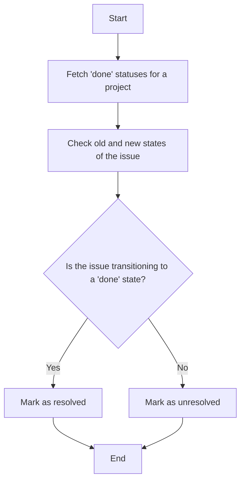

This document will cover the process of determining the resolution state of an issue. We'll cover:

1. Fetching 'done' statuses for a project
2. Checking the old and new states of the issue
3. Deciding whether the issue should be resolved or unresolved.

Technical document: <SwmLink doc-title="Determining Issue Resolution State">[Determining Issue Resolution State](/.swm/determining-issue-resolution-state.38lzwca9.sw.md)</SwmLink>

# [Fetching 'done' statuses for a project](https://app.swimm.io/repos/Z2l0aHViJTNBJTNBc2VudHJ5LWRlbW8tMSUzQSUzQVN3aW1tLURlbW8=/docs/38lzwca9#fetching-done-statuses)

The first step in determining the resolution state of an issue is to identify the states that are considered 'done' for a project. This involves retrieving all possible states for work items in the project and filtering them to include only those that are categorized as 'done'. This ensures that we have a clear understanding of which states indicate that an issue is completed.

# [Checking the old and new states of the issue](https://app.swimm.io/repos/Z2l0aHViJTNBJTNBc2VudHJ5LWRlbW8tMSUzQSUzQVN3aW1tLURlbW8=/docs/38lzwca9#flow-drill-down)

Next, we need to check the previous and current states of the issue. This involves comparing the state of the issue before and after a change. By doing this, we can determine if the issue has transitioned from a non-done state to a done state or vice versa. This comparison is crucial for deciding the resolution status of the issue.

# [Deciding whether the issue should be resolved or unresolved](https://app.swimm.io/repos/Z2l0aHViJTNBJTNBc2VudHJ5LWRlbW8tMSUzQSUzQVN3aW1tLURlbW8=/docs/38lzwca9#resolving-sync-actions)

Finally, based on the comparison of the old and new states, we decide whether the issue should be marked as resolved or unresolved. If the issue transitions from a non-done state to a done state, it should be marked as resolved. Conversely, if it transitions from a done state to a non-done state, it should be marked as unresolved. This decision ensures that the issue's resolution status accurately reflects its current state.

&nbsp;

*This is an auto-generated document by Swimm AI 🌊 and has not yet been verified by a human*

<SwmMeta version="3.0.0" repo-id="Z2l0aHViJTNBJTNBc2VudHJ5LWRlbW8tMSUzQSUzQVN3aW1tLURlbW8=" repo-name="sentry-demo-1" doc-type="product-flows">Powered by [Swimm](/)</SwmMeta>
