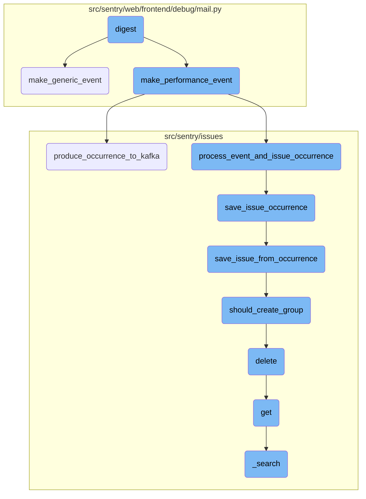
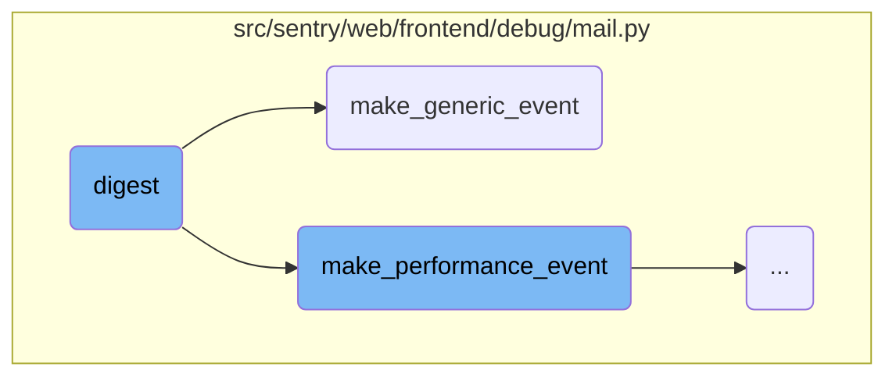
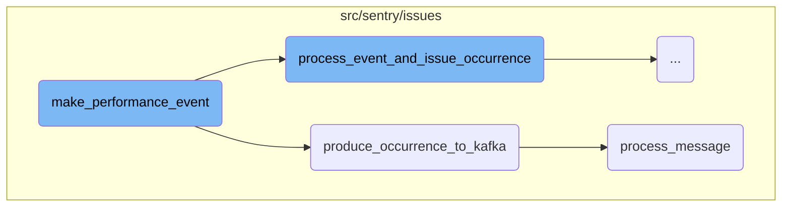

```mermaid
graph TD;
      subgraph src/sentry/issues
0e8f321a5b964b59138c9e0d58498beaca614106b333f11974108d74cbf72aeb(process_event_and_issue_occurrence):::mainFlowStyle --> 33077f0cb2f5fe38aabaa9c72ed4fbf8e8cf82a4b46f6acd4c52c20ca2539759(save_issue_occurrence):::mainFlowStyle
end

subgraph src/sentry/issues
33077f0cb2f5fe38aabaa9c72ed4fbf8e8cf82a4b46f6acd4c52c20ca2539759(save_issue_occurrence):::mainFlowStyle --> 73287f14b41aed47cefb33e729102b46f361055d12591635d598418e9fcd0c6e(save_issue_from_occurrence):::mainFlowStyle
end

subgraph src/sentry/issues
73287f14b41aed47cefb33e729102b46f361055d12591635d598418e9fcd0c6e(save_issue_from_occurrence):::mainFlowStyle --> 53b0f1a055e7d42105ff0f146acb6ee963337d2414ab6ffd49658c81c22f3925(should_create_group):::mainFlowStyle
end

subgraph src/sentry/issues
53b0f1a055e7d42105ff0f146acb6ee963337d2414ab6ffd49658c81c22f3925(should_create_group):::mainFlowStyle --> 46fd623efcf0e07f29eeff8dfb22b891d99366d92b989de50b3ebe258b2250c2(delete):::mainFlowStyle
end

subgraph src/sentry/issues
46fd623efcf0e07f29eeff8dfb22b891d99366d92b989de50b3ebe258b2250c2(delete):::mainFlowStyle --> 6a6c4d35daa9b5dfd9b380a4500d5f2e54056cd198f5a8081354febbd6bde7cb(get):::mainFlowStyle
end

subgraph src/sentry/issues
6a6c4d35daa9b5dfd9b380a4500d5f2e54056cd198f5a8081354febbd6bde7cb(get):::mainFlowStyle --> 5c2c7c800021b5710cca667044f2c20f2f4c5b0e41468fd7f58fef2f2118f594(_search):::mainFlowStyle
end


      classDef mainFlowStyle color:#000000,fill:#7CB9F4
classDef rootsStyle color:#000000,fill:#00FFF4
classDef Style1 color:#000000,fill:#00FFAA
classDef Style2 color:#000000,fill:#FFFF00
classDef Style3 color:#000000,fill:#AA7CB9

%% Swimm:
%% graph TD;
%%       subgraph <SwmPath>[src/sentry/issues/](src/sentry/issues/)</SwmPath>
%% 0e8f321a5b964b59138c9e0d58498beaca614106b333f11974108d74cbf72aeb(process_event_and_issue_occurrence):::mainFlowStyle --> 33077f0cb2f5fe38aabaa9c72ed4fbf8e8cf82a4b46f6acd4c52c20ca2539759(save_issue_occurrence):::mainFlowStyle
%% end
%% 
%% subgraph <SwmPath>[src/sentry/issues/](src/sentry/issues/)</SwmPath>
%% 33077f0cb2f5fe38aabaa9c72ed4fbf8e8cf82a4b46f6acd4c52c20ca2539759(save_issue_occurrence):::mainFlowStyle --> 73287f14b41aed47cefb33e729102b46f361055d12591635d598418e9fcd0c6e(save_issue_from_occurrence):::mainFlowStyle
%% end
%% 
%% subgraph <SwmPath>[src/sentry/issues/](src/sentry/issues/)</SwmPath>
%% 73287f14b41aed47cefb33e729102b46f361055d12591635d598418e9fcd0c6e(save_issue_from_occurrence):::mainFlowStyle --> 53b0f1a055e7d42105ff0f146acb6ee963337d2414ab6ffd49658c81c22f3925(should_create_group):::mainFlowStyle
%% end
%% 
%% subgraph <SwmPath>[src/sentry/issues/](src/sentry/issues/)</SwmPath>
%% 53b0f1a055e7d42105ff0f146acb6ee963337d2414ab6ffd49658c81c22f3925(should_create_group):::mainFlowStyle --> 46fd623efcf0e07f29eeff8dfb22b891d99366d92b989de50b3ebe258b2250c2(delete):::mainFlowStyle
%% end
%% 
%% subgraph <SwmPath>[src/sentry/issues/](src/sentry/issues/)</SwmPath>
%% 46fd623efcf0e07f29eeff8dfb22b891d99366d92b989de50b3ebe258b2250c2(delete):::mainFlowStyle --> 6a6c4d35daa9b5dfd9b380a4500d5f2e54056cd198f5a8081354febbd6bde7cb(get):::mainFlowStyle
%% end
%% 
%% subgraph <SwmPath>[src/sentry/issues/](src/sentry/issues/)</SwmPath>
%% 6a6c4d35daa9b5dfd9b380a4500d5f2e54056cd198f5a8081354febbd6bde7cb(get):::mainFlowStyle --> 5c2c7c800021b5710cca667044f2c20f2f4c5b0e41468fd7f58fef2f2118f594(_search):::mainFlowStyle
%% end
%% 
%% 
%%       classDef mainFlowStyle color:#000000,fill:#7CB9F4
%% classDef rootsStyle color:#000000,fill:#00FFF4
%% classDef Style1 color:#000000,fill:#00FFAA
%% classDef Style2 color:#000000,fill:#FFFF00
%% classDef Style3 color:#000000,fill:#AA7CB9
```

This document explains the <SwmToken path="src/sentry/web/frontend/debug/mail.py" pos="494:2:2" line-data="def digest(request):">`digest`</SwmToken> function, which simulates the creation of a digest email by generating random data for an organization, project, rules, and events. It includes the creation of groups of events and notifications, such as performance and generic issues, and compiles them into a digest format. This function is crucial for testing the digest email functionality.

The <SwmToken path="src/sentry/web/frontend/debug/mail.py" pos="494:2:2" line-data="def digest(request):">`digest`</SwmToken> function starts by generating random data for an organization and project. It then creates rules and groups of events. For each group, it generates multiple events, including performance and generic issues. These events are compiled into a digest format, which is used to simulate the creation of a digest email. This process helps in testing the functionality of digest emails by providing a realistic set of data.

Here is a high level diagram of the flow, showing only the most important functions:



# Flow drill down

First, we'll zoom into this section of the flow:



<SwmSnippet path="/src/sentry/web/frontend/debug/mail.py" line="494">

---

## Digest Function

The <SwmToken path="src/sentry/web/frontend/debug/mail.py" pos="494:2:2" line-data="def digest(request):">`digest`</SwmToken> function simulates the creation of a digest email by generating random data for an organization, project, rules, and events. It creates groups of events and notifications, including performance and generic issues, and compiles them into a digest format. This function is crucial for testing the digest email functionality.

```python
def digest(request):
    random = get_random(request)

    # TODO: Refactor all of these into something more manageable.
    org = Organization(id=1, slug="example", name="Example Organization")
    project = Project(id=1, slug="example", name="Example Project", organization=org)
    rules = {
        i: Rule(id=i, project=project, label=f"Rule #{i}") for i in range(1, random.randint(2, 4))
    }
    groups = {}
    event_counts = {}
    user_counts = {}
    records = []
    group_generator = make_group_generator(random, project)
    notification_uuid = str(uuid.uuid4())
    for _ in range(random.randint(1, 30)):
        group = next(group_generator)
        groups[group.id] = group

        offset = timedelta(seconds=0)
        for _ in range(random.randint(1, 10)):
```

---

</SwmSnippet>

<SwmSnippet path="/src/sentry/web/frontend/debug/mail.py" line="236">

---

## Make Generic Event Function

The <SwmToken path="src/sentry/web/frontend/debug/mail.py" pos="236:2:2" line-data="def make_generic_event(project: Project):">`make_generic_event`</SwmToken> function generates a generic event for a given project. It creates a unique event ID, processes the event and its occurrence, and returns the latest event in the group. This function is used within the <SwmToken path="src/sentry/web/frontend/debug/mail.py" pos="494:2:2" line-data="def digest(request):">`digest`</SwmToken> function to add generic issues to the digest.

```python
def make_generic_event(project: Project):
    event_id = uuid.uuid4().hex
    occurrence_data = TEST_ISSUE_OCCURRENCE.to_dict()
    occurrence_data["event_id"] = event_id
    occurrence_data["fingerprint"] = [
        md5(part.encode("utf-8")).hexdigest() for part in occurrence_data["fingerprint"]
    ]
    occurrence, group_info = process_event_and_issue_occurrence(
        occurrence_data,
        {
            "event_id": event_id,
            "project_id": project.id,
            "timestamp": before_now(minutes=1).isoformat(),
        },
    )
    assert group_info is not None
    generic_group = group_info.group
    return generic_group.get_latest_event()
```

---

</SwmSnippet>

Now, lets zoom into this section of the flow:



<SwmSnippet path="/src/sentry/web/frontend/debug/mail.py" line="206">

---

## <SwmToken path="src/sentry/web/frontend/debug/mail.py" pos="206:2:2" line-data="def make_performance_event(project: Project, sample_name: str):">`make_performance_event`</SwmToken>

The function <SwmToken path="src/sentry/web/frontend/debug/mail.py" pos="206:2:2" line-data="def make_performance_event(project: Project, sample_name: str):">`make_performance_event`</SwmToken> is responsible for creating a mock performance event. It initializes timestamps, event <SwmToken path="src/sentry/web/frontend/debug/mail.py" pos="549:13:13" line-data="        # don&#39;t clobber error issue ids">`ids`</SwmToken>, and occurrence data. It then processes the event and issue occurrence using <SwmToken path="src/sentry/web/frontend/debug/mail.py" pos="220:8:8" line-data="        occurrence, group_info = process_event_and_issue_occurrence(">`process_event_and_issue_occurrence`</SwmToken> and produces the occurrence to Kafka using <SwmToken path="src/sentry/web/frontend/debug/mail.py" pos="224:1:1" line-data="        produce_occurrence_to_kafka(payload_type=PayloadType.OCCURRENCE, occurrence=occurrence)">`produce_occurrence_to_kafka`</SwmToken>. Finally, it ensures the group information is not null and returns the latest event from the group.

```python
def make_performance_event(project: Project, sample_name: str):
    timestamp = datetime(2017, 9, 6, 0, 0)
    start_timestamp = timestamp - timedelta(seconds=3)
    event_id = "44f1419e73884cd2b45c79918f4b6dc4"
    mock_occurrence = SAMPLE_TO_OCCURRENCE_MAP[sample_name]
    occurrence_data = mock_occurrence.to_dict()
    occurrence_data["event_id"] = event_id
    perf_data = dict(load_data(sample_name, start_timestamp=start_timestamp, timestamp=timestamp))
    perf_data["event_id"] = event_id
    perf_data["project_id"] = project.id

    with mock.patch.object(
        mock_occurrence.type, "noise_config", new=NoiseConfig(0, timedelta(minutes=1))
    ):
        occurrence, group_info = process_event_and_issue_occurrence(
            occurrence_data,
            perf_data,
        )
        produce_occurrence_to_kafka(payload_type=PayloadType.OCCURRENCE, occurrence=occurrence)

    assert group_info is not None
```

---

</SwmSnippet>

<SwmSnippet path="/src/sentry/issues/producer.py" line="50">

---

### Producing Occurrence to Kafka

The function <SwmToken path="src/sentry/issues/producer.py" pos="50:2:2" line-data="def produce_occurrence_to_kafka(">`produce_occurrence_to_kafka`</SwmToken> is used to send the occurrence data to Kafka. It prepares the payload based on the payload type and sends it to the appropriate Kafka topic. If Kafka is not running, it processes the message directly.

```python
def produce_occurrence_to_kafka(
    payload_type: PayloadType = PayloadType.OCCURRENCE,
    occurrence: IssueOccurrence | None = None,
    status_change: StatusChangeMessage | None = None,
    event_data: dict[str, Any] | None = None,
    is_buffered_spans: bool | None = False,
) -> None:
    if payload_type == PayloadType.OCCURRENCE:
        payload_data = _prepare_occurrence_message(occurrence, event_data, is_buffered_spans)
    elif payload_type == PayloadType.STATUS_CHANGE:
        payload_data = _prepare_status_change_message(status_change)
    else:
        raise NotImplementedError(f"Unknown payload type: {payload_type}")

    if payload_data is None:
        return

    partition_key = None
    if occurrence and occurrence.fingerprint:
        partition_key = occurrence.fingerprint[0].encode()
    elif status_change and status_change.fingerprint:
```

---

</SwmSnippet>

<SwmSnippet path="/src/sentry/issues/run.py" line="95">

---

### Processing Message

The function <SwmToken path="src/sentry/issues/run.py" pos="95:2:2" line-data="def process_message(message: Message[KafkaPayload]) -&gt; None:">`process_message`</SwmToken> is responsible for processing the Kafka message. It loads the message payload and processes it using <SwmToken path="src/sentry/issues/run.py" pos="96:11:11" line-data="    from sentry.issues.occurrence_consumer import _process_message">`_process_message`</SwmToken>. If an exception occurs, it logs the failure.

```python
def process_message(message: Message[KafkaPayload]) -> None:
    from sentry.issues.occurrence_consumer import _process_message

    try:
        payload = orjson.loads(message.payload.value)
        _process_message(payload)
    except Exception:
        logger.exception("failed to process message payload")
```

---

</SwmSnippet>

Now, lets zoom into this section of the flow:



<SwmSnippet path="/src/sentry/issues/occurrence_consumer.py" line="116">

---

## Processing Event and Issue Occurrence

The function <SwmToken path="src/sentry/issues/occurrence_consumer.py" pos="116:2:2" line-data="def process_event_and_issue_occurrence(">`process_event_and_issue_occurrence`</SwmToken> ensures that the <SwmToken path="src/sentry/issues/occurrence_consumer.py" pos="119:6:6" line-data="    if occurrence_data[&quot;event_id&quot;] != event_data[&quot;event_id&quot;]:">`event_id`</SwmToken> in <SwmToken path="src/sentry/issues/occurrence_consumer.py" pos="117:1:1" line-data="    occurrence_data: IssueOccurrenceData, event_data: dict[str, Any]">`occurrence_data`</SwmToken> matches the <SwmToken path="src/sentry/issues/occurrence_consumer.py" pos="119:6:6" line-data="    if occurrence_data[&quot;event_id&quot;] != event_data[&quot;event_id&quot;]:">`event_id`</SwmToken> in <SwmToken path="src/sentry/issues/occurrence_consumer.py" pos="117:7:7" line-data="    occurrence_data: IssueOccurrenceData, event_data: dict[str, Any]">`event_data`</SwmToken>. If they match, it proceeds to save the event from the occurrence and then calls <SwmToken path="src/sentry/issues/occurrence_consumer.py" pos="126:6:6" line-data="        &quot;occurrence_consumer._process_message.save_issue_occurrence&quot;,">`save_issue_occurrence`</SwmToken> to handle the issue occurrence.

```python
def process_event_and_issue_occurrence(
    occurrence_data: IssueOccurrenceData, event_data: dict[str, Any]
) -> tuple[IssueOccurrence, GroupInfo | None]:
    if occurrence_data["event_id"] != event_data["event_id"]:
        raise ValueError(
            f"event_id in occurrence({occurrence_data['event_id']}) is different from event_id in event_data({event_data['event_id']})"
        )

    event = save_event_from_occurrence(event_data)
    with metrics.timer(
        "occurrence_consumer._process_message.save_issue_occurrence",
        tags={"method": "process_event_and_issue_occurrence"},
    ):
        return save_issue_occurrence(occurrence_data, event)
```

---

</SwmSnippet>

<SwmSnippet path="/src/sentry/issues/ingest.py" line="43">

---

## Saving Issue Occurrence

The function <SwmToken path="src/sentry/issues/ingest.py" pos="43:2:2" line-data="def save_issue_occurrence(">`save_issue_occurrence`</SwmToken> converts the occurrence data into an <SwmToken path="src/sentry/issues/ingest.py" pos="45:6:6" line-data=") -&gt; tuple[IssueOccurrence, GroupInfo | None]:">`IssueOccurrence`</SwmToken> object and ensures it matches the event's <SwmToken path="src/sentry/issues/ingest.py" pos="48:5:5" line-data="    if occurrence.event_id != event.event_id:">`event_id`</SwmToken>. It then saves the occurrence, retrieves the release associated with the event, and calls <SwmToken path="src/sentry/issues/ingest.py" pos="60:5:5" line-data="    group_info = save_issue_from_occurrence(occurrence, event, release)">`save_issue_from_occurrence`</SwmToken> to handle further processing. If a <SwmToken path="src/sentry/issues/ingest.py" pos="45:9:9" line-data=") -&gt; tuple[IssueOccurrence, GroupInfo | None]:">`GroupInfo`</SwmToken> is returned, it updates the environment and release counts and sends the occurrence to the event stream.

```python
def save_issue_occurrence(
    occurrence_data: IssueOccurrenceData, event: Event
) -> tuple[IssueOccurrence, GroupInfo | None]:
    # Convert occurrence data to `IssueOccurrence`
    occurrence = IssueOccurrence.from_dict(occurrence_data)
    if occurrence.event_id != event.event_id:
        raise ValueError("IssueOccurrence must have the same event_id as the passed Event")
    # Note: For now we trust the project id passed along with the event. Later on we should make
    # sure that this is somehow validated.
    occurrence.save()

    try:
        release = Release.get(event.project, event.release)
    except Release.DoesNotExist:
        # The release should always exist here since event has been ingested at this point, but just
        # in case it has been deleted
        release = None
    group_info = save_issue_from_occurrence(occurrence, event, release)
    if group_info:
        environment = event.get_environment()
        _get_or_create_group_environment(environment, release, [group_info])
```

---

</SwmSnippet>

<SwmSnippet path="/src/sentry/issues/ingest.py" line="166">

---

## Saving Issue from Occurrence

The function <SwmToken path="src/sentry/issues/ingest.py" pos="166:2:2" line-data="def save_issue_from_occurrence(">`save_issue_from_occurrence`</SwmToken> creates or retrieves a <SwmToken path="src/sentry/issues/ingest.py" pos="172:16:16" line-data="    # until after we have created a `Group`.">`Group`</SwmToken> based on the occurrence's fingerprint. If no existing group hash is found, it checks if a new group should be created using <SwmToken path="src/sentry/issues/grouptype.py" pos="597:2:2" line-data="def should_create_group(">`should_create_group`</SwmToken>. If a new group is created, it handles rate limiting and saves the group and group hash. If an existing group is found, it processes the existing aggregate and returns the <SwmToken path="src/sentry/issues/ingest.py" pos="168:4:4" line-data=") -&gt; GroupInfo | None:">`GroupInfo`</SwmToken>.

```python
def save_issue_from_occurrence(
    occurrence: IssueOccurrence, event: Event, release: Release | None
) -> GroupInfo | None:
    project = event.project
    issue_kwargs = _create_issue_kwargs(occurrence, event, release)
    # We need to augment the message with occurrence data here since we can't build a `GroupEvent`
    # until after we have created a `Group`.
    issue_kwargs["message"] = augment_message_with_occurrence(issue_kwargs["message"], occurrence)

    # TODO: For now we will assume a single fingerprint. We can expand later if necessary.
    # Note that additional fingerprints won't be used to generated additional issues, they'll be
    # used to map the occurrence to a specific issue.
    new_grouphash = occurrence.fingerprint[0]
    existing_grouphash = (
        GroupHash.objects.filter(project=project, hash=new_grouphash)
        .select_related("group")
        .first()
    )

    if not existing_grouphash:
        cluster_key = settings.SENTRY_ISSUE_PLATFORM_RATE_LIMITER_OPTIONS.get("cluster", "default")
```

---

</SwmSnippet>

<SwmSnippet path="/src/sentry/issues/grouptype.py" line="597">

---

## Determining if a Group Should Be Created

The function <SwmToken path="src/sentry/issues/grouptype.py" pos="597:2:2" line-data="def should_create_group(">`should_create_group`</SwmToken> determines whether a new group should be created based on the occurrence type and project. It uses a Redis client to track the number of times a group hash has been seen and compares it against a noise reduction threshold. If the threshold is exceeded, it deletes the group hash and returns `True`, indicating a new group should be created.

```python
def should_create_group(
    grouptype: type[GroupType],
    client: RedisCluster | StrictRedis,
    grouphash: str,
    project: Project,
) -> bool:
    key = f"grouphash:{grouphash}:{project.id}"
    times_seen = client.incr(key)
    noise_config = grouptype.noise_config

    if not noise_config:
        return True

    over_threshold = times_seen >= noise_config.ignore_limit

    metrics.incr(
        "noise_reduction.should_create_group.threshold",
        tags={
            "over_threshold": over_threshold,
            "group_type": grouptype.slug,
        },
```

---

</SwmSnippet>

&nbsp;

*This is an auto-generated document by Swimm AI 🌊 and has not yet been verified by a human*

<SwmMeta version="3.0.0" repo-id="Z2l0aHViJTNBJTNBc2VudHJ5LWRlbW8tMSUzQSUzQVN3aW1tLURlbW8=" repo-name="sentry-demo-1" doc-type="flows"><sup>Powered by [Swimm](/)</sup></SwmMeta>
