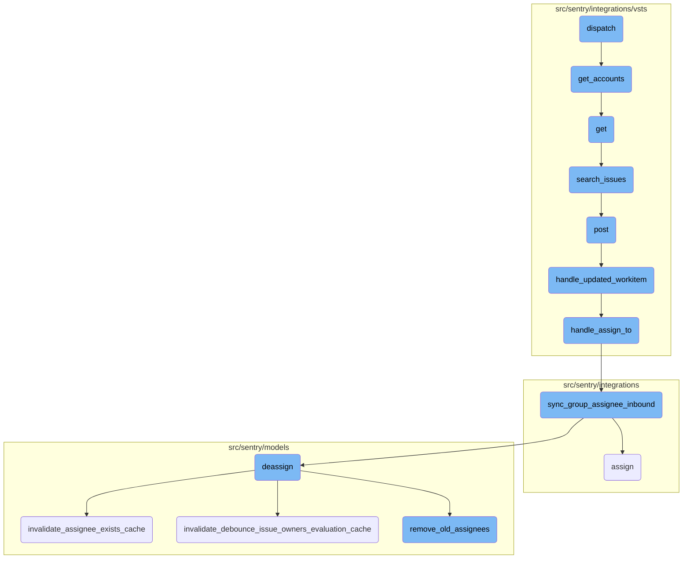
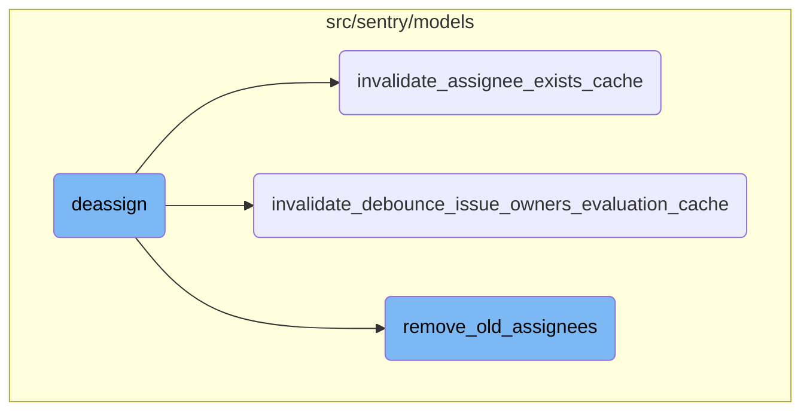

This document explains the dispatch process, which is a crucial part of handling incoming requests and determining the next steps based on account information. The dispatch process involves fetching account and identity states, retrieving user information, and proceeding through various steps to handle and synchronize data.

The dispatch process starts by handling an incoming request and checking for account information. If account information is found, it fetches the state of accounts and identity, retrieves user information, and calls a function to get the user's accounts. Depending on the accounts retrieved, it either moves to the next step or shows a configuration template. The process continues by searching for issues, handling webhook events, processing updated work items, and synchronizing group assignees. Finally, it updates group assignments and sends follow-up messages.

Here is a high level diagram of the flow, showing only the most important functions:



# Flow drill down

First, we'll zoom into this section of the flow:

```mermaid
graph TD;
      subgraph src/sentry/integrations/vsts
04c7f600bab73bd33d58c42a2bb79a5d7940c8893c9442c64363f0c8d1400bea(dispatch):::mainFlowStyle --> 249edb7850e4686b490e4fbf7308033d218e22c1ede366424dc0faf780df9aa7(get_accounts):::mainFlowStyle
end

subgraph src/sentry/integrations/vsts
249edb7850e4686b490e4fbf7308033d218e22c1ede366424dc0faf780df9aa7(get_accounts):::mainFlowStyle --> c9f1b6abd5b86b248deafac3aa63eb8d055350bf49cbe100c54a0d94ee13361a(get):::mainFlowStyle
end

subgraph src/sentry/integrations/vsts
c9f1b6abd5b86b248deafac3aa63eb8d055350bf49cbe100c54a0d94ee13361a(get):::mainFlowStyle --> fc4a2a7e5f1b5a9d6230778920f9b62f4b7f3caa80ebd97c89444e007895b382(search_issues):::mainFlowStyle
end

subgraph src/sentry/integrations/vsts
fc4a2a7e5f1b5a9d6230778920f9b62f4b7f3caa80ebd97c89444e007895b382(search_issues):::mainFlowStyle --> a0445eff32744589c21cfe40b46d7b4346893653994134be4a340aaaf32b3f6d(post):::mainFlowStyle
end

subgraph src/sentry/integrations/vsts
a0445eff32744589c21cfe40b46d7b4346893653994134be4a340aaaf32b3f6d(post):::mainFlowStyle --> 66e049c83c1ca3a7a23933e320651f77196243d817b62c1a401dfd7205f9a929(handle_updated_workitem):::mainFlowStyle
end

subgraph src/sentry/integrations/vsts
66e049c83c1ca3a7a23933e320651f77196243d817b62c1a401dfd7205f9a929(handle_updated_workitem):::mainFlowStyle --> 66c307c65db74ab637ed0ed1623cc34d22110f0911938f86a52ccb8f5e8009dd(handle_assign_to):::mainFlowStyle
end

subgraph src/sentry/integrations/utils/sync.py
66c307c65db74ab637ed0ed1623cc34d22110f0911938f86a52ccb8f5e8009dd(handle_assign_to):::mainFlowStyle --> dd6f2c6555a3ad00a0aed3ab34055c7026063e3a2a74b2537fcf2a1223ffa577(sync_group_assignee_inbound):::mainFlowStyle
end

subgraph src/sentry/integrations/discord/webhooks
dd6f2c6555a3ad00a0aed3ab34055c7026063e3a2a74b2537fcf2a1223ffa577(sync_group_assignee_inbound):::mainFlowStyle --> 56621b0838f35e2e3d298b3ec08199d7d5798cf4ceebb767aed231b8ab67c192(assign)
end

subgraph src/sentry/models/groupassignee.py
dd6f2c6555a3ad00a0aed3ab34055c7026063e3a2a74b2537fcf2a1223ffa577(sync_group_assignee_inbound):::mainFlowStyle --> c745dbcbd32c9f5374c257f26bdc9092c08fc103acaae49568a75a0568d76364(deassign):::mainFlowStyle
end

subgraph src/sentry/models/groupassignee.py
c745dbcbd32c9f5374c257f26bdc9092c08fc103acaae49568a75a0568d76364(deassign):::mainFlowStyle --> eme2h(...)
end

subgraph src/sentry/integrations/discord/webhooks
56621b0838f35e2e3d298b3ec08199d7d5798cf4ceebb767aed231b8ab67c192(assign) --> 5abb0782c5d50dc9bb2caef009ed5c564204afbedcccbd9f32c823400ee85c55(send_message)
end


      classDef mainFlowStyle color:#000000,fill:#7CB9F4
classDef rootsStyle color:#000000,fill:#00FFF4
classDef Style1 color:#000000,fill:#00FFAA
classDef Style2 color:#000000,fill:#FFFF00
classDef Style3 color:#000000,fill:#AA7CB9

%% Swimm:
%% graph TD;
%%       subgraph <SwmPath>[src/sentry/integrations/vsts/](src/sentry/integrations/vsts/)</SwmPath>
%% 04c7f600bab73bd33d58c42a2bb79a5d7940c8893c9442c64363f0c8d1400bea(dispatch):::mainFlowStyle --> 249edb7850e4686b490e4fbf7308033d218e22c1ede366424dc0faf780df9aa7(get_accounts):::mainFlowStyle
%% end
%% 
%% subgraph <SwmPath>[src/sentry/integrations/vsts/](src/sentry/integrations/vsts/)</SwmPath>
%% 249edb7850e4686b490e4fbf7308033d218e22c1ede366424dc0faf780df9aa7(get_accounts):::mainFlowStyle --> c9f1b6abd5b86b248deafac3aa63eb8d055350bf49cbe100c54a0d94ee13361a(get):::mainFlowStyle
%% end
%% 
%% subgraph <SwmPath>[src/sentry/integrations/vsts/](src/sentry/integrations/vsts/)</SwmPath>
%% c9f1b6abd5b86b248deafac3aa63eb8d055350bf49cbe100c54a0d94ee13361a(get):::mainFlowStyle --> fc4a2a7e5f1b5a9d6230778920f9b62f4b7f3caa80ebd97c89444e007895b382(search_issues):::mainFlowStyle
%% end
%% 
%% subgraph <SwmPath>[src/sentry/integrations/vsts/](src/sentry/integrations/vsts/)</SwmPath>
%% fc4a2a7e5f1b5a9d6230778920f9b62f4b7f3caa80ebd97c89444e007895b382(search_issues):::mainFlowStyle --> a0445eff32744589c21cfe40b46d7b4346893653994134be4a340aaaf32b3f6d(post):::mainFlowStyle
%% end
%% 
%% subgraph <SwmPath>[src/sentry/integrations/vsts/](src/sentry/integrations/vsts/)</SwmPath>
%% a0445eff32744589c21cfe40b46d7b4346893653994134be4a340aaaf32b3f6d(post):::mainFlowStyle --> 66e049c83c1ca3a7a23933e320651f77196243d817b62c1a401dfd7205f9a929(handle_updated_workitem):::mainFlowStyle
%% end
%% 
%% subgraph <SwmPath>[src/sentry/integrations/vsts/](src/sentry/integrations/vsts/)</SwmPath>
%% 66e049c83c1ca3a7a23933e320651f77196243d817b62c1a401dfd7205f9a929(handle_updated_workitem):::mainFlowStyle --> 66c307c65db74ab637ed0ed1623cc34d22110f0911938f86a52ccb8f5e8009dd(handle_assign_to):::mainFlowStyle
%% end
%% 
%% subgraph <SwmPath>[src/sentry/integrations/utils/sync.py](src/sentry/integrations/utils/sync.py)</SwmPath>
%% 66c307c65db74ab637ed0ed1623cc34d22110f0911938f86a52ccb8f5e8009dd(handle_assign_to):::mainFlowStyle --> dd6f2c6555a3ad00a0aed3ab34055c7026063e3a2a74b2537fcf2a1223ffa577(sync_group_assignee_inbound):::mainFlowStyle
%% end
%% 
%% subgraph <SwmPath>[src/sentry/integrations/discord/webhooks/](src/sentry/integrations/discord/webhooks/)</SwmPath>
%% dd6f2c6555a3ad00a0aed3ab34055c7026063e3a2a74b2537fcf2a1223ffa577(sync_group_assignee_inbound):::mainFlowStyle --> 56621b0838f35e2e3d298b3ec08199d7d5798cf4ceebb767aed231b8ab67c192(assign)
%% end
%% 
%% subgraph <SwmPath>[src/sentry/models/groupassignee.py](src/sentry/models/groupassignee.py)</SwmPath>
%% dd6f2c6555a3ad00a0aed3ab34055c7026063e3a2a74b2537fcf2a1223ffa577(sync_group_assignee_inbound):::mainFlowStyle --> c745dbcbd32c9f5374c257f26bdc9092c08fc103acaae49568a75a0568d76364(deassign):::mainFlowStyle
%% end
%% 
%% subgraph <SwmPath>[src/sentry/models/groupassignee.py](src/sentry/models/groupassignee.py)</SwmPath>
%% c745dbcbd32c9f5374c257f26bdc9092c08fc103acaae49568a75a0568d76364(deassign):::mainFlowStyle --> eme2h(...)
%% end
%% 
%% subgraph <SwmPath>[src/sentry/integrations/discord/webhooks/](src/sentry/integrations/discord/webhooks/)</SwmPath>
%% 56621b0838f35e2e3d298b3ec08199d7d5798cf4ceebb767aed231b8ab67c192(assign) --> 5abb0782c5d50dc9bb2caef009ed5c564204afbedcccbd9f32c823400ee85c55(send_message)
%% end
%% 
%% 
%%       classDef mainFlowStyle color:#000000,fill:#7CB9F4
%% classDef rootsStyle color:#000000,fill:#00FFF4
%% classDef Style1 color:#000000,fill:#00FFAA
%% classDef Style2 color:#000000,fill:#FFFF00
%% classDef Style3 color:#000000,fill:#AA7CB9
```



<SwmSnippet path="/src/sentry/integrations/vsts/integration.py" line="566">

---

## Dispatch Function

The dispatch function initiates the flow by handling the incoming request and determining the next step based on the account information. It fetches the state of accounts and identity, retrieves user information, and calls <SwmToken path="src/sentry/integrations/vsts/integration.py" pos="581:7:7" line-data="        accounts = self.get_accounts(access_token, user[&quot;uuid&quot;])">`get_accounts`</SwmToken> to fetch the user's accounts. Depending on the accounts retrieved, it either proceeds to the next step in the pipeline or renders a configuration template.

```python
    def dispatch(self, request: HttpRequest, pipeline: Pipeline) -> HttpResponseBase:
        account_id = request.POST.get("account")
        if account_id is not None:
            state_accounts: Sequence[Mapping[str, Any]] | None = pipeline.fetch_state(
                key="accounts"
            )
            account = self.get_account_from_id(account_id, state_accounts or [])
            if account is not None:
                pipeline.bind_state("account", account)
                return pipeline.next_step()

        state: Mapping[str, Any] | None = pipeline.fetch_state(key="identity")
        access_token = (state or {}).get("data", {}).get("access_token")
        user = get_user_info(access_token)

        accounts = self.get_accounts(access_token, user["uuid"])
        logger.info(
            "vsts.get_accounts",
            extra={
                "organization_id": pipeline.organization.id if pipeline.organization else None,
                "user_id": request.user.id,
```

---

</SwmSnippet>

<SwmSnippet path="/src/sentry/integrations/vsts/integration.py" line="613">

---

## Get Accounts Function

The <SwmToken path="src/sentry/integrations/vsts/integration.py" pos="613:3:3" line-data="    def get_accounts(self, access_token: str, user_id: int) -&gt; Any | None:">`get_accounts`</SwmToken> function retrieves the user's accounts from the VSTS API using the provided access token and user ID. It sends a GET request to the VSTS API and returns the response in JSON format if successful.

```python
    def get_accounts(self, access_token: str, user_id: int) -> Any | None:
        url = (
            f"https://app.vssps.visualstudio.com/_apis/accounts?memberId={user_id}&api-version=4.1"
        )
        with http.build_session() as session:
            response = session.get(
                url,
                headers={
                    "Content-Type": "application/json",
                    "Authorization": f"Bearer {access_token}",
                },
            )
        if response.status_code == 200:
            return response.json()
        return None
```

---

</SwmSnippet>

<SwmSnippet path="/src/sentry/integrations/vsts/search.py" line="23">

---

## Get Function

The get function fetches the integration details and processes the search query for external issues. It validates the request parameters, retrieves the integration installation, and calls <SwmToken path="src/sentry/integrations/vsts/client.py" pos="417:3:3" line-data="    def search_issues(self, account_name: str, query: str | None = None) -&gt; Response:">`search_issues`</SwmToken> to search for work items based on the query.

```python
    def get(
        self, request: Request, organization: RpcOrganization, integration_id: int, **kwds: Any
    ) -> Response:
        try:
            integration = Integration.objects.get(
                organizationintegration__organization_id=coerce_id_from(organization),
                id=integration_id,
                provider="vsts",
            )
        except Integration.DoesNotExist:
            return Response(status=404)

        field = request.GET.get("field")
        query = request.GET.get("query")
        if field is None:
            return Response({"detail": "field is a required parameter"}, status=400)
        if not query:
            return Response({"detail": "query is a required parameter"}, status=400)

        installation = integration.get_installation(organization.id)
        assert isinstance(installation, VstsIntegration), installation
```

---

</SwmSnippet>

<SwmSnippet path="/src/sentry/integrations/vsts/client.py" line="417">

---

## Search Issues Function

The <SwmToken path="src/sentry/integrations/vsts/client.py" pos="417:3:3" line-data="    def search_issues(self, account_name: str, query: str | None = None) -&gt; Response:">`search_issues`</SwmToken> function sends a POST request to the VSTS API to search for work items based on the query. It constructs the request URL and payload, and returns the response from the API.

```python
    def search_issues(self, account_name: str, query: str | None = None) -> Response:
        return self.post(
            VstsApiPath.work_item_search.format(account_name=account_name),
            data={"searchText": query, "$top": 1000},
            api_preview=True,
        )
```

---

</SwmSnippet>

<SwmSnippet path="/src/sentry/integrations/vsts/webhooks.py" line="43">

---

## Post Function

The post function handles incoming webhook events and triggers the appropriate handler based on the event type. It validates the webhook payload, retrieves the integration, checks the webhook secret, and calls <SwmToken path="src/sentry/integrations/vsts/webhooks.py" pos="151:2:2" line-data="def handle_updated_workitem(data: Mapping[str, Any], integration: RpcIntegration) -&gt; None:">`handle_updated_workitem`</SwmToken> if the event type is <SwmToken path="src/sentry/integrations/vsts/webhooks.py" pos="52:31:33" line-data="        # https://docs.microsoft.com/en-us/azure/devops/service-hooks/events?view=azure-devops#workitem.updated">`workitem.updated`</SwmToken>.

```python
    def post(self, request: Request, *args: Any, **kwargs: Any) -> Response:
        try:
            data = request.data
            event_type = data["eventType"]
            external_id = get_vsts_external_id(data=request.data)
        except Exception as e:
            logger.info("vsts.invalid-webhook-payload", extra={"error": str(e)})
            return self.respond(status=status.HTTP_400_BAD_REQUEST)

        # https://docs.microsoft.com/en-us/azure/devops/service-hooks/events?view=azure-devops#workitem.updated
        if event_type == "workitem.updated":
            integration = integration_service.get_integration(
                provider=PROVIDER_KEY, external_id=external_id
            )
            if integration is None:
                logger.info(
                    "vsts.integration-in-webhook-payload-does-not-exist",
                    extra={"external_id": external_id, "event_type": event_type},
                )
                return self.respond(
                    {"detail": "Integration does not exist."}, status=status.HTTP_400_BAD_REQUEST
```

---

</SwmSnippet>

<SwmSnippet path="/src/sentry/integrations/vsts/webhooks.py" line="151">

---

## Handle Updated Workitem Function

The <SwmToken path="src/sentry/integrations/vsts/webhooks.py" pos="151:2:2" line-data="def handle_updated_workitem(data: Mapping[str, Any], integration: RpcIntegration) -&gt; None:">`handle_updated_workitem`</SwmToken> function processes the updated work item data and delegates the assignment handling to the <SwmToken path="src/sentry/integrations/vsts/webhooks.py" pos="89:2:2" line-data="def handle_assign_to(">`handle_assign_to`</SwmToken> function. It extracts necessary information from the data, logs the update, and calls <SwmToken path="src/sentry/integrations/vsts/webhooks.py" pos="89:2:2" line-data="def handle_assign_to(">`handle_assign_to`</SwmToken> and <SwmToken path="src/sentry/integrations/vsts/webhooks.py" pos="124:2:2" line-data="def handle_status_change(">`handle_status_change`</SwmToken> to process the assignment and status change.

```python
def handle_updated_workitem(data: Mapping[str, Any], integration: RpcIntegration) -> None:
    project: str | None = None
    try:
        external_issue_key = data["resource"]["workItemId"]
    except KeyError as e:
        logger.info(
            "vsts.updating-workitem-does-not-have-necessary-information",
            extra={"error": str(e), "integration_id": integration.id},
        )
        return

    try:
        project = data["resourceContainers"]["project"]["id"]
    except KeyError as e:
        logger.info(
            "vsts.updating-workitem-does-not-have-necessary-information",
            extra={"error": str(e), "integration_id": integration.id},
        )

    try:
        assigned_to = data["resource"]["fields"].get("System.AssignedTo")
```

---

</SwmSnippet>

<SwmSnippet path="/src/sentry/integrations/vsts/webhooks.py" line="89">

---

## Handle Assign To Function

The <SwmToken path="src/sentry/integrations/vsts/webhooks.py" pos="89:2:2" line-data="def handle_assign_to(">`handle_assign_to`</SwmToken> function parses the assigned user's email and calls <SwmToken path="src/sentry/integrations/utils/sync.py" pos="64:2:2" line-data="def sync_group_assignee_inbound(">`sync_group_assignee_inbound`</SwmToken> to synchronize the group assignee. It checks if the <SwmToken path="src/sentry/integrations/vsts/webhooks.py" pos="92:1:1" line-data="    assigned_to: Mapping[str, str] | None,">`assigned_to`</SwmToken> field is present, parses the email, and calls <SwmToken path="src/sentry/integrations/utils/sync.py" pos="64:2:2" line-data="def sync_group_assignee_inbound(">`sync_group_assignee_inbound`</SwmToken> with the parsed email and assignment flag.

```python
def handle_assign_to(
    integration: RpcIntegration,
    external_issue_key: str | None,
    assigned_to: Mapping[str, str] | None,
) -> None:
    if not assigned_to:
        return

    email: str | None = None
    assign = False

    new_value = assigned_to.get("newValue")
    if new_value is not None:
        email = parse_email(new_value)
        if not email:
            logger.info(
                "vsts.failed-to-parse-email-in-handle-assign-to",
                extra={
                    "error": "parse_error",
                    "integration_id": integration.id,
                    "assigned_to_values": assigned_to,
```

---

</SwmSnippet>

<SwmSnippet path="/src/sentry/integrations/utils/sync.py" line="64">

---

## Sync Group Assignee Inbound Function

The <SwmToken path="src/sentry/integrations/utils/sync.py" pos="64:2:2" line-data="def sync_group_assignee_inbound(">`sync_group_assignee_inbound`</SwmToken> function assigns or deassigns users to groups based on the provided email and issue key. It retrieves the affected groups, checks if the assignment flag is set, and assigns or deassigns users to the groups accordingly.

```python
def sync_group_assignee_inbound(
    integration: RpcIntegration,
    email: str | None,
    external_issue_key: str,
    assign: bool = True,
) -> Sequence[Group]:
    """
    Given an integration, user email address and an external issue key,
    assign linked groups to matching users. Checks project membership.
    Returns a list of groups that were successfully assigned.
    """

    logger = logging.getLogger(f"sentry.integrations.{integration.provider}")

    orgs_with_sync_enabled = where_should_sync(integration, "inbound_assignee")
    affected_groups = Group.objects.get_groups_by_external_issue(
        integration,
        orgs_with_sync_enabled,
        external_issue_key,
    )
    log_context = {
```

---

</SwmSnippet>

<SwmSnippet path="/src/sentry/integrations/discord/webhooks/message_component.py" line="137">

---

## Assign Function

The assign function updates the group assignment in Discord and logs the assignment details. It retrieves the selected assignee, updates the group with the assignee information, logs the assignment, and sends a follow-up message to Discord.

```python
    def assign(self) -> Response:
        assignee = self.request.get_selected_options()[0]

        self.update_group(
            {
                "assignedTo": assignee,
                "integration": ActivityIntegration.DISCORD.value,
            }
        )

        logger.info(
            "discord.assign.dialog",
            extra={
                "assignee": assignee,
                "user": self.request.user,
            },
        )

        assert self.request.user is not None

        analytics.record(
```

---

</SwmSnippet>

<SwmSnippet path="/src/sentry/integrations/discord/webhooks/handler.py" line="24">

---

## Send Message Function

The <SwmToken path="src/sentry/integrations/discord/webhooks/handler.py" pos="24:3:3" line-data="    def send_message(self, message: str | DiscordMessageBuilder, update: bool = False) -&gt; Response:">`send_message`</SwmToken> function sends a follow-up message to Discord. It constructs the message payload and sends it as a response with the appropriate response type.

```python
    def send_message(self, message: str | DiscordMessageBuilder, update: bool = False) -> Response:
        """Sends a new follow up message."""
        response_type = DiscordResponseTypes.UPDATE if update else DiscordResponseTypes.MESSAGE

        if isinstance(message, str):
            message = DiscordMessageBuilder(
                content=message, flags=DiscordMessageFlags().set_ephemeral()
            )
        return Response(
            {
                "type": response_type,
                "data": message.build(),
            },
            status=200,
        )
```

---

</SwmSnippet>

Now, lets zoom into this section of the flow:



<SwmSnippet path="/src/sentry/models/groupassignee.py" line="197">

---

## Deassign Function

The <SwmToken path="src/sentry/models/groupassignee.py" pos="197:3:3" line-data="    def deassign(">`deassign`</SwmToken> function is responsible for removing the current assignee from a group. It first attempts to retrieve the current assignee and then deletes the assignee record if it exists. It also logs the unassignment activity, updates the group history, and clears the ownership cache for the group. Additionally, it synchronizes the assignee status with external systems if the relevant feature is enabled.

```python
    def deassign(
        self,
        group: Group,
        acting_user: User | RpcUser | None = None,
        assigned_to: Team | RpcUser | None = None,
        extra: dict[str, str] | None = None,
    ) -> None:
        from sentry.integrations.utils import sync_group_assignee_outbound
        from sentry.models.activity import Activity
        from sentry.models.projectownership import ProjectOwnership

        try:
            previous_groupassignee = self.get(group=group)
        except GroupAssignee.DoesNotExist:
            previous_groupassignee = None

        affected = self.filter(group=group)[:1].count()
        self.filter(group=group).delete()

        if affected > 0:
            Activity.objects.create_group_activity(group, ActivityType.UNASSIGNED, user=acting_user)
```

---

</SwmSnippet>

<SwmSnippet path="/src/sentry/models/groupowner.py" line="150">

---

### Invalidate Assignee Exists Cache

The <SwmToken path="src/sentry/models/groupowner.py" pos="150:3:3" line-data="    def invalidate_assignee_exists_cache(cls, project_id, group_id=None):">`invalidate_assignee_exists_cache`</SwmToken> function clears the cache that tracks whether an assignee exists for a group. If a specific group ID is provided, it clears the cache for that group; otherwise, it clears the cache for all groups in a project that had recent events.

```python
    def invalidate_assignee_exists_cache(cls, project_id, group_id=None):
        """
        If `group_id` is provided, clear the assignee exists cache for that group, else
        clear the cache of all groups for a project that had an event within the
        ASSIGNEE_EXISTS_DURATION window.
        """
        if group_id:
            cache.delete(ASSIGNEE_EXISTS_KEY(group_id))
            return

        # Get all the groups for a project that had an event within the ASSIGNEE_EXISTS_DURATION window.
        # Any groups without events in that window would have expired their TTL in the cache.
        queryset = Group.objects.filter(
            project_id=project_id,
            last_seen__gte=timezone.now() - timedelta(seconds=ASSIGNEE_EXISTS_DURATION),
        ).values_list("id", flat=True)

        # Run cache invalidation in batches
        group_id_iter = queryset.iterator(chunk_size=1000)
        while True:
            group_ids = list(itertools.islice(group_id_iter, 1000))
```

---

</SwmSnippet>

<SwmSnippet path="/src/sentry/models/groupowner.py" line="123">

---

### Invalidate Debounce Issue Owners Evaluation Cache

The <SwmToken path="src/sentry/models/groupowner.py" pos="123:3:3" line-data="    def invalidate_debounce_issue_owners_evaluation_cache(cls, project_id, group_id=None):">`invalidate_debounce_issue_owners_evaluation_cache`</SwmToken> function clears the cache that prevents frequent evaluations of issue owners. Similar to the previous function, it can clear the cache for a specific group or for all groups in a project with recent events.

```python
    def invalidate_debounce_issue_owners_evaluation_cache(cls, project_id, group_id=None):
        """
        If `group_id` is provided, clear the debounce issue owners cache for that group, else clear
        the cache of all groups for a project that had an event within the
        ISSUE_OWNERS_DEBOUNCE_DURATION window.
        """
        if group_id:
            cache.delete(ISSUE_OWNERS_DEBOUNCE_KEY(group_id))
            return

        # Get all the groups for a project that had an event within the ISSUE_OWNERS_DEBOUNCE_DURATION window.
        # Any groups without events in that window would have expired their TTL in the cache.
        queryset = Group.objects.filter(
            project_id=project_id,
            last_seen__gte=timezone.now() - timedelta(seconds=ISSUE_OWNERS_DEBOUNCE_DURATION),
        ).values_list("id", flat=True)

        # Run cache invalidation in batches
        group_id_iter = queryset.iterator(chunk_size=1000)
        while True:
            group_ids = list(itertools.islice(group_id_iter, 1000))
```

---

</SwmSnippet>

<SwmSnippet path="/src/sentry/models/groupassignee.py" line="65">

---

### Remove Old Assignees

The <SwmToken path="src/sentry/models/groupassignee.py" pos="65:3:3" line-data="    def remove_old_assignees(">`remove_old_assignees`</SwmToken> function handles the cleanup of subscriptions related to the previous assignee. It removes the old assignee from group subscriptions and logs the removal. Special conditions are handled, such as when the previous assignee is a team or when the new assignee is part of the same team.

```python
    def remove_old_assignees(
        self,
        group: Group,
        previous_assignee: GroupAssignee | None,
        new_assignee_id: int | None = None,
        new_assignee_type: str | None = None,
    ) -> None:
        from sentry.models.team import Team

        if not previous_assignee:
            return

        if (
            features.has("organizations:team-workflow-notifications", group.organization)
            and previous_assignee.team
        ):
            GroupSubscription.objects.filter(
                group=group,
                project=group.project,
                team=previous_assignee.team,
                reason=GroupSubscriptionReason.assigned,
```

---

</SwmSnippet>

&nbsp;

*This is an auto-generated document by Swimm AI 🌊 and has not yet been verified by a human*

<SwmMeta version="3.0.0" repo-id="Z2l0aHViJTNBJTNBc2VudHJ5LWRlbW8tMSUzQSUzQVN3aW1tLURlbW8=" repo-name="sentry-demo-1" doc-type="flows"><sup>Powered by [Swimm](/)</sup></SwmMeta>
