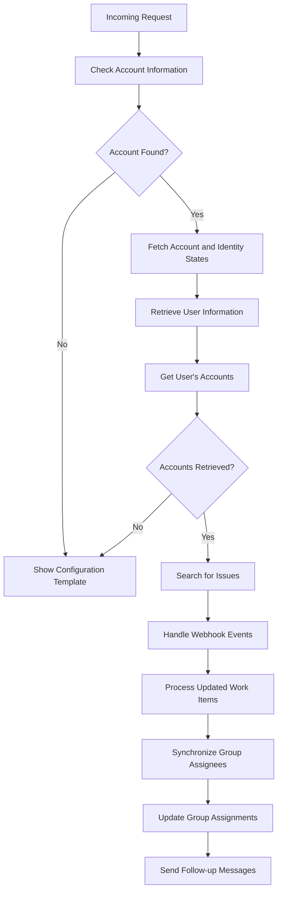

This document will cover the Dispatch Process Overview, which includes:

1. Handling incoming requests
2. Fetching account and identity states
3. Retrieving user information
4. Processing and synchronizing data.

Technical document: <SwmLink doc-title="Dispatch Process Overview">[Dispatch Process Overview](/.swm/dispatch-process-overview.72prpqpg.sw.md)</SwmLink>

# [Handling Incoming Requests](https://app.swimm.io/repos/Z2l0aHViJTNBJTNBc2VudHJ5LWRlbW8tMSUzQSUzQVN3aW1tLURlbW8=/docs/72prpqpg#dispatch-function)

The dispatch process begins by handling an incoming request. This step is crucial as it determines the next steps based on the account information provided in the request. If account information is found, the process proceeds to fetch the state of accounts and identity.

# [Fetching Account and Identity States](https://app.swimm.io/repos/Z2l0aHViJTNBJTNBc2VudHJ5LWRlbW8tMSUzQSUzQVN3aW1tLURlbW8=/docs/72prpqpg#dispatch-function)

Once the account information is identified, the system fetches the state of accounts and identity. This involves retrieving the current status and details of the user's accounts and identity, which are essential for the subsequent steps.

# [Retrieving User Information](https://app.swimm.io/repos/Z2l0aHViJTNBJTNBc2VudHJ5LWRlbW8tMSUzQSUzQVN3aW1tLURlbW8=/docs/72prpqpg#dispatch-function)

After fetching the account and identity states, the system retrieves user information using the access token. This step ensures that the system has the necessary user details to proceed with fetching the user's accounts.

# [Processing and Synchronizing Data](https://app.swimm.io/repos/Z2l0aHViJTNBJTNBc2VudHJ5LWRlbW8tMSUzQSUzQVN3aW1tLURlbW8=/docs/72prpqpg#get-accounts-function)

The system then calls a function to get the user's accounts. Depending on the accounts retrieved, the process either moves to the next step or shows a configuration template. If accounts are retrieved, the system searches for issues, handles webhook events, processes updated work items, and synchronizes group assignees. Finally, it updates group assignments and sends follow-up messages.

&nbsp;

*This is an auto-generated document by Swimm AI 🌊 and has not yet been verified by a human*

<SwmMeta version="3.0.0" repo-id="Z2l0aHViJTNBJTNBc2VudHJ5LWRlbW8tMSUzQSUzQVN3aW1tLURlbW8=" repo-name="sentry-demo-1" doc-type="product-flows">Powered by [Swimm](/)</SwmMeta>
