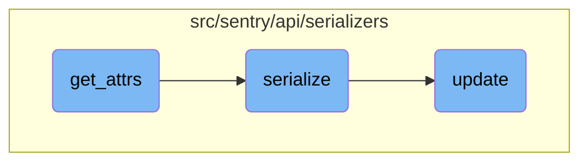

This document explains the role of the <SwmToken path="src/sentry/api/serializers/models/event.py" pos="176:3:3" line-data="    def get_attrs(self, item_list, user, is_public=False):">`get_attrs`</SwmToken> function in gathering and organizing event attributes. It also covers how these attributes are used in the serialization process to format event data for API responses.

The <SwmToken path="src/sentry/api/serializers/models/event.py" pos="176:3:3" line-data="    def get_attrs(self, item_list, user, is_public=False):">`get_attrs`</SwmToken> function collects various pieces of information about an event, such as crash files, user data, and context data. It organizes this information into a dictionary. This dictionary is then used by the <SwmToken path="src/sentry/api/serializers/models/event.py" pos="180:15:15" line-data="            for file, serialized in zip(crash_files, serialize(crash_files, user=user))">`serialize`</SwmToken> function to convert the event data into a format that can be sent to clients via an API. The <SwmToken path="src/sentry/api/serializers/rest_framework/dashboard.py" pos="565:3:3" line-data="    def update(self, instance, validated_data):">`update`</SwmToken> function ensures that any changes to the event data are properly reflected in the system.

# Flow drill down



<SwmSnippet path="/src/sentry/api/serializers/models/event.py" line="176">

---

## <SwmToken path="src/sentry/api/serializers/models/event.py" pos="176:3:3" line-data="    def get_attrs(self, item_list, user, is_public=False):">`get_attrs`</SwmToken> Function

The <SwmToken path="src/sentry/api/serializers/models/event.py" pos="176:3:3" line-data="    def get_attrs(self, item_list, user, is_public=False):">`get_attrs`</SwmToken> function is responsible for gathering and organizing various attributes related to an event. It collects crash files, user data, context data, SDK data, and entries, and then compiles them into a dictionary. This dictionary is then used to provide a structured representation of the event's attributes.

```python
    def get_attrs(self, item_list, user, is_public=False):
        crash_files = get_crash_files(item_list)
        serialized_files = {
            file.event_id: serialized
            for file, serialized in zip(crash_files, serialize(crash_files, user=user))
        }
        results = defaultdict(dict)
        for item in item_list:
            # TODO(dcramer): convert to get_api_context
            (user_data, user_meta) = self._get_interface_with_meta(item, "user", is_public)
            (contexts_data, contexts_meta) = self._get_interface_with_meta(
                item, "contexts", is_public
            )
            (sdk_data, sdk_meta) = self._get_interface_with_meta(item, "sdk", is_public)

            (entries, entries_meta) = get_entries(item, user, is_public=is_public)

            results[item] = {
                "entries": entries,
                "user": user_data,
                "contexts": contexts_data or {},
```

---

</SwmSnippet>

<SwmSnippet path="/src/sentry/api/serializers/models/event.py" line="220">

---

## serialize Function

The <SwmToken path="src/sentry/api/serializers/models/event.py" pos="220:3:3" line-data="    def serialize(self, obj, attrs, user, **kwargs):">`serialize`</SwmToken> function takes an event object and its attributes, then converts them into a format suitable for API responses. It processes various components such as errors, messages, tags, context, packages, and metadata. The function ensures that the event data is properly formatted and includes all necessary information for the client.

```python
    def serialize(self, obj, attrs, user, **kwargs):
        from sentry.api.serializers.rest_framework import convert_dict_key_case, snake_to_camel_case

        errors = [
            EventError(error).get_api_context()
            for error in get_path(obj.data, "errors", filter=True, default=())
            # TODO(ja): Temporary workaround to hide certain normalization errors.
            # Remove this and the test in tests/sentry/api/serializers/test_event.py
            if self.should_display_error(error)
        ]

        (message, message_meta) = self._get_legacy_message_with_meta(obj)
        (tags, tags_meta) = get_tags_with_meta(obj)
        (context, context_meta) = self._get_attr_with_meta(obj, "extra", {})
        (packages, packages_meta) = self._get_attr_with_meta(obj, "modules", {})

        received = obj.data.get("received")
        if received:
            # Sentry at one point attempted to record invalid types here.
            # Remove after June 2 2016
            try:
```

---

</SwmSnippet>

<SwmSnippet path="/src/sentry/api/serializers/rest_framework/dashboard.py" line="565">

---

## update Function

The <SwmToken path="src/sentry/api/serializers/rest_framework/dashboard.py" pos="565:3:3" line-data="    def update(self, instance, validated_data):">`update`</SwmToken> function is used to update a dashboard and its associated widgets and queries. It handles the creation, updating, and deletion of widgets based on the provided validated data. The function ensures that the dashboard's state is consistent with the incoming data and schedules updates for project configurations.

```python
    def update(self, instance, validated_data):
        """
        Update a dashboard, the connected widgets and queries

        - Widgets in the dashboard currently, but not in validated_data will be removed.
        - Widgets without ids will be created.
        - Widgets with matching IDs will be updated.
        - The order of the widgets will be updated based on the order in the request data.

        Only call save() on this serializer from within a transaction or
        bad things will happen
        """
        instance.title = validated_data.get("title", instance.title)
        instance.save()

        if "widgets" in validated_data:
            self.update_widgets(instance, validated_data["widgets"])

        self.update_dashboard_filters(instance, validated_data)

        schedule_update_project_configs(instance)
```

---

</SwmSnippet>

&nbsp;

*This is an auto-generated document by Swimm AI 🌊 and has not yet been verified by a human*

<SwmMeta version="3.0.0" repo-id="Z2l0aHViJTNBJTNBc2VudHJ5LWRlbW8tMSUzQSUzQVN3aW1tLURlbW8=" repo-name="sentry-demo-1" doc-type="flows"><sup>Powered by [Swimm](/)</sup></SwmMeta>
