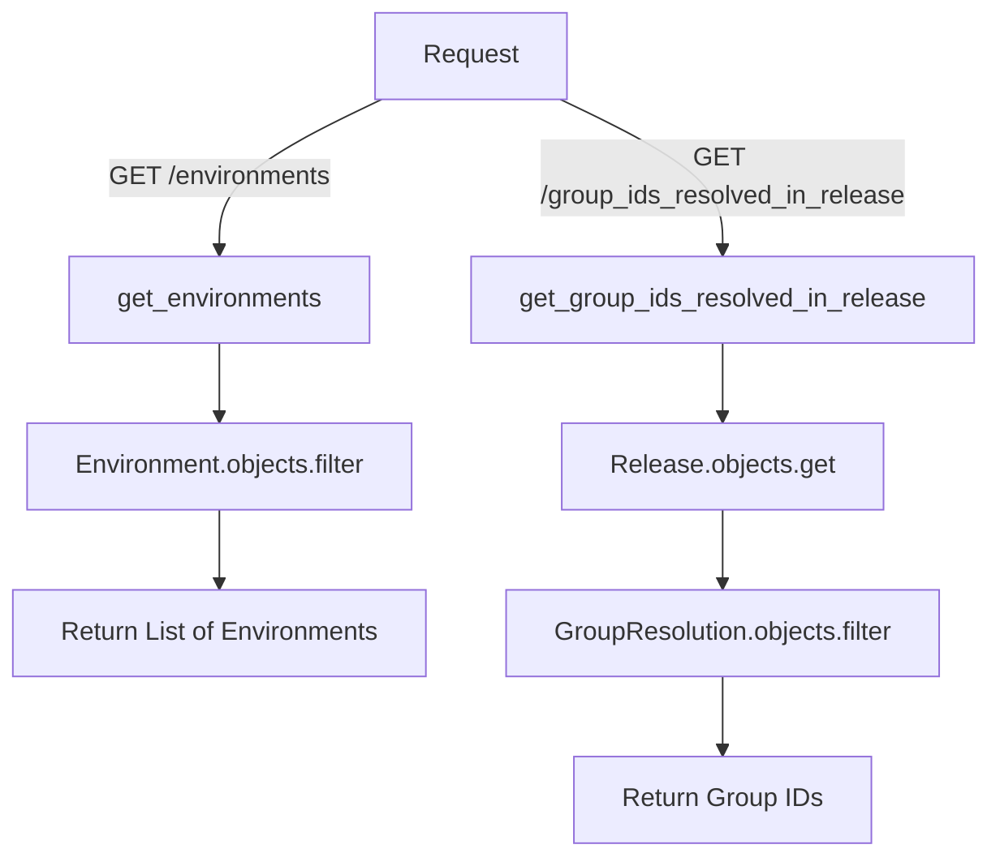

# Overview

Helpers are utility functions and classes designed to assist with various tasks in the API layer. They provide reusable code for common operations, such as validating slugs, managing team permissions, and handling source maps. Helpers improve code maintainability and reduce redundancy by centralizing logic that can be shared across different parts of the application.

# Example of Helpers

The <SwmToken path="src/sentry/api/helpers/actionable_items_helper.py" pos="33:6:6" line-data="    EventError.CLOCK_DRIFT: ActionPriority.LOW,">`ActionPriority`</SwmToken> class defines priority levels for different types of errors, which can be used throughout the application to categorize and handle errors appropriately.

<SwmSnippet path="/src/sentry/api/helpers/actionable_items_helper.py" line="31">

---

The <SwmToken path="src/sentry/api/helpers/actionable_items_helper.py" pos="31:0:0" line-data="priority_ranking = {">`priority_ranking`</SwmToken> dictionary maps various error types to their corresponding priority levels, providing a centralized way to manage error prioritization.

```python
priority_ranking = {
    # Low Priority
    EventError.CLOCK_DRIFT: ActionPriority.LOW,
    EventError.FETCH_GENERIC_ERROR: ActionPriority.LOW,
    EventError.FUTURE_TIMESTAMP: ActionPriority.LOW,
    EventError.INVALID_ATTRIBUTE: ActionPriority.LOW,
    EventError.INVALID_DATA: ActionPriority.LOW,
    EventError.INVALID_ENVIRONMENT: ActionPriority.LOW,
    EventError.NATIVE_BAD_DSYM: ActionPriority.LOW,
    EventError.NATIVE_MISSING_DSYM: ActionPriority.LOW,
    EventError.NATIVE_MISSING_OPTIONALLY_BUNDLED_DSYM: ActionPriority.LOW,
    EventError.PAST_TIMESTAMP: ActionPriority.LOW,
    EventError.PROGUARD_MISSING_LINENO: ActionPriority.LOW,
    EventError.PROGUARD_MISSING_MAPPING: ActionPriority.LOW,
    EventError.RESTRICTED_IP: ActionPriority.LOW,
    EventError.SECURITY_VIOLATION: ActionPriority.LOW,
    # Medium Priority
    EventError.JS_MISSING_SOURCES_CONTENT: ActionPriority.MEDIUM,
    EventError.JS_SCRAPING_DISABLED: ActionPriority.MEDIUM,
    # High Priority
    SourceMapProcessingIssue.DEBUG_ID_NO_SOURCEMAPS: ActionPriority.HIGH,
```

---

</SwmSnippet>

<SwmSnippet path="/src/sentry/api/helpers/actionable_items_helper.py" line="91">

---

The <SwmToken path="src/sentry/api/helpers/actionable_items_helper.py" pos="92:2:2" line-data="def find_debug_frames(event):">`find_debug_frames`</SwmToken> function identifies and returns debug frames from an event, demonstrating how helpers can encapsulate complex logic for reuse.

```python
# These checks mirror what we do in the front end in getUniqueFilesFromException
def find_debug_frames(event):
    debug_frames = []
    exceptions = event.interfaces["exception"].values
    seen_filenames = []

    for exception_idx, exception in enumerate(exceptions):
        for frame_idx, frame in enumerate(exception.stacktrace.frames):
            if (
                frame.in_app
                and is_frame_filename_valid(frame)
                and frame.lineno
                and frame.filename not in seen_filenames
            ):
                debug_frames.append((frame_idx, exception_idx))
                seen_filenames.append(frame.filename)

    return debug_frames
```

---

</SwmSnippet>

<SwmSnippet path="/src/sentry/api/helpers/actionable_items_helper.py" line="118">

---

The <SwmToken path="src/sentry/api/helpers/actionable_items_helper.py" pos="118:2:2" line-data="def is_frame_filename_valid(frame):">`is_frame_filename_valid`</SwmToken> function checks the validity of a frame's filename, showing how helpers can be used for validation tasks.

```python
def is_frame_filename_valid(frame):
    filename = frame.abs_path
    if not filename:
        return False
    try:
        filename = filename.split("/")[-1]
    except Exception:
        pass

    if frame.filename == "<anonymous>" and frame.in_app:
        return False
    elif frame.function in fileNameBlocklist:
        return False
    elif filename and not get_file_extension(filename):
        return False
    return True
```

---

</SwmSnippet>

# Helpers Endpoints

Helpers also include endpoints that facilitate various operations. Below are examples of such endpoints.

## <SwmToken path="src/sentry/api/helpers/environments.py" pos="21:2:2" line-data="def get_environments(">`get_environments`</SwmToken>

The <SwmToken path="src/sentry/api/helpers/environments.py" pos="21:2:2" line-data="def get_environments(">`get_environments`</SwmToken> function retrieves a list of environments based on the request parameters and organization. It filters the environments by the organization ID and the requested environment names. If the requested environments do not match the available environments, it raises a <SwmToken path="src/sentry/api/helpers/environments.py" pos="34:3:3" line-data="        raise ResourceDoesNotExist">`ResourceDoesNotExist`</SwmToken> exception.

<SwmSnippet path="/src/sentry/api/helpers/environments.py" line="21">

---

The <SwmToken path="src/sentry/api/helpers/environments.py" pos="21:2:2" line-data="def get_environments(">`get_environments`</SwmToken> function retrieves a list of environments based on the request parameters and organization.

```python
def get_environments(
    request: Request, organization: Organization | RpcOrganization
) -> list[Environment]:
    requested_environments = set(request.GET.getlist("environment"))

    if not requested_environments:
        return []

    environments = list(
        Environment.objects.filter(organization_id=organization.id, name__in=requested_environments)
    )

    if set(requested_environments) != {e.name for e in environments}:
        raise ResourceDoesNotExist

    return environments
```

---

</SwmSnippet>

## <SwmToken path="src/sentry/api/helpers/releases.py" pos="8:2:2" line-data="def get_group_ids_resolved_in_release(organization, version):">`get_group_ids_resolved_in_release`</SwmToken>

The <SwmToken path="src/sentry/api/helpers/releases.py" pos="8:2:2" line-data="def get_group_ids_resolved_in_release(organization, version):">`get_group_ids_resolved_in_release`</SwmToken> function fetches the group IDs that are resolved in a specific release. It first retrieves the release object based on the version and organization. Then, it gathers group IDs from <SwmToken path="src/sentry/api/helpers/releases.py" pos="15:1:1" line-data="        GroupResolution.objects.filter(release=release).values_list(&quot;group_id&quot;, flat=True)">`GroupResolution`</SwmToken> and <SwmToken path="src/sentry/api/helpers/releases.py" pos="18:1:1" line-data="        GroupLink.objects.filter(">`GroupLink`</SwmToken> models that are linked to the release.

<SwmSnippet path="/src/sentry/api/helpers/releases.py" line="8">

---

The <SwmToken path="src/sentry/api/helpers/releases.py" pos="8:2:2" line-data="def get_group_ids_resolved_in_release(organization, version):">`get_group_ids_resolved_in_release`</SwmToken> function fetches the group IDs that are resolved in a specific release.

```python
def get_group_ids_resolved_in_release(organization, version):
    try:
        release = Release.objects.get(version=version, organization=organization)
    except Release.DoesNotExist:
        raise ResourceDoesNotExist

    group_ids = set(
        GroupResolution.objects.filter(release=release).values_list("group_id", flat=True)
    )
    group_ids |= set(
        GroupLink.objects.filter(
            linked_type=GroupLink.LinkedType.commit,
            linked_id__in=ReleaseCommit.objects.filter(release=release).values_list(
                "commit_id", flat=True
            ),
        ).values_list("group_id", flat=True)
    )
    return group_ids
```

---

</SwmSnippet>

&nbsp;

*This is an auto-generated document by Swimm AI 🌊 and has not yet been verified by a human*

<SwmMeta version="3.0.0" repo-id="Z2l0aHViJTNBJTNBc2VudHJ5LWRlbW8tMSUzQSUzQVN3aW1tLURlbW8=" repo-name="sentry-demo-1" doc-type="overview"><sup>Powered by [Swimm](/)</sup></SwmMeta>
