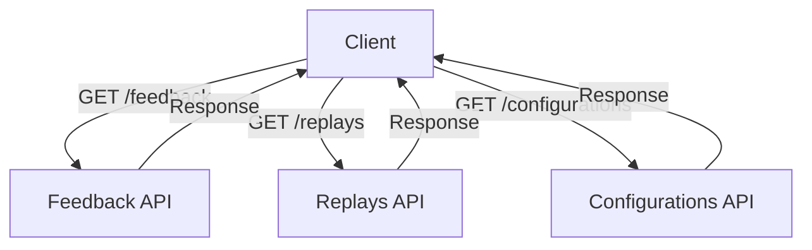

# Overview

The API in the application modules is designed to handle various functionalities such as feedback, replays, and configurations. These APIs are structured by resources, with each resource having specific actions that can be performed against it, ensuring a clear and organized approach to managing application data.

# Feedback API

The Feedback API allows users to browse, fetch, update, and delete feedback for specific organizations and projects. For example, to retrieve a single feedback item, you can use the <SwmToken path="src/sentry/api/client.py" pos="113:3:3" line-data="    def get(self, *args, **kwargs):">`get`</SwmToken> method on the <SwmPath>[src/sentry/feedback/](src/sentry/feedback/)</SwmPath> endpoint.

# Configurations API

The Configurations API is used to get, set, and delete configurations for projects, ensuring that the application settings can be managed programmatically. This allows for dynamic adjustments to the application's behavior based on the configuration settings.

# API Endpoints

API Endpoints are the specific paths through which the APIs can be accessed. Each endpoint corresponds to a specific functionality within the API.

<SwmSnippet path="/src/sentry/api/client.py" line="32">

---

## request Method

The <SwmToken path="src/sentry/api/client.py" pos="32:3:3" line-data="    def request(">`request`</SwmToken> method in the <SwmToken path="src/sentry/api/client.py" pos="12:6:6" line-data="__all__ = (&quot;ApiClient&quot;,)">`ApiClient`</SwmToken> class is a general-purpose method for making API requests. It constructs the full path for the request, resolves the callback, and prepares a mock request object. It handles authentication, session, and superuser checks, and finally calls the callback with the mock request.

```python
    def request(
        self,
        method,
        path,
        user=None,
        auth=None,
        params=None,
        data=None,
        is_sudo=None,
        is_superuser=None,
        request=None,
    ):
        if self.prefix not in path:
            full_path = self.prefix + path
        else:
            full_path = path

        # we explicitly do not allow you to override the request *and* the user
        # as then other checks like is_superuser would need overwritten
        assert not (request and (user or auth)), "use either request or auth"
```

---

</SwmSnippet>

<SwmSnippet path="/src/sentry/api/client.py" line="113">

---

## get Method

The <SwmToken path="src/sentry/api/client.py" pos="113:3:3" line-data="    def get(self, *args, **kwargs):">`get`</SwmToken> method in the <SwmToken path="src/sentry/api/client.py" pos="12:6:6" line-data="__all__ = (&quot;ApiClient&quot;,)">`ApiClient`</SwmToken> class is a convenience method that calls the <SwmToken path="src/sentry/api/client.py" pos="114:5:5" line-data="        return self.request(&quot;GET&quot;, *args, **kwargs)">`request`</SwmToken> method with the HTTP GET method. It simplifies making GET requests to the API.

```python
    def get(self, *args, **kwargs):
        return self.request("GET", *args, **kwargs)
```

---

</SwmSnippet>

## Sequence Diagram

The sequence diagram below illustrates the interaction between the client, <SwmToken path="src/sentry/api/client.py" pos="12:6:6" line-data="__all__ = (&quot;ApiClient&quot;,)">`ApiClient`</SwmToken>, and the server when making a GET request.

sequenceDiagram participant Client participant <SwmToken path="src/sentry/api/client.py" pos="12:6:6" line-data="__all__ = (&quot;ApiClient&quot;,)">`ApiClient`</SwmToken> participant Server Client->>ApiClient: get() ApiClient->>Server: request(GET) Server-->>ApiClient: Response ApiClient-->>Client: Response

&nbsp;

*This is an auto-generated document by Swimm AI 🌊 and has not yet been verified by a human*

<SwmMeta version="3.0.0" repo-id="Z2l0aHViJTNBJTNBc2VudHJ5LWRlbW8tMSUzQSUzQVN3aW1tLURlbW8=" repo-name="sentry-demo-1" doc-type="overview"><sup>Powered by [Swimm](/)</sup></SwmMeta>
