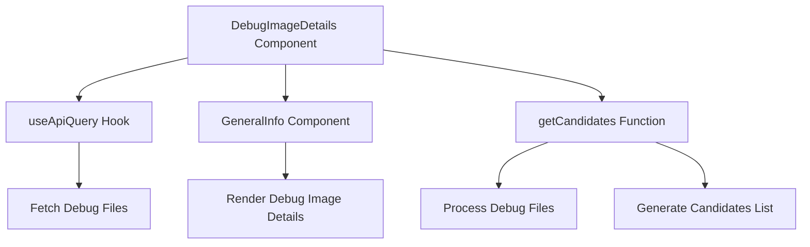

# Overview

Debug image details provide comprehensive information about the debug images associated with an event. This includes metadata such as the debug ID, debug file, code ID, code file, architecture, and processing status.

<SwmSnippet path="/static/app/components/events/interfaces/debugMeta/debugImageDetails/index.tsx" line="211">

---

The <SwmToken path="static/app/components/events/interfaces/debugMeta/debugImageDetails/index.tsx" pos="203:4:4" line-data="export function DebugImageDetails({">`DebugImageDetails`</SwmToken> function fetches and displays detailed information about a debug image, including metadata such as the debug ID, debug file, code ID, code file, architecture, and processing status. It uses hooks like <SwmToken path="static/app/components/events/interfaces/debugMeta/debugImageDetails/index.tsx" pos="212:7:7" line-data="  const organization = useOrganization();">`useOrganization`</SwmToken>, <SwmToken path="static/app/components/events/interfaces/debugMeta/debugImageDetails/index.tsx" pos="213:7:7" line-data="  const api = useApi();">`useApi`</SwmToken>, and <SwmToken path="static/app/components/events/interfaces/debugMeta/debugImageDetails/index.tsx" pos="222:5:5" line-data="  } = useApiQuery&lt;DebugFile[]&gt;(">`useApiQuery`</SwmToken> to manage API calls and state.

```tsx
}: DebugImageDetailsProps) {
  const organization = useOrganization();
  const api = useApi();
  const hasUploadedDebugFiles =
    image?.candidates?.some(candidate => candidate.source === INTERNAL_SOURCE) ?? false;

  const {
    data: debugFiles,
    isPending,
    isError,
    refetch,
  } = useApiQuery<DebugFile[]>(
```

---

</SwmSnippet>

# Processing Debug Files and Image Data

The <SwmToken path="static/app/components/events/interfaces/debugMeta/debugImageDetails/index.tsx" pos="252:7:7" line-data="  const candidates = getCandidates({debugFiles, image, isLoading: isPending});">`getCandidates`</SwmToken> function processes the debug files and image data to generate a list of candidates. It maps through the candidates and debug files to create a structured list, which is then used for display purposes.

<SwmSnippet path="/static/app/components/events/interfaces/debugMeta/debugImageDetails/index.tsx" line="252">

---

The <SwmToken path="static/app/components/events/interfaces/debugMeta/debugImageDetails/index.tsx" pos="252:7:7" line-data="  const candidates = getCandidates({debugFiles, image, isLoading: isPending});">`getCandidates`</SwmToken> function processes the debug files and image data to generate a list of candidates.

```tsx
  const candidates = getCandidates({debugFiles, image, isLoading: isPending});
  const baseUrl = api.baseUrl;
  const fileName = getFileName(code_file);
  const haveCandidatesUnappliedDebugFile = candidates.some(
    candidate => candidate.download.status === CandidateDownloadStatus.UNAPPLIED
  );
```

---

</SwmSnippet>

# Rendering Detailed Information

The <SwmToken path="static/app/components/events/interfaces/debugMeta/debugImageDetails/generalInfo.tsx" pos="15:2:2" line-data="function GeneralInfo({image}: Props) {">`GeneralInfo`</SwmToken> component within <SwmToken path="static/app/components/events/interfaces/debugMeta/debugImageDetails/index.tsx" pos="203:4:4" line-data="export function DebugImageDetails({">`DebugImageDetails`</SwmToken> renders the detailed information about the debug image. This includes address range, debug ID, debug file, code ID, code file, architecture, and processing status.

<SwmSnippet path="/static/app/components/events/interfaces/debugMeta/debugImageDetails/generalInfo.tsx" line="15">

---

The <SwmToken path="static/app/components/events/interfaces/debugMeta/debugImageDetails/generalInfo.tsx" pos="15:2:2" line-data="function GeneralInfo({image}: Props) {">`GeneralInfo`</SwmToken> component is responsible for rendering detailed information about the debug image. This includes address range, debug ID, debug file, code ID, code file, architecture, and processing status. It uses helper functions like <SwmToken path="static/app/components/events/interfaces/debugMeta/debugImageDetails/generalInfo.tsx" pos="19:11:11" line-data="  const imageAddress = image ? getImageAddress(image) : undefined;">`getImageAddress`</SwmToken> to format and display the data.

```tsx
function GeneralInfo({image}: Props) {
  const {debug_id, debug_file, code_id, code_file, arch, unwind_status, debug_status} =
    image ?? {};

  const imageAddress = image ? getImageAddress(image) : undefined;

  return (
    <Wrapper>
      <Label coloredBg>{t('Address Range')}</Label>
      <Value coloredBg>{imageAddress ?? <NotAvailable />}</Value>

      <Label>{t('Debug ID')}</Label>
      <Value>{debug_id ?? <NotAvailable />}</Value>

      <Label coloredBg>{t('Debug File')}</Label>
      <Value coloredBg>{debug_file ?? <NotAvailable />}</Value>

      <Label>{t('Code ID')}</Label>
      <Value>{code_id ?? <NotAvailable />}</Value>

      <Label coloredBg>{t('Code File')}</Label>
```

---

</SwmSnippet>

# Checking for Uploaded Debug Files

The <SwmToken path="static/app/components/events/interfaces/debugMeta/debugImageDetails/index.tsx" pos="214:3:3" line-data="  const hasUploadedDebugFiles =">`hasUploadedDebugFiles`</SwmToken> constant checks if there are any uploaded debug files associated with the image, which influences the fetching and display logic.

<SwmSnippet path="/static/app/components/events/interfaces/debugMeta/debugImageDetails/index.tsx" line="214">

---

The <SwmToken path="static/app/components/events/interfaces/debugMeta/debugImageDetails/index.tsx" pos="214:3:3" line-data="  const hasUploadedDebugFiles =">`hasUploadedDebugFiles`</SwmToken> constant checks if there are any uploaded debug files associated with the image.

```tsx
  const hasUploadedDebugFiles =
    image?.candidates?.some(candidate => candidate.source === INTERNAL_SOURCE) ?? false;
```

---

</SwmSnippet>

<SwmSnippet path="/static/app/components/events/interfaces/debugMeta/debugImageDetails/index.tsx" line="281">

---

The <SwmToken path="static/app/components/events/interfaces/debugMeta/debugImageDetails/index.tsx" pos="281:3:3" line-data="  const debugFilesSettingsLink =">`debugFilesSettingsLink`</SwmToken> provides a link to the settings page for managing debug files based on the project slug and image debug ID.

```tsx
  const debugFilesSettingsLink =
    projSlug && image?.debug_id
      ? `/settings/${organization.slug}/projects/${projSlug}/debug-symbols/?query=${image?.debug_id}`
      : undefined;
```

---

</SwmSnippet>

# Endpoints of Debug Image Details

The <SwmToken path="static/app/components/events/interfaces/debugMeta/debugImageDetails/reprocessAlert.tsx" pos="40:3:3" line-data="  const checkEventReprocessable = useCallback(async () =&gt; {">`checkEventReprocessable`</SwmToken> function is an endpoint that checks if an event can be reprocessed. It sends a request to the URL `/projects/${orgSlug}/${projSlug}/events/${eventId}/reprocessable/` and sets the response to the state <SwmToken path="static/app/components/events/interfaces/debugMeta/debugImageDetails/reprocessAlert.tsx" pos="22:2:2" line-data="type ReprocessableEvent = {">`ReprocessableEvent`</SwmToken>.

<SwmSnippet path="/static/app/components/events/interfaces/debugMeta/debugImageDetails/reprocessAlert.tsx" line="40">

---

The <SwmToken path="static/app/components/events/interfaces/debugMeta/debugImageDetails/reprocessAlert.tsx" pos="40:3:3" line-data="  const checkEventReprocessable = useCallback(async () =&gt; {">`checkEventReprocessable`</SwmToken> function is an endpoint that checks if an event can be reprocessed.

```tsx
  const checkEventReprocessable = useCallback(async () => {
    try {
      const response = await api.requestPromise(
        `/projects/${orgSlug}/${projSlug}/events/${eventId}/reprocessable/`
      );
      setReprocessableEvent(response);
    } catch {
      // do nothing
    }
  }, [api, eventId, orgSlug, projSlug]);
```

---

</SwmSnippet>

&nbsp;

*This is an auto-generated document by Swimm AI 🌊 and has not yet been verified by a human*

<SwmMeta version="3.0.0" repo-id="Z2l0aHViJTNBJTNBc2VudHJ5LWRlbW8tMSUzQSUzQVN3aW1tLURlbW8=" repo-name="sentry-demo-1" doc-type="overview"><sup>Powered by [Swimm](/)</sup></SwmMeta>
