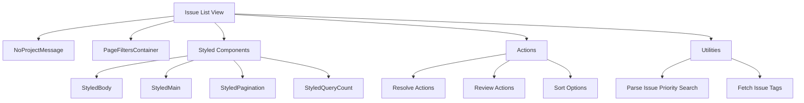

# Overview

The Issue List is a view that displays a list of issues within the application. It provides a comprehensive overview of all the issues that have been logged, allowing users to track and manage them effectively.

# Components

The Issue List view includes various components and utilities to enhance its functionality. For instance, it uses <SwmToken path="static/app/views/issueList/index.tsx" pos="1:2:2" line-data="import NoProjectMessage from &#39;sentry/components/noProjectMessage&#39;;">`NoProjectMessage`</SwmToken> to handle cases where no project is selected and <SwmToken path="static/app/views/issueList/index.tsx" pos="2:2:2" line-data="import PageFiltersContainer from &#39;sentry/components/organizations/pageFilters/container&#39;;">`PageFiltersContainer`</SwmToken> to manage filters applied to the list of issues.

<SwmSnippet path="/static/app/views/issueList/index.tsx" line="1">

---

The <SwmToken path="static/app/views/issueList/index.tsx" pos="12:2:2" line-data="function IssueListContainer({children}: Props) {">`IssueListContainer`</SwmToken> component integrates <SwmToken path="static/app/views/issueList/index.tsx" pos="1:2:2" line-data="import NoProjectMessage from &#39;sentry/components/noProjectMessage&#39;;">`NoProjectMessage`</SwmToken> and <SwmToken path="static/app/views/issueList/index.tsx" pos="2:2:2" line-data="import PageFiltersContainer from &#39;sentry/components/organizations/pageFilters/container&#39;;">`PageFiltersContainer`</SwmToken> to manage the display and filtering of issues.

```tsx
import NoProjectMessage from 'sentry/components/noProjectMessage';
import PageFiltersContainer from 'sentry/components/organizations/pageFilters/container';
import SentryDocumentTitle from 'sentry/components/sentryDocumentTitle';
import {t} from 'sentry/locale';
import useRouteAnalyticsHookSetup from 'sentry/utils/routeAnalytics/useRouteAnalyticsHookSetup';
import useOrganization from 'sentry/utils/useOrganization';

type Props = {
  children: React.ReactNode;
};

function IssueListContainer({children}: Props) {
  const organization = useOrganization();
  useRouteAnalyticsHookSetup();

  return (
    <SentryDocumentTitle title={t('Issues')} orgSlug={organization.slug}>
      <PageFiltersContainer>
        <NoProjectMessage organization={organization}>{children}</NoProjectMessage>
      </PageFiltersContainer>
    </SentryDocumentTitle>
```

---

</SwmSnippet>

# Styled Components

Styled components such as <SwmToken path="static/app/views/issueList/overview.tsx" pos="1341:2:2" line-data="const StyledBody = styled(&#39;div&#39;)`">`StyledBody`</SwmToken>, <SwmToken path="static/app/views/issueList/overview.tsx" pos="1354:2:2" line-data="const StyledMain = styled(&#39;section&#39;)`">`StyledMain`</SwmToken>, <SwmToken path="static/app/views/issueList/overview.tsx" pos="1296:2:2" line-data="            &lt;StyledPagination">`StyledPagination`</SwmToken>, and <SwmToken path="static/app/views/issueList/overview.tsx" pos="1303:2:2" line-data="                        &lt;StyledQueryCount">`StyledQueryCount`</SwmToken> are used to ensure a consistent and visually appealing layout.

<SwmSnippet path="/static/app/views/issueList/overview.tsx" line="1341">

---

The styled components <SwmToken path="static/app/views/issueList/overview.tsx" pos="1341:2:2" line-data="const StyledBody = styled(&#39;div&#39;)`">`StyledBody`</SwmToken> and <SwmToken path="static/app/views/issueList/overview.tsx" pos="1354:2:2" line-data="const StyledMain = styled(&#39;section&#39;)`">`StyledMain`</SwmToken> are defined to maintain a consistent layout.

```tsx
const StyledBody = styled('div')`
  background-color: ${p => p.theme.background};

  flex: 1;
  display: grid;
  gap: 0;
  padding: 0;

  grid-template-rows: 1fr;
  grid-template-columns: minmax(0, 1fr) auto;
  grid-template-areas: 'content saved-searches';
`;

const StyledMain = styled('section')`
  grid-area: content;
  padding: ${space(2)};

  @media (min-width: ${p => p.theme.breakpoints.medium}) {
    padding: ${space(3)} ${space(4)};
  }
`;
```

---

</SwmSnippet>

# Actions

The Issue List view includes actions and utilities for handling issue-related operations, such as resolving issues, reviewing actions, and sorting options.

<SwmSnippet path="/static/app/views/issueList/actions/index.tsx" line="179">

---

The <SwmToken path="static/app/views/issueList/overview.tsx" pos="70:2:2" line-data="import IssueListActions from &#39;./actions&#39;;">`IssueListActions`</SwmToken> function handles various user actions on the issue list, such as deleting, merging, and updating issues.

```tsx
}: IssueListActionsProps) {
  const api = useApi();
  const queryClient = useQueryClient();
  const organization = useOrganization();
  const {
    pageSelected,
    multiSelected,
    anySelected,
    allInQuerySelected,
    selectedIdsSet,
    selectedProjectSlug,
    setAllInQuerySelected,
  } = useSelectedGroupsState();
  const [isSavedSearchesOpen] = useSyncedLocalStorageState(
    SAVED_SEARCHES_SIDEBAR_OPEN_LOCALSTORAGE_KEY,
    false
  );

  const disableActions = useMedia(
    `(max-width: ${
      isSavedSearchesOpen ? theme.breakpoints.xlarge : theme.breakpoints.medium
```

---

</SwmSnippet>

# Search Functionalities

The view supports various search functionalities, including parsing issue priority searches and fetching issue tags.

<SwmSnippet path="/static/app/views/issueList/issueListSetAsDefault.tsx" line="56">

---

The search functionalities include parsing issue priority searches and fetching issue tags.

```tsx
    onSuccess: () => {
      const {cursor: _cursor, page: _page, ...currentQuery} = location.query;
      browserHistory.replace(
        normalizeUrl({
          ...location,
          pathname: `/organizations/${organization.slug}/issues/`,
          query: {
            referrer: 'search-bar',
            query,
            sort,
            ...currentQuery,
          },
        })
      );
    },
```

---

</SwmSnippet>

# Main Functions

There are several main functions in this folder. Some of them are <SwmToken path="static/app/views/issueList/overview.tsx" pos="158:2:2" line-data="class IssueListOverview extends Component&lt;Props, State&gt; {">`IssueListOverview`</SwmToken> and <SwmToken path="static/app/views/issueList/overview.tsx" pos="70:2:2" line-data="import IssueListActions from &#39;./actions&#39;;">`IssueListActions`</SwmToken>. We will dive a little into <SwmToken path="static/app/views/issueList/overview.tsx" pos="158:2:2" line-data="class IssueListOverview extends Component&lt;Props, State&gt; {">`IssueListOverview`</SwmToken> and <SwmToken path="static/app/views/issueList/overview.tsx" pos="70:2:2" line-data="import IssueListActions from &#39;./actions&#39;;">`IssueListActions`</SwmToken>.

## <SwmToken path="static/app/views/issueList/overview.tsx" pos="158:2:2" line-data="class IssueListOverview extends Component&lt;Props, State&gt; {">`IssueListOverview`</SwmToken>

The <SwmToken path="static/app/views/issueList/overview.tsx" pos="158:2:2" line-data="class IssueListOverview extends Component&lt;Props, State&gt; {">`IssueListOverview`</SwmToken> class is responsible for managing the state and lifecycle of the issue list view. It initializes state variables, sets up polling for real-time updates, and fetches necessary data such as issues and tags.

<SwmSnippet path="/static/app/views/issueList/overview.tsx" line="158">

---

The <SwmToken path="static/app/views/issueList/overview.tsx" pos="158:2:2" line-data="class IssueListOverview extends Component&lt;Props, State&gt; {">`IssueListOverview`</SwmToken> class manages the state and lifecycle of the issue list view.

```tsx
class IssueListOverview extends Component<Props, State> {
  state: State = this.getInitialState();

  getInitialState() {
    const realtimeActiveCookie = Cookies.get('realtimeActive');
    const realtimeActive =
      typeof realtimeActiveCookie === 'undefined'
        ? false
        : realtimeActiveCookie === 'true';

    return {
      groupIds: [],
      actionTaken: false,
      selectAllActive: false,
      realtimeActive,
      pageLinks: '',
      queryCount: 0,
      queryCounts: {},
      queryMaxCount: 0,
```

---

</SwmSnippet>

# Endpoints

The Issue List view interacts with several endpoints to fetch data and manage the state of the issue list.

## Fetching Issue Statistics

The endpoint <SwmToken path="static/app/views/issueList/overview.actions.spec.tsx" pos="50:5:15" line-data="      url: &#39;/organizations/org-slug/issues-stats/&#39;,">`/organizations/org-slug/issues-stats/`</SwmToken> is used to fetch statistics about issues within an organization. This endpoint is mocked in the test to return predefined group statistics.

<SwmSnippet path="/static/app/views/issueList/overview.actions.spec.tsx" line="50">

---

The endpoint <SwmToken path="static/app/views/issueList/overview.actions.spec.tsx" pos="50:5:15" line-data="      url: &#39;/organizations/org-slug/issues-stats/&#39;,">`/organizations/org-slug/issues-stats/`</SwmToken> fetches statistics about issues within an organization.

```tsx
      url: '/organizations/org-slug/issues-stats/',
      body: [groupStats],
    });
```

---

</SwmSnippet>

## Checking First Event Sent

The endpoint <SwmToken path="static/app/views/issueList/noGroupsHandler/index.spec.tsx" pos="21:5:17" line-data="      url: &#39;/organizations/org-slug/sent-first-event/&#39;,">`/organizations/org-slug/sent-first-event/`</SwmToken> checks if the first event has been sent for the organization. This is used to determine the state of the issue list view, such as displaying a waiting message if no events have been sent.

<SwmSnippet path="/static/app/views/issueList/noGroupsHandler/index.spec.tsx" line="21">

---

The endpoint <SwmToken path="static/app/views/issueList/noGroupsHandler/index.spec.tsx" pos="21:5:17" line-data="      url: &#39;/organizations/org-slug/sent-first-event/&#39;,">`/organizations/org-slug/sent-first-event/`</SwmToken> checks if the first event has been sent for the organization.

```tsx
      url: '/organizations/org-slug/sent-first-event/',
      body: {sentFirstEvent: true},
    });
```

---

</SwmSnippet>

&nbsp;

*This is an auto-generated document by Swimm AI 🌊 and has not yet been verified by a human*

<SwmMeta version="3.0.0" repo-id="Z2l0aHViJTNBJTNBc2VudHJ5LWRlbW8tMSUzQSUzQVN3aW1tLURlbW8=" repo-name="sentry-demo-1" doc-type="overview"><sup>Powered by [Swimm](/)</sup></SwmMeta>
