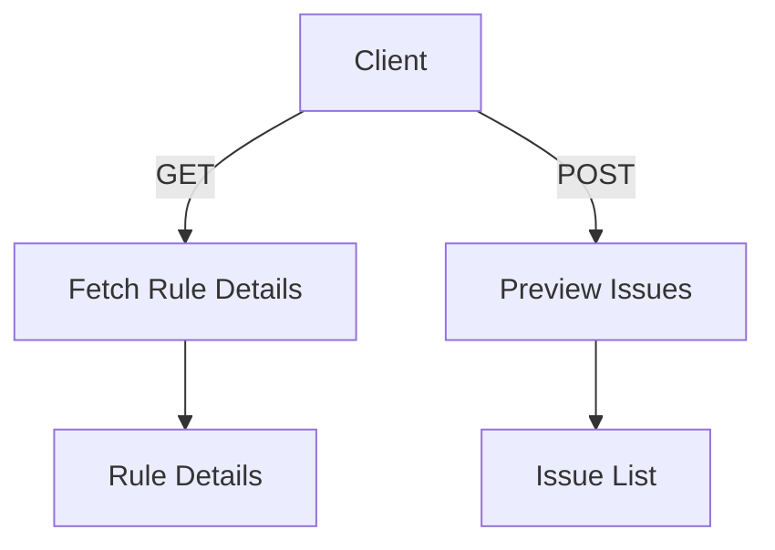

# Exploring Issues in Alerts

An Issue refers to an event or a group of events that Sentry has identified as a potential problem in the application. Issues are used to track errors, performance problems, and other types of events that may require attention from developers. In the context of alerts, an Issue triggers notifications and alerts to inform developers about the occurrence of the problem. The details of an Issue can include information such as the error message, stack trace, and the context in which the error occurred. Issues can be resolved, and their status can be tracked to ensure that problems are addressed in a timely manner.

## Issue Details

The details of an Issue provide crucial information for debugging and resolving the problem. This includes the error message, stack trace, and the context in which the error occurred. By examining these details, developers can understand the root cause of the issue and take appropriate action to fix it.

## Main Functions

There are several main functions in this folder that are essential for handling issues in alerts. Two of the key functions are <SwmToken path="static/app/views/alerts/rules/issue/details/issuesList.tsx" pos="36:2:2" line-data="function AlertRuleIssuesList({project, rule, period, start, end, utc, cursor}: Props) {">`AlertRuleIssuesList`</SwmToken> and `PreviewIssues`. We will dive a little into each of these functions.

<SwmSnippet path="/static/app/views/alerts/rules/issue/details/issuesList.tsx" line="36">

---

### <SwmToken path="static/app/views/alerts/rules/issue/details/issuesList.tsx" pos="36:2:2" line-data="function AlertRuleIssuesList({project, rule, period, start, end, utc, cursor}: Props) {">`AlertRuleIssuesList`</SwmToken>

The <SwmToken path="static/app/views/alerts/rules/issue/details/issuesList.tsx" pos="36:2:2" line-data="function AlertRuleIssuesList({project, rule, period, start, end, utc, cursor}: Props) {">`AlertRuleIssuesList`</SwmToken> function fetches and displays a list of issues related to a specific alert rule. It uses the <SwmToken path="static/app/views/alerts/rules/issue/details/issuesList.tsx" pos="44:5:5" line-data="  } = useApiQuery&lt;GroupHistory[]&gt;(">`useApiQuery`</SwmToken> hook to make an API request to retrieve the group history of issues for a given project and rule.

```tsx
function AlertRuleIssuesList({project, rule, period, start, end, utc, cursor}: Props) {
  const organization = useOrganization();
  const {
    data: groupHistory,
    getResponseHeader,
    isPending,
    isError,
    error,
  } = useApiQuery<GroupHistory[]>(
    [
      `/projects/${organization.slug}/${project.slug}/rules/${rule.id}/group-history/`,
      {
        query: {
          per_page: 10,
          ...(period && {statsPeriod: period}),
          start,
          end,
          utc,
          cursor,
        },
      },
```

---

</SwmSnippet>

## Issue APIs

The Issue APIs are used to interact with the backend to fetch and preview issues related to alert rules. Two important endpoints are <SwmToken path="static/app/views/alerts/rules/issue/index.spec.tsx" pos="133:5:19" line-data="      url: &#39;/projects/org-slug/project-slug/rules/1/&#39;,">`/projects/org-slug/project-slug/rules/1/`</SwmToken> and <SwmToken path="static/app/views/alerts/rules/issue/index.spec.tsx" pos="145:5:19" line-data="      url: &#39;/projects/org-slug/project-slug/rules/preview/&#39;,">`/projects/org-slug/project-slug/rules/preview/`</SwmToken>.

<SwmSnippet path="/static/app/views/alerts/rules/issue/index.spec.tsx" line="133">

---

### Fetch Rule Details

This endpoint is used to fetch the details of a specific alert rule for a project. The rule ID is specified in the URL, and the response includes the configuration and details of the alert rule.

```tsx
      url: '/projects/org-slug/project-slug/rules/1/',
      body: ProjectAlertRuleFixture(),
    });
```

---

</SwmSnippet>

<SwmSnippet path="/static/app/views/alerts/rules/issue/index.spec.tsx" line="145">

---

### Preview Issues

This endpoint is used to preview the issues that would have triggered a specific alert rule. It is a POST request that includes the rule configuration in the request body and returns a list of issues that match the rule's conditions.

```tsx
      url: '/projects/org-slug/project-slug/rules/preview/',
      method: 'POST',
      body: [],
    });
```

---

</SwmSnippet>

&nbsp;

*This is an auto-generated document by Swimm AI 🌊 and has not yet been verified by a human*

<SwmMeta version="3.0.0" repo-id="Z2l0aHViJTNBJTNBc2VudHJ5LWRlbW8tMSUzQSUzQVN3aW1tLURlbW8=" repo-name="sentry-demo-1" doc-type="overview"><sup>Powered by [Swimm](/)</sup></SwmMeta>
