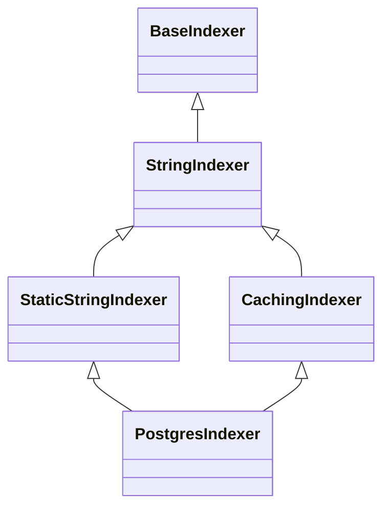

# Overview

The Indexer in Sentry metrics is responsible for providing integer <SwmToken path="src/sentry/sentry_metrics/indexer/strings.py" pos="20:8:8" line-data="# These are hardcoded ids for the metrics indexer and if">`ids`</SwmToken> for metric names, tag keys, and tag values, as well as the corresponding reverse lookup. It plays a crucial role in efficiently mapping strings to integer <SwmToken path="src/sentry/sentry_metrics/indexer/strings.py" pos="20:8:8" line-data="# These are hardcoded ids for the metrics indexer and if">`ids`</SwmToken>, which helps in optimizing storage and retrieval operations.

# Components of the Indexer

The Indexer uses various components such as <SwmToken path="src/sentry/sentry_metrics/indexer/postgres/models.py" pos="64:2:2" line-data="class StringIndexer(BaseIndexer):">`StringIndexer`</SwmToken>, <SwmToken path="src/sentry/sentry_metrics/indexer/strings.py" pos="274:2:2" line-data="class StaticStringIndexer(StringIndexer):">`StaticStringIndexer`</SwmToken>, and <SwmToken path="src/sentry/sentry_metrics/indexer/cache.py" pos="208:2:2" line-data="class CachingIndexer(StringIndexer):">`CachingIndexer`</SwmToken> to manage these mappings. It also includes mechanisms for handling cache hits, hardcoded values, database reads, and rate-limited entries to ensure efficient data processing. The Indexer is integrated with other parts of the Sentry metrics system, including limiters and models, to provide a comprehensive solution for metric indexing.

<SwmSnippet path="/src/sentry/sentry_metrics/indexer/postgres/models.py" line="64">

---

## <SwmToken path="src/sentry/sentry_metrics/indexer/postgres/models.py" pos="64:2:2" line-data="class StringIndexer(BaseIndexer):">`StringIndexer`</SwmToken>

<SwmToken path="src/sentry/sentry_metrics/indexer/postgres/models.py" pos="64:2:2" line-data="class StringIndexer(BaseIndexer):">`StringIndexer`</SwmToken> is a class that extends <SwmToken path="src/sentry/sentry_metrics/indexer/postgres/models.py" pos="64:4:4" line-data="class StringIndexer(BaseIndexer):">`BaseIndexer`</SwmToken> and is used to map strings to unique integer <SwmToken path="src/sentry/sentry_metrics/indexer/strings.py" pos="20:8:8" line-data="# These are hardcoded ids for the metrics indexer and if">`ids`</SwmToken> within the database.

```python
class StringIndexer(BaseIndexer):
    __relocation_scope__ = RelocationScope.Excluded

    class Meta:
        db_table = "sentry_stringindexer"
        app_label = "sentry"
        constraints = [
            models.UniqueConstraint(fields=["string", "organization_id"], name="unique_org_string"),
        ]
```

---

</SwmSnippet>

<SwmSnippet path="/src/sentry/sentry_metrics/indexer/strings.py" line="274">

---

## <SwmToken path="src/sentry/sentry_metrics/indexer/strings.py" pos="274:2:2" line-data="class StaticStringIndexer(StringIndexer):">`StaticStringIndexer`</SwmToken>

<SwmToken path="src/sentry/sentry_metrics/indexer/strings.py" pos="274:2:2" line-data="class StaticStringIndexer(StringIndexer):">`StaticStringIndexer`</SwmToken> is a wrapper for static strings that provides methods for bulk recording and resolving strings to <SwmToken path="src/sentry/sentry_metrics/indexer/strings.py" pos="20:8:8" line-data="# These are hardcoded ids for the metrics indexer and if">`ids`</SwmToken>, leveraging hardcoded values for shared strings.

```python
class StaticStringIndexer(StringIndexer):
    """
    Wrapper for static strings
    """

    def __init__(self, indexer: StringIndexer) -> None:
        self.indexer = indexer

    def bulk_record(
        self, strings: Mapping[UseCaseID, Mapping[OrgId, set[str]]]
    ) -> UseCaseKeyResults:
        static_keys = UseCaseKeyCollection(strings)
        static_key_results = UseCaseKeyResults()
        for use_case_id, org_id, string in static_keys.as_tuples():
            if string in SHARED_STRINGS:
                id = SHARED_STRINGS[string]
                static_key_results.add_use_case_key_result(
                    UseCaseKeyResult(use_case_id, org_id, string, id), FetchType.HARDCODED
                )

        org_strings_left = static_key_results.get_unmapped_use_case_keys(static_keys)
```

---

</SwmSnippet>

<SwmSnippet path="/src/sentry/sentry_metrics/indexer/cache.py" line="208">

---

## <SwmToken path="src/sentry/sentry_metrics/indexer/cache.py" pos="208:2:2" line-data="class CachingIndexer(StringIndexer):">`CachingIndexer`</SwmToken>

<SwmToken path="src/sentry/sentry_metrics/indexer/cache.py" pos="208:2:2" line-data="class CachingIndexer(StringIndexer):">`CachingIndexer`</SwmToken> extends <SwmToken path="src/sentry/sentry_metrics/indexer/cache.py" pos="208:4:4" line-data="class CachingIndexer(StringIndexer):">`StringIndexer`</SwmToken> and adds caching capabilities to reduce database load by storing frequently accessed mappings in a cache.

```python
class CachingIndexer(StringIndexer):
    def __init__(self, cache: StringIndexerCache, indexer: StringIndexer) -> None:
        self.cache = cache
        self.indexer = indexer

    def bulk_record(
        self, strings: Mapping[UseCaseID, Mapping[OrgId, set[str]]]
    ) -> UseCaseKeyResults:
        cache_keys = UseCaseKeyCollection(strings)
        metrics.gauge("sentry_metrics.indexer.lookups_per_batch", value=cache_keys.size)
        cache_key_strs = cache_keys.as_strings()
        cache_results = self.cache.get_many(BULK_RECORD_CACHE_NAMESPACE, cache_key_strs)

        hits = [k for k, v in cache_results.items() if v is not None]

        # record all the cache hits we had
        metrics.incr(
            _INDEXER_CACHE_BULK_RECORD_METRIC,
            tags={"cache_hit": "true", "caller": "get_many_ids"},
            amount=len(hits),
        )
```

---

</SwmSnippet>

<SwmSnippet path="/src/sentry/sentry_metrics/indexer/postgres/postgres_v2.py" line="325">

---

## <SwmToken path="src/sentry/sentry_metrics/indexer/postgres/postgres_v2.py" pos="325:2:2" line-data="class PostgresIndexer(StaticStringIndexer):">`PostgresIndexer`</SwmToken>

<SwmToken path="src/sentry/sentry_metrics/indexer/postgres/postgres_v2.py" pos="325:2:2" line-data="class PostgresIndexer(StaticStringIndexer):">`PostgresIndexer`</SwmToken> is a class that combines <SwmToken path="src/sentry/sentry_metrics/indexer/postgres/postgres_v2.py" pos="325:4:4" line-data="class PostgresIndexer(StaticStringIndexer):">`StaticStringIndexer`</SwmToken> and <SwmToken path="src/sentry/sentry_metrics/indexer/postgres/postgres_v2.py" pos="327:7:7" line-data="        super().__init__(CachingIndexer(indexer_cache, PGStringIndexerV2()))">`CachingIndexer`</SwmToken> to provide a comprehensive solution for indexing strings in a PostgreSQL database.

```python
class PostgresIndexer(StaticStringIndexer):
    def __init__(self) -> None:
        super().__init__(CachingIndexer(indexer_cache, PGStringIndexerV2()))
```

---

</SwmSnippet>

&nbsp;

*This is an auto-generated document by Swimm AI 🌊 and has not yet been verified by a human*

<SwmMeta version="3.0.0" repo-id="Z2l0aHViJTNBJTNBc2VudHJ5LWRlbW8tMSUzQSUzQVN3aW1tLURlbW8=" repo-name="sentry-demo-1" doc-type="overview"><sup>Powered by [Swimm](/)</sup></SwmMeta>
