```mermaid
classDiagram
 class MonitorEndpoint {
 +convert_args(request, organization_id_or_slug, MONITOR_ID_OR_SLUG, environment, checkin_id)
 }
 class ProjectMonitorEndpoint {
 +convert_args(request, MONITOR_ID_OR_SLUG)
 }
 class ProjectMonitorCheckinEndpoint {
 +convert_args(request, checkin_id)
 }
 class ProjectMonitorEnvironmentEndpoint {
 +convert_args(request, environment)
 }
 class MonitorStatsMixin {
 +get_monitor_stats(request, project, monitor)
 }
 MonitorEndpoint <|-- ProjectMonitorEndpoint
 ProjectMonitorEndpoint <|-- ProjectMonitorCheckinEndpoint
 ProjectMonitorEndpoint <|-- ProjectMonitorEnvironmentEndpoint
 MonitorStatsMixin <|-- ProjectMonitorStatsEndpoint

%% Swimm:
%% classDiagram
%%  class <SwmToken path="src/sentry/monitors/endpoints/organization_monitor_checkin_attachment.py" pos="19:1:1" line-data="    MonitorEndpoint, BaseMonitorCheckInAttachmentEndpoint">`MonitorEndpoint`</SwmToken> {
%%  +convert_args(request, <SwmToken path="src/sentry/monitors/endpoints/base.py" pos="51:1:1" line-data="        organization_id_or_slug: int | str,">`organization_id_or_slug`</SwmToken>, <SwmToken path="src/sentry/monitors/endpoints/organization_monitor_details.py" pos="40:3:3" line-data="            MonitorParams.MONITOR_ID_OR_SLUG,">`MONITOR_ID_OR_SLUG`</SwmToken>, environment, <SwmToken path="src/sentry/monitors/endpoints/base.py" pos="54:1:1" line-data="        checkin_id: str | None = None,">`checkin_id`</SwmToken>)
%%  }
%%  class <SwmToken path="src/sentry/monitors/endpoints/base.py" pos="105:2:2" line-data="class ProjectMonitorEndpoint(ProjectEndpoint):">`ProjectMonitorEndpoint`</SwmToken> {
%%  +convert_args(request, <SwmToken path="src/sentry/monitors/endpoints/organization_monitor_details.py" pos="40:3:3" line-data="            MonitorParams.MONITOR_ID_OR_SLUG,">`MONITOR_ID_OR_SLUG`</SwmToken>)
%%  }
%%  class <SwmToken path="src/sentry/monitors/endpoints/base.py" pos="145:2:2" line-data="class ProjectMonitorCheckinEndpoint(ProjectMonitorEndpoint):">`ProjectMonitorCheckinEndpoint`</SwmToken> {
%%  +convert_args(request, <SwmToken path="src/sentry/monitors/endpoints/base.py" pos="54:1:1" line-data="        checkin_id: str | None = None,">`checkin_id`</SwmToken>)
%%  }
%%  class <SwmToken path="src/sentry/monitors/endpoints/base.py" pos="170:2:2" line-data="class ProjectMonitorEnvironmentEndpoint(ProjectMonitorEndpoint):">`ProjectMonitorEnvironmentEndpoint`</SwmToken> {
%%  +convert_args(request, environment)
%%  }
%%  class <SwmToken path="src/sentry/monitors/endpoints/base_monitor_stats.py" pos="27:2:2" line-data="class MonitorStatsMixin(BaseEndpointMixin, StatsMixin):">`MonitorStatsMixin`</SwmToken> {
%%  +get_monitor_stats(request, project, monitor)
%%  }
%%  <SwmToken path="src/sentry/monitors/endpoints/organization_monitor_checkin_attachment.py" pos="19:1:1" line-data="    MonitorEndpoint, BaseMonitorCheckInAttachmentEndpoint">`MonitorEndpoint`</SwmToken> <|-- <SwmToken path="src/sentry/monitors/endpoints/base.py" pos="105:2:2" line-data="class ProjectMonitorEndpoint(ProjectEndpoint):">`ProjectMonitorEndpoint`</SwmToken>
%%  <SwmToken path="src/sentry/monitors/endpoints/base.py" pos="105:2:2" line-data="class ProjectMonitorEndpoint(ProjectEndpoint):">`ProjectMonitorEndpoint`</SwmToken> <|-- <SwmToken path="src/sentry/monitors/endpoints/base.py" pos="145:2:2" line-data="class ProjectMonitorCheckinEndpoint(ProjectMonitorEndpoint):">`ProjectMonitorCheckinEndpoint`</SwmToken>
%%  <SwmToken path="src/sentry/monitors/endpoints/base.py" pos="105:2:2" line-data="class ProjectMonitorEndpoint(ProjectEndpoint):">`ProjectMonitorEndpoint`</SwmToken> <|-- <SwmToken path="src/sentry/monitors/endpoints/base.py" pos="170:2:2" line-data="class ProjectMonitorEnvironmentEndpoint(ProjectMonitorEndpoint):">`ProjectMonitorEnvironmentEndpoint`</SwmToken>
%%  <SwmToken path="src/sentry/monitors/endpoints/base_monitor_stats.py" pos="27:2:2" line-data="class MonitorStatsMixin(BaseEndpointMixin, StatsMixin):">`MonitorStatsMixin`</SwmToken> <|-- ProjectMonitorStatsEndpoint
```

# Overview

Endpoints are specific routes in the application that handle requests related to monitors. They are responsible for various operations such as retrieving, updating, and deleting monitor data.

# <SwmToken path="src/sentry/monitors/endpoints/organization_monitor_checkin_attachment.py" pos="19:1:1" line-data="    MonitorEndpoint, BaseMonitorCheckInAttachmentEndpoint">`MonitorEndpoint`</SwmToken>

The <SwmToken path="src/sentry/monitors/endpoints/organization_monitor_checkin_attachment.py" pos="19:1:1" line-data="    MonitorEndpoint, BaseMonitorCheckInAttachmentEndpoint">`MonitorEndpoint`</SwmToken> class serves as a base endpoint for monitors, providing functionality to look up a monitor and convert it to a <SwmToken path="src/sentry/monitors/endpoints/base.py" pos="107:21:21" line-data="    Base endpoint class for monitors which will look up the monitor and">`monitor`</SwmToken> object. This class ensures that the necessary permissions are checked and the monitor is correctly retrieved based on the provided identifiers.

# <SwmToken path="src/sentry/monitors/endpoints/base.py" pos="105:2:2" line-data="class ProjectMonitorEndpoint(ProjectEndpoint):">`ProjectMonitorEndpoint`</SwmToken>

The <SwmToken path="src/sentry/monitors/endpoints/base.py" pos="105:2:2" line-data="class ProjectMonitorEndpoint(ProjectEndpoint):">`ProjectMonitorEndpoint`</SwmToken> class extends the <SwmToken path="src/sentry/monitors/endpoints/organization_monitor_checkin_attachment.py" pos="19:1:1" line-data="    MonitorEndpoint, BaseMonitorCheckInAttachmentEndpoint">`MonitorEndpoint`</SwmToken> and adds functionality specific to project monitors. It includes methods to look up monitors by their slug or GUID and ensures that the monitor belongs to the correct project.

<SwmSnippet path="/src/sentry/monitors/endpoints/base.py" line="105">

---

The <SwmToken path="src/sentry/monitors/endpoints/base.py" pos="105:2:2" line-data="class ProjectMonitorEndpoint(ProjectEndpoint):">`ProjectMonitorEndpoint`</SwmToken> class is defined here, extending the <SwmToken path="src/sentry/monitors/endpoints/organization_monitor_checkin_attachment.py" pos="19:1:1" line-data="    MonitorEndpoint, BaseMonitorCheckInAttachmentEndpoint">`MonitorEndpoint`</SwmToken> for project-specific functionality.

```python
class ProjectMonitorEndpoint(ProjectEndpoint):
    """
    Base endpoint class for monitors which will look up the monitor and
    convert it to a Monitor object.
    """
```

---

</SwmSnippet>

<SwmSnippet path="/src/sentry/monitors/endpoints/base.py" line="145">

---

The <SwmToken path="src/sentry/monitors/endpoints/base.py" pos="145:2:2" line-data="class ProjectMonitorCheckinEndpoint(ProjectMonitorEndpoint):">`ProjectMonitorCheckinEndpoint`</SwmToken> class is defined here, extending the <SwmToken path="src/sentry/monitors/endpoints/base.py" pos="145:4:4" line-data="class ProjectMonitorCheckinEndpoint(ProjectMonitorEndpoint):">`ProjectMonitorEndpoint`</SwmToken> to handle check-ins.

```python
class ProjectMonitorCheckinEndpoint(ProjectMonitorEndpoint):
    """
    Base endpoint class for monitors which will look up a checkin
    and convert it to a MonitorCheckin object.
    """
```

---

</SwmSnippet>

# <SwmToken path="src/sentry/monitors/endpoints/base.py" pos="170:2:2" line-data="class ProjectMonitorEnvironmentEndpoint(ProjectMonitorEndpoint):">`ProjectMonitorEnvironmentEndpoint`</SwmToken>

The <SwmToken path="src/sentry/monitors/endpoints/base.py" pos="170:2:2" line-data="class ProjectMonitorEnvironmentEndpoint(ProjectMonitorEndpoint):">`ProjectMonitorEnvironmentEndpoint`</SwmToken> class is designed to handle monitor environments. It looks up the monitor environment and converts it to a <SwmToken path="src/sentry/monitors/endpoints/base.py" pos="16:19:19" line-data="from sentry.monitors.models import CheckInStatus, Monitor, MonitorCheckIn, MonitorEnvironment">`MonitorEnvironment`</SwmToken> object, ensuring that the environment data is correctly associated with the monitor.

# <SwmToken path="src/sentry/monitors/endpoints/base_monitor_stats.py" pos="27:2:2" line-data="class MonitorStatsMixin(BaseEndpointMixin, StatsMixin):">`MonitorStatsMixin`</SwmToken>

The <SwmToken path="src/sentry/monitors/endpoints/base_monitor_stats.py" pos="27:2:2" line-data="class MonitorStatsMixin(BaseEndpointMixin, StatsMixin):">`MonitorStatsMixin`</SwmToken> class provides methods to retrieve and normalize monitor statistics. It includes functionality to filter check-ins based on various criteria and aggregate the data into meaningful statistics.

<SwmSnippet path="/src/sentry/monitors/endpoints/base_monitor_stats.py" line="27">

---

The <SwmToken path="src/sentry/monitors/endpoints/base_monitor_stats.py" pos="27:2:2" line-data="class MonitorStatsMixin(BaseEndpointMixin, StatsMixin):">`MonitorStatsMixin`</SwmToken> class is defined here, providing methods to retrieve and normalize monitor statistics.

```python
class MonitorStatsMixin(BaseEndpointMixin, StatsMixin):
    def get_monitor_stats(self, request: Request, project, monitor) -> Response:
        args = self._parse_args(request)

        start = normalize_to_epoch(args["start"], args["rollup"])
        end = normalize_to_epoch(args["end"], args["rollup"])

        tracked_statuses = [
            CheckInStatus.OK,
            CheckInStatus.ERROR,
            CheckInStatus.MISSED,
            CheckInStatus.TIMEOUT,
        ]

        check_ins = MonitorCheckIn.objects.filter(
            monitor=monitor,
            status__in=tracked_statuses,
            date_added__gt=args["start"],
            date_added__lte=args["end"],
        )
```

---

</SwmSnippet>

<SwmSnippet path="/src/sentry/monitors/endpoints/organization_monitor_checkin_attachment.py" line="17">

---

The <SwmToken path="src/sentry/monitors/endpoints/organization_monitor_checkin_attachment.py" pos="18:2:2" line-data="class OrganizationMonitorCheckInAttachmentEndpoint(">`OrganizationMonitorCheckInAttachmentEndpoint`</SwmToken> class is defined here, handling the retrieval of <SwmToken path="src/sentry/monitors/endpoints/base.py" pos="229:29:31" line-data="    # we support the magic keyword of &quot;latest&quot; to grab the most recent check-in">`check-in`</SwmToken> attachments.

```python
@region_silo_endpoint
class OrganizationMonitorCheckInAttachmentEndpoint(
    MonitorEndpoint, BaseMonitorCheckInAttachmentEndpoint
):
    publish_status = {
        "GET": ApiPublishStatus.PRIVATE,
    }
    owner = ApiOwner.CRONS

    permission_classes = (MonitorCheckInAttachmentPermission,)

    def get(self, request: Request, organization, project, monitor, checkin) -> Response:
        return self.get_monitor_checkin_attachment(request, project, monitor, checkin)
```

---

</SwmSnippet>

# <SwmToken path="src/sentry/monitors/endpoints/organization_monitor_details.py" pos="28:2:2" line-data="class OrganizationMonitorDetailsEndpoint(MonitorEndpoint, MonitorDetailsMixin):">`OrganizationMonitorDetailsEndpoint`</SwmToken>

The <SwmToken path="src/sentry/monitors/endpoints/organization_monitor_details.py" pos="28:2:2" line-data="class OrganizationMonitorDetailsEndpoint(MonitorEndpoint, MonitorDetailsMixin):">`OrganizationMonitorDetailsEndpoint`</SwmToken> class handles the retrieval, updating, and deletion of monitor details. It inherits from <SwmToken path="src/sentry/monitors/endpoints/organization_monitor_checkin_attachment.py" pos="19:1:1" line-data="    MonitorEndpoint, BaseMonitorCheckInAttachmentEndpoint">`MonitorEndpoint`</SwmToken> and <SwmToken path="src/sentry/monitors/endpoints/organization_monitor_details.py" pos="28:7:7" line-data="class OrganizationMonitorDetailsEndpoint(MonitorEndpoint, MonitorDetailsMixin):">`MonitorDetailsMixin`</SwmToken>. The <SwmToken path="src/sentry/monitors/endpoints/organization_monitor_checkin_attachment.py" pos="22:2:2" line-data="        &quot;GET&quot;: ApiPublishStatus.PRIVATE,">`GET`</SwmToken>, <SwmToken path="src/sentry/monitors/endpoints/organization_monitor_details.py" pos="32:2:2" line-data="        &quot;PUT&quot;: ApiPublishStatus.PUBLIC,">`PUT`</SwmToken>, and <SwmToken path="src/sentry/monitors/endpoints/organization_monitor_details.py" pos="30:2:2" line-data="        &quot;DELETE&quot;: ApiPublishStatus.PUBLIC,">`DELETE`</SwmToken> methods are defined to retrieve monitor details, update a monitor, and delete a monitor or monitor environments, respectively.

<SwmSnippet path="/src/sentry/monitors/endpoints/organization_monitor_details.py" line="26">

---

The <SwmToken path="src/sentry/monitors/endpoints/organization_monitor_details.py" pos="28:2:2" line-data="class OrganizationMonitorDetailsEndpoint(MonitorEndpoint, MonitorDetailsMixin):">`OrganizationMonitorDetailsEndpoint`</SwmToken> class is defined here, handling the retrieval, updating, and deletion of monitor details.

```python
@region_silo_endpoint
@extend_schema(tags=["Crons"])
class OrganizationMonitorDetailsEndpoint(MonitorEndpoint, MonitorDetailsMixin):
    publish_status = {
        "DELETE": ApiPublishStatus.PUBLIC,
        "GET": ApiPublishStatus.PUBLIC,
        "PUT": ApiPublishStatus.PUBLIC,
    }
    owner = ApiOwner.CRONS

    @extend_schema(
        operation_id="Retrieve a Monitor",
        parameters=[
            GlobalParams.ORG_ID_OR_SLUG,
            MonitorParams.MONITOR_ID_OR_SLUG,
            GlobalParams.ENVIRONMENT,
        ],
        responses={
            200: MonitorSerializer,
            401: RESPONSE_UNAUTHORIZED,
            403: RESPONSE_FORBIDDEN,
```

---

</SwmSnippet>

&nbsp;

*This is an auto-generated document by Swimm AI 🌊 and has not yet been verified by a human*

<SwmMeta version="3.0.0" repo-id="Z2l0aHViJTNBJTNBc2VudHJ5LWRlbW8tMSUzQSUzQVN3aW1tLURlbW8=" repo-name="sentry-demo-1" doc-type="overview"><sup>Powered by [Swimm](/)</sup></SwmMeta>
