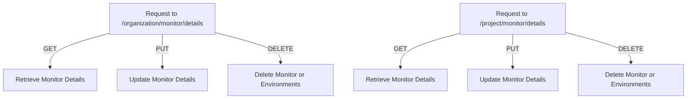

# Introduction

Monitors are used to track the status and performance of scheduled tasks or cron jobs. They help in identifying issues by checking the success or failure of these tasks over time. Monitors can be configured with specific settings and are associated with projects and organizations. They can be automatically muted if they fail to process a successful <SwmToken path="src/sentry/monitors/endpoints/base.py" pos="229:29:31" line-data="    # we support the magic keyword of &quot;latest&quot; to grab the most recent check-in">`check-in`</SwmToken> for an extended period.

<SwmSnippet path="/src/sentry/monitors/endpoints/base.py" line="40">

---

# <SwmToken path="src/sentry/monitors/endpoints/base.py" pos="40:2:2" line-data="class MonitorEndpoint(Endpoint):">`MonitorEndpoint`</SwmToken>

The <SwmToken path="src/sentry/monitors/endpoints/base.py" pos="40:2:2" line-data="class MonitorEndpoint(Endpoint):">`MonitorEndpoint`</SwmToken> class is a base endpoint class for monitors, which looks up the monitor and converts it to a Monitor object. It includes permission classes and a method <SwmToken path="src/sentry/monitors/endpoints/base.py" pos="48:3:3" line-data="    def convert_args(">`convert_args`</SwmToken> to handle the conversion and validation of monitor-related arguments.

```python
class MonitorEndpoint(Endpoint):
    """
    Base endpoint class for monitors which will look up the monitor and
    convert it to a Monitor object.
    """

    permission_classes: tuple[type[BasePermission], ...] = (ProjectMonitorPermission,)

    def convert_args(
        self,
        request: Request,
        organization_id_or_slug: int | str,
        monitor_id_or_slug: str,
        environment: str | None = None,
        checkin_id: str | None = None,
        *args,
        **kwargs,
    ):
        try:
            if str(organization_id_or_slug).isdigit():
                organization = Organization.objects.get_from_cache(id=organization_id_or_slug)
```

---

</SwmSnippet>

<SwmSnippet path="/src/sentry/monitors/endpoints/base.py" line="105">

---

# <SwmToken path="src/sentry/monitors/endpoints/base.py" pos="105:2:2" line-data="class ProjectMonitorEndpoint(ProjectEndpoint):">`ProjectMonitorEndpoint`</SwmToken>

The <SwmToken path="src/sentry/monitors/endpoints/base.py" pos="105:2:2" line-data="class ProjectMonitorEndpoint(ProjectEndpoint):">`ProjectMonitorEndpoint`</SwmToken> class extends <SwmToken path="src/sentry/monitors/endpoints/base.py" pos="105:4:4" line-data="class ProjectMonitorEndpoint(ProjectEndpoint):">`ProjectEndpoint`</SwmToken> and serves as a base endpoint class for monitors within a project. It includes a <SwmToken path="src/sentry/monitors/endpoints/base.py" pos="113:3:3" line-data="    def convert_args(">`convert_args`</SwmToken> method to handle the conversion and validation of monitor-related arguments specific to a project.

```python
class ProjectMonitorEndpoint(ProjectEndpoint):
    """
    Base endpoint class for monitors which will look up the monitor and
    convert it to a Monitor object.
    """

    permission_classes: tuple[type[BasePermission], ...] = (ProjectMonitorPermission,)

    def convert_args(
        self,
        request: Request,
        monitor_id_or_slug: str,
        *args,
        **kwargs,
    ):
        args, kwargs = super().convert_args(request, *args, **kwargs)

        # Try lookup by slug
        try:
            kwargs["monitor"] = Monitor.objects.get(
                project_id=kwargs["project"].id, slug=monitor_id_or_slug
```

---

</SwmSnippet>

<SwmSnippet path="/src/sentry/monitors/endpoints/organization_monitor_details.py" line="50">

---

# Retrieving Monitor Details

The <SwmToken path="src/sentry/monitors/endpoints/organization_monitor_details.py" pos="50:3:3" line-data="    def get(self, request: Request, organization, project, monitor) -&gt; Response:">`get`</SwmToken> function retrieves details for a monitor by calling the <SwmToken path="src/sentry/monitors/endpoints/organization_monitor_details.py" pos="54:5:5" line-data="        return self.get_monitor(request, project, monitor)">`get_monitor`</SwmToken> method.

```python
    def get(self, request: Request, organization, project, monitor) -> Response:
        """
        Retrieves details for a monitor.
        """
        return self.get_monitor(request, project, monitor)
```

---

</SwmSnippet>

<SwmSnippet path="/src/sentry/monitors/endpoints/base_monitor_details.py" line="40">

---

The <SwmToken path="src/sentry/monitors/endpoints/base_monitor_details.py" pos="40:3:3" line-data="    def get_monitor(self, request: Request, project: Project, monitor: Monitor) -&gt; Response:">`get_monitor`</SwmToken> function retrieves details for a monitor, including environments and expanded data, and returns a serialized response.

```python
    def get_monitor(self, request: Request, project: Project, monitor: Monitor) -> Response:
        """
        Retrieves details for a monitor.
        """

        environments = get_environments(request, project.organization)
        expand = request.GET.getlist("expand", [])

        return self.respond(
            serialize(
                monitor, request.user, MonitorSerializer(environments=environments, expand=expand)
            )
        )
```

---

</SwmSnippet>

<SwmSnippet path="/src/sentry/monitors/consumers/monitor_consumer.py" line="89">

---

# Ensuring Monitor Configuration

The <SwmToken path="src/sentry/monitors/consumers/monitor_consumer.py" pos="89:2:2" line-data="def _ensure_monitor_with_config(">`_ensure_monitor_with_config`</SwmToken> function ensures that a monitor is correctly configured and exists within the system. It handles the creation or updating of the monitor based on the provided configuration.

```python
def _ensure_monitor_with_config(
    project: Project,
    monitor_slug: str,
    config: Mapping | None,
):
    try:
        monitor = Monitor.objects.get(
            slug=monitor_slug,
            project_id=project.id,
            organization_id=project.organization_id,
        )
    except Monitor.DoesNotExist:
        monitor = None

    if not config:
        return monitor

    # The upsert payload doesn't quite match the api one. Pop out the owner here since
    # it's not part of the monitor config
    owner = config.pop("owner", None)
    owner_user_id = None
```

---

</SwmSnippet>

<SwmSnippet path="/src/sentry/monitors/endpoints/organization_monitor_details.py" line="71">

---

# Updating Monitor Details

The <SwmToken path="src/sentry/monitors/endpoints/organization_monitor_details.py" pos="71:3:3" line-data="    def put(self, request: AuthenticatedHttpRequest, organization, project, monitor) -&gt; Response:">`put`</SwmToken> function updates a monitor by calling the <SwmToken path="src/sentry/monitors/endpoints/organization_monitor_details.py" pos="75:5:5" line-data="        return self.update_monitor(request, project, monitor)">`update_monitor`</SwmToken> method.

```python
    def put(self, request: AuthenticatedHttpRequest, organization, project, monitor) -> Response:
        """
        Update a monitor.
        """
        return self.update_monitor(request, project, monitor)
```

---

</SwmSnippet>

<SwmSnippet path="/src/sentry/monitors/endpoints/base_monitor_details.py" line="54">

---

The <SwmToken path="src/sentry/monitors/endpoints/base_monitor_details.py" pos="54:3:3" line-data="    def update_monitor(">`update_monitor`</SwmToken> function updates a monitor's details, including its configuration, status, and ownership. It validates the input data and handles the necessary updates to the monitor and related entities.

```python
    def update_monitor(
        self, request: AuthenticatedHttpRequest, project: Project, monitor: Monitor
    ) -> Response:
        """
        Update a monitor.
        """
        # set existing values as validator will overwrite
        existing_config = monitor.config
        existing_margin = existing_config.get("checkin_margin")
        existing_max_runtime = existing_config.get("max_runtime")

        validator = MonitorValidator(
            data=request.data,
            partial=True,
            instance={
                "name": monitor.name,
                "slug": monitor.slug,
                "status": monitor.status,
                "type": monitor.type,
                "config": monitor.config,
                "project": project,
```

---

</SwmSnippet>

# Monitor Endpoints

Monitor endpoints are crucial for interacting with monitors within an organization or project. They provide methods to retrieve, update, and delete monitor details.

<SwmSnippet path="/src/sentry/monitors/endpoints/organization_monitor_details.py" line="26">

---

## <SwmToken path="src/sentry/monitors/endpoints/organization_monitor_details.py" pos="28:2:2" line-data="class OrganizationMonitorDetailsEndpoint(MonitorEndpoint, MonitorDetailsMixin):">`OrganizationMonitorDetailsEndpoint`</SwmToken>

The <SwmToken path="src/sentry/monitors/endpoints/organization_monitor_details.py" pos="28:2:2" line-data="class OrganizationMonitorDetailsEndpoint(MonitorEndpoint, MonitorDetailsMixin):">`OrganizationMonitorDetailsEndpoint`</SwmToken> class defines endpoints for retrieving, updating, and deleting monitor details within an organization. The <SwmToken path="src/sentry/monitors/endpoints/organization_monitor_details.py" pos="31:2:2" line-data="        &quot;GET&quot;: ApiPublishStatus.PUBLIC,">`GET`</SwmToken> method retrieves monitor details, the <SwmToken path="src/sentry/monitors/endpoints/organization_monitor_details.py" pos="32:2:2" line-data="        &quot;PUT&quot;: ApiPublishStatus.PUBLIC,">`PUT`</SwmToken> method updates monitor details, and the <SwmToken path="src/sentry/monitors/endpoints/organization_monitor_details.py" pos="30:2:2" line-data="        &quot;DELETE&quot;: ApiPublishStatus.PUBLIC,">`DELETE`</SwmToken> method deletes a monitor or its environments.

```python
@region_silo_endpoint
@extend_schema(tags=["Crons"])
class OrganizationMonitorDetailsEndpoint(MonitorEndpoint, MonitorDetailsMixin):
    publish_status = {
        "DELETE": ApiPublishStatus.PUBLIC,
        "GET": ApiPublishStatus.PUBLIC,
        "PUT": ApiPublishStatus.PUBLIC,
    }
    owner = ApiOwner.CRONS

    @extend_schema(
        operation_id="Retrieve a Monitor",
        parameters=[
            GlobalParams.ORG_ID_OR_SLUG,
            MonitorParams.MONITOR_ID_OR_SLUG,
            GlobalParams.ENVIRONMENT,
        ],
        responses={
            200: MonitorSerializer,
            401: RESPONSE_UNAUTHORIZED,
            403: RESPONSE_FORBIDDEN,
```

---

</SwmSnippet>

<SwmSnippet path="/src/sentry/monitors/endpoints/project_monitor_details.py" line="26">

---

## <SwmToken path="src/sentry/monitors/endpoints/project_monitor_details.py" pos="28:2:2" line-data="class ProjectMonitorDetailsEndpoint(ProjectMonitorEndpoint, MonitorDetailsMixin):">`ProjectMonitorDetailsEndpoint`</SwmToken>

The <SwmToken path="src/sentry/monitors/endpoints/project_monitor_details.py" pos="28:2:2" line-data="class ProjectMonitorDetailsEndpoint(ProjectMonitorEndpoint, MonitorDetailsMixin):">`ProjectMonitorDetailsEndpoint`</SwmToken> class defines endpoints for retrieving, updating, and deleting monitor details within a project. The <SwmToken path="src/sentry/monitors/endpoints/project_monitor_details.py" pos="31:2:2" line-data="        &quot;GET&quot;: ApiPublishStatus.PUBLIC,">`GET`</SwmToken> method retrieves monitor details, the <SwmToken path="src/sentry/monitors/endpoints/project_monitor_details.py" pos="32:2:2" line-data="        &quot;PUT&quot;: ApiPublishStatus.PUBLIC,">`PUT`</SwmToken> method updates monitor details, and the <SwmToken path="src/sentry/monitors/endpoints/project_monitor_details.py" pos="30:2:2" line-data="        &quot;DELETE&quot;: ApiPublishStatus.PUBLIC,">`DELETE`</SwmToken> method deletes a monitor or its environments.

```python
@region_silo_endpoint
@extend_schema(tags=["Crons"])
class ProjectMonitorDetailsEndpoint(ProjectMonitorEndpoint, MonitorDetailsMixin):
    publish_status = {
        "DELETE": ApiPublishStatus.PUBLIC,
        "GET": ApiPublishStatus.PUBLIC,
        "PUT": ApiPublishStatus.PUBLIC,
    }
    owner = ApiOwner.CRONS

    @extend_schema(
        operation_id="Retrieve a Monitor for a Project",
        parameters=[
            GlobalParams.ORG_ID_OR_SLUG,
            GlobalParams.PROJECT_ID_OR_SLUG,
            MonitorParams.MONITOR_ID_OR_SLUG,
        ],
        responses={
            200: MonitorSerializer,
            401: RESPONSE_UNAUTHORIZED,
            403: RESPONSE_FORBIDDEN,
```

---

</SwmSnippet>

&nbsp;

*This is an auto-generated document by Swimm AI 🌊 and has not yet been verified by a human*

<SwmMeta version="3.0.0" repo-id="Z2l0aHViJTNBJTNBc2VudHJ5LWRlbW8tMSUzQSUzQVN3aW1tLURlbW8=" repo-name="sentry-demo-1" doc-type="overview"><sup>Powered by [Swimm](/)</sup></SwmMeta>
