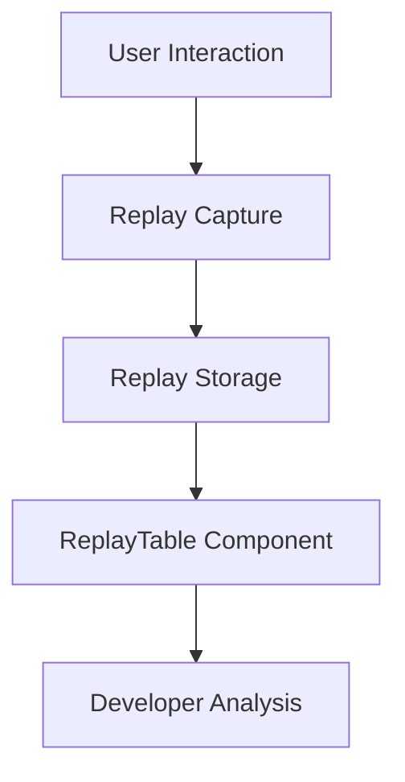

# Introduction

Replays are used to capture and replay user sessions, allowing developers to see exactly what users experienced during their interaction with the application. They provide a detailed view of user actions, including clicks, navigation, and other interactions, which helps in diagnosing issues and understanding user behavior.

# Managing and Displaying Replays

In the views, replays are managed and displayed through various components and utilities, such as `ReplayTable`, which organizes and presents replay data in a tabular format. The `ReplayTable` component handles the fetching, sorting, and displaying of replay data, ensuring that developers can easily access and analyze user sessions. Replays also include features like filtering and searching, allowing developers to narrow down sessions based on specific criteria or events.

# Replays API

The Replays API provides endpoints to browse, fetch, and delete replays, as well as to fetch replay accessibility issues, recording segments, and other related data.

# Fetching Replay Data

The function <SwmToken path="static/app/views/replays/detail/trace/useReplayTraces.tsx" pos="27:4:4" line-data="export function useReplayTraces({">`useReplayTraces`</SwmToken> fetches trace IDs and timestamps associated with each replay record, which is essential for analyzing user sessions.

<SwmSnippet path="/static/app/views/replays/detail/trace/useReplayTraces.tsx" line="27">

---

The <SwmToken path="static/app/views/replays/detail/trace/useReplayTraces.tsx" pos="27:4:4" line-data="export function useReplayTraces({">`useReplayTraces`</SwmToken> function initializes the API and organization context, sets up the state for replay traces, and defines the <SwmToken path="static/app/views/replays/detail/trace/useReplayTraces.tsx" pos="44:3:3" line-data="  const listEventView = useMemo(() =&gt; {">`listEventView`</SwmToken> memoized function to handle replay records.

```tsx
export function useReplayTraces({
  replayRecord,
}: {
  replayRecord: ReplayRecord | undefined;
}) {
  const api = useApi();
  const organization = useOrganization();

  const [state, setState] = useState<ReplayTraceDataResults>({
    indexComplete: false,
    indexError: undefined,
    replayTraces: undefined,
    eventView: undefined,
  });

  const orgSlug = organization.slug;

  const listEventView = useMemo(() => {
    if (!replayRecord) {
      return null;
    }
```

---

</SwmSnippet>

# Displaying Replays

The `ReplaysList` function utilizes various hooks and utilities to fetch and display replay data in a list format, making it easier for developers to browse through user sessions.

# Replay Endpoints

Replay Endpoints provide various functionalities to manage and filter replays.

# <SwmToken path="static/app/views/replays/list/replaySearchBar.tsx" pos="67:2:2" line-data="function getReplayFilterKeys(supportedTags: TagCollection): TagCollection {">`getReplayFilterKeys`</SwmToken>

The <SwmToken path="static/app/views/replays/list/replaySearchBar.tsx" pos="67:2:2" line-data="function getReplayFilterKeys(supportedTags: TagCollection): TagCollection {">`getReplayFilterKeys`</SwmToken> function merges a list of supported tags and replay search properties into one collection. This endpoint is crucial for filtering replays based on various criteria.

<SwmSnippet path="/static/app/views/replays/list/replaySearchBar.tsx" line="67">

---

The <SwmToken path="static/app/views/replays/list/replaySearchBar.tsx" pos="67:2:2" line-data="function getReplayFilterKeys(supportedTags: TagCollection): TagCollection {">`getReplayFilterKeys`</SwmToken> function combines replay fields and supported tags, filtering out excluded tags and mapping the remaining keys to their definitions.

```tsx
function getReplayFilterKeys(supportedTags: TagCollection): TagCollection {
  return {
    ...REPLAY_FIELDS_AS_TAGS,
    ...REPLAY_CLICK_FIELDS_AS_TAGS,
    ...Object.fromEntries(
      Object.keys(supportedTags)
        .filter(key => !EXCLUDED_TAGS.includes(key))
        .map(key => [
          key,
          {
            ...supportedTags[key],
            kind: getReplayFieldDefinition(key)?.kind ?? FieldKind.TAG,
          },
        ])
    ),
  };
```

---

</SwmSnippet>

# <SwmToken path="static/app/views/replays/list/replaySearchBar.tsx" pos="85:2:2" line-data="const getFilterKeySections = (">`getFilterKeySections`</SwmToken>

The <SwmToken path="static/app/views/replays/list/replaySearchBar.tsx" pos="85:2:2" line-data="const getFilterKeySections = (">`getFilterKeySections`</SwmToken> function returns sections of filter keys based on the organization features. It organizes the filter keys into categories like 'Suggested', 'Click Fields', and 'Tags'.

<SwmSnippet path="/static/app/views/replays/list/replaySearchBar.tsx" line="85">

---

The <SwmToken path="static/app/views/replays/list/replaySearchBar.tsx" pos="85:2:2" line-data="const getFilterKeySections = (">`getFilterKeySections`</SwmToken> function filters and orders custom tags, then returns them in categorized sections based on the organization's features.

```tsx
const getFilterKeySections = (
  tags: TagCollection,
  organization: Organization
): FilterKeySection[] => {
  if (!organization.features.includes('search-query-builder-replays')) {
    return [];
  }

  const customTags: Tag[] = Object.values(tags).filter(
    tag =>
      !EXCLUDED_TAGS.includes(tag.key) &&
      !REPLAY_FIELDS.map(String).includes(tag.key) &&
      !REPLAY_CLICK_FIELDS.map(String).includes(tag.key)
  );

  const orderedTagKeys = orderBy(customTags, ['totalValues', 'key'], ['desc', 'asc']).map(
    tag => tag.key
  );

  return [
    {
```

---

</SwmSnippet>

&nbsp;

*This is an auto-generated document by Swimm AI 🌊 and has not yet been verified by a human*

<SwmMeta version="3.0.0" repo-id="Z2l0aHViJTNBJTNBc2VudHJ5LWRlbW8tMSUzQSUzQVN3aW1tLURlbW8=" repo-name="sentry-demo-1" doc-type="overview"><sup>Powered by [Swimm](/)</sup></SwmMeta>
