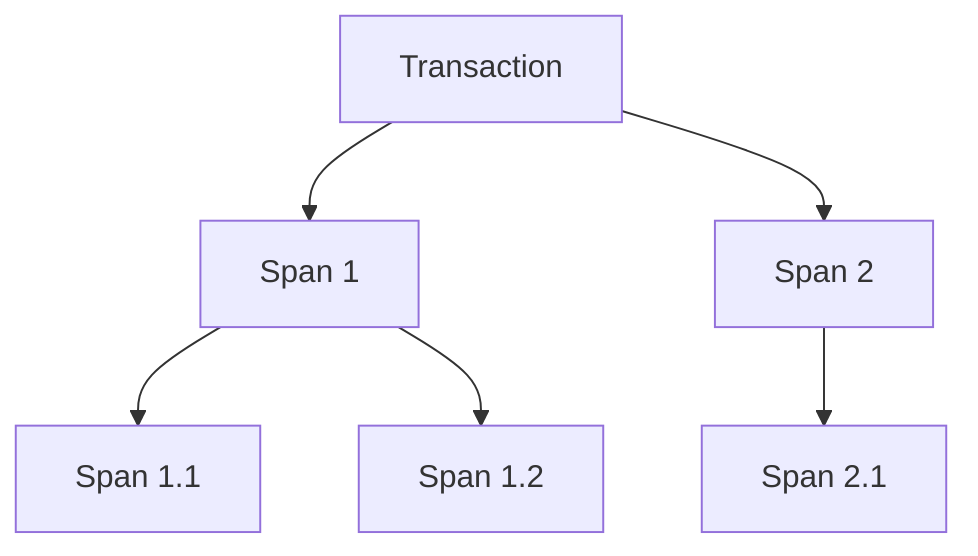

# Overview

Spans are used to represent individual units of work within a transaction. They provide detailed insights into the performance and behavior of specific operations. Spans are visualized in a hierarchical tree structure, allowing users to see the relationships between different spans and how they contribute to the overall transaction.

# Spans Interface

The `SpansInterface` component is responsible for rendering the spans related to a transaction. It includes features like error alerts, search functionality, and a detailed view of each span.

# Span Context

The <SwmToken path="static/app/components/events/interfaces/spans/spanContext.tsx" pos="13:2:2" line-data="const SpanContext = createContext&lt;SpanContextProps&gt;({">`SpanContext`</SwmToken> provides a context for managing the state of expanded spans, ensuring that the UI can remember which spans have been expanded even after they unmount.

<SwmSnippet path="/static/app/components/events/interfaces/spans/spanContext.tsx" line="5">

---

The <SwmToken path="static/app/components/events/interfaces/spans/spanContext.tsx" pos="13:2:2" line-data="const SpanContext = createContext&lt;SpanContextProps&gt;({">`SpanContext`</SwmToken> defines the context properties and provides a <SwmToken path="static/app/components/events/interfaces/spans/spanContext.tsx" pos="25:4:4" line-data="export class Provider extends Component&lt;Props&gt; {">`Provider`</SwmToken> component to manage the state of expanded spans.

```tsx
export type SpanContextProps = {
  addExpandedSpan: (span: Readonly<ProcessedSpanType>, callback?: () => void) => void;
  didAnchoredSpanMount: () => boolean;
  isSpanExpanded: (span: Readonly<ProcessedSpanType>) => boolean;
  markAnchoredSpanIsMounted: () => void;
  removeExpandedSpan: (span: Readonly<ProcessedSpanType>, callback?: () => void) => void;
};

const SpanContext = createContext<SpanContextProps>({
  didAnchoredSpanMount: () => false,
  markAnchoredSpanIsMounted: () => undefined,
  addExpandedSpan: () => undefined,
  removeExpandedSpan: () => undefined,
  isSpanExpanded: () => false,
});

type Props = {
  children: React.ReactNode;
};

export class Provider extends Component<Props> {
```

---

</SwmSnippet>

<SwmSnippet path="/static/app/components/events/interfaces/spans/spanDetail.tsx" line="106">

---

The <SwmToken path="static/app/components/events/interfaces/spans/spanDetail.tsx" pos="106:2:2" line-data="function SpanDetail(props: Props) {">`SpanDetail`</SwmToken> component uses hooks like <SwmToken path="static/app/components/events/interfaces/spans/spanDetail.tsx" pos="107:12:12" line-data="  const [errorsOpened, setErrorsOpened] = useState(false);">`useState`</SwmToken> and <SwmToken path="static/app/components/events/interfaces/spans/spanDetail.tsx" pos="113:1:1" line-data="  useEffect(() =&gt; {">`useEffect`</SwmToken> to manage its state and side effects.

```tsx
function SpanDetail(props: Props) {
  const [errorsOpened, setErrorsOpened] = useState(false);
  const location = useLocation();
  const profileId = useTransactionProfileId();
  const {projects} = useProjects();
  const project = projects.find(p => p.id === props.event.projectID);

  useEffect(() => {
    // Run on mount.

    const {span, organization, event} = props;
    if (!('op' in span)) {
      return;
    }

    trackAnalytics('performance_views.event_details.open_span_details', {
```

---

</SwmSnippet>

# Span Tree

The <SwmToken path="static/app/components/events/interfaces/spans/spanTree.tsx" pos="64:2:2" line-data="class SpanTree extends Component&lt;PropType&gt; {">`SpanTree`</SwmToken> component manages the hierarchical structure of spans, handling the rendering and interaction of the span tree.

<SwmSnippet path="/static/app/components/events/interfaces/spans/spanTree.tsx" line="393">

---

The <SwmToken path="static/app/components/events/interfaces/spans/spanTree.tsx" pos="393:1:1" line-data="  generateSpanTree = () =&gt; {">`generateSpanTree`</SwmToken> method in the <SwmToken path="static/app/components/events/interfaces/spans/spanTree.tsx" pos="64:2:2" line-data="class SpanTree extends Component&lt;PropType&gt; {">`SpanTree`</SwmToken> component generates the hierarchical structure of spans.

```tsx
  generateSpanTree = () => {
    const {
      waterfallModel,
      spans,
      organization,
      dragProps,
      onWheel,
      addContentSpanBarRef,
      removeContentSpanBarRef,
      storeSpanBar,
      getCurrentLeftPos,
      onDragStart,
      onScroll,
      scrollBarAreaRef,
      updateHorizontalScrollState,
      updateScrollState,
      virtualScrollbarRef,
    } = this.props;

    const generateBounds = waterfallModel.generateBounds({
      viewStart: dragProps.viewWindowStart,
```

---

</SwmSnippet>

# Span Bar

The <SwmToken path="static/app/components/events/interfaces/spans/spanTree.tsx" pos="28:10:10" line-data="import {ProfiledSpanBar} from &#39;./spanBar&#39;;">`spanBar`</SwmToken> component represents a single span within the span tree, providing visual indicators of the span's duration and any associated errors.

<SwmSnippet path="/static/app/components/events/interfaces/spans/spanBar.tsx" line="805">

---

The <SwmToken path="static/app/components/events/interfaces/spans/spanTree.tsx" pos="28:10:10" line-data="import {ProfiledSpanBar} from &#39;./spanBar&#39;;">`spanBar`</SwmToken> component calculates the position and movement of spans within the minimap.

```tsx
          // invariant: spanNumber >= 1

          const numberOfMovedSpans = spanNumber - 1;
          const totalHeightOfHiddenSpans = numberOfMovedSpans * MINIMAP_SPAN_BAR_HEIGHT;
          const currentSpanHiddenRatio = 1 - entry.intersectionRatio;

          const panYPixels =
            totalHeightOfHiddenSpans + currentSpanHiddenRatio * MINIMAP_SPAN_BAR_HEIGHT;

          // invariant: this.props.numOfSpans - spanNumberToStopMoving + 1 = NUM_OF_SPANS_FIT_IN_MINI_MAP

          const spanNumberToStopMoving =
            this.props.numOfSpans + 1 - NUM_OF_SPANS_FIT_IN_MINI_MAP;

          if (spanNumber > spanNumberToStopMoving) {
            // if the last span bar appears on the minimap, we do not want the minimap
            // to keep panning upwards
            minimapSlider.style.top = `-${
              spanNumberToStopMoving * MINIMAP_SPAN_BAR_HEIGHT
            }px`;
            return;
```

---

</SwmSnippet>

# Main Functions

There are several main functions related to spans. Some of them are <SwmToken path="static/app/components/events/interfaces/spans/utils.tsx" pos="250:4:4" line-data="export function generateRootSpan(">`generateRootSpan`</SwmToken>, <SwmToken path="static/app/components/events/interfaces/spans/spanDetail.tsx" pos="67:1:1" line-data="  getTraceDateTimeRange,">`getTraceDateTimeRange`</SwmToken>, and <SwmToken path="static/app/components/events/interfaces/spans/utils.tsx" pos="608:2:2" line-data="function sortSpans(firstSpan: SpanType, secondSpan: SpanType) {">`sortSpans`</SwmToken>. We will dive a little into <SwmToken path="static/app/components/events/interfaces/spans/utils.tsx" pos="250:4:4" line-data="export function generateRootSpan(">`generateRootSpan`</SwmToken> and <SwmToken path="static/app/components/events/interfaces/spans/utils.tsx" pos="608:2:2" line-data="function sortSpans(firstSpan: SpanType, secondSpan: SpanType) {">`sortSpans`</SwmToken>.

## <SwmToken path="static/app/components/events/interfaces/spans/utils.tsx" pos="250:4:4" line-data="export function generateRootSpan(">`generateRootSpan`</SwmToken>

The <SwmToken path="static/app/components/events/interfaces/spans/utils.tsx" pos="250:4:4" line-data="export function generateRootSpan(">`generateRootSpan`</SwmToken> function creates a root span object from a given trace. It extracts and assigns various properties from the trace to the root span, such as <SwmToken path="static/app/components/events/interfaces/spans/utils.tsx" pos="254:1:1" line-data="    trace_id: trace.traceID,">`trace_id`</SwmToken>, <SwmToken path="static/app/components/events/interfaces/spans/utils.tsx" pos="255:1:1" line-data="    span_id: trace.rootSpanID,">`span_id`</SwmToken>, <SwmToken path="static/app/components/events/interfaces/spans/utils.tsx" pos="257:1:1" line-data="    start_timestamp: trace.traceStartTimestamp,">`start_timestamp`</SwmToken>, and others.

<SwmSnippet path="/static/app/components/events/interfaces/spans/utils.tsx" line="250">

---

The <SwmToken path="static/app/components/events/interfaces/spans/utils.tsx" pos="250:4:4" line-data="export function generateRootSpan(">`generateRootSpan`</SwmToken> function implementation.

```tsx
export function generateRootSpan(
  trace: ParsedTraceType
): RawSpanType | AggregateSpanType {
  const rootSpan = {
    trace_id: trace.traceID,
    span_id: trace.rootSpanID,
    parent_span_id: trace.parentSpanID,
    start_timestamp: trace.traceStartTimestamp,
    timestamp: trace.traceEndTimestamp,
    op: trace.op,
    description: trace.description,
    data: {},
    status: trace.rootSpanStatus,
    hash: trace.hash,
    exclusive_time: trace.exclusiveTime,
    count: trace.count,
    frequency: trace.frequency,
    total: trace.total,
  };

  return rootSpan;
```

---

</SwmSnippet>

## <SwmToken path="static/app/components/events/interfaces/spans/utils.tsx" pos="608:2:2" line-data="function sortSpans(firstSpan: SpanType, secondSpan: SpanType) {">`sortSpans`</SwmToken>

The <SwmToken path="static/app/components/events/interfaces/spans/utils.tsx" pos="608:2:2" line-data="function sortSpans(firstSpan: SpanType, secondSpan: SpanType) {">`sortSpans`</SwmToken> function sorts spans based on their start timestamps in ascending order. It also ensures that orphan spans come after <SwmToken path="static/app/components/events/interfaces/spans/utils.tsx" pos="609:11:13" line-data="  // orphan spans come after non-orphan spans.">`non-orphan`</SwmToken> spans.

<SwmSnippet path="/static/app/components/events/interfaces/spans/utils.tsx" line="608">

---

The <SwmToken path="static/app/components/events/interfaces/spans/utils.tsx" pos="608:2:2" line-data="function sortSpans(firstSpan: SpanType, secondSpan: SpanType) {">`sortSpans`</SwmToken> function implementation.

```tsx
function sortSpans(firstSpan: SpanType, secondSpan: SpanType) {
  // orphan spans come after non-orphan spans.

  if (isOrphanSpan(firstSpan) && !isOrphanSpan(secondSpan)) {
    // sort secondSpan before firstSpan
    return 1;
  }

  if (!isOrphanSpan(firstSpan) && isOrphanSpan(secondSpan)) {
    // sort firstSpan before secondSpan
    return -1;
  }

  // sort spans by their start timestamp in ascending order

  if (firstSpan.start_timestamp < secondSpan.start_timestamp) {
    // sort firstSpan before secondSpan
    return -1;
  }

  if (firstSpan.start_timestamp === secondSpan.start_timestamp) {
```

---

</SwmSnippet>

# Endpoints of Spans

Endpoints of spans include functions like <SwmToken path="static/app/components/events/interfaces/spans/inlineDocs.tsx" pos="43:1:1" line-data="  fetchData = async () =&gt; {">`fetchData`</SwmToken> and <SwmToken path="static/app/components/events/interfaces/spans/traceErrorList.spec.tsx" pos="12:3:3" line-data="describe(&#39;TraceErrorList&#39;, () =&gt; {">`TraceErrorList`</SwmToken>.

## <SwmToken path="static/app/components/events/interfaces/spans/inlineDocs.tsx" pos="43:1:1" line-data="  fetchData = async () =&gt; {">`fetchData`</SwmToken>

The <SwmToken path="static/app/components/events/interfaces/spans/inlineDocs.tsx" pos="43:1:1" line-data="  fetchData = async () =&gt; {">`fetchData`</SwmToken> function in the <SwmToken path="static/app/components/events/interfaces/spans/spanDetail.tsx" pos="58:2:2" line-data="import InlineDocs from &#39;./inlineDocs&#39;;">`InlineDocs`</SwmToken> component is responsible for fetching documentation related to spans based on the platform. It sets the loading state, determines the tracing platform, and makes an API call to load the documentation. If successful, it updates the state with the fetched HTML and link; otherwise, it captures the exception and resets the state.

<SwmSnippet path="/static/app/components/events/interfaces/spans/inlineDocs.tsx" line="43">

---

The <SwmToken path="static/app/components/events/interfaces/spans/inlineDocs.tsx" pos="43:1:1" line-data="  fetchData = async () =&gt; {">`fetchData`</SwmToken> function implementation.

```tsx
  fetchData = async () => {
    const {platform, api, orgSlug, projectSlug} = this.props;

    if (!platform) {
      return;
    }

    this.setState({loading: true});

    let tracingPlatform: 'python-tracing' | 'node-tracing' | 'react-native-tracing';

    if (platform.startsWith('sentry.python')) {
      tracingPlatform = 'python-tracing';
    } else if (platform.startsWith('sentry.javascript.node')) {
      tracingPlatform = 'node-tracing';
    } else if (platform.startsWith('sentry.javascript.react-native')) {
      tracingPlatform = 'react-native-tracing';
    } else {
      this.setState({loading: false});
      return;
    }
```

---

</SwmSnippet>

## <SwmToken path="static/app/components/events/interfaces/spans/traceErrorList.spec.tsx" pos="12:3:3" line-data="describe(&#39;TraceErrorList&#39;, () =&gt; {">`TraceErrorList`</SwmToken>

The <SwmToken path="static/app/components/events/interfaces/spans/traceErrorList.spec.tsx" pos="12:3:3" line-data="describe(&#39;TraceErrorList&#39;, () =&gt; {">`TraceErrorList`</SwmToken> component aggregates errors by span and level. It takes an event and a list of errors, renders the <SwmToken path="static/app/components/events/interfaces/spans/traceErrorList.spec.tsx" pos="12:3:3" line-data="describe(&#39;TraceErrorList&#39;, () =&gt; {">`TraceErrorList`</SwmToken> component, and verifies that errors are correctly grouped and displayed. This helps in identifying and categorizing errors associated with specific spans.

<SwmSnippet path="/static/app/components/events/interfaces/spans/traceErrorList.spec.tsx" line="12">

---

The <SwmToken path="static/app/components/events/interfaces/spans/traceErrorList.spec.tsx" pos="12:3:3" line-data="describe(&#39;TraceErrorList&#39;, () =&gt; {">`TraceErrorList`</SwmToken> component test implementation.

```tsx
describe('TraceErrorList', () => {
  it('aggregates errors by span and level', () => {
    const event = TransactionEventFixture({
      entries: [
        {
          type: EntryType.SPANS,
          data: [
            SpanFixture({
              op: '/api/fetchitems',
              span_id: '42118aba',
            }),
          ],
        },
      ],
    });

    const errors = [
      TraceErrorFixture({
        event_id: '1',
        span: '42118aba',
        level: 'warning',
```

---

</SwmSnippet>

&nbsp;

*This is an auto-generated document by Swimm AI 🌊 and has not yet been verified by a human*

<SwmMeta version="3.0.0" repo-id="Z2l0aHViJTNBJTNBc2VudHJ5LWRlbW8tMSUzQSUzQVN3aW1tLURlbW8=" repo-name="sentry-demo-1" doc-type="overview"><sup>Powered by [Swimm](/)</sup></SwmMeta>
