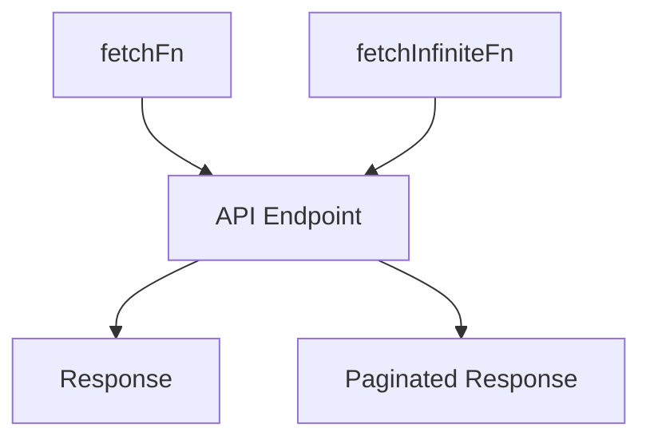

# Overview

The Dev Toolbar is a proof of concept (PoC) for a potential Dev Toolbar product, showcasing its possible features. It is not production-ready and is intended to be visible only to Sentry employees on [sentry.io](http://sentry.io) or in a development environment. To make it production-ready for customer use, it would need to be bundled similarly to the SDK or Spotlight, with several steps remaining to achieve this.

# Initialization

The `init` function is the main entry point for initializing the Dev Toolbar. It mounts the toolbar to the DOM using the provided configuration.

# Components

The Dev Toolbar includes various components such as issues, feature flags, replay, releases, teams, alerts, feedback, and navigation.

# Hooks

The Dev Toolbar contains hooks for functionalities like API endpoints, fetching data, visibility, configuration, and more.

# Main Functions

There are several main functions in this folder. Some of them are `init`, <SwmToken path="static/app/components/devtoolbar/mount.tsx" pos="8:6:6" line-data="export default function mount(rootNode: HTMLElement, config: Configuration) {">`mount`</SwmToken>, and <SwmToken path="static/app/components/devtoolbar/hooks/useToolbarRoute.tsx" pos="39:6:6" line-data="export default function useToolbarRoute() {">`useToolbarRoute`</SwmToken>. We will dive a little into `init` and <SwmToken path="static/app/components/devtoolbar/mount.tsx" pos="8:6:6" line-data="export default function mount(rootNode: HTMLElement, config: Configuration) {">`mount`</SwmToken>.

## init

The `init` function is the main entry point for initializing the Dev Toolbar. It imports the <SwmToken path="static/app/components/devtoolbar/mount.tsx" pos="8:6:6" line-data="export default function mount(rootNode: HTMLElement, config: Configuration) {">`mount`</SwmToken> function and calls it with the provided <SwmToken path="static/app/components/devtoolbar/mount.tsx" pos="8:8:8" line-data="export default function mount(rootNode: HTMLElement, config: Configuration) {">`rootNode`</SwmToken> and configuration.

## mount

The <SwmToken path="static/app/components/devtoolbar/mount.tsx" pos="8:6:6" line-data="export default function mount(rootNode: HTMLElement, config: Configuration) {">`mount`</SwmToken> function is responsible for rendering the Dev Toolbar into the DOM. It creates a new div element, attaches a shadow DOM to it, and then uses React to render the toolbar components within this shadow DOM.

<SwmSnippet path="/static/app/components/devtoolbar/mount.tsx" line="1">

---

The <SwmToken path="static/app/components/devtoolbar/mount.tsx" pos="8:6:6" line-data="export default function mount(rootNode: HTMLElement, config: Configuration) {">`mount`</SwmToken> function creates a new div element, attaches a shadow DOM to it, and then uses React to render the toolbar components within this shadow DOM.

```tsx
import {StrictMode} from 'react';
import {createRoot} from 'react-dom/client';

import App from './components/app';
import Providers from './components/providers';
import type {Configuration} from './types';

export default function mount(rootNode: HTMLElement, config: Configuration) {
  const host = document.createElement('div');
  host.id = config.domId ?? 'sentry-devtools';
  const shadow = host.attachShadow({mode: 'open'});
  const reactRoot = makeReactRoot(shadow, config);

  rootNode.appendChild(host);

  return () => {
    host.remove();
    reactRoot.unmount();
  };
}
```

---

</SwmSnippet>

## <SwmToken path="static/app/components/devtoolbar/hooks/useToolbarRoute.tsx" pos="39:6:6" line-data="export default function useToolbarRoute() {">`useToolbarRoute`</SwmToken>

The <SwmToken path="static/app/components/devtoolbar/hooks/useToolbarRoute.tsx" pos="39:6:6" line-data="export default function useToolbarRoute() {">`useToolbarRoute`</SwmToken> hook provides access to the current state and the function to set the active panel in the Dev Toolbar. It uses React's context API to share this state across components.

<SwmSnippet path="/static/app/components/devtoolbar/hooks/useToolbarRoute.tsx" line="39">

---

The <SwmToken path="static/app/components/devtoolbar/hooks/useToolbarRoute.tsx" pos="39:6:6" line-data="export default function useToolbarRoute() {">`useToolbarRoute`</SwmToken> hook uses React's context API to share the current state and the function to set the active panel across components.

```tsx
export default function useToolbarRoute() {
  return useContext(context);
}
```

---

</SwmSnippet>

# Dev Toolbar Endpoints

The Dev Toolbar includes several endpoints for fetching data from APIs.

## <SwmToken path="static/app/components/devtoolbar/hooks/useApiEndpoint.tsx" pos="31:3:3" line-data="  const fetchFn = useMemo(">`fetchFn`</SwmToken>

The <SwmToken path="static/app/components/devtoolbar/hooks/useApiEndpoint.tsx" pos="31:3:3" line-data="  const fetchFn = useMemo(">`fetchFn`</SwmToken> function is used to fetch data from a specified API endpoint. It constructs the URL using the <SwmToken path="static/app/components/devtoolbar/hooks/useApiEndpoint.tsx" pos="37:7:7" line-data="          stringifyUrl({url: apiPrefix + endpoint, query: options?.query}),">`apiPrefix`</SwmToken> and the endpoint, and sends a request with the specified options such as query parameters, payload, headers, and method. If the response is not successful, it throws an error. Otherwise, it returns the JSON data and headers from the response.

<SwmSnippet path="/static/app/components/devtoolbar/hooks/useApiEndpoint.tsx" line="31">

---

The <SwmToken path="static/app/components/devtoolbar/hooks/useApiEndpoint.tsx" pos="31:3:3" line-data="  const fetchFn = useMemo(">`fetchFn`</SwmToken> function constructs the URL using the <SwmToken path="static/app/components/devtoolbar/hooks/useApiEndpoint.tsx" pos="37:7:7" line-data="          stringifyUrl({url: apiPrefix + endpoint, query: options?.query}),">`apiPrefix`</SwmToken> and the endpoint, sends a request, and returns the JSON data and headers from the response.

```tsx
  const fetchFn = useMemo(
    () =>
      async <Data,>({
        queryKey: [_ns, endpoint, options],
      }: FetchParams): Promise<ApiResult<Data>> => {
        const response = await fetch(
          stringifyUrl({url: apiPrefix + endpoint, query: options?.query}),
          {
            body: options?.payload ? JSON.stringify(options?.payload) : undefined,
            headers: options?.headers,
            method: options?.method ?? 'GET',
          }
        );

        if (!response.ok) {
          throw new Error('Network response was not ok');
        }

        return {
          json: await response.json(),
          headers: response.headers,
```

---

</SwmSnippet>

## <SwmToken path="static/app/components/devtoolbar/hooks/useApiEndpoint.tsx" pos="57:3:3" line-data="  const fetchInfiniteFn = useMemo(">`fetchInfiniteFn`</SwmToken>

The <SwmToken path="static/app/components/devtoolbar/hooks/useApiEndpoint.tsx" pos="57:3:3" line-data="  const fetchInfiniteFn = useMemo(">`fetchInfiniteFn`</SwmToken> function is used to fetch paginated data from an API endpoint. It extends the <SwmToken path="static/app/components/devtoolbar/hooks/useApiEndpoint.tsx" pos="31:3:3" line-data="  const fetchFn = useMemo(">`fetchFn`</SwmToken> by adding a <SwmToken path="static/app/components/devtoolbar/hooks/useApiEndpoint.tsx" pos="65:1:1" line-data="          cursor: pageParam?.cursor,">`cursor`</SwmToken> parameter to the query, which is used for pagination. This function is useful for implementing infinite scrolling or loading more data as the user navigates through the application.

<SwmSnippet path="/static/app/components/devtoolbar/hooks/useApiEndpoint.tsx" line="57">

---

The <SwmToken path="static/app/components/devtoolbar/hooks/useApiEndpoint.tsx" pos="57:3:3" line-data="  const fetchInfiniteFn = useMemo(">`fetchInfiniteFn`</SwmToken> function extends the <SwmToken path="static/app/components/devtoolbar/hooks/useApiEndpoint.tsx" pos="67:3:3" line-data="        return fetchFn&lt;Data&gt;({">`fetchFn`</SwmToken> by adding a <SwmToken path="static/app/components/devtoolbar/hooks/useApiEndpoint.tsx" pos="65:1:1" line-data="          cursor: pageParam?.cursor,">`cursor`</SwmToken> parameter to the query for pagination.

```tsx
  const fetchInfiniteFn = useMemo(
    () =>
      <Data,>({
        queryKey: [ns, endpoint, options],
        pageParam,
      }: InfiniteFetchParams): Promise<ApiResult<Data>> => {
        const query = {
          ...options?.query,
          cursor: pageParam?.cursor,
        };
        return fetchFn<Data>({
          queryKey: [ns, endpoint, {...options, query}],
        });
      },
    [fetchFn]
  );
```

---

</SwmSnippet>

&nbsp;

*This is an auto-generated document by Swimm AI 🌊 and has not yet been verified by a human*

<SwmMeta version="3.0.0" repo-id="Z2l0aHViJTNBJTNBc2VudHJ5LWRlbW8tMSUzQSUzQVN3aW1tLURlbW8=" repo-name="sentry-demo-1" doc-type="overview"><sup>Powered by [Swimm](/)</sup></SwmMeta>
