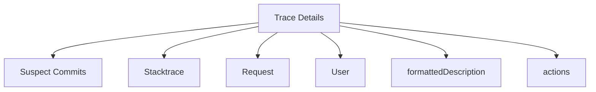

# Exploring Trace Details

Details in the Trace drawer provide a comprehensive view of specific trace events and their associated data. These details include various sections such as suspect commits, tags, stacktrace, request, user, and message. Each section offers insights into different aspects of the trace, helping developers diagnose and understand issues more effectively.

## Suspect Commits

The 'Suspect Commits' section lists commits that might have introduced the issue. For example, a commit message and author details are provided to help identify potential sources of the problem.

## Stacktrace

The 'Stacktrace' section provides a detailed call stack at the time of the error, which is crucial for understanding the sequence of function calls that led to the issue.

## Request

The 'Request' section includes information about the HTTP request that triggered the trace, such as the URL, method, and parameters, which can help in reproducing and diagnosing the issue.

## User

The 'User' section provides details about the user involved in the trace, including user ID and other relevant metadata, which can be useful for understanding the context of the issue.

## Main Functions

There are several main functions in this folder. Some of them are `formattedDescription`, `actions`, `value`, and `title`. We will dive a little into `formattedDescription` and `actions`.

<SwmSnippet path="/static/app/views/performance/newTraceDetails/traceDrawer/details/span/sections/description.tsx" line="45">

---

### formattedDescription

The `formattedDescription` function formats the description of a span based on its module type. If the module is a database, it formats the description using a SQLishFormatter; otherwise, it returns the description as is.

```tsx
  const formattedDescription = useMemo(() => {
    if (resolvedModule !== ModuleName.DB) {
      return span.description ?? '';
    }

    return formatter.toString(span.description ?? '');
  }, [span.description, resolvedModule]);
```

---

</SwmSnippet>

<SwmSnippet path="/static/app/views/performance/newTraceDetails/traceDrawer/details/span/sections/description.tsx" line="67">

---

### actions

The `actions` function generates a set of buttons for span actions, such as viewing span summaries or similar spans. It uses the span's operation and hash to create links and track analytics events.

```tsx
  const actions =
    !span.op || !span.hash ? null : (
      <ButtonGroup>
        <SpanSummaryButton event={event} organization={organization} span={span} />
        <LinkButton
          size="xs"
          to={spanDetailsRouteWithQuery({
            orgSlug: organization.slug,
            transaction: event.title,
            query: location.query,
            spanSlug: {op: span.op, group: groupHash},
            projectID: event.projectID,
          })}
          onClick={() => {
            hasNewSpansUIFlag
              ? trackAnalytics('trace.trace_layout.view_span_summary', {
                  organization,
                  module: resolvedModule,
                })
              : trackAnalytics('trace.trace_layout.view_similar_spans', {
                  organization,
```

---

</SwmSnippet>

&nbsp;

*This is an auto-generated document by Swimm AI 🌊 and has not yet been verified by a human*

<SwmMeta version="3.0.0" repo-id="Z2l0aHViJTNBJTNBc2VudHJ5LWRlbW8tMSUzQSUzQVN3aW1tLURlbW8=" repo-name="sentry-demo-1" doc-type="overview"><sup>Powered by [Swimm](https://app.swimm.io/)</sup></SwmMeta>
