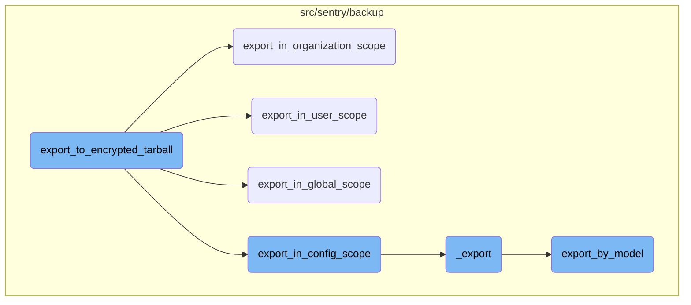

This document explains the process of exporting data to an encrypted tarball. The process involves generating a <SwmToken path="src/sentry/testutils/helpers/backups.py" pos="201:7:9" line-data="    # Generate a public-private key pair.">`public-private`</SwmToken> key pair, determining the export scope, and invoking the appropriate export function with encryption enabled.

The flow starts by generating a <SwmToken path="src/sentry/testutils/helpers/backups.py" pos="201:7:9" line-data="    # Generate a public-private key pair.">`public-private`</SwmToken> key pair to ensure encryption. Next, it determines the scope of the export, which could be global, user-specific, organization-specific, or configuration-specific. Based on the determined scope, it calls the corresponding export function to handle the data export. Finally, the data is encrypted and saved into a tarball file.

# Flow drill down



<SwmSnippet path="/src/sentry/testutils/helpers/backups.py" line="190">

---

## Orchestrating the Export Process

The function <SwmToken path="src/sentry/testutils/helpers/backups.py" pos="190:2:2" line-data="def export_to_encrypted_tarball(">`export_to_encrypted_tarball`</SwmToken> orchestrates the export process by generating a <SwmToken path="src/sentry/testutils/helpers/backups.py" pos="201:7:9" line-data="    # Generate a public-private key pair.">`public-private`</SwmToken> key pair and determining the export scope. It then invokes the appropriate export function (<SwmToken path="src/sentry/backup/exports.py" pos="232:2:2" line-data="def export_in_global_scope(">`export_in_global_scope`</SwmToken>, <SwmToken path="src/sentry/backup/exports.py" pos="207:2:2" line-data="def export_in_config_scope(">`export_in_config_scope`</SwmToken>, <SwmToken path="src/sentry/backup/exports.py" pos="180:2:2" line-data="def export_in_organization_scope(">`export_in_organization_scope`</SwmToken>, or <SwmToken path="src/sentry/backup/exports.py" pos="154:2:2" line-data="def export_in_user_scope(">`export_in_user_scope`</SwmToken>) with encryption enabled.

```python
def export_to_encrypted_tarball(
    path: Path,
    scope: ExportScope,
    *,
    filter_by: set[str] | None = None,
) -> Any:
    """
    Helper function that exports the current state of the database to the specified encrypted
    tarball.
    """

    # Generate a public-private key pair.
    (private_key_pem, public_key_pem) = generate_rsa_key_pair()
    public_key_fp = io.BytesIO(public_key_pem)

    # Run the appropriate `export_in_...` command with encryption enabled.
    tar_file_path = str(path)
    with open(tar_file_path, "wb+") as tmp_file:
        # These functions are just thin wrappers, but its best to exercise them directly anyway in
        # case that ever changes.
        if scope == ExportScope.Global:
```

---

</SwmSnippet>

<SwmSnippet path="/src/sentry/backup/exports.py" line="180">

---

## Exporting in Organization Scope

The function <SwmToken path="src/sentry/backup/exports.py" pos="180:2:2" line-data="def export_in_organization_scope(">`export_in_organization_scope`</SwmToken> handles the export logic for the <SwmToken path="src/sentry/backup/exports.py" pos="189:12:12" line-data="    Perform an export in the `Organization` scope, meaning that only models with">`Organization`</SwmToken> scope. It filters models based on the organization and invokes the core export function <SwmToken path="src/sentry/backup/exports.py" pos="197:3:3" line-data="    return _export(">`_export`</SwmToken> with the appropriate parameters.

```python
def export_in_organization_scope(
    dest: IO[bytes],
    *,
    encryptor: Encryptor | None = None,
    org_filter: set[str] | None = None,
    indent: int = 2,
    printer: Printer,
):
    """
    Perform an export in the `Organization` scope, meaning that only models with
    `RelocationScope.User` or `RelocationScope.Organization` will be exported from the provided
    `dest` file.
    """

    # Import here to prevent circular module resolutions.
    from sentry.models.organization import Organization

    return _export(
        dest,
        ExportScope.Organization,
        encryptor=encryptor,
```

---

</SwmSnippet>

<SwmSnippet path="/src/sentry/backup/exports.py" line="154">

---

## Exporting in User Scope

The function <SwmToken path="src/sentry/backup/exports.py" pos="154:2:2" line-data="def export_in_user_scope(">`export_in_user_scope`</SwmToken> handles the export logic for the <SwmToken path="src/sentry/backup/exports.py" pos="163:12:12" line-data="    Perform an export in the `User` scope, meaning that only models with `RelocationScope.User` will">`User`</SwmToken> scope. It filters models based on the user and invokes the core export function <SwmToken path="src/sentry/backup/exports.py" pos="170:3:3" line-data="    return _export(">`_export`</SwmToken> with the appropriate parameters.

```python
def export_in_user_scope(
    dest: IO[bytes],
    *,
    encryptor: Encryptor | None = None,
    user_filter: set[str] | None = None,
    indent: int = 2,
    printer: Printer,
):
    """
    Perform an export in the `User` scope, meaning that only models with `RelocationScope.User` will
    be exported from the provided `dest` file.
    """

    # Import here to prevent circular module resolutions.
    from sentry.users.models.user import User

    return _export(
        dest,
        ExportScope.User,
        encryptor=encryptor,
        filter_by=Filter(User, "username", user_filter) if user_filter is not None else None,
```

---

</SwmSnippet>

<SwmSnippet path="/src/sentry/backup/exports.py" line="232">

---

## Exporting in Global Scope

The function <SwmToken path="src/sentry/backup/exports.py" pos="232:2:2" line-data="def export_in_global_scope(">`export_in_global_scope`</SwmToken> handles the export logic for the `Global` scope, meaning that all models will be exported. It invokes the core export function <SwmToken path="src/sentry/backup/exports.py" pos="243:3:3" line-data="    return _export(">`_export`</SwmToken> with the appropriate parameters.

```python
def export_in_global_scope(
    dest: IO[bytes],
    *,
    encryptor: Encryptor | None = None,
    indent: int = 2,
    printer: Printer,
):
    """
    Perform an export in the `Global` scope, meaning that all models will be exported from the
    provided source file.
    """
    return _export(
        dest,
        ExportScope.Global,
        encryptor=encryptor,
        indent=indent,
        printer=printer,
    )
```

---

</SwmSnippet>

<SwmSnippet path="/src/sentry/backup/exports.py" line="207">

---

## Exporting in Config Scope

The function <SwmToken path="src/sentry/backup/exports.py" pos="207:2:2" line-data="def export_in_config_scope(">`export_in_config_scope`</SwmToken> handles the export logic for the <SwmToken path="src/sentry/backup/exports.py" pos="215:12:12" line-data="    Perform an export in the `Config` scope, meaning that only models directly related to the global">`Config`</SwmToken> scope, meaning that only models directly related to the global configuration and administration of an entire Sentry instance will be exported. It invokes the core export function <SwmToken path="src/sentry/backup/exports.py" pos="222:3:3" line-data="    return _export(">`_export`</SwmToken> with the appropriate parameters.

```python
def export_in_config_scope(
    dest: IO[bytes],
    *,
    encryptor: Encryptor | None = None,
    indent: int = 2,
    printer: Printer,
):
    """
    Perform an export in the `Config` scope, meaning that only models directly related to the global
    configuration and administration of an entire Sentry instance will be exported.
    """

    # Import here to prevent circular module resolutions.
    from sentry.users.models.user import User

    return _export(
        dest,
        ExportScope.Config,
        encryptor=encryptor,
        filter_by=Filter(User, "pk", import_export_service.get_all_globally_privileged_users()),
        indent=indent,
```

---

</SwmSnippet>

<SwmSnippet path="/src/sentry/backup/exports.py" line="44">

---

## Core Export Logic

The function <SwmToken path="src/sentry/backup/exports.py" pos="44:2:2" line-data="def _export(">`_export`</SwmToken> performs the core export logic. It filters models based on the provided scope and filter criteria, serializes the data, and writes it to the destination file. If an encryptor is provided, it creates an encrypted tarball of the exported data.

```python
def _export(
    dest: IO[bytes],
    scope: ExportScope,
    *,
    encryptor: Encryptor | None = None,
    indent: int = 2,
    filter_by: Filter | None = None,
    printer: Printer,
):
    """
    Exports core data for the Sentry installation.

    It is generally preferable to avoid calling this function directly, as there are certain
    combinations of input parameters that should not be used together. Instead, use one of the other
    wrapper functions in this file, named `export_in_XXX_scope()`.
    """

    # Import here to prevent circular module resolutions.
    from sentry.models.organization import Organization
    from sentry.models.organizationmember import OrganizationMember
    from sentry.users.models.user import User
```

---

</SwmSnippet>

<SwmSnippet path="/src/sentry/backup/services/import_export/impl.py" line="427">

---

## Exporting Individual Models

The function <SwmToken path="src/sentry/backup/services/import_export/impl.py" pos="427:3:3" line-data="    def export_by_model(">`export_by_model`</SwmToken> handles the export of individual models. It ensures that the model is exportable, applies the necessary filters, and serializes the data. It also manages the primary key mapping and handles any exceptions that occur during the export process.

```python
    def export_by_model(
        self,
        *,
        export_model_name: str = "",
        from_pk: int = 0,
        scope: RpcExportScope | None = None,
        filter_by: list[RpcFilter],
        pk_map: RpcPrimaryKeyMap,
        indent: int = 2,
    ) -> RpcExportResult:
        try:
            from sentry.db.models.base import BaseModel

            deps = dependencies()
            batch_model_name = NormalizedModelName(export_model_name)
            model = get_model(batch_model_name)
            if model is None or not issubclass(model, BaseModel):
                return RpcExportError(
                    kind=RpcExportErrorKind.UnknownModel,
                    on=InstanceID(export_model_name),
                    reason=f"The model `{export_model_name}` could not be found",
```

---

</SwmSnippet>

&nbsp;

*This is an auto-generated document by Swimm AI 🌊 and has not yet been verified by a human*

<SwmMeta version="3.0.0" repo-id="Z2l0aHViJTNBJTNBc2VudHJ5LWRlbW8tMSUzQSUzQVN3aW1tLURlbW8=" repo-name="sentry-demo-1" doc-type="flows"><sup>Powered by [Swimm](/)</sup></SwmMeta>
