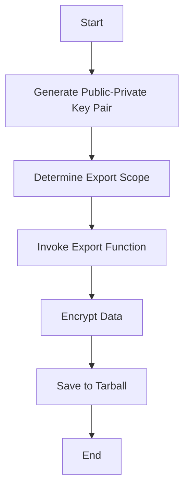

The process of exporting data to an encrypted tarball involves several key steps to ensure data security and integrity. This document will cover:

1. Generating a public-private key pair
2. Determining the export scope
3. Invoking the appropriate export function
4. Encrypting and saving the data into a tarball file.

Technical document: <SwmLink doc-title="Exporting Data to an Encrypted Tarball">[Exporting Data to an Encrypted Tarball](/.swm/exporting-data-to-an-encrypted-tarball.3pxpc311.sw.md)</SwmLink>

# [Generating a Public-Private Key Pair](https://app.swimm.io/repos/Z2l0aHViJTNBJTNBc2VudHJ5LWRlbW8tMSUzQSUzQVN3aW1tLURlbW8=/docs/3pxpc311#orchestrating-the-export-process)

The first step in exporting data to an encrypted tarball is to generate a public-private key pair. This key pair is essential for encrypting the data to ensure that it remains secure during and after the export process. The public key is used to encrypt the data, while the private key is required to decrypt it. This ensures that only authorized users with the private key can access the exported data.

# [Determining the Export Scope](https://app.swimm.io/repos/Z2l0aHViJTNBJTNBc2VudHJ5LWRlbW8tMSUzQSUzQVN3aW1tLURlbW8=/docs/3pxpc311#orchestrating-the-export-process)

The next step is to determine the scope of the export. The scope defines which data will be included in the export. There are several possible scopes:

- **Global Scope**: All data in the system is included.
- **User Scope**: Only data related to specific users is included.
- **Organization Scope**: Only data related to specific organizations is included.
- **Config Scope**: Only configuration and administrative data is included. Determining the correct scope is crucial as it ensures that only the relevant data is exported, which can help in managing data size and relevance.

# [Invoking the Appropriate Export Function](https://app.swimm.io/repos/Z2l0aHViJTNBJTNBc2VudHJ5LWRlbW8tMSUzQSUzQVN3aW1tLURlbW8=/docs/3pxpc311#orchestrating-the-export-process)

Once the scope is determined, the appropriate export function is invoked. Each scope has a corresponding export function that handles the data export for that specific scope. For example:

- **Global Scope**: The function `export_in_global_scope` is called.
- **User Scope**: The function `export_in_user_scope` is called.
- **Organization Scope**: The function `export_in_organization_scope` is called.
- **Config Scope**: The function `export_in_config_scope` is called. These functions ensure that the data is filtered and processed according to the specified scope before being exported.

# [Encrypting and Saving the Data into a Tarball File](https://app.swimm.io/repos/Z2l0aHViJTNBJTNBc2VudHJ5LWRlbW8tMSUzQSUzQVN3aW1tLURlbW8=/docs/3pxpc311#core-export-logic)

After the data is processed by the appropriate export function, it is then encrypted using the public key generated earlier. The encryption process ensures that the data is secure and cannot be accessed by unauthorized users. Once encrypted, the data is saved into a tarball file. A tarball is a compressed archive file that can contain multiple files and directories. By saving the data into a tarball, it is easier to manage and transfer the exported data as a single file. The tarball file can then be stored securely or transferred to another system for further processing or backup.

&nbsp;

*This is an auto-generated document by Swimm AI 🌊 and has not yet been verified by a human*

<SwmMeta version="3.0.0" repo-id="Z2l0aHViJTNBJTNBc2VudHJ5LWRlbW8tMSUzQSUzQVN3aW1tLURlbW8=" repo-name="sentry-demo-1" doc-type="product-flows">Powered by [Swimm](/)</SwmMeta>
