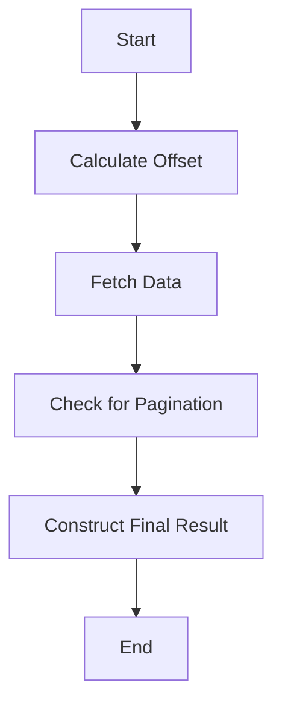

This document will cover the process of fetching and processing paginated data using the get_result function. We'll cover:

1. Calculating the offset
2. Fetching the data
3. Handling pagination
4. Constructing the final result.

Technical document: <SwmLink doc-title="Overview of get_result Function">[Overview of get_result Function](/.swm/overview-of-get_result-function.lo66rpm5.sw.md)</SwmLink>

# [Calculating the offset](https://app.swimm.io/repos/Z2l0aHViJTNBJTNBc2VudHJ5LWRlbW8tMSUzQSUzQVN3aW1tLURlbW8=/docs/lo66rpm5#calculating-the-offset)

The process begins by determining the offset based on the provided cursor. The offset is essentially the starting point from which data will be fetched. If a cursor is provided, the offset is set to the cursor's offset value; otherwise, it defaults to 0. This step ensures that the data retrieval process starts from the correct position, which is crucial for accurate pagination.

# [Fetching the data](https://app.swimm.io/repos/Z2l0aHViJTNBJTNBc2VudHJ5LWRlbW8tMSUzQSUzQVN3aW1tLURlbW8=/docs/lo66rpm5#fetching-the-data)

Next, the function calls another function to fetch the data. This function is responsible for querying the database or data source to retrieve the required data based on the calculated offset and a specified limit. The limit defines the maximum number of items to be fetched in one go. This step is important for managing the amount of data processed at a time, which can impact performance and user experience.

# [Handling pagination](https://app.swimm.io/repos/Z2l0aHViJTNBJTNBc2VudHJ5LWRlbW8tMSUzQSUzQVN3aW1tLURlbW8=/docs/lo66rpm5#handling-pagination)

After fetching the data, the function checks if the data includes a list of groups. If the number of items in the list exceeds the limit, it indicates that there are more items to be fetched, and pagination is needed. The function then removes the extra item from the list to ensure that only the specified number of items is processed. This step is crucial for managing large datasets and providing a seamless user experience by breaking down the data into manageable chunks.

# [Constructing the final result](https://app.swimm.io/repos/Z2l0aHViJTNBJTNBc2VudHJ5LWRlbW8tMSUzQSUzQVN3aW1tLURlbW8=/docs/lo66rpm5#constructing-the-final-result)

Finally, the function constructs and returns an object that includes the data and pagination details. This object typically contains the fetched data, along with information about the previous and next pages, such as the offsets and whether there are more items to be fetched. This step is essential for providing users with a complete and navigable view of the data, allowing them to move back and forth between pages seamlessly.

&nbsp;

*This is an auto-generated document by Swimm AI 🌊 and has not yet been verified by a human*

<SwmMeta version="3.0.0" repo-id="Z2l0aHViJTNBJTNBc2VudHJ5LWRlbW8tMSUzQSUzQVN3aW1tLURlbW8=" repo-name="sentry-demo-1" doc-type="product-flows">Powered by [Swimm](/)</SwmMeta>
