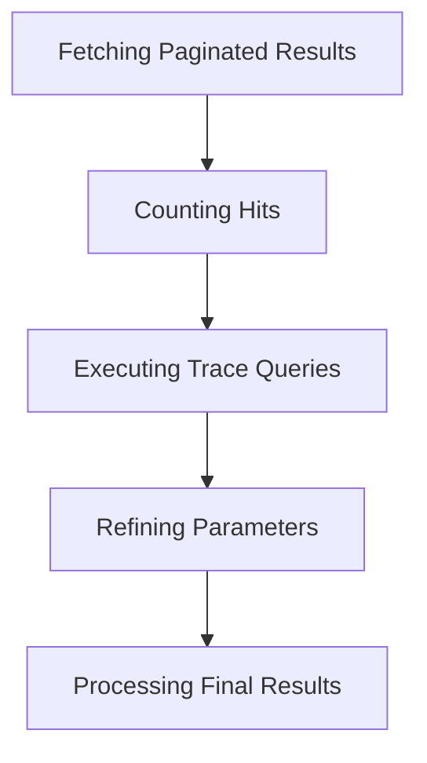

This document will cover the process of fetching and processing paginated results, which includes:

1. Fetching paginated results
2. Counting hits
3. Executing trace queries
4. Refining parameters
5. Processing final results.

Technical document: <SwmLink doc-title="Fetching and Processing Paginated Results">[Fetching and Processing Paginated Results](/.swm/fetching-and-processing-paginated-results.pb2xhn7q.sw.md)</SwmLink>

# [Fetching Paginated Results](https://app.swimm.io/repos/Z2l0aHViJTNBJTNBc2VudHJ5LWRlbW8tMSUzQSUzQVN3aW1tLURlbW8=/docs/pb2xhn7q#fetching-and-processing-trace-data)

The process begins with fetching paginated results based on a cursor and limit. This step involves building a query set and determining the starting point for fetching data. The cursor helps in navigating through the pages of results, ensuring that the user can access all available data in a structured manner.

# [Counting Hits](https://app.swimm.io/repos/Z2l0aHViJTNBJTNBc2VudHJ5LWRlbW8tMSUzQSUzQVN3aW1tLURlbW8=/docs/pb2xhn7q#counting-hits)

Counting hits is essential for pagination as it determines the total number of results available. This step involves querying the database to count the number of entries that match the search criteria. Knowing the total count helps in providing accurate pagination information to the user, such as the total number of pages.

# [Executing Trace Queries](https://app.swimm.io/repos/Z2l0aHViJTNBJTNBc2VudHJ5LWRlbW8tMSUzQSUzQVN3aW1tLURlbW8=/docs/pb2xhn7q#executing-trace-queries)

Executing trace queries involves running the necessary database queries to fetch trace data. This step is crucial for retrieving the actual data that matches the user's search criteria. The execution process ensures that all relevant traces are fetched and prepared for further processing.

# [Refining Parameters](https://app.swimm.io/repos/Z2l0aHViJTNBJTNBc2VudHJ5LWRlbW8tMSUzQSUzQVN3aW1tLURlbW8=/docs/pb2xhn7q#refining-parameters)

Refining parameters is about adjusting the query parameters to ensure accuracy. This step involves narrowing down the time range or other criteria based on the initial results. Refining parameters helps in optimizing the query and ensuring that the most relevant data is fetched.

# [Processing Final Results](https://app.swimm.io/repos/Z2l0aHViJTNBJTNBc2VudHJ5LWRlbW8tMSUzQSUzQVN3aW1tLURlbW8=/docs/pb2xhn7q#processing-final-results)

Processing final results involves organizing and preparing the fetched data for presentation. This step includes handling errors, merging data from multiple queries, and formatting the results. The goal is to provide the user with a clear and accurate representation of the data they requested.

&nbsp;

*This is an auto-generated document by Swimm AI 🌊 and has not yet been verified by a human*

<SwmMeta version="3.0.0" repo-id="Z2l0aHViJTNBJTNBc2VudHJ5LWRlbW8tMSUzQSUzQVN3aW1tLURlbW8=" repo-name="sentry-demo-1" doc-type="product-flows">Powered by [Swimm](/)</SwmMeta>
