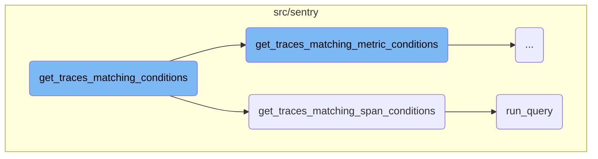
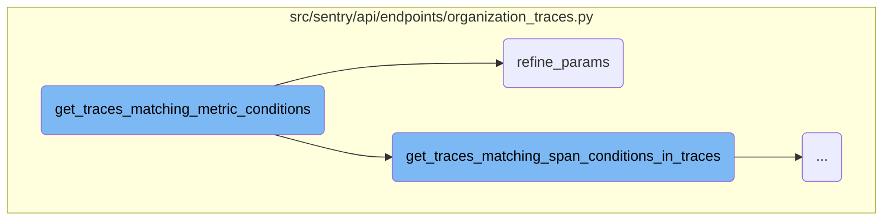

```mermaid
graph TD;
      subgraph src/sentry/api
f59ee77eba4bec02fbf85e491379b08643b77650d2e8bc67d47777a17b7efb74(get_traces_matching_span_conditions_in_traces):::mainFlowStyle --> d8fac1d7bfbb4e9e65dcd73832dd4018c7613d45d8b1afd52d47203ce0c78c32(get_traces_matching_span_conditions_query):::mainFlowStyle
end

subgraph src/sentry/api
d8fac1d7bfbb4e9e65dcd73832dd4018c7613d45d8b1afd52d47203ce0c78c32(get_traces_matching_span_conditions_query):::mainFlowStyle --> ba18c5554394177c4ba758ce8262e4486312fe1945d3a8c33084e911a1d88843(get):::mainFlowStyle
end

subgraph src/sentry/api
ba18c5554394177c4ba758ce8262e4486312fe1945d3a8c33084e911a1d88843(get):::mainFlowStyle --> 76555db3c36df80d8ce698d10ee1f95e79e25496e48ce2c0e3a19dce410f1dcd(handle_results_with_meta):::mainFlowStyle
end


      classDef mainFlowStyle color:#000000,fill:#7CB9F4
classDef rootsStyle color:#000000,fill:#00FFF4
classDef Style1 color:#000000,fill:#00FFAA
classDef Style2 color:#000000,fill:#FFFF00
classDef Style3 color:#000000,fill:#AA7CB9

%% Swimm:
%% graph TD;
%%       subgraph <SwmPath>[src/sentry/api/](src/sentry/api/)</SwmPath>
%% f59ee77eba4bec02fbf85e491379b08643b77650d2e8bc67d47777a17b7efb74(get_traces_matching_span_conditions_in_traces):::mainFlowStyle --> d8fac1d7bfbb4e9e65dcd73832dd4018c7613d45d8b1afd52d47203ce0c78c32(get_traces_matching_span_conditions_query):::mainFlowStyle
%% end
%% 
%% subgraph <SwmPath>[src/sentry/api/](src/sentry/api/)</SwmPath>
%% d8fac1d7bfbb4e9e65dcd73832dd4018c7613d45d8b1afd52d47203ce0c78c32(get_traces_matching_span_conditions_query):::mainFlowStyle --> ba18c5554394177c4ba758ce8262e4486312fe1945d3a8c33084e911a1d88843(get):::mainFlowStyle
%% end
%% 
%% subgraph <SwmPath>[src/sentry/api/](src/sentry/api/)</SwmPath>
%% ba18c5554394177c4ba758ce8262e4486312fe1945d3a8c33084e911a1d88843(get):::mainFlowStyle --> 76555db3c36df80d8ce698d10ee1f95e79e25496e48ce2c0e3a19dce410f1dcd(handle_results_with_meta):::mainFlowStyle
%% end
%% 
%% 
%%       classDef mainFlowStyle color:#000000,fill:#7CB9F4
%% classDef rootsStyle color:#000000,fill:#00FFF4
%% classDef Style1 color:#000000,fill:#00FFAA
%% classDef Style2 color:#000000,fill:#FFFF00
%% classDef Style3 color:#000000,fill:#AA7CB9
```

This document provides an overview of the <SwmToken path="src/sentry/api/paginator.py" pos="136:3:3" line-data="    def get_result(self, limit=100, cursor=None, count_hits=False, known_hits=None, max_hits=None):">`get_result`</SwmToken> function, which is responsible for fetching and processing paginated results. It outlines the main steps involved in the flow, including building the query set, counting hits, executing trace queries, refining parameters, and processing final results.

The flow starts with the <SwmToken path="src/sentry/api/paginator.py" pos="136:3:3" line-data="    def get_result(self, limit=100, cursor=None, count_hits=False, known_hits=None, max_hits=None):">`get_result`</SwmToken> function fetching paginated results based on a cursor and limit. It builds a query set and counts the number of hits if needed. The function then executes trace queries, refines the parameters to ensure accuracy, and processes the final results to prepare the data for presentation. Each step is designed to handle specific tasks, such as fetching trace <SwmToken path="src/sentry/api/endpoints/organization_traces.py" pos="516:11:11" line-data="        # Putting all the trace ids into a single query will likely encounter the">`ids`</SwmToken>, matching conditions, and organizing trace data.

Here is a high level diagram of the flow, showing only the most important functions:

```mermaid
graph TD;
      subgraph src/sentry/api
abf32dc110ada74010f77f524e32b6c03c9796c02088877559196d3baf55dbcc(get_result):::mainFlowStyle --> 4e0325d69363c1a325c523108c2f05e70c1a2c475175e98cf37479b992ee07a9(count_hits):::mainFlowStyle
end

subgraph src/sentry/api
4e0325d69363c1a325c523108c2f05e70c1a2c475175e98cf37479b992ee07a9(count_hits):::mainFlowStyle --> 1938ec8ed54d8d70157d96ff2f4bce170d3c52f6243334b6177e345b6a81bb39(execute):::mainFlowStyle
end

subgraph src/sentry/api
1938ec8ed54d8d70157d96ff2f4bce170d3c52f6243334b6177e345b6a81bb39(execute):::mainFlowStyle --> 3efcbc16abd0946e8b6c91ac6a89660ed1fe5265c062931dd99fc75600126b0e(_execute):::mainFlowStyle
end

subgraph src/sentry/api
3efcbc16abd0946e8b6c91ac6a89660ed1fe5265c062931dd99fc75600126b0e(_execute):::mainFlowStyle --> 0118137c1f91b17b6ac71cd9660b3974ee398845c92ac976d9e2c83b70213c23(process_final_results)
end

subgraph src/sentry/api
3efcbc16abd0946e8b6c91ac6a89660ed1fe5265c062931dd99fc75600126b0e(_execute):::mainFlowStyle --> 67d9f62d1fbfe2e5cea257f1839d2978f09d2ea9d21cf8776dedb6f7c3276713(get_all_queries)
end

subgraph src/sentry/api
3efcbc16abd0946e8b6c91ac6a89660ed1fe5265c062931dd99fc75600126b0e(_execute):::mainFlowStyle --> 631d3eac77106d64fc2b7debc667613ecc58da4d8fa33bb817d51bee12df2456(refine_params)
end

subgraph src/sentry/api
3efcbc16abd0946e8b6c91ac6a89660ed1fe5265c062931dd99fc75600126b0e(_execute):::mainFlowStyle --> cb7bf590eb4d9b91b43b9946d51d12df9cec74340c6fb4e23490bb068b6c5784(get_traces_matching_conditions):::mainFlowStyle
end

subgraph src/sentry/api
cb7bf590eb4d9b91b43b9946d51d12df9cec74340c6fb4e23490bb068b6c5784(get_traces_matching_conditions):::mainFlowStyle --> f5148fbd228fba83c5d9093b36b9f1c15fa984d4fb9b6d9a5a077e395ea6dd08(get_traces_matching_span_conditions)
end

subgraph src/sentry/api
cb7bf590eb4d9b91b43b9946d51d12df9cec74340c6fb4e23490bb068b6c5784(get_traces_matching_conditions):::mainFlowStyle --> 6cc28a424002d92046479ae1f49affe0a2eb238031cc67948be05b59a3e3c2cf(get_traces_matching_metric_conditions):::mainFlowStyle
end

subgraph src/sentry/api
6cc28a424002d92046479ae1f49affe0a2eb238031cc67948be05b59a3e3c2cf(get_traces_matching_metric_conditions):::mainFlowStyle --> 631d3eac77106d64fc2b7debc667613ecc58da4d8fa33bb817d51bee12df2456(refine_params)
end

subgraph src/sentry/api
6cc28a424002d92046479ae1f49affe0a2eb238031cc67948be05b59a3e3c2cf(get_traces_matching_metric_conditions):::mainFlowStyle --> f59ee77eba4bec02fbf85e491379b08643b77650d2e8bc67d47777a17b7efb74(get_traces_matching_span_conditions_in_traces):::mainFlowStyle
end

subgraph src/sentry/api
f59ee77eba4bec02fbf85e491379b08643b77650d2e8bc67d47777a17b7efb74(get_traces_matching_span_conditions_in_traces):::mainFlowStyle --> d8fac1d7bfbb4e9e65dcd73832dd4018c7613d45d8b1afd52d47203ce0c78c32(get_traces_matching_span_conditions_query):::mainFlowStyle
end

subgraph src/sentry/api
d8fac1d7bfbb4e9e65dcd73832dd4018c7613d45d8b1afd52d47203ce0c78c32(get_traces_matching_span_conditions_query):::mainFlowStyle --> ba18c5554394177c4ba758ce8262e4486312fe1945d3a8c33084e911a1d88843(get):::mainFlowStyle
end

subgraph src/sentry/api
ba18c5554394177c4ba758ce8262e4486312fe1945d3a8c33084e911a1d88843(get):::mainFlowStyle --> 76555db3c36df80d8ce698d10ee1f95e79e25496e48ce2c0e3a19dce410f1dcd(handle_results_with_meta):::mainFlowStyle
end


      classDef mainFlowStyle color:#000000,fill:#7CB9F4
classDef rootsStyle color:#000000,fill:#00FFF4
classDef Style1 color:#000000,fill:#00FFAA
classDef Style2 color:#000000,fill:#FFFF00
classDef Style3 color:#000000,fill:#AA7CB9

%% Swimm:
%% graph TD;
%%       subgraph <SwmPath>[src/sentry/api/](src/sentry/api/)</SwmPath>
%% abf32dc110ada74010f77f524e32b6c03c9796c02088877559196d3baf55dbcc(get_result):::mainFlowStyle --> 4e0325d69363c1a325c523108c2f05e70c1a2c475175e98cf37479b992ee07a9(count_hits):::mainFlowStyle
%% end
%% 
%% subgraph <SwmPath>[src/sentry/api/](src/sentry/api/)</SwmPath>
%% 4e0325d69363c1a325c523108c2f05e70c1a2c475175e98cf37479b992ee07a9(count_hits):::mainFlowStyle --> 1938ec8ed54d8d70157d96ff2f4bce170d3c52f6243334b6177e345b6a81bb39(execute):::mainFlowStyle
%% end
%% 
%% subgraph <SwmPath>[src/sentry/api/](src/sentry/api/)</SwmPath>
%% 1938ec8ed54d8d70157d96ff2f4bce170d3c52f6243334b6177e345b6a81bb39(execute):::mainFlowStyle --> 3efcbc16abd0946e8b6c91ac6a89660ed1fe5265c062931dd99fc75600126b0e(_execute):::mainFlowStyle
%% end
%% 
%% subgraph <SwmPath>[src/sentry/api/](src/sentry/api/)</SwmPath>
%% 3efcbc16abd0946e8b6c91ac6a89660ed1fe5265c062931dd99fc75600126b0e(_execute):::mainFlowStyle --> 0118137c1f91b17b6ac71cd9660b3974ee398845c92ac976d9e2c83b70213c23(process_final_results)
%% end
%% 
%% subgraph <SwmPath>[src/sentry/api/](src/sentry/api/)</SwmPath>
%% 3efcbc16abd0946e8b6c91ac6a89660ed1fe5265c062931dd99fc75600126b0e(_execute):::mainFlowStyle --> 67d9f62d1fbfe2e5cea257f1839d2978f09d2ea9d21cf8776dedb6f7c3276713(get_all_queries)
%% end
%% 
%% subgraph <SwmPath>[src/sentry/api/](src/sentry/api/)</SwmPath>
%% 3efcbc16abd0946e8b6c91ac6a89660ed1fe5265c062931dd99fc75600126b0e(_execute):::mainFlowStyle --> 631d3eac77106d64fc2b7debc667613ecc58da4d8fa33bb817d51bee12df2456(refine_params)
%% end
%% 
%% subgraph <SwmPath>[src/sentry/api/](src/sentry/api/)</SwmPath>
%% 3efcbc16abd0946e8b6c91ac6a89660ed1fe5265c062931dd99fc75600126b0e(_execute):::mainFlowStyle --> cb7bf590eb4d9b91b43b9946d51d12df9cec74340c6fb4e23490bb068b6c5784(get_traces_matching_conditions):::mainFlowStyle
%% end
%% 
%% subgraph <SwmPath>[src/sentry/api/](src/sentry/api/)</SwmPath>
%% cb7bf590eb4d9b91b43b9946d51d12df9cec74340c6fb4e23490bb068b6c5784(get_traces_matching_conditions):::mainFlowStyle --> f5148fbd228fba83c5d9093b36b9f1c15fa984d4fb9b6d9a5a077e395ea6dd08(get_traces_matching_span_conditions)
%% end
%% 
%% subgraph <SwmPath>[src/sentry/api/](src/sentry/api/)</SwmPath>
%% cb7bf590eb4d9b91b43b9946d51d12df9cec74340c6fb4e23490bb068b6c5784(get_traces_matching_conditions):::mainFlowStyle --> 6cc28a424002d92046479ae1f49affe0a2eb238031cc67948be05b59a3e3c2cf(get_traces_matching_metric_conditions):::mainFlowStyle
%% end
%% 
%% subgraph <SwmPath>[src/sentry/api/](src/sentry/api/)</SwmPath>
%% 6cc28a424002d92046479ae1f49affe0a2eb238031cc67948be05b59a3e3c2cf(get_traces_matching_metric_conditions):::mainFlowStyle --> 631d3eac77106d64fc2b7debc667613ecc58da4d8fa33bb817d51bee12df2456(refine_params)
%% end
%% 
%% subgraph <SwmPath>[src/sentry/api/](src/sentry/api/)</SwmPath>
%% 6cc28a424002d92046479ae1f49affe0a2eb238031cc67948be05b59a3e3c2cf(get_traces_matching_metric_conditions):::mainFlowStyle --> f59ee77eba4bec02fbf85e491379b08643b77650d2e8bc67d47777a17b7efb74(get_traces_matching_span_conditions_in_traces):::mainFlowStyle
%% end
%% 
%% subgraph <SwmPath>[src/sentry/api/](src/sentry/api/)</SwmPath>
%% f59ee77eba4bec02fbf85e491379b08643b77650d2e8bc67d47777a17b7efb74(get_traces_matching_span_conditions_in_traces):::mainFlowStyle --> d8fac1d7bfbb4e9e65dcd73832dd4018c7613d45d8b1afd52d47203ce0c78c32(get_traces_matching_span_conditions_query):::mainFlowStyle
%% end
%% 
%% subgraph <SwmPath>[src/sentry/api/](src/sentry/api/)</SwmPath>
%% d8fac1d7bfbb4e9e65dcd73832dd4018c7613d45d8b1afd52d47203ce0c78c32(get_traces_matching_span_conditions_query):::mainFlowStyle --> ba18c5554394177c4ba758ce8262e4486312fe1945d3a8c33084e911a1d88843(get):::mainFlowStyle
%% end
%% 
%% subgraph <SwmPath>[src/sentry/api/](src/sentry/api/)</SwmPath>
%% ba18c5554394177c4ba758ce8262e4486312fe1945d3a8c33084e911a1d88843(get):::mainFlowStyle --> 76555db3c36df80d8ce698d10ee1f95e79e25496e48ce2c0e3a19dce410f1dcd(handle_results_with_meta):::mainFlowStyle
%% end
%% 
%% 
%%       classDef mainFlowStyle color:#000000,fill:#7CB9F4
%% classDef rootsStyle color:#000000,fill:#00FFF4
%% classDef Style1 color:#000000,fill:#00FFAA
%% classDef Style2 color:#000000,fill:#FFFF00
%% classDef Style3 color:#000000,fill:#AA7CB9
```



# Flow drill down

First, we'll zoom into this section of the flow:

```mermaid
graph TD;
      subgraph src/sentry/api
abf32dc110ada74010f77f524e32b6c03c9796c02088877559196d3baf55dbcc(get_result):::mainFlowStyle --> 4e0325d69363c1a325c523108c2f05e70c1a2c475175e98cf37479b992ee07a9(count_hits):::mainFlowStyle
end

subgraph src/sentry/api
4e0325d69363c1a325c523108c2f05e70c1a2c475175e98cf37479b992ee07a9(count_hits):::mainFlowStyle --> 1938ec8ed54d8d70157d96ff2f4bce170d3c52f6243334b6177e345b6a81bb39(execute):::mainFlowStyle
end

subgraph src/sentry/api
1938ec8ed54d8d70157d96ff2f4bce170d3c52f6243334b6177e345b6a81bb39(execute):::mainFlowStyle --> 3efcbc16abd0946e8b6c91ac6a89660ed1fe5265c062931dd99fc75600126b0e(_execute):::mainFlowStyle
end

subgraph src/sentry/api
3efcbc16abd0946e8b6c91ac6a89660ed1fe5265c062931dd99fc75600126b0e(_execute):::mainFlowStyle --> 0118137c1f91b17b6ac71cd9660b3974ee398845c92ac976d9e2c83b70213c23(process_final_results)
end

subgraph src/sentry/api
3efcbc16abd0946e8b6c91ac6a89660ed1fe5265c062931dd99fc75600126b0e(_execute):::mainFlowStyle --> 67d9f62d1fbfe2e5cea257f1839d2978f09d2ea9d21cf8776dedb6f7c3276713(get_all_queries)
end

subgraph src/sentry/api
3efcbc16abd0946e8b6c91ac6a89660ed1fe5265c062931dd99fc75600126b0e(_execute):::mainFlowStyle --> 631d3eac77106d64fc2b7debc667613ecc58da4d8fa33bb817d51bee12df2456(refine_params)
end

subgraph src/sentry/api
3efcbc16abd0946e8b6c91ac6a89660ed1fe5265c062931dd99fc75600126b0e(_execute):::mainFlowStyle --> cb7bf590eb4d9b91b43b9946d51d12df9cec74340c6fb4e23490bb068b6c5784(get_traces_matching_conditions):::mainFlowStyle
end

subgraph src/sentry/api
cb7bf590eb4d9b91b43b9946d51d12df9cec74340c6fb4e23490bb068b6c5784(get_traces_matching_conditions):::mainFlowStyle --> t75nq(...)
end

subgraph src/sentry/api
67d9f62d1fbfe2e5cea257f1839d2978f09d2ea9d21cf8776dedb6f7c3276713(get_all_queries) --> 1210b0da90ed8a41abfe3c0d54ec897407e03d31a5934d18b0a10dfb5bb80157(get_traces_metas_query)
end

subgraph src/sentry/api
0118137c1f91b17b6ac71cd9660b3974ee398845c92ac976d9e2c83b70213c23(process_final_results) --> 3cd1b1a0e8a728db57f669bad3f106ec90842fca07422760267389e206165e0b(process_breakdowns)
end


      classDef mainFlowStyle color:#000000,fill:#7CB9F4
classDef rootsStyle color:#000000,fill:#00FFF4
classDef Style1 color:#000000,fill:#00FFAA
classDef Style2 color:#000000,fill:#FFFF00
classDef Style3 color:#000000,fill:#AA7CB9

%% Swimm:
%% graph TD;
%%       subgraph <SwmPath>[src/sentry/api/](src/sentry/api/)</SwmPath>
%% abf32dc110ada74010f77f524e32b6c03c9796c02088877559196d3baf55dbcc(get_result):::mainFlowStyle --> 4e0325d69363c1a325c523108c2f05e70c1a2c475175e98cf37479b992ee07a9(count_hits):::mainFlowStyle
%% end
%% 
%% subgraph <SwmPath>[src/sentry/api/](src/sentry/api/)</SwmPath>
%% 4e0325d69363c1a325c523108c2f05e70c1a2c475175e98cf37479b992ee07a9(count_hits):::mainFlowStyle --> 1938ec8ed54d8d70157d96ff2f4bce170d3c52f6243334b6177e345b6a81bb39(execute):::mainFlowStyle
%% end
%% 
%% subgraph <SwmPath>[src/sentry/api/](src/sentry/api/)</SwmPath>
%% 1938ec8ed54d8d70157d96ff2f4bce170d3c52f6243334b6177e345b6a81bb39(execute):::mainFlowStyle --> 3efcbc16abd0946e8b6c91ac6a89660ed1fe5265c062931dd99fc75600126b0e(_execute):::mainFlowStyle
%% end
%% 
%% subgraph <SwmPath>[src/sentry/api/](src/sentry/api/)</SwmPath>
%% 3efcbc16abd0946e8b6c91ac6a89660ed1fe5265c062931dd99fc75600126b0e(_execute):::mainFlowStyle --> 0118137c1f91b17b6ac71cd9660b3974ee398845c92ac976d9e2c83b70213c23(process_final_results)
%% end
%% 
%% subgraph <SwmPath>[src/sentry/api/](src/sentry/api/)</SwmPath>
%% 3efcbc16abd0946e8b6c91ac6a89660ed1fe5265c062931dd99fc75600126b0e(_execute):::mainFlowStyle --> 67d9f62d1fbfe2e5cea257f1839d2978f09d2ea9d21cf8776dedb6f7c3276713(get_all_queries)
%% end
%% 
%% subgraph <SwmPath>[src/sentry/api/](src/sentry/api/)</SwmPath>
%% 3efcbc16abd0946e8b6c91ac6a89660ed1fe5265c062931dd99fc75600126b0e(_execute):::mainFlowStyle --> 631d3eac77106d64fc2b7debc667613ecc58da4d8fa33bb817d51bee12df2456(refine_params)
%% end
%% 
%% subgraph <SwmPath>[src/sentry/api/](src/sentry/api/)</SwmPath>
%% 3efcbc16abd0946e8b6c91ac6a89660ed1fe5265c062931dd99fc75600126b0e(_execute):::mainFlowStyle --> cb7bf590eb4d9b91b43b9946d51d12df9cec74340c6fb4e23490bb068b6c5784(get_traces_matching_conditions):::mainFlowStyle
%% end
%% 
%% subgraph <SwmPath>[src/sentry/api/](src/sentry/api/)</SwmPath>
%% cb7bf590eb4d9b91b43b9946d51d12df9cec74340c6fb4e23490bb068b6c5784(get_traces_matching_conditions):::mainFlowStyle --> t75nq(...)
%% end
%% 
%% subgraph <SwmPath>[src/sentry/api/](src/sentry/api/)</SwmPath>
%% 67d9f62d1fbfe2e5cea257f1839d2978f09d2ea9d21cf8776dedb6f7c3276713(get_all_queries) --> 1210b0da90ed8a41abfe3c0d54ec897407e03d31a5934d18b0a10dfb5bb80157(get_traces_metas_query)
%% end
%% 
%% subgraph <SwmPath>[src/sentry/api/](src/sentry/api/)</SwmPath>
%% 0118137c1f91b17b6ac71cd9660b3974ee398845c92ac976d9e2c83b70213c23(process_final_results) --> 3cd1b1a0e8a728db57f669bad3f106ec90842fca07422760267389e206165e0b(process_breakdowns)
%% end
%% 
%% 
%%       classDef mainFlowStyle color:#000000,fill:#7CB9F4
%% classDef rootsStyle color:#000000,fill:#00FFF4
%% classDef Style1 color:#000000,fill:#00FFAA
%% classDef Style2 color:#000000,fill:#FFFF00
%% classDef Style3 color:#000000,fill:#AA7CB9
```



<SwmSnippet path="/src/sentry/api/paginator.py" line="136">

---

## Fetching and Processing Trace Data

The <SwmToken path="src/sentry/api/paginator.py" pos="136:3:3" line-data="    def get_result(self, limit=100, cursor=None, count_hits=False, known_hits=None, max_hits=None):">`get_result`</SwmToken> function is responsible for fetching paginated results based on the provided cursor and limit. It builds the query set, counts hits if required, and processes the results to handle pagination correctly.

```python
    def get_result(self, limit=100, cursor=None, count_hits=False, known_hits=None, max_hits=None):
        # cursors are:
        #   (identifier(integer), row offset, is_prev)
        if cursor is None:
            cursor = Cursor(0, 0, 0)

        limit = min(limit, self.max_limit)

        if cursor.value:
            cursor_value = self.value_from_cursor(cursor)
        else:
            cursor_value = 0

        queryset = self.build_queryset(cursor_value, cursor.is_prev)

        # TODO(dcramer): this does not yet work correctly for ``is_prev`` when
        # the key is not unique

        # max_hits can be limited to speed up the query
        if max_hits is None:
            max_hits = MAX_HITS_LIMIT
```

---

</SwmSnippet>

<SwmSnippet path="/src/sentry/api/paginator.py" line="27">

---

### Counting Hits

The <SwmToken path="src/sentry/api/paginator.py" pos="27:2:2" line-data="def count_hits(queryset, max_hits):">`count_hits`</SwmToken> function counts the number of hits in the query set, which is useful for pagination and determining the total number of results.

```python
def count_hits(queryset, max_hits):
    if not max_hits:
        return 0
    hits_query = queryset.values()[:max_hits].query
    # clear out any select fields (include select_related) and pull just the id
    hits_query.clear_select_clause()
    hits_query.add_fields(["id"])
    hits_query.clear_ordering(force=True, clear_default=True)
    try:
        h_sql, h_params = hits_query.sql_with_params()
    except EmptyResultSet:
        return 0
    cursor = connections[queryset.using_replica().db].cursor()
    cursor.execute(f"SELECT COUNT(*) FROM ({h_sql}) as t", h_params)
    return cursor.fetchone()[0]
```

---

</SwmSnippet>

<SwmSnippet path="/src/sentry/api/endpoints/organization_traces.py" line="332">

---

## Executing Trace Queries

The <SwmToken path="src/sentry/api/endpoints/organization_traces.py" pos="332:3:3" line-data="    def execute(self, offset: int, limit: int):">`execute`</SwmToken> function initiates the execution of trace queries by calling the <SwmToken path="src/sentry/api/endpoints/organization_traces.py" pos="333:11:11" line-data="        return {&quot;data&quot;: self._execute()}">`_execute`</SwmToken> function.

```python
    def execute(self, offset: int, limit: int):
        return {"data": self._execute()}
```

---

</SwmSnippet>

<SwmSnippet path="/src/sentry/api/endpoints/organization_traces.py" line="335">

---

### Handling Trace Query Execution

The <SwmToken path="src/sentry/api/endpoints/organization_traces.py" pos="335:3:3" line-data="    def _execute(self):">`_execute`</SwmToken> function handles the execution of trace queries. It fetches trace <SwmToken path="src/sentry/api/endpoints/organization_traces.py" pos="516:11:11" line-data="        # Putting all the trace ids into a single query will likely encounter the">`ids`</SwmToken> matching the conditions, refines the parameters, and processes the results from multiple queries to produce the final data.

```python
    def _execute(self):
        with handle_span_query_errors():
            min_timestamp, max_timestamp, trace_ids = self.get_traces_matching_conditions(
                self.snuba_params,
            )

        self.refine_params(min_timestamp, max_timestamp)

        if not trace_ids:
            return []

        with handle_span_query_errors():
            snuba_params = self.params_with_all_projects()

            all_queries = self.get_all_queries(
                snuba_params,
                trace_ids,
            )

            all_raw_results = bulk_snuba_queries_with_referrers(
                [(query.get_snql_query(), referrer.value) for query, referrer in all_queries]
```

---

</SwmSnippet>

<SwmSnippet path="/src/sentry/api/endpoints/organization_traces.py" line="673">

---

### Processing Final Results

The <SwmToken path="src/sentry/api/endpoints/organization_traces.py" pos="673:3:3" line-data="    def process_final_results(">`process_final_results`</SwmToken> function processes the final results of the trace queries. It organizes the trace data, handles errors, and prepares the data for presentation.

```python
    def process_final_results(
        self,
        *,
        traces_metas_results,
        traces_errors_results,
        traces_occurrences_results,
        traces_breakdown_projects_results,
    ) -> list[TraceResult]:
        traces_range = {
            row["trace"]: {
                "start": row["first_seen()"],
                "end": row["last_seen()"],
                "slices": self.breakdown_slices,
            }
            for row in traces_metas_results["data"]
        }

        spans = [span for span in traces_breakdown_projects_results["data"]]
        spans.sort(key=lambda span: (span["precise.start_ts"], span["precise.finish_ts"]))

        try:
```

---

</SwmSnippet>

<SwmSnippet path="/src/sentry/api/endpoints/organization_traces.py" line="641">

---

### Fetching All Queries

The <SwmToken path="src/sentry/api/endpoints/organization_traces.py" pos="641:3:3" line-data="    def get_all_queries(">`get_all_queries`</SwmToken> function fetches all the necessary queries for traces, including metadata, errors, occurrences, and breakdowns.

```python
    def get_all_queries(
        self,
        snuba_params: SnubaParams,
        trace_ids: list[str],
    ) -> list[tuple[BaseQueryBuilder, Referrer]]:
        traces_metas_query_with_referrer = self.get_traces_metas_query(
            snuba_params,
            trace_ids,
        )

        traces_errors_query_with_referrer = self.get_traces_errors_query(
            snuba_params,
            trace_ids,
        )

        traces_occurrences_query_with_referrer = self.get_traces_occurrences_query(
            snuba_params,
            trace_ids,
        )

        traces_breakdown_projects_query_with_referrer = self.get_traces_breakdown_projects_query(
```

---

</SwmSnippet>

<SwmSnippet path="/src/sentry/api/endpoints/organization_traces.py" line="389">

---

### Refining Parameters

The <SwmToken path="src/sentry/api/endpoints/organization_traces.py" pos="389:3:3" line-data="    def refine_params(self, min_timestamp: datetime, max_timestamp: datetime):">`refine_params`</SwmToken> function refines the query parameters to select a time range that is as small as possible based on the min and max timestamps.

```python
    def refine_params(self, min_timestamp: datetime, max_timestamp: datetime):
        """
        Once we have a min/max timestamp for all the traces in the query,
        refine the params so that it selects a time range that is as small as possible.
        """

        # TODO: move to use `update_snuba_params_with_timestamp`
        time_buffer = options.get("performance.traces.trace-explorer-buffer-hours")
        buffer = timedelta(hours=time_buffer)

        self.snuba_params.start = min_timestamp - buffer
        self.snuba_params.end = max_timestamp + buffer
```

---

</SwmSnippet>

<SwmSnippet path="/src/sentry/api/endpoints/organization_traces.py" line="793">

---

### Fetching Trace Metadata Query

The <SwmToken path="src/sentry/api/endpoints/organization_traces.py" pos="793:3:3" line-data="    def get_traces_metas_query(">`get_traces_metas_query`</SwmToken> function builds the query to fetch trace metadata, including conditions to match user queries and count the number of matching spans.

```python
    def get_traces_metas_query(
        self,
        snuba_params: SnubaParams,
        trace_ids: list[str],
    ) -> tuple[BaseQueryBuilder, Referrer]:
        query = SpansIndexedQueryBuilder(
            Dataset.SpansIndexed,
            params={},
            snuba_params=snuba_params,
            query=None,
            selected_columns=[
                "trace",
                "count()",
                "first_seen()",
                "last_seen()",
            ],
            limit=len(trace_ids),
            config=QueryBuilderConfig(
                functions_acl=["first_seen", "last_seen"],
                transform_alias_to_input_format=True,
            ),
```

---

</SwmSnippet>

<SwmSnippet path="/src/sentry/api/endpoints/organization_traces.py" line="1250">

---

### Processing Breakdowns

The <SwmToken path="src/sentry/api/endpoints/organization_traces.py" pos="1250:2:2" line-data="def process_breakdowns(data, traces_range):">`process_breakdowns`</SwmToken> function processes the breakdowns of trace data, merging intervals and organizing spans to provide detailed trace breakdowns.

```python
def process_breakdowns(data, traces_range):
    breakdowns: Mapping[str, list[TraceInterval]] = {trace: [] for trace in traces_range}
    stacks: Mapping[str, list[TraceInterval]] = {trace: [] for trace in traces_range}

    def should_merge(interval_a, interval_b):
        return (
            # only merge intervals that have parent spans, i.e. those that aren't the trace root
            not interval_a["isRoot"]
            and not interval_b["isRoot"]
            # only merge intervals that overlap
            and interval_a["end"] >= interval_b["start"]
            # only merge intervals that are part of the same service
            and interval_a["project"] == interval_b["project"]
            and interval_a["sdkName"] == interval_b["sdkName"]
        )

    def breakdown_push(trace, interval):
        breakdown = breakdowns[trace]

        """ TODO: Add this back
        # Find the last interval. If there is an interval on the stack, it
```

---

</SwmSnippet>

Now, lets zoom into this section of the flow:



<SwmSnippet path="/src/sentry/api/endpoints/organization_traces.py" line="406">

---

## Handling Trace Conditions

The function <SwmToken path="src/sentry/api/endpoints/organization_traces.py" pos="337:13:13" line-data="            min_timestamp, max_timestamp, trace_ids = self.get_traces_matching_conditions(">`get_traces_matching_conditions`</SwmToken> determines which type of trace conditions to apply based on the presence of <SwmToken path="src/sentry/api/endpoints/organization_traces.py" pos="406:5:5" line-data="        if self.mri is not None:">`mri`</SwmToken>. If <SwmToken path="src/sentry/api/endpoints/organization_traces.py" pos="406:5:5" line-data="        if self.mri is not None:">`mri`</SwmToken> is not `None`, it sets a tag and calls <SwmToken path="src/sentry/api/endpoints/organization_traces.py" pos="408:5:5" line-data="            return self.get_traces_matching_metric_conditions(snuba_params)">`get_traces_matching_metric_conditions`</SwmToken>. Otherwise, it calls <SwmToken path="src/sentry/api/endpoints/organization_traces.py" pos="410:5:5" line-data="        return self.get_traces_matching_span_conditions(snuba_params)">`get_traces_matching_span_conditions`</SwmToken>.

```python
        if self.mri is not None:
            sentry_sdk.set_tag("mri", self.mri)
            return self.get_traces_matching_metric_conditions(snuba_params)

        return self.get_traces_matching_span_conditions(snuba_params)
```

---

</SwmSnippet>

<SwmSnippet path="/src/sentry/api/endpoints/organization_traces.py" line="481">

---

## Matching Span Conditions

The function <SwmToken path="src/sentry/api/endpoints/organization_traces.py" pos="410:5:5" line-data="        return self.get_traces_matching_span_conditions(snuba_params)">`get_traces_matching_span_conditions`</SwmToken> constructs a query to find traces that match specific span conditions. It processes the results to extract trace <SwmToken path="src/sentry/api/endpoints/organization_traces.py" pos="516:11:11" line-data="        # Putting all the trace ids into a single query will likely encounter the">`ids`</SwmToken> and timestamps, updating the minimum and maximum timestamps as it iterates through the results. If the number of matching trace <SwmToken path="src/sentry/api/endpoints/organization_traces.py" pos="516:11:11" line-data="        # Putting all the trace ids into a single query will likely encounter the">`ids`</SwmToken> reaches a specified limit, it returns the current results.

```python
        query, timestamp_column = self.get_traces_matching_span_conditions_query(
            snuba_params,
        )

        results = query.run_query(
            referrer=Referrer.API_TRACE_EXPLORER_SPANS_LIST.value,
        )
        results = query.process_results(results)

        matching_trace_ids: list[str] = []
        min_timestamp = self.snuba_params.end
        max_timestamp = self.snuba_params.start
        assert min_timestamp is not None
        assert max_timestamp is not None

        for row in results["data"]:
            matching_trace_ids.append(row["trace"])
            timestamp = datetime.fromisoformat(row[timestamp_column])
            min_timestamp = min(min_timestamp, timestamp)
            max_timestamp = max(max_timestamp, timestamp)

```

---

</SwmSnippet>

<SwmSnippet path="/src/sentry/snuba/metrics_layer/query.py" line="143">

---

### Executing the Query

The function <SwmToken path="src/sentry/snuba/metrics_layer/query.py" pos="143:2:2" line-data="def run_query(request: Request) -&gt; Mapping[str, Any]:">`run_query`</SwmToken> is the entry point for executing a metrics query in Snuba. It calls <SwmToken path="src/sentry/snuba/metrics_layer/query.py" pos="147:3:3" line-data="    return bulk_run_query([request])[0]">`bulk_run_query`</SwmToken> with the provided request and returns the first result.

```python
def run_query(request: Request) -> Mapping[str, Any]:
    """
    Entrypoint for executing a metrics query in Snuba.
    """
    return bulk_run_query([request])[0]
```

---

</SwmSnippet>

Now, lets zoom into this section of the flow:



<SwmSnippet path="/src/sentry/api/endpoints/organization_traces.py" line="447">

---

## Refining Parameters

The function <SwmToken path="src/sentry/api/endpoints/organization_traces.py" pos="447:3:3" line-data="        self.refine_params(min_timestamp, max_timestamp)">`refine_params`</SwmToken> is called to adjust the parameters based on the minimum and maximum timestamps obtained from the traces. This step ensures that the parameters are accurate and relevant for the subsequent operations.

```python
        self.refine_params(min_timestamp, max_timestamp)
```

---

</SwmSnippet>

<SwmSnippet path="/src/sentry/api/endpoints/organization_traces.py" line="453">

---

## Matching Span Conditions

If there are user queries, the function <SwmToken path="src/sentry/api/endpoints/organization_traces.py" pos="457:7:7" line-data="            ) = self.get_traces_matching_span_conditions_in_traces(snuba_params, trace_ids)">`get_traces_matching_span_conditions_in_traces`</SwmToken> is invoked to further refine the trace <SwmToken path="src/sentry/api/endpoints/organization_traces.py" pos="516:11:11" line-data="        # Putting all the trace ids into a single query will likely encounter the">`ids`</SwmToken>. This step filters the traces to match the user-specified conditions, ensuring that only relevant traces are considered.

```python
            (
                min_timestamp,
                max_timestamp,
                trace_ids,
            ) = self.get_traces_matching_span_conditions_in_traces(snuba_params, trace_ids)
```

---

</SwmSnippet>

<SwmSnippet path="/src/sentry/api/endpoints/organization_traces.py" line="459">

---

### Handling No Trace <SwmToken path="src/sentry/api/endpoints/organization_traces.py" pos="516:11:11" line-data="        # Putting all the trace ids into a single query will likely encounter the">`ids`</SwmToken>

If no trace <SwmToken path="src/sentry/api/endpoints/organization_traces.py" pos="516:11:11" line-data="        # Putting all the trace ids into a single query will likely encounter the">`ids`</SwmToken> are found after applying the user queries, the function returns the minimum and maximum timestamps along with an empty list of trace <SwmToken path="src/sentry/api/endpoints/organization_traces.py" pos="516:11:11" line-data="        # Putting all the trace ids into a single query will likely encounter the">`ids`</SwmToken>. This step handles the scenario where no traces match the conditions.

```python
            if not trace_ids:
                return min_timestamp, max_timestamp, []
```

---

</SwmSnippet>

<SwmSnippet path="/src/sentry/api/endpoints/organization_traces.py" line="468">

---

### Limiting Trace <SwmToken path="src/sentry/api/endpoints/organization_traces.py" pos="516:11:11" line-data="        # Putting all the trace ids into a single query will likely encounter the">`ids`</SwmToken>

If trace <SwmToken path="src/sentry/api/endpoints/organization_traces.py" pos="516:11:11" line-data="        # Putting all the trace ids into a single query will likely encounter the">`ids`</SwmToken> are found, the function limits the number of trace <SwmToken path="src/sentry/api/endpoints/organization_traces.py" pos="516:11:11" line-data="        # Putting all the trace ids into a single query will likely encounter the">`ids`</SwmToken> and timestamps to the specified limit. This step ensures that only a manageable number of traces are processed further.

```python
            trace_ids = trace_ids[: self.limit]
            timestamps = timestamps[: self.limit]
            for timestamp in timestamps:
                min_timestamp = min(min_timestamp, timestamp)
                max_timestamp = max(max_timestamp, timestamp)
```

---

</SwmSnippet>

Now, lets zoom into this section of the flow:



<SwmSnippet path="/src/sentry/api/endpoints/organization_traces.py" line="508">

---

## Matching Span Conditions in Traces

The function <SwmToken path="src/sentry/api/endpoints/organization_traces.py" pos="508:3:3" line-data="    def get_traces_matching_span_conditions_in_traces(">`get_traces_matching_span_conditions_in_traces`</SwmToken> is responsible for breaking down trace <SwmToken path="src/sentry/api/endpoints/organization_traces.py" pos="516:11:11" line-data="        # Putting all the trace ids into a single query will likely encounter the">`ids`</SwmToken> into manageable chunks and querying them to match specific span conditions. It then processes the results to find matching trace <SwmToken path="src/sentry/api/endpoints/organization_traces.py" pos="516:11:11" line-data="        # Putting all the trace ids into a single query will likely encounter the">`ids`</SwmToken> and their corresponding timestamps.

```python
    def get_traces_matching_span_conditions_in_traces(
        self,
        snuba_params: SnubaParams,
        trace_ids: list[str],
    ) -> tuple[datetime, datetime, list[str]]:
        all_queries: list[BaseQueryBuilder] = []
        timestamp_column: str | None = None

        # Putting all the trace ids into a single query will likely encounter the
        # max query size limit in ClickHouse. This tries to spread the trace ids
        # out evenly across N queries up to some limit per query.
        max_trace_ids_per_chunk = options.get(
            "performance.traces.trace-explorer-max-trace-ids-per-chunk"
        )
        num_chunks = math.ceil(len(trace_ids) / max_trace_ids_per_chunk)
        chunk_size = math.ceil(len(trace_ids) / num_chunks)

        for chunk in chunked(trace_ids, chunk_size):
            query, timestamp_column = self.get_traces_matching_span_conditions_query(
                snuba_params,
            )
```

---

</SwmSnippet>

<SwmSnippet path="/src/sentry/api/endpoints/organization_traces.py" line="564">

---

### Building the Query

The function <SwmToken path="src/sentry/api/endpoints/organization_traces.py" pos="564:3:3" line-data="    def get_traces_matching_span_conditions_query(">`get_traces_matching_span_conditions_query`</SwmToken> constructs the query used to match span conditions. It optimizes the query based on the number of user queries and whether sorting is required.

```python
    def get_traces_matching_span_conditions_query(
        self,
        snuba_params: SnubaParams,
        sort: str | None = None,
    ) -> tuple[BaseQueryBuilder, str]:
        if len(self.user_queries) < 2:
            timestamp_column = "timestamp"
        else:
            timestamp_column = "min(timestamp)"

        if sort == "-timestamp":
            orderby = [f"-{timestamp_column}"]
        else:
            # The orderby is intentionally `None` here as this query is much faster
            # if we let Clickhouse decide which order to return the results in.
            # This also means we cannot order by any columns or paginate.
            orderby = None

        if len(self.user_queries) < 2:
            # Optimization: If there is only a condition for a single span,
            # we can take the fast path and query without using aggregates.
```

---

</SwmSnippet>

<SwmSnippet path="/src/sentry/api/endpoints/organization_traces.py" line="116">

---

### Executing the Query

The function <SwmToken path="src/sentry/api/endpoints/organization_traces.py" pos="116:3:3" line-data="    def get(self, request: Request, organization: Organization) -&gt; Response:">`get`</SwmToken> handles the execution of the query by first validating the request and then using the <SwmToken path="src/sentry/api/endpoints/organization_traces.py" pos="132:5:5" line-data="        executor = TracesExecutor(">`TracesExecutor`</SwmToken> to execute the query. The results are then paginated and processed.

```python
    def get(self, request: Request, organization: Organization) -> Response:
        if not features.has(
            "organizations:performance-trace-explorer", organization, actor=request.user
        ):
            return Response(status=404)

        try:
            snuba_params = self.get_snuba_params(request, organization)
        except NoProjects:
            return Response(status=404)

        serializer = OrganizationTracesSerializer(data=request.GET)
        if not serializer.is_valid():
            return Response(serializer.errors, status=400)
        serialized = serializer.validated_data

        executor = TracesExecutor(
            snuba_params=snuba_params,
            user_queries=serialized.get("query", []),
            metrics_max=serialized.get("metricsMax"),
            metrics_min=serialized.get("metricsMin"),
```

---

</SwmSnippet>

<SwmSnippet path="/src/sentry/api/bases/organization_events.py" line="290">

---

### Handling Results

The function <SwmToken path="src/sentry/api/bases/organization_events.py" pos="290:3:3" line-data="    def handle_results_with_meta(">`handle_results_with_meta`</SwmToken> processes the results returned by the query, adding metadata and handling any additional data processing required.

```python
    def handle_results_with_meta(
        self,
        request: Request,
        organization: Organization,
        project_ids: Sequence[int],
        results: dict[str, Any],
        standard_meta: bool | None = False,
        dataset: Any | None = None,
    ) -> dict[str, Any]:
        with sentry_sdk.start_span(op="discover.endpoint", description="base.handle_results"):
            data = self.handle_data(request, organization, project_ids, results.get("data"))
            meta = results.get("meta", {})
            fields_meta = meta.get("fields", {})

            if standard_meta:
                isMetricsData = meta.pop("isMetricsData", False)
                isMetricsExtractedData = meta.pop("isMetricsExtractedData", False)
                discoverSplitDecision = meta.pop("discoverSplitDecision", None)
                fields, units = self.handle_unit_meta(fields_meta)
                meta = {
                    "fields": fields,
```

---

</SwmSnippet>

&nbsp;

*This is an auto-generated document by Swimm AI 🌊 and has not yet been verified by a human*

<SwmMeta version="3.0.0" repo-id="Z2l0aHViJTNBJTNBc2VudHJ5LWRlbW8tMSUzQSUzQVN3aW1tLURlbW8=" repo-name="sentry-demo-1" doc-type="flows"><sup>Powered by [Swimm](/)</sup></SwmMeta>
