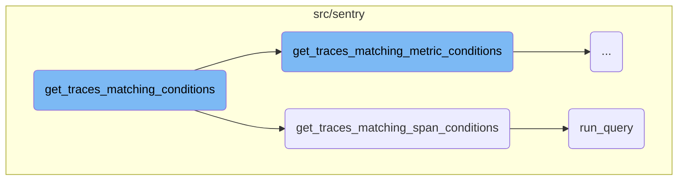
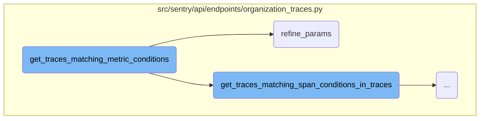

```mermaid
graph TD;
      subgraph src/sentry/api
f59ee77eba4bec02fbf85e491379b08643b77650d2e8bc67d47777a17b7efb74(get_traces_matching_span_conditions_in_traces):::mainFlowStyle --> d8fac1d7bfbb4e9e65dcd73832dd4018c7613d45d8b1afd52d47203ce0c78c32(get_traces_matching_span_conditions_query):::mainFlowStyle
end

subgraph src/sentry/api
d8fac1d7bfbb4e9e65dcd73832dd4018c7613d45d8b1afd52d47203ce0c78c32(get_traces_matching_span_conditions_query):::mainFlowStyle --> ba18c5554394177c4ba758ce8262e4486312fe1945d3a8c33084e911a1d88843(get):::mainFlowStyle
end

subgraph src/sentry/api
ba18c5554394177c4ba758ce8262e4486312fe1945d3a8c33084e911a1d88843(get):::mainFlowStyle --> 76555db3c36df80d8ce698d10ee1f95e79e25496e48ce2c0e3a19dce410f1dcd(handle_results_with_meta):::mainFlowStyle
end


      classDef mainFlowStyle color:#000000,fill:#7CB9F4
classDef rootsStyle color:#000000,fill:#00FFF4
classDef Style1 color:#000000,fill:#00FFAA
classDef Style2 color:#000000,fill:#FFFF00
classDef Style3 color:#000000,fill:#AA7CB9

%% Swimm:
%% graph TD;
%%       subgraph <SwmPath>[src/sentry/api/](src/sentry/api/)</SwmPath>
%% f59ee77eba4bec02fbf85e491379b08643b77650d2e8bc67d47777a17b7efb74(get_traces_matching_span_conditions_in_traces):::mainFlowStyle --> d8fac1d7bfbb4e9e65dcd73832dd4018c7613d45d8b1afd52d47203ce0c78c32(get_traces_matching_span_conditions_query):::mainFlowStyle
%% end
%% 
%% subgraph <SwmPath>[src/sentry/api/](src/sentry/api/)</SwmPath>
%% d8fac1d7bfbb4e9e65dcd73832dd4018c7613d45d8b1afd52d47203ce0c78c32(get_traces_matching_span_conditions_query):::mainFlowStyle --> ba18c5554394177c4ba758ce8262e4486312fe1945d3a8c33084e911a1d88843(get):::mainFlowStyle
%% end
%% 
%% subgraph <SwmPath>[src/sentry/api/](src/sentry/api/)</SwmPath>
%% ba18c5554394177c4ba758ce8262e4486312fe1945d3a8c33084e911a1d88843(get):::mainFlowStyle --> 76555db3c36df80d8ce698d10ee1f95e79e25496e48ce2c0e3a19dce410f1dcd(handle_results_with_meta):::mainFlowStyle
%% end
%% 
%% 
%%       classDef mainFlowStyle color:#000000,fill:#7CB9F4
%% classDef rootsStyle color:#000000,fill:#00FFF4
%% classDef Style1 color:#000000,fill:#00FFAA
%% classDef Style2 color:#000000,fill:#FFFF00
%% classDef Style3 color:#000000,fill:#AA7CB9
```

In this document, we will explain the process of fetching deploy data for a list of projects. The process involves executing a SQL query to retrieve the most recent deploys for each project and environment, and then processing the results into a dictionary format.

The flow starts by executing a SQL query to fetch the most recent deploys for each project and environment. The results are then processed and organized into a dictionary format, making it easy to access the deploy data for each project.

Here is a high level diagram of the flow, showing only the most important functions:

```mermaid
graph TD;
      subgraph src/sentry/api
817d10cc6792d94a2a9d90f506e2522404087fa188148c342b9bd6d47188cc36(get_deploys_by_project):::mainFlowStyle --> 1938ec8ed54d8d70157d96ff2f4bce170d3c52f6243334b6177e345b6a81bb39(execute):::mainFlowStyle
end

subgraph src/sentry/api
1938ec8ed54d8d70157d96ff2f4bce170d3c52f6243334b6177e345b6a81bb39(execute):::mainFlowStyle --> 3efcbc16abd0946e8b6c91ac6a89660ed1fe5265c062931dd99fc75600126b0e(_execute):::mainFlowStyle
end

subgraph src/sentry/api
3efcbc16abd0946e8b6c91ac6a89660ed1fe5265c062931dd99fc75600126b0e(_execute):::mainFlowStyle --> 0118137c1f91b17b6ac71cd9660b3974ee398845c92ac976d9e2c83b70213c23(process_final_results)
end

subgraph src/sentry/api
3efcbc16abd0946e8b6c91ac6a89660ed1fe5265c062931dd99fc75600126b0e(_execute):::mainFlowStyle --> 67d9f62d1fbfe2e5cea257f1839d2978f09d2ea9d21cf8776dedb6f7c3276713(get_all_queries)
end

subgraph src/sentry/api
3efcbc16abd0946e8b6c91ac6a89660ed1fe5265c062931dd99fc75600126b0e(_execute):::mainFlowStyle --> 631d3eac77106d64fc2b7debc667613ecc58da4d8fa33bb817d51bee12df2456(refine_params)
end

subgraph src/sentry/api
3efcbc16abd0946e8b6c91ac6a89660ed1fe5265c062931dd99fc75600126b0e(_execute):::mainFlowStyle --> cb7bf590eb4d9b91b43b9946d51d12df9cec74340c6fb4e23490bb068b6c5784(get_traces_matching_conditions):::mainFlowStyle
end

subgraph src/sentry/api
cb7bf590eb4d9b91b43b9946d51d12df9cec74340c6fb4e23490bb068b6c5784(get_traces_matching_conditions):::mainFlowStyle --> f5148fbd228fba83c5d9093b36b9f1c15fa984d4fb9b6d9a5a077e395ea6dd08(get_traces_matching_span_conditions)
end

subgraph src/sentry/api
cb7bf590eb4d9b91b43b9946d51d12df9cec74340c6fb4e23490bb068b6c5784(get_traces_matching_conditions):::mainFlowStyle --> 6cc28a424002d92046479ae1f49affe0a2eb238031cc67948be05b59a3e3c2cf(get_traces_matching_metric_conditions):::mainFlowStyle
end

subgraph src/sentry/api
6cc28a424002d92046479ae1f49affe0a2eb238031cc67948be05b59a3e3c2cf(get_traces_matching_metric_conditions):::mainFlowStyle --> 631d3eac77106d64fc2b7debc667613ecc58da4d8fa33bb817d51bee12df2456(refine_params)
end

subgraph src/sentry/api
6cc28a424002d92046479ae1f49affe0a2eb238031cc67948be05b59a3e3c2cf(get_traces_matching_metric_conditions):::mainFlowStyle --> f59ee77eba4bec02fbf85e491379b08643b77650d2e8bc67d47777a17b7efb74(get_traces_matching_span_conditions_in_traces):::mainFlowStyle
end

subgraph src/sentry/api
f59ee77eba4bec02fbf85e491379b08643b77650d2e8bc67d47777a17b7efb74(get_traces_matching_span_conditions_in_traces):::mainFlowStyle --> d8fac1d7bfbb4e9e65dcd73832dd4018c7613d45d8b1afd52d47203ce0c78c32(get_traces_matching_span_conditions_query):::mainFlowStyle
end

subgraph src/sentry/api
d8fac1d7bfbb4e9e65dcd73832dd4018c7613d45d8b1afd52d47203ce0c78c32(get_traces_matching_span_conditions_query):::mainFlowStyle --> ba18c5554394177c4ba758ce8262e4486312fe1945d3a8c33084e911a1d88843(get):::mainFlowStyle
end

subgraph src/sentry/api
ba18c5554394177c4ba758ce8262e4486312fe1945d3a8c33084e911a1d88843(get):::mainFlowStyle --> 76555db3c36df80d8ce698d10ee1f95e79e25496e48ce2c0e3a19dce410f1dcd(handle_results_with_meta):::mainFlowStyle
end


      classDef mainFlowStyle color:#000000,fill:#7CB9F4
classDef rootsStyle color:#000000,fill:#00FFF4
classDef Style1 color:#000000,fill:#00FFAA
classDef Style2 color:#000000,fill:#FFFF00
classDef Style3 color:#000000,fill:#AA7CB9

%% Swimm:
%% graph TD;
%%       subgraph <SwmPath>[src/sentry/api/](src/sentry/api/)</SwmPath>
%% 817d10cc6792d94a2a9d90f506e2522404087fa188148c342b9bd6d47188cc36(get_deploys_by_project):::mainFlowStyle --> 1938ec8ed54d8d70157d96ff2f4bce170d3c52f6243334b6177e345b6a81bb39(execute):::mainFlowStyle
%% end
%% 
%% subgraph <SwmPath>[src/sentry/api/](src/sentry/api/)</SwmPath>
%% 1938ec8ed54d8d70157d96ff2f4bce170d3c52f6243334b6177e345b6a81bb39(execute):::mainFlowStyle --> 3efcbc16abd0946e8b6c91ac6a89660ed1fe5265c062931dd99fc75600126b0e(_execute):::mainFlowStyle
%% end
%% 
%% subgraph <SwmPath>[src/sentry/api/](src/sentry/api/)</SwmPath>
%% 3efcbc16abd0946e8b6c91ac6a89660ed1fe5265c062931dd99fc75600126b0e(_execute):::mainFlowStyle --> 0118137c1f91b17b6ac71cd9660b3974ee398845c92ac976d9e2c83b70213c23(process_final_results)
%% end
%% 
%% subgraph <SwmPath>[src/sentry/api/](src/sentry/api/)</SwmPath>
%% 3efcbc16abd0946e8b6c91ac6a89660ed1fe5265c062931dd99fc75600126b0e(_execute):::mainFlowStyle --> 67d9f62d1fbfe2e5cea257f1839d2978f09d2ea9d21cf8776dedb6f7c3276713(get_all_queries)
%% end
%% 
%% subgraph <SwmPath>[src/sentry/api/](src/sentry/api/)</SwmPath>
%% 3efcbc16abd0946e8b6c91ac6a89660ed1fe5265c062931dd99fc75600126b0e(_execute):::mainFlowStyle --> 631d3eac77106d64fc2b7debc667613ecc58da4d8fa33bb817d51bee12df2456(refine_params)
%% end
%% 
%% subgraph <SwmPath>[src/sentry/api/](src/sentry/api/)</SwmPath>
%% 3efcbc16abd0946e8b6c91ac6a89660ed1fe5265c062931dd99fc75600126b0e(_execute):::mainFlowStyle --> cb7bf590eb4d9b91b43b9946d51d12df9cec74340c6fb4e23490bb068b6c5784(get_traces_matching_conditions):::mainFlowStyle
%% end
%% 
%% subgraph <SwmPath>[src/sentry/api/](src/sentry/api/)</SwmPath>
%% cb7bf590eb4d9b91b43b9946d51d12df9cec74340c6fb4e23490bb068b6c5784(get_traces_matching_conditions):::mainFlowStyle --> f5148fbd228fba83c5d9093b36b9f1c15fa984d4fb9b6d9a5a077e395ea6dd08(get_traces_matching_span_conditions)
%% end
%% 
%% subgraph <SwmPath>[src/sentry/api/](src/sentry/api/)</SwmPath>
%% cb7bf590eb4d9b91b43b9946d51d12df9cec74340c6fb4e23490bb068b6c5784(get_traces_matching_conditions):::mainFlowStyle --> 6cc28a424002d92046479ae1f49affe0a2eb238031cc67948be05b59a3e3c2cf(get_traces_matching_metric_conditions):::mainFlowStyle
%% end
%% 
%% subgraph <SwmPath>[src/sentry/api/](src/sentry/api/)</SwmPath>
%% 6cc28a424002d92046479ae1f49affe0a2eb238031cc67948be05b59a3e3c2cf(get_traces_matching_metric_conditions):::mainFlowStyle --> 631d3eac77106d64fc2b7debc667613ecc58da4d8fa33bb817d51bee12df2456(refine_params)
%% end
%% 
%% subgraph <SwmPath>[src/sentry/api/](src/sentry/api/)</SwmPath>
%% 6cc28a424002d92046479ae1f49affe0a2eb238031cc67948be05b59a3e3c2cf(get_traces_matching_metric_conditions):::mainFlowStyle --> f59ee77eba4bec02fbf85e491379b08643b77650d2e8bc67d47777a17b7efb74(get_traces_matching_span_conditions_in_traces):::mainFlowStyle
%% end
%% 
%% subgraph <SwmPath>[src/sentry/api/](src/sentry/api/)</SwmPath>
%% f59ee77eba4bec02fbf85e491379b08643b77650d2e8bc67d47777a17b7efb74(get_traces_matching_span_conditions_in_traces):::mainFlowStyle --> d8fac1d7bfbb4e9e65dcd73832dd4018c7613d45d8b1afd52d47203ce0c78c32(get_traces_matching_span_conditions_query):::mainFlowStyle
%% end
%% 
%% subgraph <SwmPath>[src/sentry/api/](src/sentry/api/)</SwmPath>
%% d8fac1d7bfbb4e9e65dcd73832dd4018c7613d45d8b1afd52d47203ce0c78c32(get_traces_matching_span_conditions_query):::mainFlowStyle --> ba18c5554394177c4ba758ce8262e4486312fe1945d3a8c33084e911a1d88843(get):::mainFlowStyle
%% end
%% 
%% subgraph <SwmPath>[src/sentry/api/](src/sentry/api/)</SwmPath>
%% ba18c5554394177c4ba758ce8262e4486312fe1945d3a8c33084e911a1d88843(get):::mainFlowStyle --> 76555db3c36df80d8ce698d10ee1f95e79e25496e48ce2c0e3a19dce410f1dcd(handle_results_with_meta):::mainFlowStyle
%% end
%% 
%% 
%%       classDef mainFlowStyle color:#000000,fill:#7CB9F4
%% classDef rootsStyle color:#000000,fill:#00FFF4
%% classDef Style1 color:#000000,fill:#00FFAA
%% classDef Style2 color:#000000,fill:#FFFF00
%% classDef Style3 color:#000000,fill:#AA7CB9
```



# Flow drill down

First, we'll zoom into this section of the flow:

```mermaid
graph TD;
      subgraph src/sentry/api
817d10cc6792d94a2a9d90f506e2522404087fa188148c342b9bd6d47188cc36(get_deploys_by_project):::mainFlowStyle --> 1938ec8ed54d8d70157d96ff2f4bce170d3c52f6243334b6177e345b6a81bb39(execute):::mainFlowStyle
end

subgraph src/sentry/api
1938ec8ed54d8d70157d96ff2f4bce170d3c52f6243334b6177e345b6a81bb39(execute):::mainFlowStyle --> 3efcbc16abd0946e8b6c91ac6a89660ed1fe5265c062931dd99fc75600126b0e(_execute):::mainFlowStyle
end

subgraph src/sentry/api
3efcbc16abd0946e8b6c91ac6a89660ed1fe5265c062931dd99fc75600126b0e(_execute):::mainFlowStyle --> 0118137c1f91b17b6ac71cd9660b3974ee398845c92ac976d9e2c83b70213c23(process_final_results)
end

subgraph src/sentry/api
3efcbc16abd0946e8b6c91ac6a89660ed1fe5265c062931dd99fc75600126b0e(_execute):::mainFlowStyle --> 67d9f62d1fbfe2e5cea257f1839d2978f09d2ea9d21cf8776dedb6f7c3276713(get_all_queries)
end

subgraph src/sentry/api
3efcbc16abd0946e8b6c91ac6a89660ed1fe5265c062931dd99fc75600126b0e(_execute):::mainFlowStyle --> 631d3eac77106d64fc2b7debc667613ecc58da4d8fa33bb817d51bee12df2456(refine_params)
end

subgraph src/sentry/api
3efcbc16abd0946e8b6c91ac6a89660ed1fe5265c062931dd99fc75600126b0e(_execute):::mainFlowStyle --> cb7bf590eb4d9b91b43b9946d51d12df9cec74340c6fb4e23490bb068b6c5784(get_traces_matching_conditions):::mainFlowStyle
end

subgraph src/sentry/api
cb7bf590eb4d9b91b43b9946d51d12df9cec74340c6fb4e23490bb068b6c5784(get_traces_matching_conditions):::mainFlowStyle --> a7tls(...)
end

subgraph src/sentry/api
67d9f62d1fbfe2e5cea257f1839d2978f09d2ea9d21cf8776dedb6f7c3276713(get_all_queries) --> 1210b0da90ed8a41abfe3c0d54ec897407e03d31a5934d18b0a10dfb5bb80157(get_traces_metas_query)
end

subgraph src/sentry/api
0118137c1f91b17b6ac71cd9660b3974ee398845c92ac976d9e2c83b70213c23(process_final_results) --> 3cd1b1a0e8a728db57f669bad3f106ec90842fca07422760267389e206165e0b(process_breakdowns)
end


      classDef mainFlowStyle color:#000000,fill:#7CB9F4
classDef rootsStyle color:#000000,fill:#00FFF4
classDef Style1 color:#000000,fill:#00FFAA
classDef Style2 color:#000000,fill:#FFFF00
classDef Style3 color:#000000,fill:#AA7CB9

%% Swimm:
%% graph TD;
%%       subgraph <SwmPath>[src/sentry/api/](src/sentry/api/)</SwmPath>
%% 817d10cc6792d94a2a9d90f506e2522404087fa188148c342b9bd6d47188cc36(get_deploys_by_project):::mainFlowStyle --> 1938ec8ed54d8d70157d96ff2f4bce170d3c52f6243334b6177e345b6a81bb39(execute):::mainFlowStyle
%% end
%% 
%% subgraph <SwmPath>[src/sentry/api/](src/sentry/api/)</SwmPath>
%% 1938ec8ed54d8d70157d96ff2f4bce170d3c52f6243334b6177e345b6a81bb39(execute):::mainFlowStyle --> 3efcbc16abd0946e8b6c91ac6a89660ed1fe5265c062931dd99fc75600126b0e(_execute):::mainFlowStyle
%% end
%% 
%% subgraph <SwmPath>[src/sentry/api/](src/sentry/api/)</SwmPath>
%% 3efcbc16abd0946e8b6c91ac6a89660ed1fe5265c062931dd99fc75600126b0e(_execute):::mainFlowStyle --> 0118137c1f91b17b6ac71cd9660b3974ee398845c92ac976d9e2c83b70213c23(process_final_results)
%% end
%% 
%% subgraph <SwmPath>[src/sentry/api/](src/sentry/api/)</SwmPath>
%% 3efcbc16abd0946e8b6c91ac6a89660ed1fe5265c062931dd99fc75600126b0e(_execute):::mainFlowStyle --> 67d9f62d1fbfe2e5cea257f1839d2978f09d2ea9d21cf8776dedb6f7c3276713(get_all_queries)
%% end
%% 
%% subgraph <SwmPath>[src/sentry/api/](src/sentry/api/)</SwmPath>
%% 3efcbc16abd0946e8b6c91ac6a89660ed1fe5265c062931dd99fc75600126b0e(_execute):::mainFlowStyle --> 631d3eac77106d64fc2b7debc667613ecc58da4d8fa33bb817d51bee12df2456(refine_params)
%% end
%% 
%% subgraph <SwmPath>[src/sentry/api/](src/sentry/api/)</SwmPath>
%% 3efcbc16abd0946e8b6c91ac6a89660ed1fe5265c062931dd99fc75600126b0e(_execute):::mainFlowStyle --> cb7bf590eb4d9b91b43b9946d51d12df9cec74340c6fb4e23490bb068b6c5784(get_traces_matching_conditions):::mainFlowStyle
%% end
%% 
%% subgraph <SwmPath>[src/sentry/api/](src/sentry/api/)</SwmPath>
%% cb7bf590eb4d9b91b43b9946d51d12df9cec74340c6fb4e23490bb068b6c5784(get_traces_matching_conditions):::mainFlowStyle --> a7tls(...)
%% end
%% 
%% subgraph <SwmPath>[src/sentry/api/](src/sentry/api/)</SwmPath>
%% 67d9f62d1fbfe2e5cea257f1839d2978f09d2ea9d21cf8776dedb6f7c3276713(get_all_queries) --> 1210b0da90ed8a41abfe3c0d54ec897407e03d31a5934d18b0a10dfb5bb80157(get_traces_metas_query)
%% end
%% 
%% subgraph <SwmPath>[src/sentry/api/](src/sentry/api/)</SwmPath>
%% 0118137c1f91b17b6ac71cd9660b3974ee398845c92ac976d9e2c83b70213c23(process_final_results) --> 3cd1b1a0e8a728db57f669bad3f106ec90842fca07422760267389e206165e0b(process_breakdowns)
%% end
%% 
%% 
%%       classDef mainFlowStyle color:#000000,fill:#7CB9F4
%% classDef rootsStyle color:#000000,fill:#00FFF4
%% classDef Style1 color:#000000,fill:#00FFAA
%% classDef Style2 color:#000000,fill:#FFFF00
%% classDef Style3 color:#000000,fill:#AA7CB9
```



<SwmSnippet path="/src/sentry/api/serializers/models/project.py" line="643">

---

## Fetching Deploy Data

The function <SwmToken path="src/sentry/api/serializers/models/project.py" pos="643:3:3" line-data="    def get_deploys_by_project(self, item_list):">`get_deploys_by_project`</SwmToken> fetches deploy data for a list of projects. It executes a SQL query to retrieve the most recent deploys for each project and environment, then processes the results into a dictionary format.

```python
    def get_deploys_by_project(self, item_list):
        cursor = connection.cursor()
        cursor.execute(
            """
            select srpe.project_id, se.name, sr.version, date_finished
            from (
                select *
                -- Finally, filter to the top row for each project/environment.
                from (
                    -- Next we join to deploys and rank based recency of latest deploy for each project/environment.
                    select srpe.project_id, srpe.release_id, srpe.environment_id, sd.date_finished,
                    row_number() OVER (partition by (srpe.project_id, srpe.environment_id) order by sd.date_finished desc) row_num
                    from
                    (
                        -- First we fetch all related ReleaseProjectEnvironments, then filter to the x most recent for
                        -- each project/environment that actually have a deploy. This cuts out a lot of data volume
                        select *
                        from (
                            select *, row_number() OVER (partition by (srpe.project_id, srpe.environment_id) order by srpe.id desc) row_num
                            from sentry_releaseprojectenvironment srpe
                            where srpe.last_deploy_id is not null
```

---

</SwmSnippet>

<SwmSnippet path="/src/sentry/api/endpoints/organization_traces.py" line="332">

---

## Executing the Main Logic

The function <SwmToken path="src/sentry/api/endpoints/organization_traces.py" pos="332:3:3" line-data="    def execute(self, offset: int, limit: int):">`execute`</SwmToken> calls the <SwmToken path="src/sentry/api/endpoints/organization_traces.py" pos="333:11:11" line-data="        return {&quot;data&quot;: self._execute()}">`_execute`</SwmToken> function to perform the main logic of fetching and processing trace data.

```python
    def execute(self, offset: int, limit: int):
        return {"data": self._execute()}
```

---

</SwmSnippet>

<SwmSnippet path="/src/sentry/api/endpoints/organization_traces.py" line="335">

---

### Main Execution Flow

The function <SwmToken path="src/sentry/api/endpoints/organization_traces.py" pos="335:3:3" line-data="    def _execute(self):">`_execute`</SwmToken> handles the main execution flow. It first fetches trace conditions, refines parameters, and then performs multiple queries to gather trace data. The results are processed and returned as a final dataset.

```python
    def _execute(self):
        with handle_span_query_errors():
            min_timestamp, max_timestamp, trace_ids = self.get_traces_matching_conditions(
                self.snuba_params,
            )

        self.refine_params(min_timestamp, max_timestamp)

        if not trace_ids:
            return []

        with handle_span_query_errors():
            snuba_params = self.params_with_all_projects()

            all_queries = self.get_all_queries(
                snuba_params,
                trace_ids,
            )

            all_raw_results = bulk_snuba_queries_with_referrers(
                [(query.get_snql_query(), referrer.value) for query, referrer in all_queries]
```

---

</SwmSnippet>

<SwmSnippet path="/src/sentry/api/endpoints/organization_traces.py" line="673">

---

### Processing Final Results

The function <SwmToken path="src/sentry/api/endpoints/organization_traces.py" pos="673:3:3" line-data="    def process_final_results(">`process_final_results`</SwmToken> processes the final results of the trace queries. It organizes trace data, handles errors, and formats the results into a list of trace information.

```python
    def process_final_results(
        self,
        *,
        traces_metas_results,
        traces_errors_results,
        traces_occurrences_results,
        traces_breakdown_projects_results,
    ) -> list[TraceResult]:
        traces_range = {
            row["trace"]: {
                "start": row["first_seen()"],
                "end": row["last_seen()"],
                "slices": self.breakdown_slices,
            }
            for row in traces_metas_results["data"]
        }

        spans = [span for span in traces_breakdown_projects_results["data"]]
        spans.sort(key=lambda span: (span["precise.start_ts"], span["precise.finish_ts"]))

        try:
```

---

</SwmSnippet>

<SwmSnippet path="/src/sentry/api/endpoints/organization_traces.py" line="641">

---

### Gathering All Queries

The function <SwmToken path="src/sentry/api/endpoints/organization_traces.py" pos="641:3:3" line-data="    def get_all_queries(">`get_all_queries`</SwmToken> gathers all necessary queries for fetching trace data. It combines multiple query builders to create a comprehensive set of queries needed for the trace analysis.

```python
    def get_all_queries(
        self,
        snuba_params: SnubaParams,
        trace_ids: list[str],
    ) -> list[tuple[BaseQueryBuilder, Referrer]]:
        traces_metas_query_with_referrer = self.get_traces_metas_query(
            snuba_params,
            trace_ids,
        )

        traces_errors_query_with_referrer = self.get_traces_errors_query(
            snuba_params,
            trace_ids,
        )

        traces_occurrences_query_with_referrer = self.get_traces_occurrences_query(
            snuba_params,
            trace_ids,
        )

        traces_breakdown_projects_query_with_referrer = self.get_traces_breakdown_projects_query(
```

---

</SwmSnippet>

<SwmSnippet path="/src/sentry/api/endpoints/organization_traces.py" line="389">

---

### Refining Parameters

The function <SwmToken path="src/sentry/api/endpoints/organization_traces.py" pos="389:3:3" line-data="    def refine_params(self, min_timestamp: datetime, max_timestamp: datetime):">`refine_params`</SwmToken> refines the query parameters by adjusting the time range based on the minimum and maximum timestamps of the traces.

```python
    def refine_params(self, min_timestamp: datetime, max_timestamp: datetime):
        """
        Once we have a min/max timestamp for all the traces in the query,
        refine the params so that it selects a time range that is as small as possible.
        """

        # TODO: move to use `update_snuba_params_with_timestamp`
        time_buffer = options.get("performance.traces.trace-explorer-buffer-hours")
        buffer = timedelta(hours=time_buffer)

        self.snuba_params.start = min_timestamp - buffer
        self.snuba_params.end = max_timestamp + buffer
```

---

</SwmSnippet>

<SwmSnippet path="/src/sentry/api/endpoints/organization_traces.py" line="793">

---

### Querying Trace Metadata

The function <SwmToken path="src/sentry/api/endpoints/organization_traces.py" pos="793:3:3" line-data="    def get_traces_metas_query(">`get_traces_metas_query`</SwmToken> constructs a query to fetch trace metadata. It includes conditions to match user queries and counts the number of matching spans.

```python
    def get_traces_metas_query(
        self,
        snuba_params: SnubaParams,
        trace_ids: list[str],
    ) -> tuple[BaseQueryBuilder, Referrer]:
        query = SpansIndexedQueryBuilder(
            Dataset.SpansIndexed,
            params={},
            snuba_params=snuba_params,
            query=None,
            selected_columns=[
                "trace",
                "count()",
                "first_seen()",
                "last_seen()",
            ],
            limit=len(trace_ids),
            config=QueryBuilderConfig(
                functions_acl=["first_seen", "last_seen"],
                transform_alias_to_input_format=True,
            ),
```

---

</SwmSnippet>

<SwmSnippet path="/src/sentry/api/endpoints/organization_traces.py" line="1250">

---

### Processing Breakdowns

The function <SwmToken path="src/sentry/api/endpoints/organization_traces.py" pos="1250:2:2" line-data="def process_breakdowns(data, traces_range):">`process_breakdowns`</SwmToken> processes the breakdowns of trace data. It handles merging intervals, pushing breakdowns, and managing stacks of trace intervals.

```python
def process_breakdowns(data, traces_range):
    breakdowns: Mapping[str, list[TraceInterval]] = {trace: [] for trace in traces_range}
    stacks: Mapping[str, list[TraceInterval]] = {trace: [] for trace in traces_range}

    def should_merge(interval_a, interval_b):
        return (
            # only merge intervals that have parent spans, i.e. those that aren't the trace root
            not interval_a["isRoot"]
            and not interval_b["isRoot"]
            # only merge intervals that overlap
            and interval_a["end"] >= interval_b["start"]
            # only merge intervals that are part of the same service
            and interval_a["project"] == interval_b["project"]
            and interval_a["sdkName"] == interval_b["sdkName"]
        )

    def breakdown_push(trace, interval):
        breakdown = breakdowns[trace]

        """ TODO: Add this back
        # Find the last interval. If there is an interval on the stack, it
```

---

</SwmSnippet>

Now, lets zoom into this section of the flow:



<SwmSnippet path="/src/sentry/api/endpoints/organization_traces.py" line="406">

---

## Handling Trace Conditions

The function <SwmToken path="src/sentry/api/endpoints/organization_traces.py" pos="337:13:13" line-data="            min_timestamp, max_timestamp, trace_ids = self.get_traces_matching_conditions(">`get_traces_matching_conditions`</SwmToken> determines whether to fetch traces based on metric conditions or span conditions. If <SwmToken path="src/sentry/api/endpoints/organization_traces.py" pos="406:3:5" line-data="        if self.mri is not None:">`self.mri`</SwmToken> is not `None`, it sets a tag and calls <SwmToken path="src/sentry/api/endpoints/organization_traces.py" pos="408:5:5" line-data="            return self.get_traces_matching_metric_conditions(snuba_params)">`get_traces_matching_metric_conditions`</SwmToken>. Otherwise, it calls <SwmToken path="src/sentry/api/endpoints/organization_traces.py" pos="410:5:5" line-data="        return self.get_traces_matching_span_conditions(snuba_params)">`get_traces_matching_span_conditions`</SwmToken>.

```python
        if self.mri is not None:
            sentry_sdk.set_tag("mri", self.mri)
            return self.get_traces_matching_metric_conditions(snuba_params)

        return self.get_traces_matching_span_conditions(snuba_params)
```

---

</SwmSnippet>

<SwmSnippet path="/src/sentry/api/endpoints/organization_traces.py" line="481">

---

## Fetching Traces Based on Span Conditions

The function <SwmToken path="src/sentry/api/endpoints/organization_traces.py" pos="410:5:5" line-data="        return self.get_traces_matching_span_conditions(snuba_params)">`get_traces_matching_span_conditions`</SwmToken> constructs a query to fetch traces that match specific span conditions. It processes the results to extract trace <SwmToken path="src/sentry/api/endpoints/organization_traces.py" pos="520:14:14" line-data="            &quot;performance.traces.trace-explorer-max-trace-ids-per-chunk&quot;">`ids`</SwmToken> and timestamps, updating the minimum and maximum timestamps as it iterates through the results. The function returns early if it has gathered enough results.

```python
        query, timestamp_column = self.get_traces_matching_span_conditions_query(
            snuba_params,
        )

        results = query.run_query(
            referrer=Referrer.API_TRACE_EXPLORER_SPANS_LIST.value,
        )
        results = query.process_results(results)

        matching_trace_ids: list[str] = []
        min_timestamp = self.snuba_params.end
        max_timestamp = self.snuba_params.start
        assert min_timestamp is not None
        assert max_timestamp is not None

        for row in results["data"]:
            matching_trace_ids.append(row["trace"])
            timestamp = datetime.fromisoformat(row[timestamp_column])
            min_timestamp = min(min_timestamp, timestamp)
            max_timestamp = max(max_timestamp, timestamp)

```

---

</SwmSnippet>

<SwmSnippet path="/src/sentry/snuba/metrics_layer/query.py" line="143">

---

### Executing the Query

The function <SwmToken path="src/sentry/snuba/metrics_layer/query.py" pos="143:2:2" line-data="def run_query(request: Request) -&gt; Mapping[str, Any]:">`run_query`</SwmToken> is the entry point for executing a metrics query in Snuba. It calls <SwmToken path="src/sentry/snuba/metrics_layer/query.py" pos="147:3:3" line-data="    return bulk_run_query([request])[0]">`bulk_run_query`</SwmToken> with the provided request and returns the first result.

```python
def run_query(request: Request) -> Mapping[str, Any]:
    """
    Entrypoint for executing a metrics query in Snuba.
    """
    return bulk_run_query([request])[0]
```

---

</SwmSnippet>

Now, lets zoom into this section of the flow:



<SwmSnippet path="/src/sentry/api/endpoints/organization_traces.py" line="447">

---

## Refining Parameters

The function <SwmToken path="src/sentry/api/endpoints/organization_traces.py" pos="447:3:3" line-data="        self.refine_params(min_timestamp, max_timestamp)">`refine_params`</SwmToken> is called to adjust the <SwmToken path="src/sentry/api/endpoints/organization_traces.py" pos="447:5:5" line-data="        self.refine_params(min_timestamp, max_timestamp)">`min_timestamp`</SwmToken> and <SwmToken path="src/sentry/api/endpoints/organization_traces.py" pos="447:8:8" line-data="        self.refine_params(min_timestamp, max_timestamp)">`max_timestamp`</SwmToken> based on the trace data retrieved. This step ensures that the time range is accurate for the subsequent operations.

```python
        self.refine_params(min_timestamp, max_timestamp)
```

---

</SwmSnippet>

<SwmSnippet path="/src/sentry/api/endpoints/organization_traces.py" line="453">

---

## Matching Span Conditions

If there are user queries, the function <SwmToken path="src/sentry/api/endpoints/organization_traces.py" pos="457:7:7" line-data="            ) = self.get_traces_matching_span_conditions_in_traces(snuba_params, trace_ids)">`get_traces_matching_span_conditions_in_traces`</SwmToken> is invoked to further filter the trace <SwmToken path="src/sentry/api/endpoints/organization_traces.py" pos="520:14:14" line-data="            &quot;performance.traces.trace-explorer-max-trace-ids-per-chunk&quot;">`ids`</SwmToken>. This step refines the trace <SwmToken path="src/sentry/api/endpoints/organization_traces.py" pos="520:14:14" line-data="            &quot;performance.traces.trace-explorer-max-trace-ids-per-chunk&quot;">`ids`</SwmToken> to include only those that match the user-defined conditions.

```python
            (
                min_timestamp,
                max_timestamp,
                trace_ids,
            ) = self.get_traces_matching_span_conditions_in_traces(snuba_params, trace_ids)
```

---

</SwmSnippet>

Now, lets zoom into this section of the flow:



<SwmSnippet path="/src/sentry/api/endpoints/organization_traces.py" line="519">

---

## Breaking Down Trace <SwmToken path="src/sentry/api/endpoints/organization_traces.py" pos="520:14:14" line-data="            &quot;performance.traces.trace-explorer-max-trace-ids-per-chunk&quot;">`ids`</SwmToken>

The function <SwmToken path="src/sentry/api/endpoints/organization_traces.py" pos="457:7:7" line-data="            ) = self.get_traces_matching_span_conditions_in_traces(snuba_params, trace_ids)">`get_traces_matching_span_conditions_in_traces`</SwmToken> starts by determining the maximum number of trace <SwmToken path="src/sentry/api/endpoints/organization_traces.py" pos="520:14:14" line-data="            &quot;performance.traces.trace-explorer-max-trace-ids-per-chunk&quot;">`ids`</SwmToken> per chunk and calculates the number of chunks needed. This is done to avoid hitting the max query size limit in <SwmToken path="src/sentry/api/endpoints/organization_traces.py" pos="578:9:9" line-data="            # if we let Clickhouse decide which order to return the results in.">`Clickhouse`</SwmToken>.

```python
        max_trace_ids_per_chunk = options.get(
            "performance.traces.trace-explorer-max-trace-ids-per-chunk"
        )
        num_chunks = math.ceil(len(trace_ids) / max_trace_ids_per_chunk)
        chunk_size = math.ceil(len(trace_ids) / num_chunks)
```

---

</SwmSnippet>

<SwmSnippet path="/src/sentry/api/endpoints/organization_traces.py" line="525">

---

## Querying Trace <SwmToken path="src/sentry/api/endpoints/organization_traces.py" pos="530:21:21" line-data="            # restrict the query to just this subset of trace ids">`ids`</SwmToken>

For each chunk of trace <SwmToken path="src/sentry/api/endpoints/organization_traces.py" pos="530:21:21" line-data="            # restrict the query to just this subset of trace ids">`ids`</SwmToken>, the function <SwmToken path="src/sentry/api/endpoints/organization_traces.py" pos="457:7:7" line-data="            ) = self.get_traces_matching_span_conditions_in_traces(snuba_params, trace_ids)">`get_traces_matching_span_conditions_in_traces`</SwmToken> calls <SwmToken path="src/sentry/api/endpoints/organization_traces.py" pos="526:10:10" line-data="            query, timestamp_column = self.get_traces_matching_span_conditions_query(">`get_traces_matching_span_conditions_query`</SwmToken> to build a query and adds conditions to restrict the query to the current chunk of trace <SwmToken path="src/sentry/api/endpoints/organization_traces.py" pos="530:21:21" line-data="            # restrict the query to just this subset of trace ids">`ids`</SwmToken>.

```python
        for chunk in chunked(trace_ids, chunk_size):
            query, timestamp_column = self.get_traces_matching_span_conditions_query(
                snuba_params,
            )

            # restrict the query to just this subset of trace ids
            query.add_conditions([Condition(Column("trace_id"), Op.IN, chunk)])

            all_queries.append(query)
```

---

</SwmSnippet>

<SwmSnippet path="/src/sentry/api/endpoints/organization_traces.py" line="537">

---

## Processing Results

The function <SwmToken path="src/sentry/api/endpoints/organization_traces.py" pos="457:7:7" line-data="            ) = self.get_traces_matching_span_conditions_in_traces(snuba_params, trace_ids)">`get_traces_matching_span_conditions_in_traces`</SwmToken> then executes the queries in bulk and processes the results to extract matching trace <SwmToken path="src/sentry/api/endpoints/organization_traces.py" pos="520:14:14" line-data="            &quot;performance.traces.trace-explorer-max-trace-ids-per-chunk&quot;">`ids`</SwmToken> and their timestamps. It keeps track of the minimum and maximum timestamps and returns them along with the matching trace <SwmToken path="src/sentry/api/endpoints/organization_traces.py" pos="520:14:14" line-data="            &quot;performance.traces.trace-explorer-max-trace-ids-per-chunk&quot;">`ids`</SwmToken>.

```python
        all_raw_results = bulk_snuba_queries(
            [query.get_snql_query() for query in all_queries],
            Referrer.API_TRACE_EXPLORER_SPANS_LIST.value,
        )
        all_results = [
            query.process_results(result) for query, result in zip(all_queries, all_raw_results)
        ]

        matching_trace_ids: list[str] = []
        min_timestamp = self.snuba_params.end
        max_timestamp = self.snuba_params.start
        assert min_timestamp is not None
        assert max_timestamp is not None

        for trace_results in all_results:
            for row in trace_results["data"]:
                matching_trace_ids.append(row["trace"])
                timestamp = datetime.fromisoformat(row[timestamp_column])
                min_timestamp = min(min_timestamp, timestamp)
                max_timestamp = max(max_timestamp, timestamp)

```

---

</SwmSnippet>

<SwmSnippet path="/src/sentry/api/endpoints/organization_traces.py" line="564">

---

## Building the Query

The function <SwmToken path="src/sentry/api/endpoints/organization_traces.py" pos="564:3:3" line-data="    def get_traces_matching_span_conditions_query(">`get_traces_matching_span_conditions_query`</SwmToken> constructs the query based on the provided <SwmToken path="src/sentry/api/endpoints/organization_traces.py" pos="566:1:1" line-data="        snuba_params: SnubaParams,">`snuba_params`</SwmToken> and user queries. It optimizes the query based on the number of user queries and adds necessary conditions to match the trace <SwmToken path="src/sentry/api/endpoints/organization_traces.py" pos="520:14:14" line-data="            &quot;performance.traces.trace-explorer-max-trace-ids-per-chunk&quot;">`ids`</SwmToken>.

```python
    def get_traces_matching_span_conditions_query(
        self,
        snuba_params: SnubaParams,
        sort: str | None = None,
    ) -> tuple[BaseQueryBuilder, str]:
        if len(self.user_queries) < 2:
            timestamp_column = "timestamp"
        else:
            timestamp_column = "min(timestamp)"

        if sort == "-timestamp":
            orderby = [f"-{timestamp_column}"]
        else:
            # The orderby is intentionally `None` here as this query is much faster
            # if we let Clickhouse decide which order to return the results in.
            # This also means we cannot order by any columns or paginate.
            orderby = None

        if len(self.user_queries) < 2:
            # Optimization: If there is only a condition for a single span,
            # we can take the fast path and query without using aggregates.
```

---

</SwmSnippet>

<SwmSnippet path="/src/sentry/api/endpoints/organization_traces.py" line="116">

---

## Handling the Request

The function <SwmToken path="src/sentry/api/endpoints/organization_traces.py" pos="116:3:3" line-data="    def get(self, request: Request, organization: Organization) -&gt; Response:">`get`</SwmToken> handles the incoming request, checks feature flags, and prepares the necessary parameters. It then uses <SwmToken path="src/sentry/api/endpoints/organization_traces.py" pos="132:5:5" line-data="        executor = TracesExecutor(">`TracesExecutor`</SwmToken> to execute the query and paginates the results, passing them to <SwmToken path="src/sentry/api/bases/organization_events.py" pos="290:3:3" line-data="    def handle_results_with_meta(">`handle_results_with_meta`</SwmToken> for final processing.

```python
    def get(self, request: Request, organization: Organization) -> Response:
        if not features.has(
            "organizations:performance-trace-explorer", organization, actor=request.user
        ):
            return Response(status=404)

        try:
            snuba_params = self.get_snuba_params(request, organization)
        except NoProjects:
            return Response(status=404)

        serializer = OrganizationTracesSerializer(data=request.GET)
        if not serializer.is_valid():
            return Response(serializer.errors, status=400)
        serialized = serializer.validated_data

        executor = TracesExecutor(
            snuba_params=snuba_params,
            user_queries=serialized.get("query", []),
            metrics_max=serialized.get("metricsMax"),
            metrics_min=serialized.get("metricsMin"),
```

---

</SwmSnippet>

<SwmSnippet path="/src/sentry/api/bases/organization_events.py" line="290">

---

## Final Processing of Results

The function <SwmToken path="src/sentry/api/bases/organization_events.py" pos="290:3:3" line-data="    def handle_results_with_meta(">`handle_results_with_meta`</SwmToken> processes the final results, extracting metadata and handling any additional data transformations. It ensures the results are in the correct format before returning them.

```python
    def handle_results_with_meta(
        self,
        request: Request,
        organization: Organization,
        project_ids: Sequence[int],
        results: dict[str, Any],
        standard_meta: bool | None = False,
        dataset: Any | None = None,
    ) -> dict[str, Any]:
        with sentry_sdk.start_span(op="discover.endpoint", description="base.handle_results"):
            data = self.handle_data(request, organization, project_ids, results.get("data"))
            meta = results.get("meta", {})
            fields_meta = meta.get("fields", {})

            if standard_meta:
                isMetricsData = meta.pop("isMetricsData", False)
                isMetricsExtractedData = meta.pop("isMetricsExtractedData", False)
                discoverSplitDecision = meta.pop("discoverSplitDecision", None)
                fields, units = self.handle_unit_meta(fields_meta)
                meta = {
                    "fields": fields,
```

---

</SwmSnippet>

&nbsp;

*This is an auto-generated document by Swimm AI 🌊 and has not yet been verified by a human*

<SwmMeta version="3.0.0" repo-id="Z2l0aHViJTNBJTNBc2VudHJ5LWRlbW8tMSUzQSUzQVN3aW1tLURlbW8=" repo-name="sentry-demo-1" doc-type="flows"><sup>Powered by [Swimm](/)</sup></SwmMeta>
