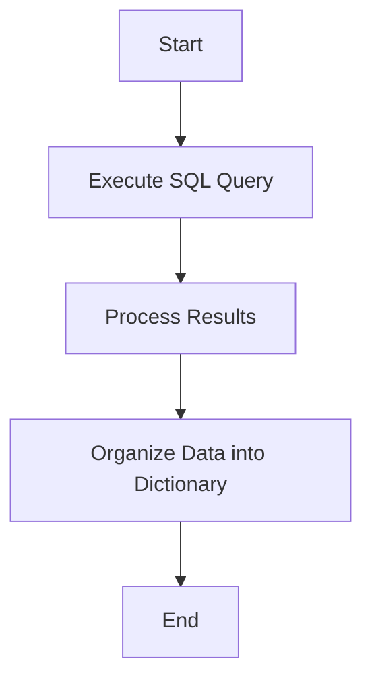

This document will cover the process of fetching deploy data for a list of projects. We'll cover:

1. Executing the SQL query
2. Processing the results
3. Organizing the data into a dictionary format.

Technical document: <SwmLink doc-title="Fetching Deploy Data Flow">[Fetching Deploy Data Flow](/.swm/fetching-deploy-data-flow.s7k3kuai.sw.md)</SwmLink>

# [Executing the SQL Query](https://app.swimm.io/repos/Z2l0aHViJTNBJTNBc2VudHJ5LWRlbW8tMSUzQSUzQVN3aW1tLURlbW8=/docs/s7k3kuai#executing-the-sql-query)

The process begins by executing a SQL query to fetch the most recent deploys for each project and environment. This step is crucial as it retrieves the necessary data that will be processed and organized in subsequent steps. The query is designed to filter and rank the deploys based on their recency, ensuring that only the latest deploys are considered.

# [Processing the Results](https://app.swimm.io/repos/Z2l0aHViJTNBJTNBc2VudHJ5LWRlbW8tMSUzQSUzQVN3aW1tLURlbW8=/docs/s7k3kuai#processing-the-results)

Once the SQL query is executed, the results are processed. This involves organizing the raw data into a structured format that can be easily manipulated. The processing step ensures that the data is clean and ready for further operations. It involves filtering out unnecessary information and focusing on the relevant deploy data for each project.

# [Organizing the Data into a Dictionary Format](https://app.swimm.io/repos/Z2l0aHViJTNBJTNBc2VudHJ5LWRlbW8tMSUzQSUzQVN3aW1tLURlbW8=/docs/s7k3kuai#organizing-the-data-into-a-dictionary-format)

The final step is to organize the processed data into a dictionary format. This format allows for easy access and manipulation of the deploy data for each project. By structuring the data in a dictionary, we ensure that it is organized in a way that is both efficient and user-friendly. This step is essential for enabling quick retrieval and display of deploy information in the application.

&nbsp;

*This is an auto-generated document by Swimm AI 🌊 and has not yet been verified by a human*

<SwmMeta version="3.0.0" repo-id="Z2l0aHViJTNBJTNBc2VudHJ5LWRlbW8tMSUzQSUzQVN3aW1tLURlbW8=" repo-name="sentry-demo-1" doc-type="product-flows">Powered by [Swimm](/)</SwmMeta>
