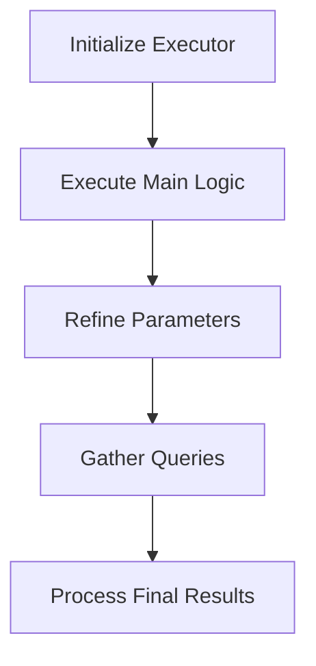

This document will cover the process of fetching event statistics, which includes:

1. Initializing the executor
2. Executing the main logic
3. Refining parameters
4. Gathering queries
5. Processing the final results.

Technical document: <SwmLink doc-title="Fetching Event Statistics Flow">[Fetching Event Statistics Flow](/.swm/fetching-event-statistics-flow.cqif79ai.sw.md)</SwmLink>

# [Initializing the Executor](https://app.swimm.io/repos/Z2l0aHViJTNBJTNBc2VudHJ5LWRlbW8tMSUzQSUzQVN3aW1tLURlbW8=/docs/cqif79ai#fetching-event-statistics)

The process begins by initializing an executor with the necessary parameters. This executor is responsible for managing the entire flow of fetching event statistics. The parameters include details such as the columns to be fetched, the query to be executed, and other configurations. This step ensures that all the necessary information is available for the subsequent steps.

# [Executing the Main Logic](https://app.swimm.io/repos/Z2l0aHViJTNBJTNBc2VudHJ5LWRlbW8tMSUzQSUzQVN3aW1tLURlbW8=/docs/cqif79ai#executing-the-trace-statistics)

Once the executor is initialized, it executes the main logic to fetch and process trace data. This involves several sub-steps, including retrieving trace IDs that match certain conditions, refining the parameters to ensure accuracy, and performing multiple queries to gather all necessary trace data. The main logic is crucial for ensuring that the data fetched is accurate and relevant.

# [Refining Parameters](https://app.swimm.io/repos/Z2l0aHViJTNBJTNBc2VudHJ5LWRlbW8tMSUzQSUzQVN3aW1tLURlbW8=/docs/cqif79ai#refining-parameters)

After retrieving the initial set of trace data, the parameters are refined to ensure they are as precise as possible. This involves adjusting the time range parameters based on the minimum and maximum timestamps of the traces. By refining the parameters, we ensure that the data fetched is within the correct time frame, which improves the accuracy of the event statistics.

# [Gathering Queries](https://app.swimm.io/repos/Z2l0aHViJTNBJTNBc2VudHJ5LWRlbW8tMSUzQSUzQVN3aW1tLURlbW8=/docs/cqif79ai#gathering-all-queries)

In this step, a list of queries is constructed to fetch different aspects of trace data, such as metadata, errors, occurrences, and breakdowns. Each query is designed to gather specific information that contributes to the overall event statistics. By gathering all necessary queries, we ensure that we have a comprehensive set of data to work with.

# [Processing the Final Results](https://app.swimm.io/repos/Z2l0aHViJTNBJTNBc2VudHJ5LWRlbW8tMSUzQSUzQVN3aW1tLURlbW8=/docs/cqif79ai#processing-final-results)

The final step involves processing the raw results from various queries to produce a list of `TraceResult` objects. This includes organizing the trace data, calculating errors and occurrences, and determining the primary and fallback names for each trace. Processing the final results ensures that the data is presented in a meaningful and useful way for end-users.

&nbsp;

*This is an auto-generated document by Swimm AI 🌊 and has not yet been verified by a human*

<SwmMeta version="3.0.0" repo-id="Z2l0aHViJTNBJTNBc2VudHJ5LWRlbW8tMSUzQSUzQVN3aW1tLURlbW8=" repo-name="sentry-demo-1" doc-type="product-flows">Powered by [Swimm](/)</SwmMeta>
