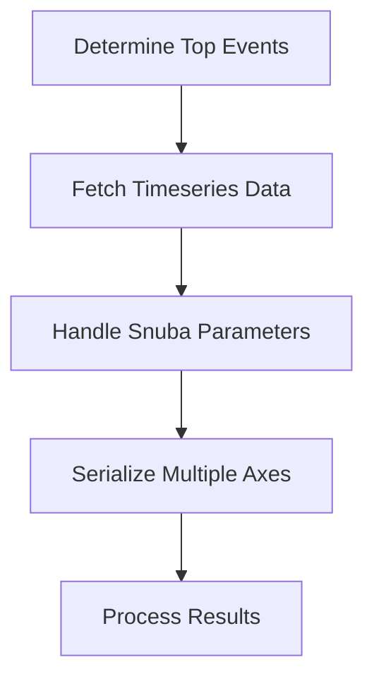

This document will cover the process of fetching event statistics metrics, which includes:

1. Determining the top events
2. Fetching timeseries data
3. Handling Snuba parameters
4. Serializing multiple axes
5. Processing the results.

Technical document: <SwmLink doc-title="Fetching Event Statistics Metrics">[Fetching Event Statistics Metrics](/.swm/fetching-event-statistics-metrics.vt457eaq.sw.md)</SwmLink>

# [Determining the Top Events](https://app.swimm.io/repos/Z2l0aHViJTNBJTNBc2VudHJ5LWRlbW8tMSUzQSUzQVN3aW1tLURlbW8=/docs/vt457eaq#fetching-top-events)

The process begins by determining the top events to fetch based on user queries. This involves setting a limit for the number of top events and retrieving the transactions with the highest event counts. If no top events are found, the process returns an empty result. This step ensures that only the most relevant events are considered for further analysis, which helps in focusing on the most significant data points for the user.

# [Fetching Timeseries Data](https://app.swimm.io/repos/Z2l0aHViJTNBJTNBc2VudHJ5LWRlbW8tMSUzQSUzQVN3aW1tLURlbW8=/docs/vt457eaq#fetching-timeseries-data)

Once the top events are identified, the next step is to fetch the timeseries data for each of these events. This involves querying the data over a specified time period to understand how these events have evolved. This step is crucial for providing users with a temporal view of the event statistics, allowing them to identify trends and patterns over time.

# [Handling Snuba Parameters](https://app.swimm.io/repos/Z2l0aHViJTNBJTNBc2VudHJ5LWRlbW8tMSUzQSUzQVN3aW1tLURlbW8=/docs/vt457eaq#handling-snuba-parameters)

Handling Snuba parameters involves constructing the necessary parameters to make Snuba queries. This includes filtering parameters, quantizing date parameters if necessary, and ensuring the user has the appropriate permissions to view events from multiple projects. This step ensures that the data fetched is accurate and relevant to the user's query, providing a tailored and precise dataset for analysis.

# [Serializing Multiple Axes](https://app.swimm.io/repos/Z2l0aHViJTNBJTNBc2VudHJ5LWRlbW8tMSUzQSUzQVN3aW1tLURlbW8=/docs/vt457eaq#serializing-multiple-axes)

Serializing multiple axes involves structuring the event results for multi-axis representation. This step ensures that the data is organized in a way that supports complex visualizations, such as graphs with multiple data series. By handling multiple axes, users can compare different metrics side by side, gaining deeper insights into the event statistics.

# [Processing the Results](https://app.swimm.io/repos/Z2l0aHViJTNBJTNBc2VudHJ5LWRlbW8tMSUzQSUzQVN3aW1tLURlbW8=/docs/vt457eaq#handling-results-with-metadata)

Processing the results involves attaching metadata to the fetched data, making it more readable and meaningful. This includes adding fields, units, and other relevant information. The results are then processed to handle specific fields like transaction status and issue IDs, ensuring that the data is in a consistent format. This step enriches the data with necessary context, providing users with a comprehensive view of the event statistics.

&nbsp;

*This is an auto-generated document by Swimm AI 🌊 and has not yet been verified by a human*

<SwmMeta version="3.0.0" repo-id="Z2l0aHViJTNBJTNBc2VudHJ5LWRlbW8tMSUzQSUzQVN3aW1tLURlbW8=" repo-name="sentry-demo-1" doc-type="product-flows">Powered by [Swimm](/)</SwmMeta>
