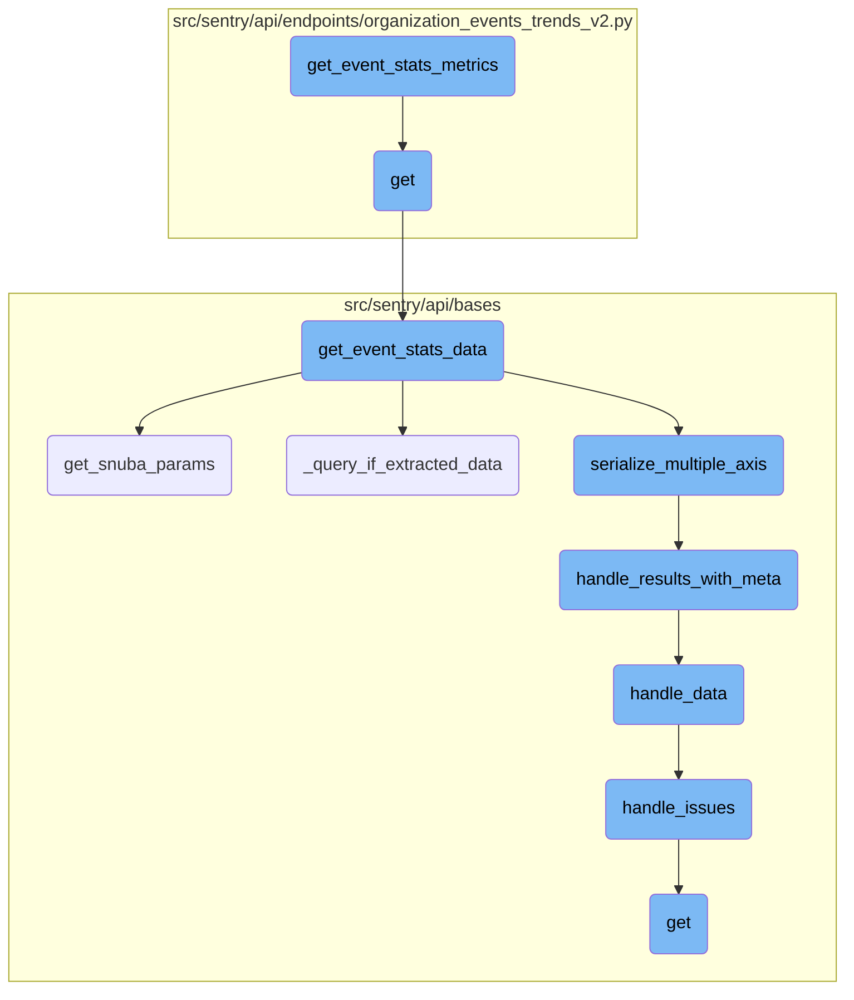

This document explains the process of fetching event statistics metrics. It involves determining the top events, fetching timeseries data, handling Snuba parameters, serializing multiple axes, and processing the results.

The flow starts by determining the top events to fetch based on user queries. If top events are found, it proceeds to fetch the timeseries data for each event. The Snuba parameters are then handled to ensure the correct data is fetched. The results are serialized for multiple axes and processed to include necessary metadata and context, making the data more readable and meaningful.

Here is a high level diagram of the flow, showing only the most important functions:



# Flow drill down

First, we'll zoom into this section of the flow:

```mermaid
graph TD;
      subgraph src/sentry/api
123a4e1114a10979ac9802100867bb8b516331555b563bdcb551d0a7c4839b4d(get_event_stats_metrics):::mainFlowStyle --> b245e962791f363f0b697a74e8bc080509f97e80b49986017b6f00c2c7fe19a2(get):::mainFlowStyle
end

subgraph src/sentry/api
b245e962791f363f0b697a74e8bc080509f97e80b49986017b6f00c2c7fe19a2(get):::mainFlowStyle --> 9a7c498c62bb10bd14cfa8e6b88481cb1758fe0fe619fac236b1dfc4f2bc9964(get_event_stats_data):::mainFlowStyle
end

subgraph src/sentry/api
9a7c498c62bb10bd14cfa8e6b88481cb1758fe0fe619fac236b1dfc4f2bc9964(get_event_stats_data):::mainFlowStyle --> a4f25188cdb1c709695d3a93e7176ddb7bd151b9a322e0836404ad0986b5f514(get_snuba_params)
end

subgraph src/sentry/api
9a7c498c62bb10bd14cfa8e6b88481cb1758fe0fe619fac236b1dfc4f2bc9964(get_event_stats_data):::mainFlowStyle --> f489dd81de3f451f7efd0d604d803743d59619f6f2cfbc21f07a08781c356525(_query_if_extracted_data)
end

subgraph src/sentry/api
9a7c498c62bb10bd14cfa8e6b88481cb1758fe0fe619fac236b1dfc4f2bc9964(get_event_stats_data):::mainFlowStyle --> 6bfd0761a315100cfb455cd63eee604e1d6ebf8e2957d5881bc086457f48801e(serialize_multiple_axis):::mainFlowStyle
end

subgraph src/sentry/api
6bfd0761a315100cfb455cd63eee604e1d6ebf8e2957d5881bc086457f48801e(serialize_multiple_axis):::mainFlowStyle --> nl5k8(...)
end

subgraph src/sentry/api
a4f25188cdb1c709695d3a93e7176ddb7bd151b9a322e0836404ad0986b5f514(get_snuba_params) --> 35216d96e8e183a6c5aebaf4c02e330cd6fb11887db7d8c6eb4d27b869ed6c57(quantize_date_params)
end


      classDef mainFlowStyle color:#000000,fill:#7CB9F4
classDef rootsStyle color:#000000,fill:#00FFF4
classDef Style1 color:#000000,fill:#00FFAA
classDef Style2 color:#000000,fill:#FFFF00
classDef Style3 color:#000000,fill:#AA7CB9

%% Swimm:
%% graph TD;
%%       subgraph <SwmPath>[src/sentry/api/](src/sentry/api/)</SwmPath>
%% 123a4e1114a10979ac9802100867bb8b516331555b563bdcb551d0a7c4839b4d(get_event_stats_metrics):::mainFlowStyle --> b245e962791f363f0b697a74e8bc080509f97e80b49986017b6f00c2c7fe19a2(get):::mainFlowStyle
%% end
%% 
%% subgraph <SwmPath>[src/sentry/api/](src/sentry/api/)</SwmPath>
%% b245e962791f363f0b697a74e8bc080509f97e80b49986017b6f00c2c7fe19a2(get):::mainFlowStyle --> 9a7c498c62bb10bd14cfa8e6b88481cb1758fe0fe619fac236b1dfc4f2bc9964(get_event_stats_data):::mainFlowStyle
%% end
%% 
%% subgraph <SwmPath>[src/sentry/api/](src/sentry/api/)</SwmPath>
%% 9a7c498c62bb10bd14cfa8e6b88481cb1758fe0fe619fac236b1dfc4f2bc9964(get_event_stats_data):::mainFlowStyle --> a4f25188cdb1c709695d3a93e7176ddb7bd151b9a322e0836404ad0986b5f514(get_snuba_params)
%% end
%% 
%% subgraph <SwmPath>[src/sentry/api/](src/sentry/api/)</SwmPath>
%% 9a7c498c62bb10bd14cfa8e6b88481cb1758fe0fe619fac236b1dfc4f2bc9964(get_event_stats_data):::mainFlowStyle --> f489dd81de3f451f7efd0d604d803743d59619f6f2cfbc21f07a08781c356525(_query_if_extracted_data)
%% end
%% 
%% subgraph <SwmPath>[src/sentry/api/](src/sentry/api/)</SwmPath>
%% 9a7c498c62bb10bd14cfa8e6b88481cb1758fe0fe619fac236b1dfc4f2bc9964(get_event_stats_data):::mainFlowStyle --> 6bfd0761a315100cfb455cd63eee604e1d6ebf8e2957d5881bc086457f48801e(serialize_multiple_axis):::mainFlowStyle
%% end
%% 
%% subgraph <SwmPath>[src/sentry/api/](src/sentry/api/)</SwmPath>
%% 6bfd0761a315100cfb455cd63eee604e1d6ebf8e2957d5881bc086457f48801e(serialize_multiple_axis):::mainFlowStyle --> nl5k8(...)
%% end
%% 
%% subgraph <SwmPath>[src/sentry/api/](src/sentry/api/)</SwmPath>
%% a4f25188cdb1c709695d3a93e7176ddb7bd151b9a322e0836404ad0986b5f514(get_snuba_params) --> 35216d96e8e183a6c5aebaf4c02e330cd6fb11887db7d8c6eb4d27b869ed6c57(quantize_date_params)
%% end
%% 
%% 
%%       classDef mainFlowStyle color:#000000,fill:#7CB9F4
%% classDef rootsStyle color:#000000,fill:#00FFF4
%% classDef Style1 color:#000000,fill:#00FFAA
%% classDef Style2 color:#000000,fill:#FFFF00
%% classDef Style3 color:#000000,fill:#AA7CB9
```



<SwmSnippet path="/src/sentry/api/endpoints/organization_events_trends_v2.py" line="228">

---

## Fetching Top Events

The function <SwmToken path="src/sentry/api/endpoints/organization_events_trends_v2.py" pos="228:3:3" line-data="        def get_event_stats_metrics(_, user_query, snuba_params, rollup, zerofill_results, __):">`get_event_stats_metrics`</SwmToken> begins by determining the limit for the top events to fetch. It then calls <SwmToken path="src/sentry/api/endpoints/organization_events_trends_v2.py" pos="235:5:5" line-data="            top_trending_transactions = get_top_events(">`get_top_events`</SwmToken> to retrieve the transactions with the highest event counts based on the user query and Snuba parameters. If no top events are found, it returns an empty dictionary.

```python
        def get_event_stats_metrics(_, user_query, snuba_params, rollup, zerofill_results, __):
            top_event_limit = min(
                int(request.GET.get("topEvents", DEFAULT_TOP_EVENTS_LIMIT)),
                MAX_TOP_EVENTS_LIMIT,
            )

            # Fetch transactions names with the highest event count
            top_trending_transactions = get_top_events(
                user_query=user_query,
                snuba_params=snuba_params,
                event_limit=top_event_limit,
                referrer=Referrer.API_TRENDS_GET_EVENT_STATS_V2_TOP_EVENTS.value,
            )

            sentry_sdk.set_tag(
                "performance.trendsv2.top_events",
                top_trending_transactions.get("data", None) is not None,
            )
            if len(top_trending_transactions.get("data", [])) == 0:
                return {}
```

---

</SwmSnippet>

<SwmSnippet path="/src/sentry/api/endpoints/organization_events_trends_v2.py" line="249">

---

## Fetching Timeseries Data

If top events are found, <SwmToken path="src/sentry/api/endpoints/organization_events_trends_v2.py" pos="228:3:3" line-data="        def get_event_stats_metrics(_, user_query, snuba_params, rollup, zerofill_results, __):">`get_event_stats_metrics`</SwmToken> proceeds to fetch the timeseries data for each top transaction name by calling <SwmToken path="src/sentry/api/endpoints/organization_events_trends_v2.py" pos="250:3:3" line-data="            return get_timeseries(top_trending_transactions, snuba_params, rollup, zerofill_results)">`get_timeseries`</SwmToken>.

```python
            # Fetch timeseries for each top transaction name
            return get_timeseries(top_trending_transactions, snuba_params, rollup, zerofill_results)
```

---

</SwmSnippet>

<SwmSnippet path="/src/sentry/api/bases/organization_events.py" line="91">

---

## Handling Snuba Parameters

The function <SwmToken path="src/sentry/api/bases/organization_events.py" pos="91:3:3" line-data="    def get_snuba_params(">`get_snuba_params`</SwmToken> constructs the parameters required to make Snuba queries. It includes filtering parameters, quantizing date parameters if necessary, and ensuring the user has the appropriate permissions to view events from multiple projects.

```python
    def get_snuba_params(
        self,
        request: Request,
        organization: Organization,
        check_global_views: bool = True,
        quantize_date_params: bool = True,
    ) -> SnubaParams:
        """Returns params to make snuba queries with"""
        with sentry_sdk.start_span(op="discover.endpoint", description="filter_params(dataclass)"):
            if (
                len(self.get_field_list(organization, request))
                + len(self.get_equation_list(organization, request))
                > MAX_FIELDS
            ):
                raise ParseError(
                    detail=f"You can view up to {MAX_FIELDS} fields at a time. Please delete some and try again."
                )

            filter_params: dict[str, Any] = self.get_filter_params(request, organization)
            if quantize_date_params:
                filter_params = self.quantize_date_params(request, filter_params)
```

---

</SwmSnippet>

<SwmSnippet path="/src/sentry/api/bases/organization_events.py" line="388">

---

## Serializing Multiple Axes

The function <SwmToken path="src/sentry/api/bases/organization_events.py" pos="388:3:3" line-data="    def get_event_stats_data(">`get_event_stats_data`</SwmToken> handles the main logic for fetching and serializing event statistics data. It constructs the query columns, determines the rollup interval, and calls <SwmToken path="src/sentry/api/bases/organization_events.py" pos="392:1:1" line-data="        get_event_stats: Callable[">`get_event_stats`</SwmToken> to fetch the data. It then serializes the results, handling multiple axes if necessary, and includes metadata in the response.

```python
    def get_event_stats_data(
        self,
        request: Request,
        organization: Organization,
        get_event_stats: Callable[
            [Sequence[str], str, SnubaParams, int, bool, timedelta | None], SnubaTSResult
        ],
        top_events: int = 0,
        query_column: str = "count()",
        snuba_params: SnubaParams | None = None,
        query: str | None = None,
        allow_partial_buckets: bool = False,
        zerofill_results: bool = True,
        comparison_delta: timedelta | None = None,
        additional_query_column: str | None = None,
        dataset: Any | None = None,
    ) -> dict[str, Any]:
        with handle_query_errors():
            with sentry_sdk.start_span(
                op="discover.endpoint", description="base.stats_query_creation"
            ):
```

---

</SwmSnippet>

<SwmSnippet path="/src/sentry/api/bases/organization_events.py" line="551">

---

### Checking for Extracted Data

The function <SwmToken path="src/sentry/api/bases/organization_events.py" pos="551:3:3" line-data="    def _query_if_extracted_data(">`_query_if_extracted_data`</SwmToken> checks if any of the query columns require extracted data by examining the metadata in the results.

```python
    def _query_if_extracted_data(
        self, results: dict[str, Any], key: str, query_columns: list[str]
    ) -> bool:
        ret_value = False
        try:
            for c in query_columns:
                # At least one of the columns has required extracted data
                if results[key][c].get("meta", {}).get("isMetricsExtractedData"):
                    ret_value = True
                    break
        except Exception as error:
            sentry_sdk.capture_exception(error)

        return ret_value
```

---

</SwmSnippet>

<SwmSnippet path="/src/sentry/api/bases/organization_events.py" line="143">

---

### Quantizing Date Parameters

The function <SwmToken path="src/sentry/api/bases/organization_events.py" pos="143:3:3" line-data="    def quantize_date_params(self, request: Request, params: dict[str, Any]) -&gt; dict[str, Any]:">`quantize_date_params`</SwmToken> adjusts the start and end dates to align with specific intervals, which helps in optimizing the Snuba queries. This is particularly useful for longer durations where rounding to the nearest minute or 15 minutes can improve performance.

```python
    def quantize_date_params(self, request: Request, params: dict[str, Any]) -> dict[str, Any]:
        # We only need to perform this rounding on relative date periods
        if "statsPeriod" not in request.GET:
            return params
        results = params.copy()
        duration = (params["end"] - params["start"]).total_seconds()
        # Only perform rounding on durations longer than an hour
        if duration > 3600:
            # Round to 15 minutes if over 30 days, otherwise round to the minute
            round_to = 15 * 60 if duration >= 30 * 24 * 3600 else 60
            key = params.get("organization_id", 0)

            results["start"] = snuba.quantize_time(
                params["start"], key, duration=round_to, rounding=snuba.ROUND_DOWN
            )
            results["end"] = snuba.quantize_time(
                params["end"], key, duration=round_to, rounding=snuba.ROUND_UP
            )
        return results
```

---

</SwmSnippet>

Now, lets zoom into this section of the flow:

```mermaid
graph TD;
      subgraph src/sentry/api/bases
6bfd0761a315100cfb455cd63eee604e1d6ebf8e2957d5881bc086457f48801e(serialize_multiple_axis):::mainFlowStyle --> 76555db3c36df80d8ce698d10ee1f95e79e25496e48ce2c0e3a19dce410f1dcd(handle_results_with_meta):::mainFlowStyle
end

subgraph src/sentry/api/bases
76555db3c36df80d8ce698d10ee1f95e79e25496e48ce2c0e3a19dce410f1dcd(handle_results_with_meta):::mainFlowStyle --> 9335165d6fb85d88094c6bb73f9e154b223f793b29b1af6be9aa07d145132b65(handle_data):::mainFlowStyle
end

subgraph src/sentry/api/bases
9335165d6fb85d88094c6bb73f9e154b223f793b29b1af6be9aa07d145132b65(handle_data):::mainFlowStyle --> 605b60781a4fbfeba3f444390472368700ddbddedce4a63bab202354b89e439d(handle_issues):::mainFlowStyle
end

subgraph src/sentry/api/bases
605b60781a4fbfeba3f444390472368700ddbddedce4a63bab202354b89e439d(handle_issues):::mainFlowStyle --> f60b5d50f3c7351433cbd1cf5c331e11b46d667524061d08fe91a0711b674de5(get):::mainFlowStyle
end


      classDef mainFlowStyle color:#000000,fill:#7CB9F4
classDef rootsStyle color:#000000,fill:#00FFF4
classDef Style1 color:#000000,fill:#00FFAA
classDef Style2 color:#000000,fill:#FFFF00
classDef Style3 color:#000000,fill:#AA7CB9

%% Swimm:
%% graph TD;
%%       subgraph <SwmPath>[src/sentry/api/bases/](src/sentry/api/bases/)</SwmPath>
%% 6bfd0761a315100cfb455cd63eee604e1d6ebf8e2957d5881bc086457f48801e(serialize_multiple_axis):::mainFlowStyle --> 76555db3c36df80d8ce698d10ee1f95e79e25496e48ce2c0e3a19dce410f1dcd(handle_results_with_meta):::mainFlowStyle
%% end
%% 
%% subgraph <SwmPath>[src/sentry/api/bases/](src/sentry/api/bases/)</SwmPath>
%% 76555db3c36df80d8ce698d10ee1f95e79e25496e48ce2c0e3a19dce410f1dcd(handle_results_with_meta):::mainFlowStyle --> 9335165d6fb85d88094c6bb73f9e154b223f793b29b1af6be9aa07d145132b65(handle_data):::mainFlowStyle
%% end
%% 
%% subgraph <SwmPath>[src/sentry/api/bases/](src/sentry/api/bases/)</SwmPath>
%% 9335165d6fb85d88094c6bb73f9e154b223f793b29b1af6be9aa07d145132b65(handle_data):::mainFlowStyle --> 605b60781a4fbfeba3f444390472368700ddbddedce4a63bab202354b89e439d(handle_issues):::mainFlowStyle
%% end
%% 
%% subgraph <SwmPath>[src/sentry/api/bases/](src/sentry/api/bases/)</SwmPath>
%% 605b60781a4fbfeba3f444390472368700ddbddedce4a63bab202354b89e439d(handle_issues):::mainFlowStyle --> f60b5d50f3c7351433cbd1cf5c331e11b46d667524061d08fe91a0711b674de5(get):::mainFlowStyle
%% end
%% 
%% 
%%       classDef mainFlowStyle color:#000000,fill:#7CB9F4
%% classDef rootsStyle color:#000000,fill:#00FFF4
%% classDef Style1 color:#000000,fill:#00FFAA
%% classDef Style2 color:#000000,fill:#FFFF00
%% classDef Style3 color:#000000,fill:#AA7CB9
```



<SwmSnippet path="/src/sentry/api/bases/organization_events.py" line="290">

---

## Handling Results with Metadata

The function <SwmToken path="src/sentry/api/bases/organization_events.py" pos="290:3:3" line-data="    def handle_results_with_meta(">`handle_results_with_meta`</SwmToken> processes the results and attaches metadata. It starts a span for performance monitoring, processes the data using <SwmToken path="src/sentry/api/bases/organization_events.py" pos="300:7:7" line-data="            data = self.handle_data(request, organization, project_ids, results.get(&quot;data&quot;))">`handle_data`</SwmToken>, and then constructs the metadata dictionary. This metadata includes fields, units, and other relevant information, ensuring that the results are enriched with necessary context.

```python
    def handle_results_with_meta(
        self,
        request: Request,
        organization: Organization,
        project_ids: Sequence[int],
        results: dict[str, Any],
        standard_meta: bool | None = False,
        dataset: Any | None = None,
    ) -> dict[str, Any]:
        with sentry_sdk.start_span(op="discover.endpoint", description="base.handle_results"):
            data = self.handle_data(request, organization, project_ids, results.get("data"))
            meta = results.get("meta", {})
            fields_meta = meta.get("fields", {})

            if standard_meta:
                isMetricsData = meta.pop("isMetricsData", False)
                isMetricsExtractedData = meta.pop("isMetricsExtractedData", False)
                discoverSplitDecision = meta.pop("discoverSplitDecision", None)
                fields, units = self.handle_unit_meta(fields_meta)
                meta = {
                    "fields": fields,
```

---

</SwmSnippet>

<SwmSnippet path="/src/sentry/api/bases/organization_events.py" line="332">

---

## Data Processing

The function <SwmToken path="src/sentry/api/bases/organization_events.py" pos="332:3:3" line-data="    def handle_data(">`handle_data`</SwmToken> processes the raw results. It handles specific fields like <SwmToken path="src/sentry/api/bases/organization_events.py" pos="346:4:6" line-data="        if &quot;transaction.status&quot; in first_row:">`transaction.status`</SwmToken> and <SwmToken path="src/sentry/api/bases/organization_events.py" pos="373:11:11" line-data="        issue_ids = {row.get(&quot;issue.id&quot;) for row in results if row.get(&quot;issue.id&quot;)}">`issue`</SwmToken>, making the data more readable and meaningful. It also removes unnecessary fields and ensures that the results are in a consistent format.

```python
    def handle_data(
        self,
        request: Request,
        organization: Organization,
        project_ids: Sequence[int],
        results: Sequence[Any] | None,
    ) -> Sequence[Any] | None:
        if not results:
            return results

        first_row = results[0]

        # TODO(mark) move all of this result formatting into discover.query()
        # once those APIs are used across the application.
        if "transaction.status" in first_row:
            for row in results:
                if "transaction.status" in row and type(row["transaction.status"]) is int:
                    row["transaction.status"] = SPAN_STATUS_CODE_TO_NAME.get(
                        row["transaction.status"]
                    )

```

---

</SwmSnippet>

<SwmSnippet path="/src/sentry/api/bases/organization_events.py" line="370">

---

## Issue Handling

The function <SwmToken path="src/sentry/api/bases/organization_events.py" pos="370:3:3" line-data="    def handle_issues(">`handle_issues`</SwmToken> maps issue IDs to their corresponding issues. It retrieves the issues from the database and updates the results with the issue information, providing a more comprehensive view of the data.

```python
    def handle_issues(
        self, results: Sequence[Any], project_ids: Sequence[int], organization: Organization
    ) -> None:
        issue_ids = {row.get("issue.id") for row in results if row.get("issue.id")}
        issues = Group.objects.get_issues_mapping(issue_ids, project_ids, organization)
        for result in results:
            if "issue.id" in result:
                result["issue"] = issues.get(result["issue.id"], "unknown")
```

---

</SwmSnippet>

<SwmSnippet path="/src/sentry/api/bases/organization_events.py" line="566">

---

## Serializing Multiple Axes

The function <SwmToken path="src/sentry/api/bases/organization_events.py" pos="566:3:3" line-data="    def serialize_multiple_axis(">`serialize_multiple_axis`</SwmToken> serializes the event results for multiple axes. It uses the <SwmToken path="src/sentry/api/bases/organization_events.py" pos="582:7:7" line-data="        meta = self.handle_results_with_meta(">`handle_results_with_meta`</SwmToken> function to get the metadata and then iterates over the query columns to serialize each axis. This function ensures that the results are structured correctly for <SwmToken path="src/sentry/api/bases/organization_events.py" pos="601:9:11" line-data="        # Set order if multi-axis + top events">`multi-axis`</SwmToken> representation.

```python
    def serialize_multiple_axis(
        self,
        request: Request,
        organization: Organization,
        serializer: BaseSnubaSerializer,
        event_result: SnubaTSResult,
        snuba_params: SnubaParams,
        columns: Sequence[str],
        query_columns: Sequence[str],
        allow_partial_buckets: bool,
        zerofill_results: bool = True,
        dataset: Any | None = None,
    ) -> dict[str, Any]:
        # Return with requested yAxis as the key
        result = {}
        equations = 0
        meta = self.handle_results_with_meta(
            request,
            organization,
            snuba_params.project_ids,
            event_result.data,
```

---

</SwmSnippet>

&nbsp;

*This is an auto-generated document by Swimm AI 🌊 and has not yet been verified by a human*

<SwmMeta version="3.0.0" repo-id="Z2l0aHViJTNBJTNBc2VudHJ5LWRlbW8tMSUzQSUzQVN3aW1tLURlbW8=" repo-name="sentry-demo-1" doc-type="flows"><sup>Powered by [Swimm](/)</sup></SwmMeta>
