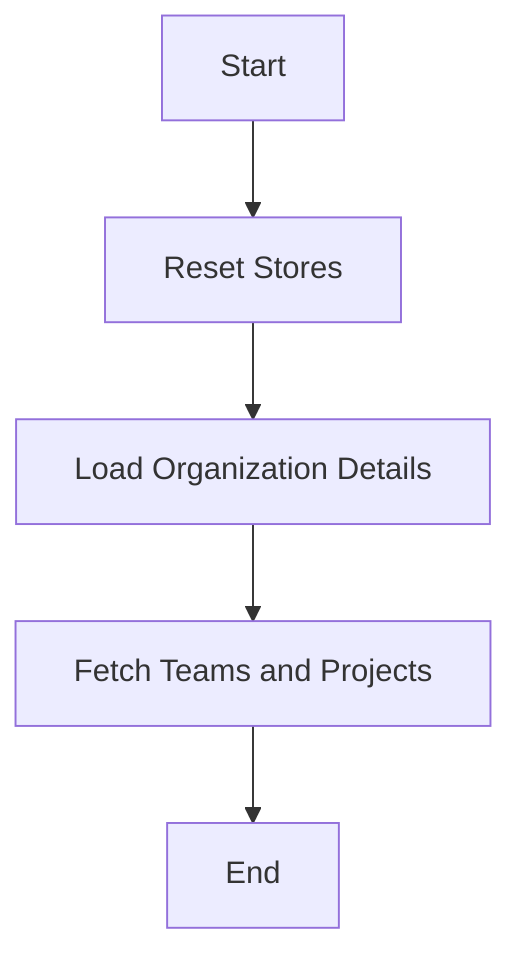

This document will cover the process of fetching organization details, which includes:

1. Resetting stores
2. Loading organization details
3. Fetching associated teams and projects.

Technical document: <SwmLink doc-title="Fetching Organization Details">[Fetching Organization Details](/.swm/fetching-organization-details.n4ddpsz4.sw.md)</SwmLink>

# [Resetting Stores](https://app.swimm.io/repos/Z2l0aHViJTNBJTNBc2VudHJ5LWRlbW8tMSUzQSUzQVN3aW1tLURlbW8=/docs/n4ddpsz4#resetting-stores)

When fetching organization details, the first step is to reset various stores. This includes the organization store, projects store, team store, and page filters store. Resetting these stores ensures that any outdated or irrelevant data is cleared out, providing a clean slate for loading fresh data. This step is crucial for maintaining data integrity and ensuring that the user sees the most up-to-date information.

# [Loading Organization Details](https://app.swimm.io/repos/Z2l0aHViJTNBJTNBc2VudHJ5LWRlbW8tMSUzQSUzQVN3aW1tLURlbW8=/docs/n4ddpsz4#loading-organization)

The next step is to load the organization details. This involves making an API request to fetch the organization's information. If the request is successful, the organization store is updated with the new data. If an error occurs, it is handled appropriately, and the user is notified. This step ensures that the organization details are current and accurate, providing the user with reliable information.

# [Fetching Associated Teams and Projects](https://app.swimm.io/repos/Z2l0aHViJTNBJTNBc2VudHJ5LWRlbW8tMSUzQSUzQVN3aW1tLURlbW8=/docs/n4ddpsz4#loading-teams-and-projects)

The final step is to fetch the associated teams and projects. This involves making additional API requests to retrieve the teams and projects linked to the organization. The data is then loaded into the respective stores. This step ensures that the user has access to all relevant teams and projects associated with the organization, providing a comprehensive view of the organization's structure and resources.

&nbsp;

*This is an auto-generated document by Swimm AI 🌊 and has not yet been verified by a human*

<SwmMeta version="3.0.0" repo-id="Z2l0aHViJTNBJTNBc2VudHJ5LWRlbW8tMSUzQSUzQVN3aW1tLURlbW8=" repo-name="sentry-demo-1" doc-type="product-flows">Powered by [Swimm](/)</SwmMeta>
