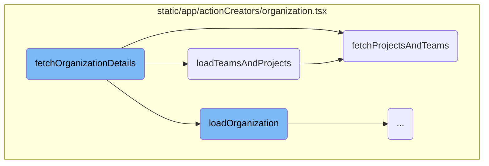

This document explains the process of fetching organization details. The process involves resetting various stores, loading organization details, and fetching associated teams and projects.

The flow starts by resetting the current organization, projects, and team data if needed. Then, it loads the organization details and fetches the associated teams and projects. This ensures that the organization data is up-to-date and handles any errors that may occur during the fetch process.

Here is a high level diagram of the flow, showing only the most important functions:

```mermaid
graph TD;
      subgraph static/app
87755becf2f08e587815d29af54b32bcf201d8e7ed338ee54d2baec7c376fc5d(fetchOrganizationDetails):::mainFlowStyle --> b001a015b1779b75b51dee2017dd5fadc1bcb813c56a01ad47420a1daf75fdfb(loadTeamsAndProjects)
end

subgraph static/app
87755becf2f08e587815d29af54b32bcf201d8e7ed338ee54d2baec7c376fc5d(fetchOrganizationDetails):::mainFlowStyle --> 7958503946400a5e1613d9717eab9ac8c782ab8e41538897b05a5c309ecb3013(fetchProjectsAndTeams)
end

subgraph static/app
87755becf2f08e587815d29af54b32bcf201d8e7ed338ee54d2baec7c376fc5d(fetchOrganizationDetails):::mainFlowStyle --> 817a49ad3722ee8b7dd1530c64c278d0b1992dbe1519f91657b532634f0ed208(loadOrganization):::mainFlowStyle
end

subgraph static/app
817a49ad3722ee8b7dd1530c64c278d0b1992dbe1519f91657b532634f0ed208(loadOrganization):::mainFlowStyle --> bf116262fb40b2861e86e227f522434df7beff1ddc141d8b63e6a5c587435b20(fetchOrg):::mainFlowStyle
end

subgraph static/app/utils
bf116262fb40b2861e86e227f522434df7beff1ddc141d8b63e6a5c587435b20(fetchOrg):::mainFlowStyle --> c7905ee327f07bb1cafd2b90ab91ffacfed6a1316aa3486cc77984eb054a7983(loadOrg):::mainFlowStyle
end

subgraph static/app/utils
c7905ee327f07bb1cafd2b90ab91ffacfed6a1316aa3486cc77984eb054a7983(loadOrg):::mainFlowStyle --> 78d4d9dabac66019b5d8f53063e1a09a20c510c60f9e24e49a171205da0b4c18(getEnabledFeatureFlagList):::mainFlowStyle
end

subgraph static/app/utils
78d4d9dabac66019b5d8f53063e1a09a20c510c60f9e24e49a171205da0b4c18(getEnabledFeatureFlagList):::mainFlowStyle --> dea6316b2f581377bf94b25bfd019f27847c2e33772a84adbbc2e9793e6c3cae(_getStoredOverrides):::mainFlowStyle
end

subgraph static/app/utils
dea6316b2f581377bf94b25bfd019f27847c2e33772a84adbbc2e9793e6c3cae(_getStoredOverrides):::mainFlowStyle --> 4b2faee236c2e651d9932fa234f72966df49f7aa0f85eb9909d65f4b6d8ce1a6(parse):::mainFlowStyle
end

subgraph static/app/utils
4b2faee236c2e651d9932fa234f72966df49f7aa0f85eb9909d65f4b6d8ce1a6(parse):::mainFlowStyle --> b2b47f6077e96a1ff47606d77c3fe70b18a84edc0ab0fa1349f7face4165d2ea(parseWidget):::mainFlowStyle
end

subgraph static/app/utils
b2b47f6077e96a1ff47606d77c3fe70b18a84edc0ab0fa1349f7face4165d2ea(parseWidget):::mainFlowStyle --> 05bf2ddeab316943d2187e10bc3886949b4b03ae946f68d4f27a5bfc0025e132(mapToMetricsQuery):::mainFlowStyle
end

subgraph static/app/utils
05bf2ddeab316943d2187e10bc3886949b4b03ae946f68d4f27a5bfc0025e132(mapToMetricsQuery):::mainFlowStyle --> 635bb507b11255a8fd7c2375dac3b6c46b736470cf89007061c6861fc973e73b(fetchAvailableTags):::mainFlowStyle
end

subgraph static/app
635bb507b11255a8fd7c2375dac3b6c46b736470cf89007061c6861fc973e73b(fetchAvailableTags):::mainFlowStyle --> 1025c11ff078741e3a52849e4dc81510d630800b045c60aea951683433a1c993(requestPromise):::mainFlowStyle
end

subgraph static/app
1025c11ff078741e3a52849e4dc81510d630800b045c60aea951683433a1c993(requestPromise):::mainFlowStyle --> 4f5a67a71dfb71654db327ed24d5e8187187a49b58963a473eec18ecb0aef026(request):::mainFlowStyle
end

subgraph static/app
4f5a67a71dfb71654db327ed24d5e8187187a49b58963a473eec18ecb0aef026(request):::mainFlowStyle --> 2cd409575454572c7b228bde73d6eb55227f3d7b14d37cc7ca5415bbcb81e4e5(handler):::mainFlowStyle
end

subgraph static/app
2cd409575454572c7b228bde73d6eb55227f3d7b14d37cc7ca5415bbcb81e4e5(handler):::mainFlowStyle --> 559bfddfedaeb6eedd4a2b9c4af59508927a1a6190c13b585781a179d22a07a1(processEvent):::mainFlowStyle
end


      classDef mainFlowStyle color:#000000,fill:#7CB9F4
classDef rootsStyle color:#000000,fill:#00FFF4
classDef Style1 color:#000000,fill:#00FFAA
classDef Style2 color:#000000,fill:#FFFF00
classDef Style3 color:#000000,fill:#AA7CB9

%% Swimm:
%% graph TD;
%%       subgraph <SwmPath>[static/app/](static/app/)</SwmPath>
%% 87755becf2f08e587815d29af54b32bcf201d8e7ed338ee54d2baec7c376fc5d(fetchOrganizationDetails):::mainFlowStyle --> b001a015b1779b75b51dee2017dd5fadc1bcb813c56a01ad47420a1daf75fdfb(loadTeamsAndProjects)
%% end
%% 
%% subgraph <SwmPath>[static/app/](static/app/)</SwmPath>
%% 87755becf2f08e587815d29af54b32bcf201d8e7ed338ee54d2baec7c376fc5d(fetchOrganizationDetails):::mainFlowStyle --> 7958503946400a5e1613d9717eab9ac8c782ab8e41538897b05a5c309ecb3013(fetchProjectsAndTeams)
%% end
%% 
%% subgraph <SwmPath>[static/app/](static/app/)</SwmPath>
%% 87755becf2f08e587815d29af54b32bcf201d8e7ed338ee54d2baec7c376fc5d(fetchOrganizationDetails):::mainFlowStyle --> 817a49ad3722ee8b7dd1530c64c278d0b1992dbe1519f91657b532634f0ed208(loadOrganization):::mainFlowStyle
%% end
%% 
%% subgraph <SwmPath>[static/app/](static/app/)</SwmPath>
%% 817a49ad3722ee8b7dd1530c64c278d0b1992dbe1519f91657b532634f0ed208(loadOrganization):::mainFlowStyle --> bf116262fb40b2861e86e227f522434df7beff1ddc141d8b63e6a5c587435b20(fetchOrg):::mainFlowStyle
%% end
%% 
%% subgraph <SwmPath>[static/app/utils/](static/app/utils/)</SwmPath>
%% bf116262fb40b2861e86e227f522434df7beff1ddc141d8b63e6a5c587435b20(fetchOrg):::mainFlowStyle --> c7905ee327f07bb1cafd2b90ab91ffacfed6a1316aa3486cc77984eb054a7983(loadOrg):::mainFlowStyle
%% end
%% 
%% subgraph <SwmPath>[static/app/utils/](static/app/utils/)</SwmPath>
%% c7905ee327f07bb1cafd2b90ab91ffacfed6a1316aa3486cc77984eb054a7983(loadOrg):::mainFlowStyle --> 78d4d9dabac66019b5d8f53063e1a09a20c510c60f9e24e49a171205da0b4c18(getEnabledFeatureFlagList):::mainFlowStyle
%% end
%% 
%% subgraph <SwmPath>[static/app/utils/](static/app/utils/)</SwmPath>
%% 78d4d9dabac66019b5d8f53063e1a09a20c510c60f9e24e49a171205da0b4c18(getEnabledFeatureFlagList):::mainFlowStyle --> dea6316b2f581377bf94b25bfd019f27847c2e33772a84adbbc2e9793e6c3cae(_getStoredOverrides):::mainFlowStyle
%% end
%% 
%% subgraph <SwmPath>[static/app/utils/](static/app/utils/)</SwmPath>
%% dea6316b2f581377bf94b25bfd019f27847c2e33772a84adbbc2e9793e6c3cae(_getStoredOverrides):::mainFlowStyle --> 4b2faee236c2e651d9932fa234f72966df49f7aa0f85eb9909d65f4b6d8ce1a6(parse):::mainFlowStyle
%% end
%% 
%% subgraph <SwmPath>[static/app/utils/](static/app/utils/)</SwmPath>
%% 4b2faee236c2e651d9932fa234f72966df49f7aa0f85eb9909d65f4b6d8ce1a6(parse):::mainFlowStyle --> b2b47f6077e96a1ff47606d77c3fe70b18a84edc0ab0fa1349f7face4165d2ea(parseWidget):::mainFlowStyle
%% end
%% 
%% subgraph <SwmPath>[static/app/utils/](static/app/utils/)</SwmPath>
%% b2b47f6077e96a1ff47606d77c3fe70b18a84edc0ab0fa1349f7face4165d2ea(parseWidget):::mainFlowStyle --> 05bf2ddeab316943d2187e10bc3886949b4b03ae946f68d4f27a5bfc0025e132(mapToMetricsQuery):::mainFlowStyle
%% end
%% 
%% subgraph <SwmPath>[static/app/utils/](static/app/utils/)</SwmPath>
%% 05bf2ddeab316943d2187e10bc3886949b4b03ae946f68d4f27a5bfc0025e132(mapToMetricsQuery):::mainFlowStyle --> 635bb507b11255a8fd7c2375dac3b6c46b736470cf89007061c6861fc973e73b(fetchAvailableTags):::mainFlowStyle
%% end
%% 
%% subgraph <SwmPath>[static/app/](static/app/)</SwmPath>
%% 635bb507b11255a8fd7c2375dac3b6c46b736470cf89007061c6861fc973e73b(fetchAvailableTags):::mainFlowStyle --> 1025c11ff078741e3a52849e4dc81510d630800b045c60aea951683433a1c993(requestPromise):::mainFlowStyle
%% end
%% 
%% subgraph <SwmPath>[static/app/](static/app/)</SwmPath>
%% 1025c11ff078741e3a52849e4dc81510d630800b045c60aea951683433a1c993(requestPromise):::mainFlowStyle --> 4f5a67a71dfb71654db327ed24d5e8187187a49b58963a473eec18ecb0aef026(request):::mainFlowStyle
%% end
%% 
%% subgraph <SwmPath>[static/app/](static/app/)</SwmPath>
%% 4f5a67a71dfb71654db327ed24d5e8187187a49b58963a473eec18ecb0aef026(request):::mainFlowStyle --> 2cd409575454572c7b228bde73d6eb55227f3d7b14d37cc7ca5415bbcb81e4e5(handler):::mainFlowStyle
%% end
%% 
%% subgraph <SwmPath>[static/app/](static/app/)</SwmPath>
%% 2cd409575454572c7b228bde73d6eb55227f3d7b14d37cc7ca5415bbcb81e4e5(handler):::mainFlowStyle --> 559bfddfedaeb6eedd4a2b9c4af59508927a1a6190c13b585781a179d22a07a1(processEvent):::mainFlowStyle
%% end
%% 
%% 
%%       classDef mainFlowStyle color:#000000,fill:#7CB9F4
%% classDef rootsStyle color:#000000,fill:#00FFF4
%% classDef Style1 color:#000000,fill:#00FFAA
%% classDef Style2 color:#000000,fill:#FFFF00
%% classDef Style3 color:#000000,fill:#AA7CB9
```



# Flow drill down

First, we'll zoom into this section of the flow:



<SwmSnippet path="/static/app/actionCreators/organization.tsx" line="116">

---

## Fetching Organization Details

The function <SwmToken path="static/app/actionCreators/organization.tsx" pos="125:4:4" line-data="export function fetchOrganizationDetails(">`fetchOrganizationDetails`</SwmToken> is responsible for fetching the details of an organization. It resets various stores if the <SwmToken path="static/app/actionCreators/organization.tsx" pos="121:6:6" line-data=" * @param silent Should we silently update the organization (do not clear the">`silent`</SwmToken> parameter is false and then proceeds to load the organization details and the associated teams and projects. This function ensures that the organization data is up-to-date and handles any errors that may occur during the fetch process.

```tsx
/**
 * Fetches an organization's details
 *
 * @param api A reference to the api client
 * @param slug The organization slug
 * @param silent Should we silently update the organization (do not clear the
 *               current organization in the store)
 * @param usePreload Should the preloaded data be used if available?
 */
export function fetchOrganizationDetails(
  api: Client,
  slug: string,
  silent: boolean,
  usePreload?: boolean
) {
  if (!silent) {
    OrganizationStore.reset();
    ProjectsStore.reset();
    TeamStore.reset();
    PageFiltersStore.onReset();
  }
```

---

</SwmSnippet>

<SwmSnippet path="/static/app/actionCreators/organization.tsx" line="177">

---

## Loading Teams and Projects

The function <SwmToken path="static/app/actionCreators/organization.tsx" pos="177:3:3" line-data="  const loadTeamsAndProjects = () =&gt; {">`loadTeamsAndProjects`</SwmToken> loads the initial data for projects and teams. It fetches the projects and teams using the <SwmToken path="static/app/actionCreators/organization.tsx" pos="179:23:23" line-data="      const [[projects], [teams, , resp]] = await fetchProjectsAndTeams(slug, usePreload);">`fetchProjectsAndTeams`</SwmToken> function and then updates the <SwmToken path="static/app/actionCreators/organization.tsx" pos="181:1:1" line-data="      ProjectsStore.loadInitialData(projects ?? []);">`ProjectsStore`</SwmToken> and <SwmToken path="static/app/actionCreators/organization.tsx" pos="188:1:1" line-data="        TeamStore.loadInitialData(teams, hasMore, cursor);">`TeamStore`</SwmToken> with the fetched data. This function also handles pagination for teams if there are more teams to be loaded.

```tsx
  const loadTeamsAndProjects = () => {
    return new Promise(async resolve => {
      const [[projects], [teams, , resp]] = await fetchProjectsAndTeams(slug, usePreload);

      ProjectsStore.loadInitialData(projects ?? []);

      const teamPageLinks = resp?.getResponseHeader('Link');
      if (teamPageLinks) {
        const paginationObject = parseLinkHeader(teamPageLinks);
        const hasMore = paginationObject?.next?.results ?? false;
        const cursor = paginationObject.next?.cursor;
        TeamStore.loadInitialData(teams, hasMore, cursor);
      } else {
        TeamStore.loadInitialData(teams);
      }
      resolve([projects, teams]);
    });
  };
```

---

</SwmSnippet>

<SwmSnippet path="/static/app/actionCreators/organization.tsx" line="57">

---

### Fetching Projects and Teams

The function <SwmToken path="static/app/actionCreators/organization.tsx" pos="57:4:4" line-data="async function fetchProjectsAndTeams(">`fetchProjectsAndTeams`</SwmToken> fetches the projects and teams for a given organization slug. It uses preloaded data if available and makes API requests to fetch the projects and teams. This function handles API errors and ensures that the data is fetched correctly, even if the user has limited access to projects and teams.

```tsx
async function fetchProjectsAndTeams(
  slug: string,
  usePreload?: boolean
): Promise<
  [
    [Project[], string | undefined, XMLHttpRequest | ResponseMeta | undefined],
    [Team[], string | undefined, XMLHttpRequest | ResponseMeta | undefined],
  ]
> {
  // Create a new client so the request is not cancelled
  const uncancelableApi = new Client();

  const projectsPromise = getPreloadedDataPromise(
    'projects',
    slug,
    () =>
      // This data should get preloaded in static/sentry/index.ejs
      // If this url changes make sure to update the preload
      uncancelableApi.requestPromise(`/organizations/${slug}/projects/`, {
        includeAllArgs: true,
        query: {
```

---

</SwmSnippet>

Now, lets zoom into this section of the flow:

```mermaid
graph TD;
      subgraph static/app
817a49ad3722ee8b7dd1530c64c278d0b1992dbe1519f91657b532634f0ed208(loadOrganization):::mainFlowStyle --> bf116262fb40b2861e86e227f522434df7beff1ddc141d8b63e6a5c587435b20(fetchOrg):::mainFlowStyle
end

subgraph static/app/utils
bf116262fb40b2861e86e227f522434df7beff1ddc141d8b63e6a5c587435b20(fetchOrg):::mainFlowStyle --> c7905ee327f07bb1cafd2b90ab91ffacfed6a1316aa3486cc77984eb054a7983(loadOrg):::mainFlowStyle
end

subgraph static/app/utils
c7905ee327f07bb1cafd2b90ab91ffacfed6a1316aa3486cc77984eb054a7983(loadOrg):::mainFlowStyle --> 78d4d9dabac66019b5d8f53063e1a09a20c510c60f9e24e49a171205da0b4c18(getEnabledFeatureFlagList):::mainFlowStyle
end

subgraph static/app/utils
78d4d9dabac66019b5d8f53063e1a09a20c510c60f9e24e49a171205da0b4c18(getEnabledFeatureFlagList):::mainFlowStyle --> dea6316b2f581377bf94b25bfd019f27847c2e33772a84adbbc2e9793e6c3cae(_getStoredOverrides):::mainFlowStyle
end

subgraph static/app/utils
dea6316b2f581377bf94b25bfd019f27847c2e33772a84adbbc2e9793e6c3cae(_getStoredOverrides):::mainFlowStyle --> 4b2faee236c2e651d9932fa234f72966df49f7aa0f85eb9909d65f4b6d8ce1a6(parse):::mainFlowStyle
end

subgraph static/app/utils
4b2faee236c2e651d9932fa234f72966df49f7aa0f85eb9909d65f4b6d8ce1a6(parse):::mainFlowStyle --> b2b47f6077e96a1ff47606d77c3fe70b18a84edc0ab0fa1349f7face4165d2ea(parseWidget):::mainFlowStyle
end

subgraph static/app/utils
b2b47f6077e96a1ff47606d77c3fe70b18a84edc0ab0fa1349f7face4165d2ea(parseWidget):::mainFlowStyle --> 05bf2ddeab316943d2187e10bc3886949b4b03ae946f68d4f27a5bfc0025e132(mapToMetricsQuery):::mainFlowStyle
end

subgraph static/app/utils
05bf2ddeab316943d2187e10bc3886949b4b03ae946f68d4f27a5bfc0025e132(mapToMetricsQuery):::mainFlowStyle --> 635bb507b11255a8fd7c2375dac3b6c46b736470cf89007061c6861fc973e73b(fetchAvailableTags):::mainFlowStyle
end

subgraph static/app
635bb507b11255a8fd7c2375dac3b6c46b736470cf89007061c6861fc973e73b(fetchAvailableTags):::mainFlowStyle --> 1025c11ff078741e3a52849e4dc81510d630800b045c60aea951683433a1c993(requestPromise):::mainFlowStyle
end

subgraph static/app
1025c11ff078741e3a52849e4dc81510d630800b045c60aea951683433a1c993(requestPromise):::mainFlowStyle --> 4f5a67a71dfb71654db327ed24d5e8187187a49b58963a473eec18ecb0aef026(request):::mainFlowStyle
end

subgraph static/app
4f5a67a71dfb71654db327ed24d5e8187187a49b58963a473eec18ecb0aef026(request):::mainFlowStyle --> 2cd409575454572c7b228bde73d6eb55227f3d7b14d37cc7ca5415bbcb81e4e5(handler):::mainFlowStyle
end

subgraph static/app
2cd409575454572c7b228bde73d6eb55227f3d7b14d37cc7ca5415bbcb81e4e5(handler):::mainFlowStyle --> 559bfddfedaeb6eedd4a2b9c4af59508927a1a6190c13b585781a179d22a07a1(processEvent):::mainFlowStyle
end


      classDef mainFlowStyle color:#000000,fill:#7CB9F4
classDef rootsStyle color:#000000,fill:#00FFF4
classDef Style1 color:#000000,fill:#00FFAA
classDef Style2 color:#000000,fill:#FFFF00
classDef Style3 color:#000000,fill:#AA7CB9

%% Swimm:
%% graph TD;
%%       subgraph <SwmPath>[static/app/](static/app/)</SwmPath>
%% 817a49ad3722ee8b7dd1530c64c278d0b1992dbe1519f91657b532634f0ed208(loadOrganization):::mainFlowStyle --> bf116262fb40b2861e86e227f522434df7beff1ddc141d8b63e6a5c587435b20(fetchOrg):::mainFlowStyle
%% end
%% 
%% subgraph <SwmPath>[static/app/utils/](static/app/utils/)</SwmPath>
%% bf116262fb40b2861e86e227f522434df7beff1ddc141d8b63e6a5c587435b20(fetchOrg):::mainFlowStyle --> c7905ee327f07bb1cafd2b90ab91ffacfed6a1316aa3486cc77984eb054a7983(loadOrg):::mainFlowStyle
%% end
%% 
%% subgraph <SwmPath>[static/app/utils/](static/app/utils/)</SwmPath>
%% c7905ee327f07bb1cafd2b90ab91ffacfed6a1316aa3486cc77984eb054a7983(loadOrg):::mainFlowStyle --> 78d4d9dabac66019b5d8f53063e1a09a20c510c60f9e24e49a171205da0b4c18(getEnabledFeatureFlagList):::mainFlowStyle
%% end
%% 
%% subgraph <SwmPath>[static/app/utils/](static/app/utils/)</SwmPath>
%% 78d4d9dabac66019b5d8f53063e1a09a20c510c60f9e24e49a171205da0b4c18(getEnabledFeatureFlagList):::mainFlowStyle --> dea6316b2f581377bf94b25bfd019f27847c2e33772a84adbbc2e9793e6c3cae(_getStoredOverrides):::mainFlowStyle
%% end
%% 
%% subgraph <SwmPath>[static/app/utils/](static/app/utils/)</SwmPath>
%% dea6316b2f581377bf94b25bfd019f27847c2e33772a84adbbc2e9793e6c3cae(_getStoredOverrides):::mainFlowStyle --> 4b2faee236c2e651d9932fa234f72966df49f7aa0f85eb9909d65f4b6d8ce1a6(parse):::mainFlowStyle
%% end
%% 
%% subgraph <SwmPath>[static/app/utils/](static/app/utils/)</SwmPath>
%% 4b2faee236c2e651d9932fa234f72966df49f7aa0f85eb9909d65f4b6d8ce1a6(parse):::mainFlowStyle --> b2b47f6077e96a1ff47606d77c3fe70b18a84edc0ab0fa1349f7face4165d2ea(parseWidget):::mainFlowStyle
%% end
%% 
%% subgraph <SwmPath>[static/app/utils/](static/app/utils/)</SwmPath>
%% b2b47f6077e96a1ff47606d77c3fe70b18a84edc0ab0fa1349f7face4165d2ea(parseWidget):::mainFlowStyle --> 05bf2ddeab316943d2187e10bc3886949b4b03ae946f68d4f27a5bfc0025e132(mapToMetricsQuery):::mainFlowStyle
%% end
%% 
%% subgraph <SwmPath>[static/app/utils/](static/app/utils/)</SwmPath>
%% 05bf2ddeab316943d2187e10bc3886949b4b03ae946f68d4f27a5bfc0025e132(mapToMetricsQuery):::mainFlowStyle --> 635bb507b11255a8fd7c2375dac3b6c46b736470cf89007061c6861fc973e73b(fetchAvailableTags):::mainFlowStyle
%% end
%% 
%% subgraph <SwmPath>[static/app/](static/app/)</SwmPath>
%% 635bb507b11255a8fd7c2375dac3b6c46b736470cf89007061c6861fc973e73b(fetchAvailableTags):::mainFlowStyle --> 1025c11ff078741e3a52849e4dc81510d630800b045c60aea951683433a1c993(requestPromise):::mainFlowStyle
%% end
%% 
%% subgraph <SwmPath>[static/app/](static/app/)</SwmPath>
%% 1025c11ff078741e3a52849e4dc81510d630800b045c60aea951683433a1c993(requestPromise):::mainFlowStyle --> 4f5a67a71dfb71654db327ed24d5e8187187a49b58963a473eec18ecb0aef026(request):::mainFlowStyle
%% end
%% 
%% subgraph <SwmPath>[static/app/](static/app/)</SwmPath>
%% 4f5a67a71dfb71654db327ed24d5e8187187a49b58963a473eec18ecb0aef026(request):::mainFlowStyle --> 2cd409575454572c7b228bde73d6eb55227f3d7b14d37cc7ca5415bbcb81e4e5(handler):::mainFlowStyle
%% end
%% 
%% subgraph <SwmPath>[static/app/](static/app/)</SwmPath>
%% 2cd409575454572c7b228bde73d6eb55227f3d7b14d37cc7ca5415bbcb81e4e5(handler):::mainFlowStyle --> 559bfddfedaeb6eedd4a2b9c4af59508927a1a6190c13b585781a179d22a07a1(processEvent):::mainFlowStyle
%% end
%% 
%% 
%%       classDef mainFlowStyle color:#000000,fill:#7CB9F4
%% classDef rootsStyle color:#000000,fill:#00FFF4
%% classDef Style1 color:#000000,fill:#00FFAA
%% classDef Style2 color:#000000,fill:#FFFF00
%% classDef Style3 color:#000000,fill:#AA7CB9
```



<SwmSnippet path="/static/app/actionCreators/organization.tsx" line="148">

---

## Loading Organization

The <SwmToken path="static/app/actionCreators/organization.tsx" pos="148:3:3" line-data="  const loadOrganization = () =&gt; {">`loadOrganization`</SwmToken> function initiates the process of loading organization details. It returns a promise that attempts to fetch the organization using the <SwmToken path="static/app/actionCreators/organization.tsx" pos="152:7:7" line-data="        org = await fetchOrg(api, slug, usePreload);">`fetchOrg`</SwmToken> function. If an error occurs, it handles specific error statuses and captures exceptions using Sentry.

```tsx
  const loadOrganization = () => {
    return new Promise(async (resolve, reject) => {
      let org: Organization | undefined = undefined;
      try {
        org = await fetchOrg(api, slug, usePreload);
      } catch (err) {
        if (!err) {
          reject(err);
          return;
        }

        OrganizationStore.onFetchOrgError(err);

        if (err.status === 403 || err.status === 401) {
          const errMessage = getErrorMessage(err);

          if (errMessage) {
            addErrorMessage(errMessage);
            reject(errMessage);
          }

```

---

</SwmSnippet>

<SwmSnippet path="/static/app/actionCreators/organization.tsx" line="21">

---

## Fetching Organization

The <SwmToken path="static/app/actionCreators/organization.tsx" pos="21:4:4" line-data="async function fetchOrg(">`fetchOrg`</SwmToken> function is responsible for making an API request to fetch the organization details. It uses the <SwmToken path="static/app/actionCreators/organization.tsx" pos="26:11:11" line-data="  const [org] = await getPreloadedDataPromise(">`getPreloadedDataPromise`</SwmToken> to either fetch the data from a preloaded source or make an API request. Once the organization is fetched, it updates the <SwmToken path="static/app/actionCreators/organization.tsx" pos="17:2:2" line-data="import FeatureFlagOverrides from &#39;sentry/utils/featureFlagOverrides&#39;;">`FeatureFlagOverrides`</SwmToken> and <SwmToken path="static/app/actionCreators/organization.tsx" pos="132:1:1" line-data="    OrganizationStore.reset();">`OrganizationStore`</SwmToken>, and sets the active organization in the Sentry scope.

```tsx
async function fetchOrg(
  api: Client,
  slug: string,
  usePreload?: boolean
): Promise<Organization> {
  const [org] = await getPreloadedDataPromise(
    'organization',
    slug,
    () =>
      // This data should get preloaded in static/sentry/index.ejs
      // If this url changes make sure to update the preload
      api.requestPromise(`/organizations/${slug}/`, {
        includeAllArgs: true,
        query: {detailed: 0, include_feature_flags: 1},
      }),
    usePreload
  );

  if (!org) {
    throw new Error('retrieved organization is falsey');
  }
```

---

</SwmSnippet>

<SwmSnippet path="/static/app/utils/featureFlagOverrides.ts" line="115">

---

### Loading Organization Features

The <SwmToken path="static/app/utils/featureFlagOverrides.ts" pos="115:3:3" line-data="  public loadOrg(organization: Organization) {">`loadOrg`</SwmToken> method in <SwmToken path="static/app/actionCreators/organization.tsx" pos="17:2:2" line-data="import FeatureFlagOverrides from &#39;sentry/utils/featureFlagOverrides&#39;;">`FeatureFlagOverrides`</SwmToken> updates the organization's features with the effective list of enabled feature flags.

```typescript
  public loadOrg(organization: Organization) {
    organization.features = this.getEnabledFeatureFlagList(organization);
  }
```

---

</SwmSnippet>

<SwmSnippet path="/static/app/utils/featureFlagOverrides.ts" line="96">

---

### Getting Enabled Feature Flags

The <SwmToken path="static/app/utils/featureFlagOverrides.ts" pos="96:3:3" line-data="  public getEnabledFeatureFlagList(organization: Organization): string[] {">`getEnabledFeatureFlagList`</SwmToken> method returns the effective feature flags for the organization. It combines non-overridden features with stored overrides to produce the final list of enabled features.

```typescript
  public getEnabledFeatureFlagList(organization: Organization): string[] {
    const nonOverriddenFeatures = this._getNonOverriddenFeatures(organization);
    const overrides = this._getStoredOverrides();

    const names = new Set(Object.keys(nonOverriddenFeatures));

    for (const [name, override] of Object.entries(overrides)) {
      if (override) {
        names.add(name);
      } else {
        names.delete(name);
      }
    }
    return Array.from(names);
  }
```

---

</SwmSnippet>

<SwmSnippet path="/static/app/utils/featureFlagOverrides.ts" line="52">

---

### Fetching Stored Overrides

The <SwmToken path="static/app/utils/featureFlagOverrides.ts" pos="52:3:3" line-data="  private _getStoredOverrides(): OverrideState {">`_getStoredOverrides`</SwmToken> method retrieves stored feature flag overrides from local storage. If parsing the stored data fails, it returns an empty object.

```typescript
  private _getStoredOverrides(): OverrideState {
    try {
      return JSON.parse(localStorageWrapper.getItem(LOCALSTORAGE_KEY) ?? '{}');
    } catch {
      return {};
    }
  }
```

---

</SwmSnippet>

<SwmSnippet path="/static/app/utils/metrics/dashboardImport.tsx" line="139">

---

### Parsing Imported Widgets

The <SwmToken path="static/app/utils/metrics/dashboardImport.tsx" pos="139:5:5" line-data="  public async parse() {">`parse`</SwmToken> method parses the imported widget, ensuring it is of a supported type and contains parseable queries. It returns a report and the parsed widget, handling any errors that occur during parsing.

```tsx
  public async parse() {
    const {
      id,
      definition: {title, type: widgetType},
    } = this.importedWidget;

    try {
      if (!SUPPORTED_WIDGET_TYPES.has(widgetType)) {
        throw new Error(`widget - unsupported type ${widgetType}`);
      }
      const widget = await this.parseWidget();

      if (!widget || !widget.queries.length) {
        throw new Error('widget - no parseable queries found');
      }

      const outcome: ImportOutcome = this.errors.length ? 'warning' : 'success';

      return {
        report: {
          id,
```

---

</SwmSnippet>

<SwmSnippet path="/static/app/utils/metrics/dashboardImport.tsx" line="179">

---

### Parsing Widget Details

The <SwmToken path="static/app/utils/metrics/dashboardImport.tsx" pos="179:5:5" line-data="  private async parseWidget() {">`parseWidget`</SwmToken> method parses the details of the widget, including its requests and queries. It maps the parsed queries to metrics queries and returns a dashboard widget if there are non-empty queries.

```tsx
  private async parseWidget() {
    this.parseLegendColumns();

    const {title, requests = []} = this.importedWidget.definition as WidgetDefinition;

    const parsedRequests = requests.map(r => this.parseRequest(r));
    const parsedQueries = parsedRequests.flatMap(request => request.queries);

    const metricsQueries = await Promise.all(
      parsedQueries.map(async query => {
        const mapped = await this.mapToMetricsQuery(query);
        return {
          ...mapped,
        };
      })
    );

    const nonEmptyQueries = metricsQueries.filter(query => query.mri) as MetricsQuery[];

    if (!nonEmptyQueries.length) {
      return null;
```

---

</SwmSnippet>

<SwmSnippet path="/static/app/utils/metrics/dashboardImport.tsx" line="398">

---

### Mapping to Metrics Query

The <SwmToken path="static/app/utils/metrics/dashboardImport.tsx" pos="398:5:5" line-data="  private async mapToMetricsQuery(widget): Promise&lt;MetricsQuery | null&gt; {">`mapToMetricsQuery`</SwmToken> method maps a widget's query to a metrics query. It fetches available tags for the metric and constructs the query filter and group by parameters.

```tsx
  private async mapToMetricsQuery(widget): Promise<MetricsQuery | null> {
    const {metric, aggregation, filters} = widget;

    // @ts-expect-error name is actually defined on MetricMeta
    const metricMeta = this.availableMetrics.find(m => m.name === metric);

    if (!metricMeta) {
      this.errors.push(`widget.request.query - metric not found: ${metric}`);
      return null;
    }

    const availableTags = await this.fetchAvailableTags(metricMeta.mri);

    const query = this.constructMetricQueryFilter(filters, availableTags);
    const groupBy = this.constructMetricGroupBy(widget.groupBy, availableTags);

    return {
      mri: metricMeta.mri,
      aggregation,
      query,
      groupBy,
```

---

</SwmSnippet>

<SwmSnippet path="/static/app/utils/metrics/dashboardImport.tsx" line="429">

---

### Fetching Available Tags

The <SwmToken path="static/app/utils/metrics/dashboardImport.tsx" pos="429:5:5" line-data="  private async fetchAvailableTags(mri: MRI) {">`fetchAvailableTags`</SwmToken> method makes an API request to fetch available tags for a given metric. It returns the keys of the fetched tags.

```tsx
  private async fetchAvailableTags(mri: MRI) {
    const tagsRes = await this.api.requestPromise(
      `/organizations/${this.orgSlug}/metrics/tags/`,
      {
        query: {
          metric: mri,
          useCase: 'custom',
        },
      }
    );

    return (tagsRes ?? []).map(tag => tag.key);
  }
```

---

</SwmSnippet>

<SwmSnippet path="/static/app/api.tsx" line="656">

---

### Making API Requests

The <SwmToken path="static/app/api.tsx" pos="656:1:1" line-data="  requestPromise&lt;IncludeAllArgsType extends boolean&gt;(">`requestPromise`</SwmToken> method makes an API request and returns a promise. It handles success and error responses, preserving the error stack trace for logging purposes.

```tsx
  requestPromise<IncludeAllArgsType extends boolean>(
    path: string,
    {
      includeAllArgs,
      ...options
    }: {includeAllArgs?: IncludeAllArgsType} & Readonly<RequestOptions> = {}
  ): Promise<IncludeAllArgsType extends true ? ApiResult : any> {
    // Create an error object here before we make any async calls so that we
    // have a helpful stack trace if it errors
    //
    // This *should* get logged to Sentry only if the promise rejection is not handled
    // (since SDK captures unhandled rejections). Ideally we explicitly ignore rejection
    // or handle with a user friendly error message
    const preservedError = new Error('API Request Error');

    return new Promise((resolve, reject) =>
      this.request(path, {
        ...options,
        preservedError,
        success: (data, textStatus, resp) => {
          if (includeAllArgs) {
```

---

</SwmSnippet>

<SwmSnippet path="/static/app/api.tsx" line="420">

---

### Handling API Requests

The <SwmToken path="static/app/api.tsx" pos="420:1:1" line-data="  request(path: string, options: Readonly&lt;RequestOptions&gt; = {}): Request {">`request`</SwmToken> method constructs and sends an API request. It handles various aspects of the request, including building the URL, setting headers, and processing the response.

```tsx
  request(path: string, options: Readonly<RequestOptions> = {}): Request {
    const method = options.method || (options.data ? 'POST' : 'GET');

    let fullUrl = buildRequestUrl(this.baseUrl, path, options);

    let data = options.data;

    if (data !== undefined && method !== 'GET' && !(data instanceof FormData)) {
      data = JSON.stringify(data);
    }

    // TODO(epurkhiser): Mimicking the old jQuery API, data could be a string /
    // object for GET requests. jQuery just sticks it onto the URL as query
    // parameters
    if (method === 'GET' && data) {
      const queryString = typeof data === 'string' ? data : qs.stringify(data);

      if (queryString.length > 0) {
        fullUrl = fullUrl + (fullUrl.includes('?') ? '&' : '?') + queryString;
      }
    }
```

---

</SwmSnippet>

<SwmSnippet path="/static/app/components/replays/canvasReplayerPlugin.tsx" line="304">

---

### Handling Canvas Events

The <SwmToken path="static/app/components/replays/canvasReplayerPlugin.tsx" pos="304:1:1" line-data="    handler: (e: eventWithTime, isSync: boolean, {replayer}: {replayer: Replayer}) =&gt; {">`handler`</SwmToken> function processes canvas mutation events. It distinguishes between synchronous and asynchronous events, handling them accordingly and pruning events as needed.

```tsx
    handler: (e: eventWithTime, isSync: boolean, {replayer}: {replayer: Replayer}) => {
      const isCanvas = isCanvasMutationEvent(e);

      // isSync = true means it is fast forwarding vs playing
      // nothing to do when fast forwarding since canvas mutations for us are
      // image snapshots and do not depend on past events
      if (isSync) {
        // Set this to -1 to indicate that we will need to search
        // `canvasMutationEvents` for starting point of preloading
        //
        // Only do this when isSync is true, meaning there was a seek, since we
        // don't know where next index is
        nextPreloadIndex = -1;

        if (isCanvas) {
          processEventSync(e, {replayer});
        }

        prune(e);
        return;
      }
```

---

</SwmSnippet>

<SwmSnippet path="/static/app/components/replays/canvasReplayerPlugin.tsx" line="233">

---

### Processing Canvas Events

The <SwmToken path="static/app/components/replays/canvasReplayerPlugin.tsx" pos="233:5:5" line-data="  async function processEvent(e: CanvasEventWithTime, {replayer}: {replayer: Replayer}) {">`processEvent`</SwmToken> function processes canvas mutation events by preloading the event, cloning the canvas, and applying the mutation. It updates the canvas image and prunes the event after processing.

```tsx
  async function processEvent(e: CanvasEventWithTime, {replayer}: {replayer: Replayer}) {
    preload(e);

    const source = replayer.getMirror().getNode(e.data.id);
    const target =
      canvases.get(e.data.id) ||
      (source && cloneCanvas(e.data.id, source as HTMLCanvasElement));

    if (!target) {
      throw new InvalidCanvasNodeError('No canvas found for id');
    }

    await canvasMutation({
      event: e,
      mutation: e.data,
      target,
      imageMap,
      canvasEventMap,
      errorHandler: (err: unknown) => {
        if (err instanceof Error) {
          Sentry.captureException(err);
```

---

</SwmSnippet>

&nbsp;

*This is an auto-generated document by Swimm AI 🌊 and has not yet been verified by a human*

<SwmMeta version="3.0.0" repo-id="Z2l0aHViJTNBJTNBc2VudHJ5LWRlbW8tMSUzQSUzQVN3aW1tLURlbW8=" repo-name="sentry-demo-1" doc-type="flows"><sup>Powered by [Swimm](/)</sup></SwmMeta>
