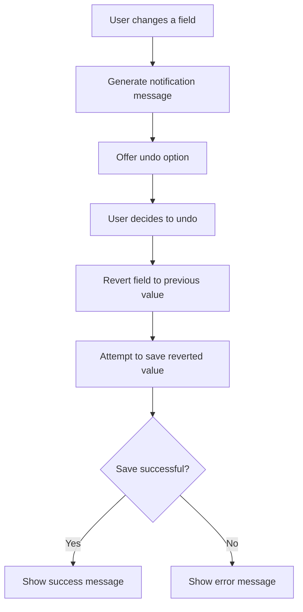

This document will cover the Field Change Notification and Undo Flow, which includes:

1. Generating a notification message for field changes
2. Providing an option to undo the changes
3. Ensuring the user is informed about the modifications they make.

Technical document: <SwmLink doc-title="Field Change Notification and Undo Flow">[Field Change Notification and Undo Flow](/.swm/field-change-notification-and-undo-flow.jutfzmpw.sw.md)</SwmLink>

# [Generating a Notification Message](https://app.swimm.io/repos/Z2l0aHViJTNBJTNBc2VudHJ5LWRlbW8tMSUzQSUzQVN3aW1tLURlbW8=/docs/jutfzmpw#handling-field-changes-and-undo-functionality)

When a user changes a field, the system generates a 'Toast' message that notifies the user about the change. This message includes the previous and current values of the field. The purpose of this notification is to ensure that the user is aware of the modifications they have made.

# [Providing an Option to Undo Changes](https://app.swimm.io/repos/Z2l0aHViJTNBJTNBc2VudHJ5LWRlbW8tMSUzQSUzQVN3aW1tLURlbW8=/docs/jutfzmpw#undoing-a-field-change)

Along with the notification message, the system provides an option for the user to undo the changes. If the user decides to undo the change, the system retrieves the old value of the field and reverts it to its previous state. This ensures that users can easily revert any changes they did not intend to make.

# [Attempting to Save the Reverted Value](https://app.swimm.io/repos/Z2l0aHViJTNBJTNBc2VudHJ5LWRlbW8tMSUzQSUzQVN3aW1tLURlbW8=/docs/jutfzmpw#saving-a-field)

After reverting the field to its previous value, the system attempts to save the reverted value. This involves performing a save operation and handling the success or error responses accordingly. If the save operation is successful, a success message is shown to the user. If it fails, an error message is displayed.

# [Ensuring User Awareness](https://app.swimm.io/repos/Z2l0aHViJTNBJTNBc2VudHJ5LWRlbW8tMSUzQSUzQVN3aW1tLURlbW8=/docs/jutfzmpw#performing-the-save-request)

Throughout this process, the system ensures that users are always informed about the changes they make. By providing clear notifications and an easy way to undo changes, the system enhances the user experience and reduces the likelihood of unintended modifications.

&nbsp;

*This is an auto-generated document by Swimm AI 🌊 and has not yet been verified by a human*

<SwmMeta version="3.0.0" repo-id="Z2l0aHViJTNBJTNBc2VudHJ5LWRlbW8tMSUzQSUzQVN3aW1tLURlbW8=" repo-name="sentry-demo-1" doc-type="product-flows">Powered by [Swimm](/)</SwmMeta>
