This document explains the purpose and flow of the <SwmToken path="static/app/actionCreators/indicator.tsx" pos="151:4:4" line-data="export function saveOnBlurUndoMessage(">`saveOnBlurUndoMessage`</SwmToken> function. It covers how the function generates a notification message for field changes, provides an option to undo the changes, and ensures the user is informed about the modifications they make.

When a user changes a field, the <SwmToken path="static/app/actionCreators/indicator.tsx" pos="151:4:4" line-data="export function saveOnBlurUndoMessage(">`saveOnBlurUndoMessage`</SwmToken> function creates a message that tells the user what was changed and offers a way to undo it. If the user decides to undo the change, the function reverts the field to its previous value and tries to save it again. If the save fails, an error message is shown. This process ensures that users are always aware of their changes and can easily revert them if needed.

Here is a high level diagram of the flow, showing only the most important functions:

```mermaid
graph TD;
      subgraph static/app
13335587824d29777fc8f296e2fd6cd20a4852175dc3b94bc0a3bec4f9fb64a7(saveOnBlurUndoMessage):::mainFlowStyle --> a856aef678397ac5c710b60e2b3eb280bddf5294d492398a2922a0ba95183dea(undo):::mainFlowStyle
end

subgraph static/app/components
a856aef678397ac5c710b60e2b3eb280bddf5294d492398a2922a0ba95183dea(undo):::mainFlowStyle --> f015bfd80a6964fe55eee359e898e335f0166863e2e94994673e2c9a07f06224(saveField):::mainFlowStyle
end

subgraph static/app/components
f015bfd80a6964fe55eee359e898e335f0166863e2e94994673e2c9a07f06224(saveField):::mainFlowStyle --> a161d996767be936bd7376ea542aa0393b5ce34c789be88d7139ddd99f81d533(saveFieldRequest):::mainFlowStyle
end

subgraph static/app/components
a161d996767be936bd7376ea542aa0393b5ce34c789be88d7139ddd99f81d533(saveFieldRequest):::mainFlowStyle --> 3d43b573114e63fa56fa8da62c1d5427b12527ba9a0494eb33857fdf4737371a(doApiRequest)
end

subgraph static/app/components
a161d996767be936bd7376ea542aa0393b5ce34c789be88d7139ddd99f81d533(saveFieldRequest):::mainFlowStyle --> 6658ff8720d856419e5c61d79ccb331bb96e3ebef7a1b1ae38b24192f3d2fb0a(error)
end

subgraph static/app/components
a161d996767be936bd7376ea542aa0393b5ce34c789be88d7139ddd99f81d533(saveFieldRequest):::mainFlowStyle --> 5365dff7094791699b966b10508444bab15bcb9a4999d2e3b2d73230ca95c6ec(setValue):::mainFlowStyle
end

subgraph static/app/components
5365dff7094791699b966b10508444bab15bcb9a4999d2e3b2d73230ca95c6ec(setValue):::mainFlowStyle --> a341473e82c596df0a888228f5d5bb9e0c73f008155db77fa4ee9694d6d6a5ab(validateField):::mainFlowStyle
end

subgraph static/app/components
a341473e82c596df0a888228f5d5bb9e0c73f008155db77fa4ee9694d6d6a5ab(validateField):::mainFlowStyle --> 2e89079da00a6905ab753c09d597626d2199069f49ee0821eccbcd5f14422ce9(validate):::mainFlowStyle
end

subgraph static/app
2e89079da00a6905ab753c09d597626d2199069f49ee0821eccbcd5f14422ce9(validate):::mainFlowStyle --> 4b2faee236c2e651d9932fa234f72966df49f7aa0f85eb9909d65f4b6d8ce1a6(parse):::mainFlowStyle
end

subgraph static/app
4b2faee236c2e651d9932fa234f72966df49f7aa0f85eb9909d65f4b6d8ce1a6(parse):::mainFlowStyle --> b2b47f6077e96a1ff47606d77c3fe70b18a84edc0ab0fa1349f7face4165d2ea(parseWidget):::mainFlowStyle
end

subgraph static/app
b2b47f6077e96a1ff47606d77c3fe70b18a84edc0ab0fa1349f7face4165d2ea(parseWidget):::mainFlowStyle --> 05bf2ddeab316943d2187e10bc3886949b4b03ae946f68d4f27a5bfc0025e132(mapToMetricsQuery):::mainFlowStyle
end

subgraph static/app
05bf2ddeab316943d2187e10bc3886949b4b03ae946f68d4f27a5bfc0025e132(mapToMetricsQuery):::mainFlowStyle --> 635bb507b11255a8fd7c2375dac3b6c46b736470cf89007061c6861fc973e73b(fetchAvailableTags):::mainFlowStyle
end

subgraph static/app
635bb507b11255a8fd7c2375dac3b6c46b736470cf89007061c6861fc973e73b(fetchAvailableTags):::mainFlowStyle --> 1025c11ff078741e3a52849e4dc81510d630800b045c60aea951683433a1c993(requestPromise):::mainFlowStyle
end

subgraph static/app
1025c11ff078741e3a52849e4dc81510d630800b045c60aea951683433a1c993(requestPromise):::mainFlowStyle --> 4f5a67a71dfb71654db327ed24d5e8187187a49b58963a473eec18ecb0aef026(request):::mainFlowStyle
end


      classDef mainFlowStyle color:#000000,fill:#7CB9F4
classDef rootsStyle color:#000000,fill:#00FFF4
classDef Style1 color:#000000,fill:#00FFAA
classDef Style2 color:#000000,fill:#FFFF00
classDef Style3 color:#000000,fill:#AA7CB9

%% Swimm:
%% graph TD;
%%       subgraph <SwmPath>[static/app/](static/app/)</SwmPath>
%% 13335587824d29777fc8f296e2fd6cd20a4852175dc3b94bc0a3bec4f9fb64a7(saveOnBlurUndoMessage):::mainFlowStyle --> a856aef678397ac5c710b60e2b3eb280bddf5294d492398a2922a0ba95183dea(undo):::mainFlowStyle
%% end
%% 
%% subgraph <SwmPath>[static/app/components/](static/app/components/)</SwmPath>
%% a856aef678397ac5c710b60e2b3eb280bddf5294d492398a2922a0ba95183dea(undo):::mainFlowStyle --> f015bfd80a6964fe55eee359e898e335f0166863e2e94994673e2c9a07f06224(saveField):::mainFlowStyle
%% end
%% 
%% subgraph <SwmPath>[static/app/components/](static/app/components/)</SwmPath>
%% f015bfd80a6964fe55eee359e898e335f0166863e2e94994673e2c9a07f06224(saveField):::mainFlowStyle --> a161d996767be936bd7376ea542aa0393b5ce34c789be88d7139ddd99f81d533(saveFieldRequest):::mainFlowStyle
%% end
%% 
%% subgraph <SwmPath>[static/app/components/](static/app/components/)</SwmPath>
%% a161d996767be936bd7376ea542aa0393b5ce34c789be88d7139ddd99f81d533(saveFieldRequest):::mainFlowStyle --> 3d43b573114e63fa56fa8da62c1d5427b12527ba9a0494eb33857fdf4737371a(doApiRequest)
%% end
%% 
%% subgraph <SwmPath>[static/app/components/](static/app/components/)</SwmPath>
%% a161d996767be936bd7376ea542aa0393b5ce34c789be88d7139ddd99f81d533(saveFieldRequest):::mainFlowStyle --> 6658ff8720d856419e5c61d79ccb331bb96e3ebef7a1b1ae38b24192f3d2fb0a(error)
%% end
%% 
%% subgraph <SwmPath>[static/app/components/](static/app/components/)</SwmPath>
%% a161d996767be936bd7376ea542aa0393b5ce34c789be88d7139ddd99f81d533(saveFieldRequest):::mainFlowStyle --> 5365dff7094791699b966b10508444bab15bcb9a4999d2e3b2d73230ca95c6ec(setValue):::mainFlowStyle
%% end
%% 
%% subgraph <SwmPath>[static/app/components/](static/app/components/)</SwmPath>
%% 5365dff7094791699b966b10508444bab15bcb9a4999d2e3b2d73230ca95c6ec(setValue):::mainFlowStyle --> a341473e82c596df0a888228f5d5bb9e0c73f008155db77fa4ee9694d6d6a5ab(validateField):::mainFlowStyle
%% end
%% 
%% subgraph <SwmPath>[static/app/components/](static/app/components/)</SwmPath>
%% a341473e82c596df0a888228f5d5bb9e0c73f008155db77fa4ee9694d6d6a5ab(validateField):::mainFlowStyle --> 2e89079da00a6905ab753c09d597626d2199069f49ee0821eccbcd5f14422ce9(validate):::mainFlowStyle
%% end
%% 
%% subgraph <SwmPath>[static/app/](static/app/)</SwmPath>
%% 2e89079da00a6905ab753c09d597626d2199069f49ee0821eccbcd5f14422ce9(validate):::mainFlowStyle --> 4b2faee236c2e651d9932fa234f72966df49f7aa0f85eb9909d65f4b6d8ce1a6(parse):::mainFlowStyle
%% end
%% 
%% subgraph <SwmPath>[static/app/](static/app/)</SwmPath>
%% 4b2faee236c2e651d9932fa234f72966df49f7aa0f85eb9909d65f4b6d8ce1a6(parse):::mainFlowStyle --> b2b47f6077e96a1ff47606d77c3fe70b18a84edc0ab0fa1349f7face4165d2ea(parseWidget):::mainFlowStyle
%% end
%% 
%% subgraph <SwmPath>[static/app/](static/app/)</SwmPath>
%% b2b47f6077e96a1ff47606d77c3fe70b18a84edc0ab0fa1349f7face4165d2ea(parseWidget):::mainFlowStyle --> 05bf2ddeab316943d2187e10bc3886949b4b03ae946f68d4f27a5bfc0025e132(mapToMetricsQuery):::mainFlowStyle
%% end
%% 
%% subgraph <SwmPath>[static/app/](static/app/)</SwmPath>
%% 05bf2ddeab316943d2187e10bc3886949b4b03ae946f68d4f27a5bfc0025e132(mapToMetricsQuery):::mainFlowStyle --> 635bb507b11255a8fd7c2375dac3b6c46b736470cf89007061c6861fc973e73b(fetchAvailableTags):::mainFlowStyle
%% end
%% 
%% subgraph <SwmPath>[static/app/](static/app/)</SwmPath>
%% 635bb507b11255a8fd7c2375dac3b6c46b736470cf89007061c6861fc973e73b(fetchAvailableTags):::mainFlowStyle --> 1025c11ff078741e3a52849e4dc81510d630800b045c60aea951683433a1c993(requestPromise):::mainFlowStyle
%% end
%% 
%% subgraph <SwmPath>[static/app/](static/app/)</SwmPath>
%% 1025c11ff078741e3a52849e4dc81510d630800b045c60aea951683433a1c993(requestPromise):::mainFlowStyle --> 4f5a67a71dfb71654db327ed24d5e8187187a49b58963a473eec18ecb0aef026(request):::mainFlowStyle
%% end
%% 
%% 
%%       classDef mainFlowStyle color:#000000,fill:#7CB9F4
%% classDef rootsStyle color:#000000,fill:#00FFF4
%% classDef Style1 color:#000000,fill:#00FFAA
%% classDef Style2 color:#000000,fill:#FFFF00
%% classDef Style3 color:#000000,fill:#AA7CB9
```



# Flow drill down

First, we'll zoom into this section of the flow:

```mermaid
graph TD;
      subgraph static/app
13335587824d29777fc8f296e2fd6cd20a4852175dc3b94bc0a3bec4f9fb64a7(saveOnBlurUndoMessage):::mainFlowStyle --> a856aef678397ac5c710b60e2b3eb280bddf5294d492398a2922a0ba95183dea(undo):::mainFlowStyle
end

subgraph static/app
a856aef678397ac5c710b60e2b3eb280bddf5294d492398a2922a0ba95183dea(undo):::mainFlowStyle --> f015bfd80a6964fe55eee359e898e335f0166863e2e94994673e2c9a07f06224(saveField):::mainFlowStyle
end

subgraph static/app
f015bfd80a6964fe55eee359e898e335f0166863e2e94994673e2c9a07f06224(saveField):::mainFlowStyle --> a161d996767be936bd7376ea542aa0393b5ce34c789be88d7139ddd99f81d533(saveFieldRequest):::mainFlowStyle
end

subgraph static/app
a161d996767be936bd7376ea542aa0393b5ce34c789be88d7139ddd99f81d533(saveFieldRequest):::mainFlowStyle --> 3d43b573114e63fa56fa8da62c1d5427b12527ba9a0494eb33857fdf4737371a(doApiRequest)
end

subgraph static/app
a161d996767be936bd7376ea542aa0393b5ce34c789be88d7139ddd99f81d533(saveFieldRequest):::mainFlowStyle --> 6658ff8720d856419e5c61d79ccb331bb96e3ebef7a1b1ae38b24192f3d2fb0a(error)
end

subgraph static/app
a161d996767be936bd7376ea542aa0393b5ce34c789be88d7139ddd99f81d533(saveFieldRequest):::mainFlowStyle --> 5365dff7094791699b966b10508444bab15bcb9a4999d2e3b2d73230ca95c6ec(setValue):::mainFlowStyle
end

subgraph static/app
5365dff7094791699b966b10508444bab15bcb9a4999d2e3b2d73230ca95c6ec(setValue):::mainFlowStyle --> pzzu9(...)
end


      classDef mainFlowStyle color:#000000,fill:#7CB9F4
classDef rootsStyle color:#000000,fill:#00FFF4
classDef Style1 color:#000000,fill:#00FFAA
classDef Style2 color:#000000,fill:#FFFF00
classDef Style3 color:#000000,fill:#AA7CB9

%% Swimm:
%% graph TD;
%%       subgraph <SwmPath>[static/app/](static/app/)</SwmPath>
%% 13335587824d29777fc8f296e2fd6cd20a4852175dc3b94bc0a3bec4f9fb64a7(saveOnBlurUndoMessage):::mainFlowStyle --> a856aef678397ac5c710b60e2b3eb280bddf5294d492398a2922a0ba95183dea(undo):::mainFlowStyle
%% end
%% 
%% subgraph <SwmPath>[static/app/](static/app/)</SwmPath>
%% a856aef678397ac5c710b60e2b3eb280bddf5294d492398a2922a0ba95183dea(undo):::mainFlowStyle --> f015bfd80a6964fe55eee359e898e335f0166863e2e94994673e2c9a07f06224(saveField):::mainFlowStyle
%% end
%% 
%% subgraph <SwmPath>[static/app/](static/app/)</SwmPath>
%% f015bfd80a6964fe55eee359e898e335f0166863e2e94994673e2c9a07f06224(saveField):::mainFlowStyle --> a161d996767be936bd7376ea542aa0393b5ce34c789be88d7139ddd99f81d533(saveFieldRequest):::mainFlowStyle
%% end
%% 
%% subgraph <SwmPath>[static/app/](static/app/)</SwmPath>
%% a161d996767be936bd7376ea542aa0393b5ce34c789be88d7139ddd99f81d533(saveFieldRequest):::mainFlowStyle --> 3d43b573114e63fa56fa8da62c1d5427b12527ba9a0494eb33857fdf4737371a(doApiRequest)
%% end
%% 
%% subgraph <SwmPath>[static/app/](static/app/)</SwmPath>
%% a161d996767be936bd7376ea542aa0393b5ce34c789be88d7139ddd99f81d533(saveFieldRequest):::mainFlowStyle --> 6658ff8720d856419e5c61d79ccb331bb96e3ebef7a1b1ae38b24192f3d2fb0a(error)
%% end
%% 
%% subgraph <SwmPath>[static/app/](static/app/)</SwmPath>
%% a161d996767be936bd7376ea542aa0393b5ce34c789be88d7139ddd99f81d533(saveFieldRequest):::mainFlowStyle --> 5365dff7094791699b966b10508444bab15bcb9a4999d2e3b2d73230ca95c6ec(setValue):::mainFlowStyle
%% end
%% 
%% subgraph <SwmPath>[static/app/](static/app/)</SwmPath>
%% 5365dff7094791699b966b10508444bab15bcb9a4999d2e3b2d73230ca95c6ec(setValue):::mainFlowStyle --> pzzu9(...)
%% end
%% 
%% 
%%       classDef mainFlowStyle color:#000000,fill:#7CB9F4
%% classDef rootsStyle color:#000000,fill:#00FFF4
%% classDef Style1 color:#000000,fill:#00FFAA
%% classDef Style2 color:#000000,fill:#FFFF00
%% classDef Style3 color:#000000,fill:#AA7CB9
```



<SwmSnippet path="/static/app/actionCreators/indicator.tsx" line="151">

---

## Handling field changes and undo functionality

The <SwmToken path="static/app/actionCreators/indicator.tsx" pos="151:4:4" line-data="export function saveOnBlurUndoMessage(">`saveOnBlurUndoMessage`</SwmToken> function is responsible for generating a 'Toast' message that notifies the user about the field change, including its previous and current values. It also provides an option to undo the change. This function ensures that the user is informed about the changes they make and can revert them if necessary.

```tsx
export function saveOnBlurUndoMessage(
  change: Change,
  model: FormModel,
  fieldName: string
) {
  if (!model) {
    return;
  }

  const label = model.getDescriptor(fieldName, 'label');

  if (!label) {
    return;
  }

  const prettifyValue = (val: ChangeValue) => prettyFormString(val, model, fieldName);

  // Hide the change text when formatMessageValue is explicitly set to false
  const showChangeText = model.getDescriptor(fieldName, 'formatMessageValue') !== false;

  const tctArgsSuccess = {
```

---

</SwmSnippet>

<SwmSnippet path="/static/app/actionCreators/indicator.tsx" line="186">

---

### Undoing a field change

The <SwmToken path="static/app/actionCreators/indicator.tsx" pos="186:1:1" line-data="        undo: () =&gt; {">`undo`</SwmToken> function is called within <SwmToken path="static/app/actionCreators/indicator.tsx" pos="151:4:4" line-data="export function saveOnBlurUndoMessage(">`saveOnBlurUndoMessage`</SwmToken> to revert the field to its previous value. It retrieves the old value, performs the undo operation, and attempts to save the field with the reverted value. If the save operation fails, an error message is displayed to the user.

```tsx
        undo: () => {
          if (!model || !fieldName) {
            return;
          }

          const oldValue = model.getValue(fieldName);
          const didUndo = model.undo();
          const newValue = model.getValue(fieldName);

          if (!didUndo) {
            return;
          }
          if (!label) {
            return;
          }

          // `saveField` can return null if it can't save
          const saveResult = model.saveField(fieldName, newValue);

          const tctArgsFail = {
            root: <MessageContainer />,
```

---

</SwmSnippet>

<SwmSnippet path="/static/app/components/forms/model.tsx" line="538">

---

### Saving a field

The <SwmToken path="static/app/components/forms/model.tsx" pos="538:1:1" line-data="  saveField(id: string, currentValue: FieldValue) {">`saveField`</SwmToken> method attempts to save the field and shows an undo message if necessary. It calls the <SwmToken path="static/app/components/forms/model.tsx" pos="540:9:9" line-data="    const savePromise = this.saveFieldRequest(id, currentValue);">`saveFieldRequest`</SwmToken> method to perform the actual save operation and handles the success or error responses accordingly.

```tsx
  saveField(id: string, currentValue: FieldValue) {
    const oldValue = this.initialData[id];
    const savePromise = this.saveFieldRequest(id, currentValue);

    if (!savePromise) {
      return null;
    }

    return savePromise
      .then(resp => {
        const newValue = this.getValue(id);
        const change = {old: oldValue, new: newValue};

        // Only use `allowUndo` option if explicitly defined
        if (typeof this.options.allowUndo === 'undefined' || this.options.allowUndo) {
          saveOnBlurUndoMessage(change, this, id);
        }

        if (this.options.onSubmitSuccess) {
          this.options.onSubmitSuccess(resp, this, id, change);
        }
```

---

</SwmSnippet>

<SwmSnippet path="/static/app/components/forms/model.tsx" line="579">

---

### Performing the save request

The <SwmToken path="static/app/components/forms/model.tsx" pos="579:1:1" line-data="  saveFieldRequest(id: string, currentValue: FieldValue) {">`saveFieldRequest`</SwmToken> method handles the actual saving of the field's new value. It validates the field, applies any necessary data transformations, and performs the API request to save the data. If the request is successful, it updates the initial data and saves a snapshot. If it fails, it handles the error and may revert the field to its initial value.

```tsx
  saveFieldRequest(id: string, currentValue: FieldValue) {
    const initialValue = this.initialData[id];

    // Don't save if field hasn't changed
    // Don't need to check for error state since initialData wouldn't have updated since last error
    if (
      currentValue === initialValue ||
      (currentValue === '' && !defined(initialValue))
    ) {
      return null;
    }

    // Check for error first
    this.validateField(id);
    if (!this.isValidField(id)) {
      return null;
    }

    // shallow clone fields
    let saveSnapshot: SaveSnapshot = this.createSnapshot();

```

---

</SwmSnippet>

<SwmSnippet path="/static/app/components/forms/model.tsx" line="396">

---

### Making the API request

The <SwmToken path="static/app/components/forms/model.tsx" pos="396:1:1" line-data="  doApiRequest({">`doApiRequest`</SwmToken> method is used by <SwmToken path="static/app/components/forms/model.tsx" pos="540:9:9" line-data="    const savePromise = this.saveFieldRequest(id, currentValue);">`saveFieldRequest`</SwmToken> to perform the API request. It constructs the request with the appropriate endpoint, method, and data, and returns a promise that resolves or rejects based on the API response.

```tsx
  doApiRequest({
    apiEndpoint,
    apiMethod,
    data,
  }: {
    data: object;
    apiEndpoint?: string;
    apiMethod?: APIRequestMethod;
  }) {
    const endpoint = apiEndpoint || this.options.apiEndpoint || '';
    const method = apiMethod || this.options.apiMethod;

    return new Promise((resolve, reject) =>
      this.api.request(endpoint, {
        method,
        data,
        success: response => resolve(response),
        error: error => reject(error),
      })
    );
  }
```

---

</SwmSnippet>

Now, lets zoom into this section of the flow:

```mermaid
graph TD;
      subgraph static/app/components
5365dff7094791699b966b10508444bab15bcb9a4999d2e3b2d73230ca95c6ec(setValue):::mainFlowStyle --> a341473e82c596df0a888228f5d5bb9e0c73f008155db77fa4ee9694d6d6a5ab(validateField):::mainFlowStyle
end

subgraph static/app/components
a341473e82c596df0a888228f5d5bb9e0c73f008155db77fa4ee9694d6d6a5ab(validateField):::mainFlowStyle --> 2e89079da00a6905ab753c09d597626d2199069f49ee0821eccbcd5f14422ce9(validate):::mainFlowStyle
end

subgraph static/app
2e89079da00a6905ab753c09d597626d2199069f49ee0821eccbcd5f14422ce9(validate):::mainFlowStyle --> 4b2faee236c2e651d9932fa234f72966df49f7aa0f85eb9909d65f4b6d8ce1a6(parse):::mainFlowStyle
end

subgraph static/app
4b2faee236c2e651d9932fa234f72966df49f7aa0f85eb9909d65f4b6d8ce1a6(parse):::mainFlowStyle --> b2b47f6077e96a1ff47606d77c3fe70b18a84edc0ab0fa1349f7face4165d2ea(parseWidget):::mainFlowStyle
end

subgraph static/app
b2b47f6077e96a1ff47606d77c3fe70b18a84edc0ab0fa1349f7face4165d2ea(parseWidget):::mainFlowStyle --> 05bf2ddeab316943d2187e10bc3886949b4b03ae946f68d4f27a5bfc0025e132(mapToMetricsQuery):::mainFlowStyle
end

subgraph static/app
05bf2ddeab316943d2187e10bc3886949b4b03ae946f68d4f27a5bfc0025e132(mapToMetricsQuery):::mainFlowStyle --> 635bb507b11255a8fd7c2375dac3b6c46b736470cf89007061c6861fc973e73b(fetchAvailableTags):::mainFlowStyle
end

subgraph static/app
635bb507b11255a8fd7c2375dac3b6c46b736470cf89007061c6861fc973e73b(fetchAvailableTags):::mainFlowStyle --> 1025c11ff078741e3a52849e4dc81510d630800b045c60aea951683433a1c993(requestPromise):::mainFlowStyle
end

subgraph static/app
1025c11ff078741e3a52849e4dc81510d630800b045c60aea951683433a1c993(requestPromise):::mainFlowStyle --> 4f5a67a71dfb71654db327ed24d5e8187187a49b58963a473eec18ecb0aef026(request):::mainFlowStyle
end


      classDef mainFlowStyle color:#000000,fill:#7CB9F4
classDef rootsStyle color:#000000,fill:#00FFF4
classDef Style1 color:#000000,fill:#00FFAA
classDef Style2 color:#000000,fill:#FFFF00
classDef Style3 color:#000000,fill:#AA7CB9

%% Swimm:
%% graph TD;
%%       subgraph <SwmPath>[static/app/components/](static/app/components/)</SwmPath>
%% 5365dff7094791699b966b10508444bab15bcb9a4999d2e3b2d73230ca95c6ec(setValue):::mainFlowStyle --> a341473e82c596df0a888228f5d5bb9e0c73f008155db77fa4ee9694d6d6a5ab(validateField):::mainFlowStyle
%% end
%% 
%% subgraph <SwmPath>[static/app/components/](static/app/components/)</SwmPath>
%% a341473e82c596df0a888228f5d5bb9e0c73f008155db77fa4ee9694d6d6a5ab(validateField):::mainFlowStyle --> 2e89079da00a6905ab753c09d597626d2199069f49ee0821eccbcd5f14422ce9(validate):::mainFlowStyle
%% end
%% 
%% subgraph <SwmPath>[static/app/](static/app/)</SwmPath>
%% 2e89079da00a6905ab753c09d597626d2199069f49ee0821eccbcd5f14422ce9(validate):::mainFlowStyle --> 4b2faee236c2e651d9932fa234f72966df49f7aa0f85eb9909d65f4b6d8ce1a6(parse):::mainFlowStyle
%% end
%% 
%% subgraph <SwmPath>[static/app/](static/app/)</SwmPath>
%% 4b2faee236c2e651d9932fa234f72966df49f7aa0f85eb9909d65f4b6d8ce1a6(parse):::mainFlowStyle --> b2b47f6077e96a1ff47606d77c3fe70b18a84edc0ab0fa1349f7face4165d2ea(parseWidget):::mainFlowStyle
%% end
%% 
%% subgraph <SwmPath>[static/app/](static/app/)</SwmPath>
%% b2b47f6077e96a1ff47606d77c3fe70b18a84edc0ab0fa1349f7face4165d2ea(parseWidget):::mainFlowStyle --> 05bf2ddeab316943d2187e10bc3886949b4b03ae946f68d4f27a5bfc0025e132(mapToMetricsQuery):::mainFlowStyle
%% end
%% 
%% subgraph <SwmPath>[static/app/](static/app/)</SwmPath>
%% 05bf2ddeab316943d2187e10bc3886949b4b03ae946f68d4f27a5bfc0025e132(mapToMetricsQuery):::mainFlowStyle --> 635bb507b11255a8fd7c2375dac3b6c46b736470cf89007061c6861fc973e73b(fetchAvailableTags):::mainFlowStyle
%% end
%% 
%% subgraph <SwmPath>[static/app/](static/app/)</SwmPath>
%% 635bb507b11255a8fd7c2375dac3b6c46b736470cf89007061c6861fc973e73b(fetchAvailableTags):::mainFlowStyle --> 1025c11ff078741e3a52849e4dc81510d630800b045c60aea951683433a1c993(requestPromise):::mainFlowStyle
%% end
%% 
%% subgraph <SwmPath>[static/app/](static/app/)</SwmPath>
%% 1025c11ff078741e3a52849e4dc81510d630800b045c60aea951683433a1c993(requestPromise):::mainFlowStyle --> 4f5a67a71dfb71654db327ed24d5e8187187a49b58963a473eec18ecb0aef026(request):::mainFlowStyle
%% end
%% 
%% 
%%       classDef mainFlowStyle color:#000000,fill:#7CB9F4
%% classDef rootsStyle color:#000000,fill:#00FFF4
%% classDef Style1 color:#000000,fill:#00FFAA
%% classDef Style2 color:#000000,fill:#FFFF00
%% classDef Style3 color:#000000,fill:#AA7CB9
```



<SwmSnippet path="/static/app/components/forms/model.tsx" line="418">

---

## Setting Form Values

The <SwmToken path="static/app/components/forms/model.tsx" pos="422:1:1" line-data="  setValue(id: string, value: FieldValue, {quiet}: {quiet?: boolean} = {}) {">`setValue`</SwmToken> function is responsible for setting the value of a form field. It first checks if there is a <SwmToken path="static/app/components/forms/model.tsx" pos="423:3:3" line-data="    const transformInput = this.getDescriptor(id, &#39;transformInput&#39;);">`transformInput`</SwmToken> function for the field and applies it if available. The value is then stored in the <SwmToken path="static/app/components/forms/model.tsx" pos="427:3:3" line-data="    this.fields.set(id, finalValue);">`fields`</SwmToken> map. If the <SwmToken path="static/app/components/forms/model.tsx" pos="420:5:5" line-data="   * if quiet is true, we skip callbacks, validations">`quiet`</SwmToken> option is not set, it triggers the <SwmToken path="static/app/components/forms/model.tsx" pos="433:8:8" line-data="    if (this.options.onFieldChange) {">`onFieldChange`</SwmToken> callback and validates the field by calling <SwmToken path="static/app/components/forms/model.tsx" pos="437:3:3" line-data="    this.validateField(id);">`validateField`</SwmToken>.

```tsx
  /**
   * Set the value of the form field
   * if quiet is true, we skip callbacks, validations
   */
  setValue(id: string, value: FieldValue, {quiet}: {quiet?: boolean} = {}) {
    const transformInput = this.getDescriptor(id, 'transformInput');
    const finalValue =
      typeof transformInput === 'function' ? transformInput(value) : value;

    this.fields.set(id, finalValue);

    if (quiet) {
      return;
    }

    if (this.options.onFieldChange) {
      this.options.onFieldChange(id, finalValue);
    }

    this.validateField(id);
    this.updateShowSaveState(id, finalValue);
```

---

</SwmSnippet>

<SwmSnippet path="/static/app/components/forms/model.tsx" line="441">

---

## Validating Form Fields

The <SwmToken path="static/app/components/forms/model.tsx" pos="441:1:1" line-data="  validateField(id: string) {">`validateField`</SwmToken> function validates a specific form field. It retrieves the validation function for the field and executes it, collecting any errors. It also checks if the field is required and adds an error if it is not filled. Finally, it updates the error state for the field.

```tsx
  validateField(id: string) {
    const validate = this.getDescriptor(id, 'validate');
    let errors: any[] = [];

    if (typeof validate === 'function') {
      // Returns "tuples" of [id, error string]
      errors = validate({model: this, id, form: this.getData()}) || [];
    }

    if (!this.isValidRequiredField(id)) {
      errors.push([id, fieldIsRequiredMessage]);
    }

    // If we have no errors, ensure we clear the field
    errors = errors.length === 0 ? [[id, null]] : errors;

    errors.forEach(([field, errorMessage]) => this.setError(field, errorMessage));
    return undefined;
  }
```

---

</SwmSnippet>

<SwmSnippet path="/static/app/components/events/highlights/highlightsSettingsForm.tsx" line="105">

---

### Custom Validation Logic

The <SwmToken path="static/app/components/events/highlights/highlightsSettingsForm.tsx" pos="105:1:1" line-data="            validate: ({id, form}) =&gt; {">`validate`</SwmToken> function provides custom validation logic for a form field. In this case, it checks if the <SwmToken path="static/app/components/events/highlights/highlightsSettingsForm.tsx" pos="106:6:6" line-data="              if (form.highlightContext) {">`highlightContext`</SwmToken> field contains valid JSON. If the JSON is invalid, it returns an error message.

```tsx
            validate: ({id, form}) => {
              if (form.highlightContext) {
                try {
                  JSON.parse(form.highlightContext);
                } catch (e) {
                  return [[id, 'Invalid JSON']];
                }
              }
              return [];
            },
```

---

</SwmSnippet>

&nbsp;

*This is an auto-generated document by Swimm AI 🌊 and has not yet been verified by a human*

<SwmMeta version="3.0.0" repo-id="Z2l0aHViJTNBJTNBc2VudHJ5LWRlbW8tMSUzQSUzQVN3aW1tLURlbW8=" repo-name="sentry-demo-1" doc-type="flows"><sup>Powered by [Swimm](/)</sup></SwmMeta>
