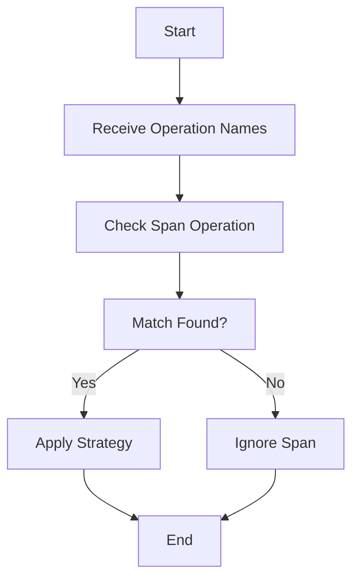

This document will cover the process of filtering spans by operation names, which includes:

1. Understanding the purpose of filtering spans by operation names
2. Detailed steps on how spans are filtered by operation names
3. How this feature affects the end user

Technical document: <SwmLink doc-title="Filtering Spans by Operation Names">[Filtering Spans by Operation Names](/.swm/filtering-spans-by-operation-names.o85n45iz.sw.md)</SwmLink>

# [Understanding the purpose of filtering spans by operation names](https://app.swimm.io/repos/Z2l0aHViJTNBJTNBc2VudHJ5LWRlbW8tMSUzQSUzQVN3aW1tLURlbW8=/docs/o85n45iz#span_op-function)

Filtering spans by operation names allows users to focus on specific types of operations when analyzing event statistics. This is particularly useful for identifying and solving issues related to specific operations within an application. By filtering out irrelevant spans, users can streamline their analysis and gain more meaningful insights into the performance and errors of their application.

# [Detailed steps on how spans are filtered by operation names](https://app.swimm.io/repos/Z2l0aHViJTNBJTNBc2VudHJ5LWRlbW8tMSUzQSUzQVN3aW1tLURlbW8=/docs/o85n45iz#span_op-function)

The process of filtering spans by operation names involves several steps:

1. **Receive Operation Names**: The system receives one or more operation names that the user is interested in.
2. **Check Span Operation**: For each span, the system checks if the span's operation matches any of the provided operation names.
3. **Match Found?**: If a match is found, the system applies a predefined strategy to the span. If no match is found, the span is ignored.
4. **Apply Strategy**: The strategy function is applied to the span, allowing for further processing or analysis based on the specific operation.
5. **End**: The process ends after all spans have been checked and the relevant strategies have been applied.

# [How this feature affects the end user](https://app.swimm.io/repos/Z2l0aHViJTNBJTNBc2VudHJ5LWRlbW8tMSUzQSUzQVN3aW1tLURlbW8=/docs/o85n45iz#span_op-function)

For the end user, filtering spans by operation names provides a more efficient way to analyze event statistics. Users can focus on specific operations that are critical to their application's performance and error tracking. This targeted analysis helps users quickly identify and resolve issues, leading to improved application performance and user satisfaction. Additionally, by filtering out irrelevant spans, users can reduce the amount of data they need to process, making their analysis more manageable and less time-consuming.

&nbsp;

*This is an auto-generated document by Swimm AI 🌊 and has not yet been verified by a human*

<SwmMeta version="3.0.0" repo-id="Z2l0aHViJTNBJTNBc2VudHJ5LWRlbW8tMSUzQSUzQVN3aW1tLURlbW8=" repo-name="sentry-demo-1" doc-type="product-flows">Powered by [Swimm](/)</SwmMeta>
