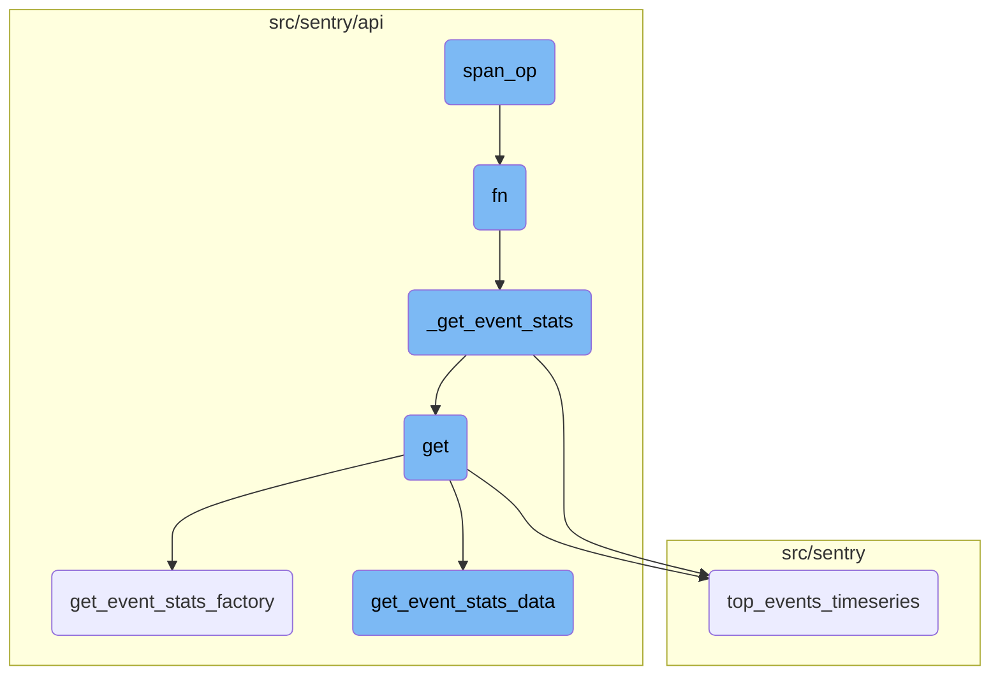
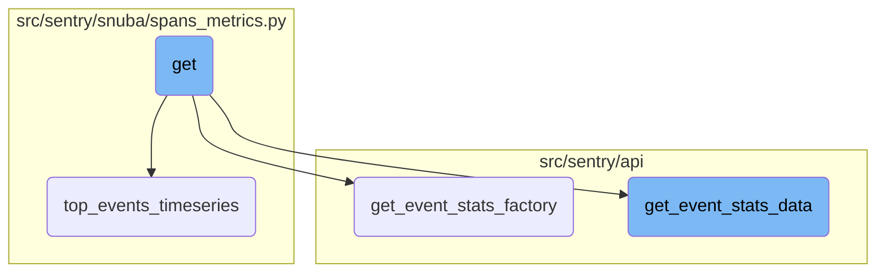

This document provides an overview of the <SwmToken path="src/sentry/spans/grouping/strategy/base.py" pos="89:2:2" line-data="def span_op(op_name: str | Sequence[str]) -&gt; Callable[[CallableStrategy], CallableStrategy]:">`span_op`</SwmToken> function, which is used to filter spans based on their operation names. It explains how the function works, its purpose, and how it fits into the overall flow of handling event statistics.

The <SwmToken path="src/sentry/spans/grouping/strategy/base.py" pos="89:2:2" line-data="def span_op(op_name: str | Sequence[str]) -&gt; Callable[[CallableStrategy], CallableStrategy]:">`span_op`</SwmToken> function helps in filtering spans by their operation names. It takes an operation name or a list of operation names and returns a function that checks if a span's operation matches any of the given names. If it matches, it applies a strategy function to the span. This is useful for focusing on specific types of operations when analyzing event statistics.

Here is a high level diagram of the flow, showing only the most important functions:



# Flow drill down

First, we'll zoom into this section of the flow:

```mermaid
graph TD;
      subgraph src/sentry
51627bbbb924d45a4e6443ac38ef7c188599e4e6c1ab498264d8a82f6db1faad(span_op):::mainFlowStyle --> 780bcbb7f1ba504427a19b761ba7a3bd49ed1d66d66daa8ef3d67ccaf80a796b(fn):::mainFlowStyle
end

subgraph src/sentry
780bcbb7f1ba504427a19b761ba7a3bd49ed1d66d66daa8ef3d67ccaf80a796b(fn):::mainFlowStyle --> ad78852d294414355cc4c1d586c85e1393b026807c627189ee95bfe783a81e9d(_get_event_stats):::mainFlowStyle
end

subgraph src/sentry
ad78852d294414355cc4c1d586c85e1393b026807c627189ee95bfe783a81e9d(_get_event_stats):::mainFlowStyle --> bc6d31d72bc18284a8d977c0ed48626395c14e576180df10f123120acbdabb9b(top_events_timeseries)
end

subgraph src/sentry
ad78852d294414355cc4c1d586c85e1393b026807c627189ee95bfe783a81e9d(_get_event_stats):::mainFlowStyle --> abc6480ff9e6702434a01780407f1b1b353e9678808b51b4270e726788e2f826(get):::mainFlowStyle
end

subgraph src/sentry
abc6480ff9e6702434a01780407f1b1b353e9678808b51b4270e726788e2f826(get):::mainFlowStyle --> db361(...)
end


      classDef mainFlowStyle color:#000000,fill:#7CB9F4
classDef rootsStyle color:#000000,fill:#00FFF4
classDef Style1 color:#000000,fill:#00FFAA
classDef Style2 color:#000000,fill:#FFFF00
classDef Style3 color:#000000,fill:#AA7CB9

%% Swimm:
%% graph TD;
%%       subgraph <SwmPath>[src/sentry/](src/sentry/)</SwmPath>
%% 51627bbbb924d45a4e6443ac38ef7c188599e4e6c1ab498264d8a82f6db1faad(span_op):::mainFlowStyle --> 780bcbb7f1ba504427a19b761ba7a3bd49ed1d66d66daa8ef3d67ccaf80a796b(fn):::mainFlowStyle
%% end
%% 
%% subgraph <SwmPath>[src/sentry/](src/sentry/)</SwmPath>
%% 780bcbb7f1ba504427a19b761ba7a3bd49ed1d66d66daa8ef3d67ccaf80a796b(fn):::mainFlowStyle --> ad78852d294414355cc4c1d586c85e1393b026807c627189ee95bfe783a81e9d(_get_event_stats):::mainFlowStyle
%% end
%% 
%% subgraph <SwmPath>[src/sentry/](src/sentry/)</SwmPath>
%% ad78852d294414355cc4c1d586c85e1393b026807c627189ee95bfe783a81e9d(_get_event_stats):::mainFlowStyle --> bc6d31d72bc18284a8d977c0ed48626395c14e576180df10f123120acbdabb9b(top_events_timeseries)
%% end
%% 
%% subgraph <SwmPath>[src/sentry/](src/sentry/)</SwmPath>
%% ad78852d294414355cc4c1d586c85e1393b026807c627189ee95bfe783a81e9d(_get_event_stats):::mainFlowStyle --> abc6480ff9e6702434a01780407f1b1b353e9678808b51b4270e726788e2f826(get):::mainFlowStyle
%% end
%% 
%% subgraph <SwmPath>[src/sentry/](src/sentry/)</SwmPath>
%% abc6480ff9e6702434a01780407f1b1b353e9678808b51b4270e726788e2f826(get):::mainFlowStyle --> db361(...)
%% end
%% 
%% 
%%       classDef mainFlowStyle color:#000000,fill:#7CB9F4
%% classDef rootsStyle color:#000000,fill:#00FFF4
%% classDef Style1 color:#000000,fill:#00FFAA
%% classDef Style2 color:#000000,fill:#FFFF00
%% classDef Style3 color:#000000,fill:#AA7CB9
```



<SwmSnippet path="/src/sentry/spans/grouping/strategy/base.py" line="89">

---

## <SwmToken path="src/sentry/spans/grouping/strategy/base.py" pos="89:2:2" line-data="def span_op(op_name: str | Sequence[str]) -&gt; Callable[[CallableStrategy], CallableStrategy]:">`span_op`</SwmToken> Function

The <SwmToken path="src/sentry/spans/grouping/strategy/base.py" pos="89:2:2" line-data="def span_op(op_name: str | Sequence[str]) -&gt; Callable[[CallableStrategy], CallableStrategy]:">`span_op`</SwmToken> function is a higher-order function that filters spans based on their operation names. It takes an operation name or a sequence of operation names and returns a wrapped function. This wrapped function checks if a span's operation matches any of the permitted operations and applies the provided strategy function to the span if it matches.

```python
def span_op(op_name: str | Sequence[str]) -> Callable[[CallableStrategy], CallableStrategy]:
    permitted_ops = [op_name] if isinstance(op_name, str) else op_name

    def wrapped(fn: CallableStrategy) -> CallableStrategy:
        return lambda span: fn(span) if span.get("op") in permitted_ops else None

    return wrapped
```

---

</SwmSnippet>

<SwmSnippet path="/src/sentry/api/endpoints/organization_events_stats.py" line="340">

---

## fn Function

The <SwmToken path="src/sentry/api/endpoints/organization_events_stats.py" pos="340:3:3" line-data="            def fn(">`fn`</SwmToken> function is responsible for fetching event statistics. It first checks if metrics are enhanced and if a dashboard widget ID is provided. Depending on these conditions, it either calls <SwmToken path="src/sentry/api/endpoints/organization_events_stats.py" pos="350:3:3" line-data="                    return _get_event_stats(">`_get_event_stats`</SwmToken> directly or performs additional logic to handle widget splits and error transactions. This function ensures that the correct dataset and query parameters are used to fetch the required event statistics.

```python
            def fn(
                query_columns: Sequence[str],
                query: str,
                snuba_params: SnubaParams,
                rollup: int,
                zerofill_results: bool,
                comparison_delta: datetime | None,
            ) -> SnubaTSResult | dict[str, SnubaTSResult]:

                if not (metrics_enhanced and dashboard_widget_id):
                    return _get_event_stats(
                        scoped_dataset,
                        query_columns,
                        query,
                        snuba_params,
                        rollup,
                        zerofill_results,
                        comparison_delta,
                    )

                try:
```

---

</SwmSnippet>

<SwmSnippet path="/src/sentry/api/endpoints/organization_events_stats.py" line="276">

---

## <SwmToken path="src/sentry/api/endpoints/organization_events_stats.py" pos="276:3:3" line-data="        def _get_event_stats(">`_get_event_stats`</SwmToken> Function

The <SwmToken path="src/sentry/api/endpoints/organization_events_stats.py" pos="276:3:3" line-data="        def _get_event_stats(">`_get_event_stats`</SwmToken> function fetches event statistics from the scoped dataset. It supports fetching top events timeseries or a general timeseries query based on the provided parameters. This function is crucial for aggregating and returning event data in a structured format.

```python
        def _get_event_stats(
            scoped_dataset: Any,
            query_columns: Sequence[str],
            query: str,
            snuba_params: SnubaParams,
            rollup: int,
            zerofill_results: bool,
            comparison_delta: datetime | None,
        ) -> SnubaTSResult | dict[str, SnubaTSResult]:
            if top_events > 0:
                return scoped_dataset.top_events_timeseries(
                    timeseries_columns=query_columns,
                    selected_columns=self.get_field_list(organization, request),
                    equations=self.get_equation_list(organization, request),
                    user_query=query,
                    snuba_params=snuba_params,
                    orderby=self.get_orderby(request),
                    rollup=rollup,
                    limit=top_events,
                    organization=organization,
                    referrer=referrer + ".find-topn",
```

---

</SwmSnippet>

<SwmSnippet path="/src/sentry/snuba/spans_metrics.py" line="144">

---

## <SwmToken path="src/sentry/snuba/spans_metrics.py" pos="144:2:2" line-data="def top_events_timeseries(">`top_events_timeseries`</SwmToken> Function

The <SwmToken path="src/sentry/snuba/spans_metrics.py" pos="144:2:2" line-data="def top_events_timeseries(">`top_events_timeseries`</SwmToken> function is a <SwmToken path="src/sentry/snuba/spans_metrics.py" pos="97:1:3" line-data="    High-level API for doing arbitrary user timeseries queries against events.">`High-level`</SwmToken> API for performing timeseries queries for a limited number of top events. It returns a dictionary of <SwmToken path="src/sentry/api/endpoints/organization_events_stats.py" pos="284:5:5" line-data="        ) -&gt; SnubaTSResult | dict[str, SnubaTSResult]:">`SnubaTSResult`</SwmToken> objects, each representing the timeseries data for a top event. This function handles the complexities of querying and aggregating timeseries data, including handling gaps and zero-filling results.

```python
def top_events_timeseries(
    timeseries_columns,
    selected_columns,
    user_query,
    snuba_params,
    orderby,
    rollup,
    limit,
    organization,
    equations=None,
    referrer=None,
    top_events=None,
    allow_empty=True,
    zerofill_results=True,
    include_other=False,
    functions_acl=None,
    on_demand_metrics_enabled=False,
    on_demand_metrics_type: MetricSpecType | None = None,
    query_source: QuerySource | None = None,
):
    """
```

---

</SwmSnippet>

Now, lets zoom into this section of the flow:



<SwmSnippet path="/src/sentry/api/endpoints/organization_events_stats.py" line="183">

---

## Handling Event Statistics

The <SwmToken path="src/sentry/api/endpoints/organization_events_stats.py" pos="183:3:3" line-data="    def get(self, request: Request, organization: Organization) -&gt; Response:">`get`</SwmToken> function is responsible for handling requests to retrieve event statistics for an organization. It processes the request parameters and delegates the actual data retrieval to helper functions like <SwmToken path="src/sentry/api/endpoints/organization_events_stats.py" pos="331:3:3" line-data="        def get_event_stats_factory(scoped_dataset):">`get_event_stats_factory`</SwmToken> and <SwmToken path="src/sentry/api/bases/organization_events.py" pos="388:3:3" line-data="    def get_event_stats_data(">`get_event_stats_data`</SwmToken>.

```python
    def get(self, request: Request, organization: Organization) -> Response:
        query_source = self.get_request_source(request)
        with sentry_sdk.start_span(op="discover.endpoint", description="filter_params") as span:
            span.set_data("organization", organization)

            top_events = 0

            if "topEvents" in request.GET:
                try:
                    top_events = int(request.GET.get("topEvents", 0))
                except ValueError:
                    return Response({"detail": "topEvents must be an integer"}, status=400)
                if top_events > MAX_TOP_EVENTS:
                    return Response(
                        {"detail": f"Can only get up to {MAX_TOP_EVENTS} top events"},
                        status=400,
                    )
                elif top_events <= 0:
                    return Response({"detail": "If topEvents needs to be at least 1"}, status=400)

            comparison_delta = None
```

---

</SwmSnippet>

<SwmSnippet path="/src/sentry/api/endpoints/organization_events_stats.py" line="331">

---

## Dashboard Widget Splits

The <SwmToken path="src/sentry/api/endpoints/organization_events_stats.py" pos="331:3:3" line-data="        def get_event_stats_factory(scoped_dataset):">`get_event_stats_factory`</SwmToken> function is a factory function that handles the logic for splitting dashboard widgets based on the type of data they display. It checks if the widget has a split configuration and processes the data accordingly, either by querying the appropriate dataset or by handling errors and transactions separately.

```python
        def get_event_stats_factory(scoped_dataset):
            """
            This factory closes over dataset in order to make an additional request to the errors dataset
            in the case that this request is from a dashboard widget and we're trying to split their discover dataset.

            This should be removed once the discover dataset is completely split in dashboards.
            """
            dashboard_widget_id = request.GET.get("dashboardWidgetId", None)

            def fn(
                query_columns: Sequence[str],
                query: str,
                snuba_params: SnubaParams,
                rollup: int,
                zerofill_results: bool,
                comparison_delta: datetime | None,
            ) -> SnubaTSResult | dict[str, SnubaTSResult]:

                if not (metrics_enhanced and dashboard_widget_id):
                    return _get_event_stats(
                        scoped_dataset,
```

---

</SwmSnippet>

<SwmSnippet path="/src/sentry/api/bases/organization_events.py" line="388">

---

## Retrieving Event Statistics Data

The <SwmToken path="src/sentry/api/bases/organization_events.py" pos="388:3:3" line-data="    def get_event_stats_data(">`get_event_stats_data`</SwmToken> function retrieves event statistics data based on the provided parameters. It constructs the necessary query, handles potential errors, and serializes the results for the response. This function ensures that the data is correctly formatted and includes any additional metadata required for the response.

```python
    def get_event_stats_data(
        self,
        request: Request,
        organization: Organization,
        get_event_stats: Callable[
            [Sequence[str], str, SnubaParams, int, bool, timedelta | None], SnubaTSResult
        ],
        top_events: int = 0,
        query_column: str = "count()",
        snuba_params: SnubaParams | None = None,
        query: str | None = None,
        allow_partial_buckets: bool = False,
        zerofill_results: bool = True,
        comparison_delta: timedelta | None = None,
        additional_query_column: str | None = None,
        dataset: Any | None = None,
    ) -> dict[str, Any]:
        with handle_query_errors():
            with sentry_sdk.start_span(
                op="discover.endpoint", description="base.stats_query_creation"
            ):
```

---

</SwmSnippet>

&nbsp;

*This is an auto-generated document by Swimm AI 🌊 and has not yet been verified by a human*

<SwmMeta version="3.0.0" repo-id="Z2l0aHViJTNBJTNBc2VudHJ5LWRlbW8tMSUzQSUzQVN3aW1tLURlbW8=" repo-name="sentry-demo-1" doc-type="flows"><sup>Powered by [Swimm](/)</sup></SwmMeta>
