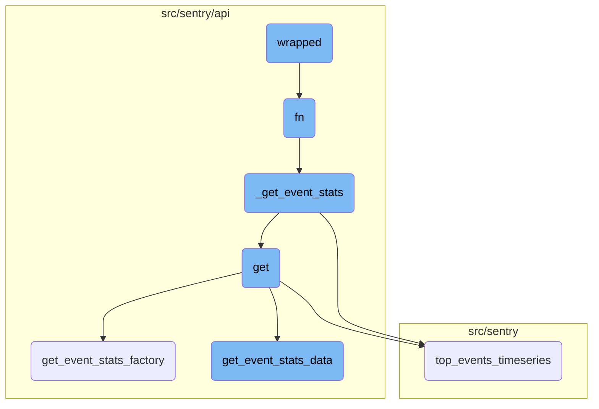
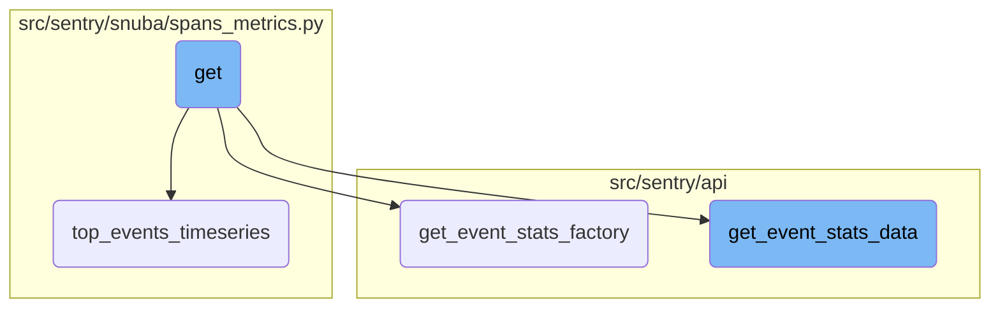

This document explains the purpose and functionality of the <SwmToken path="src/sentry/spans/grouping/strategy/base.py" pos="92:3:3" line-data="    def wrapped(fn: CallableStrategy) -&gt; CallableStrategy:">`wrapped`</SwmToken> function. It is a higher-order function that filters spans based on their operations before further processing.

The <SwmToken path="src/sentry/spans/grouping/strategy/base.py" pos="92:3:3" line-data="    def wrapped(fn: CallableStrategy) -&gt; CallableStrategy:">`wrapped`</SwmToken> function takes another function as an argument and returns a new function. This new function checks if a span's operation is in a list of permitted operations. If it is, it calls the original function with the span; if not, it returns `None`. This helps in filtering out spans that are not relevant based on their operations.

Here is a high level diagram of the flow, showing only the most important functions:



# Flow drill down

First, we'll zoom into this section of the flow:

```mermaid
graph TD;
      subgraph src/sentry
611a035db8e4485fa4e950dfbf074248712de73c3fac7f174d95ca5ef2663e36(wrapped):::mainFlowStyle --> 780bcbb7f1ba504427a19b761ba7a3bd49ed1d66d66daa8ef3d67ccaf80a796b(fn):::mainFlowStyle
end

subgraph src/sentry
780bcbb7f1ba504427a19b761ba7a3bd49ed1d66d66daa8ef3d67ccaf80a796b(fn):::mainFlowStyle --> ad78852d294414355cc4c1d586c85e1393b026807c627189ee95bfe783a81e9d(_get_event_stats):::mainFlowStyle
end

subgraph src/sentry
ad78852d294414355cc4c1d586c85e1393b026807c627189ee95bfe783a81e9d(_get_event_stats):::mainFlowStyle --> bc6d31d72bc18284a8d977c0ed48626395c14e576180df10f123120acbdabb9b(top_events_timeseries)
end

subgraph src/sentry
ad78852d294414355cc4c1d586c85e1393b026807c627189ee95bfe783a81e9d(_get_event_stats):::mainFlowStyle --> abc6480ff9e6702434a01780407f1b1b353e9678808b51b4270e726788e2f826(get):::mainFlowStyle
end

subgraph src/sentry
abc6480ff9e6702434a01780407f1b1b353e9678808b51b4270e726788e2f826(get):::mainFlowStyle --> jgzyh(...)
end


      classDef mainFlowStyle color:#000000,fill:#7CB9F4
classDef rootsStyle color:#000000,fill:#00FFF4
classDef Style1 color:#000000,fill:#00FFAA
classDef Style2 color:#000000,fill:#FFFF00
classDef Style3 color:#000000,fill:#AA7CB9

%% Swimm:
%% graph TD;
%%       subgraph <SwmPath>[src/sentry/](src/sentry/)</SwmPath>
%% 611a035db8e4485fa4e950dfbf074248712de73c3fac7f174d95ca5ef2663e36(wrapped):::mainFlowStyle --> 780bcbb7f1ba504427a19b761ba7a3bd49ed1d66d66daa8ef3d67ccaf80a796b(fn):::mainFlowStyle
%% end
%% 
%% subgraph <SwmPath>[src/sentry/](src/sentry/)</SwmPath>
%% 780bcbb7f1ba504427a19b761ba7a3bd49ed1d66d66daa8ef3d67ccaf80a796b(fn):::mainFlowStyle --> ad78852d294414355cc4c1d586c85e1393b026807c627189ee95bfe783a81e9d(_get_event_stats):::mainFlowStyle
%% end
%% 
%% subgraph <SwmPath>[src/sentry/](src/sentry/)</SwmPath>
%% ad78852d294414355cc4c1d586c85e1393b026807c627189ee95bfe783a81e9d(_get_event_stats):::mainFlowStyle --> bc6d31d72bc18284a8d977c0ed48626395c14e576180df10f123120acbdabb9b(top_events_timeseries)
%% end
%% 
%% subgraph <SwmPath>[src/sentry/](src/sentry/)</SwmPath>
%% ad78852d294414355cc4c1d586c85e1393b026807c627189ee95bfe783a81e9d(_get_event_stats):::mainFlowStyle --> abc6480ff9e6702434a01780407f1b1b353e9678808b51b4270e726788e2f826(get):::mainFlowStyle
%% end
%% 
%% subgraph <SwmPath>[src/sentry/](src/sentry/)</SwmPath>
%% abc6480ff9e6702434a01780407f1b1b353e9678808b51b4270e726788e2f826(get):::mainFlowStyle --> jgzyh(...)
%% end
%% 
%% 
%%       classDef mainFlowStyle color:#000000,fill:#7CB9F4
%% classDef rootsStyle color:#000000,fill:#00FFF4
%% classDef Style1 color:#000000,fill:#00FFAA
%% classDef Style2 color:#000000,fill:#FFFF00
%% classDef Style3 color:#000000,fill:#AA7CB9
```



<SwmSnippet path="/src/sentry/spans/grouping/strategy/base.py" line="90">

---

## wrapped Function

The <SwmToken path="src/sentry/spans/grouping/strategy/base.py" pos="92:3:3" line-data="    def wrapped(fn: CallableStrategy) -&gt; CallableStrategy:">`wrapped`</SwmToken> function is a higher-order function that takes another function <SwmToken path="src/sentry/spans/grouping/strategy/base.py" pos="92:5:5" line-data="    def wrapped(fn: CallableStrategy) -&gt; CallableStrategy:">`fn`</SwmToken> as an argument and returns a lambda function. This lambda function checks if the <SwmToken path="src/sentry/spans/grouping/strategy/base.py" pos="93:5:5" line-data="        return lambda span: fn(span) if span.get(&quot;op&quot;) in permitted_ops else None">`span`</SwmToken>'s operation (<SwmToken path="src/sentry/spans/grouping/strategy/base.py" pos="93:20:20" line-data="        return lambda span: fn(span) if span.get(&quot;op&quot;) in permitted_ops else None">`op`</SwmToken>) is in the list of permitted operations (<SwmToken path="src/sentry/spans/grouping/strategy/base.py" pos="90:1:1" line-data="    permitted_ops = [op_name] if isinstance(op_name, str) else op_name">`permitted_ops`</SwmToken>). If it is, it calls <SwmToken path="src/sentry/spans/grouping/strategy/base.py" pos="92:5:5" line-data="    def wrapped(fn: CallableStrategy) -&gt; CallableStrategy:">`fn`</SwmToken> with the <SwmToken path="src/sentry/spans/grouping/strategy/base.py" pos="93:5:5" line-data="        return lambda span: fn(span) if span.get(&quot;op&quot;) in permitted_ops else None">`span`</SwmToken>; otherwise, it returns `None`. This is useful for filtering spans based on their operations before processing them further.

```python
    permitted_ops = [op_name] if isinstance(op_name, str) else op_name

    def wrapped(fn: CallableStrategy) -> CallableStrategy:
        return lambda span: fn(span) if span.get("op") in permitted_ops else None
```

---

</SwmSnippet>

<SwmSnippet path="/src/sentry/api/endpoints/organization_events_stats.py" line="340">

---

## fn Function

The <SwmToken path="src/sentry/api/endpoints/organization_events_stats.py" pos="340:3:3" line-data="            def fn(">`fn`</SwmToken> function is responsible for fetching event statistics based on various parameters like <SwmToken path="src/sentry/api/endpoints/organization_events_stats.py" pos="341:1:1" line-data="                query_columns: Sequence[str],">`query_columns`</SwmToken>, <SwmToken path="src/sentry/api/endpoints/organization_events_stats.py" pos="342:1:1" line-data="                query: str,">`query`</SwmToken>, <SwmToken path="src/sentry/api/endpoints/organization_events_stats.py" pos="343:1:1" line-data="                snuba_params: SnubaParams,">`snuba_params`</SwmToken>, and others. It first checks if metrics are enhanced and if a dashboard widget ID is present. Depending on these conditions, it either directly calls <SwmToken path="src/sentry/api/endpoints/organization_events_stats.py" pos="350:3:3" line-data="                    return _get_event_stats(">`_get_event_stats`</SwmToken> or performs additional logic to handle widget splits and error handling. This function ensures that the correct dataset and query parameters are used to fetch the required event statistics.

```python
            def fn(
                query_columns: Sequence[str],
                query: str,
                snuba_params: SnubaParams,
                rollup: int,
                zerofill_results: bool,
                comparison_delta: datetime | None,
            ) -> SnubaTSResult | dict[str, SnubaTSResult]:

                if not (metrics_enhanced and dashboard_widget_id):
                    return _get_event_stats(
                        scoped_dataset,
                        query_columns,
                        query,
                        snuba_params,
                        rollup,
                        zerofill_results,
                        comparison_delta,
                    )

                try:
```

---

</SwmSnippet>

<SwmSnippet path="/src/sentry/api/endpoints/organization_events_stats.py" line="360">

---

### Handling Widget Splits

Within the <SwmToken path="src/sentry/spans/grouping/strategy/base.py" pos="92:5:5" line-data="    def wrapped(fn: CallableStrategy) -&gt; CallableStrategy:">`fn`</SwmToken> function, there is a section that handles widget splits. It checks if the widget has a split and whether the user has the necessary feature enabled. Depending on the type of split (error events or transaction-like), it modifies the query and dataset accordingly before calling <SwmToken path="src/sentry/api/endpoints/organization_events_stats.py" pos="276:3:3" line-data="        def _get_event_stats(">`_get_event_stats`</SwmToken>. This ensures that the data is correctly split and fetched based on the widget's configuration.

```python
                try:
                    widget = DashboardWidget.objects.get(id=dashboard_widget_id)
                    does_widget_have_split = widget.discover_widget_split is not None
                    has_override_feature = features.has(
                        "organizations:performance-discover-widget-split-override-save",
                        organization,
                        actor=request.user,
                    )

                    if does_widget_have_split and not has_override_feature:
                        # This is essentially cached behaviour and we skip the check
                        split_query = query
                        if widget.discover_widget_split == DashboardWidgetTypes.ERROR_EVENTS:
                            split_dataset = discover
                            split_query = f"({query}) AND !event.type:transaction"
                        elif widget.discover_widget_split == DashboardWidgetTypes.TRANSACTION_LIKE:
                            # We can't add event.type:transaction for now because of on-demand.
                            split_dataset = scoped_dataset
                        else:
                            # This is a fallback for the ambiguous case.
                            split_dataset = discover
```

---

</SwmSnippet>

<SwmSnippet path="/src/sentry/api/endpoints/organization_events_stats.py" line="276">

---

## <SwmToken path="src/sentry/api/endpoints/organization_events_stats.py" pos="276:3:3" line-data="        def _get_event_stats(">`_get_event_stats`</SwmToken> Function

The <SwmToken path="src/sentry/api/endpoints/organization_events_stats.py" pos="276:3:3" line-data="        def _get_event_stats(">`_get_event_stats`</SwmToken> function is responsible for querying the dataset to fetch event statistics. It checks if the <SwmToken path="src/sentry/api/endpoints/organization_events_stats.py" pos="285:3:3" line-data="            if top_events &gt; 0:">`top_events`</SwmToken> parameter is greater than zero and, if so, calls <SwmToken path="src/sentry/api/endpoints/organization_events_stats.py" pos="286:5:5" line-data="                return scoped_dataset.top_events_timeseries(">`top_events_timeseries`</SwmToken> to get the timeseries data for the top events. Otherwise, it performs a regular timeseries query. This function abstracts the logic for querying event statistics, making it reusable for different types of queries.

```python
        def _get_event_stats(
            scoped_dataset: Any,
            query_columns: Sequence[str],
            query: str,
            snuba_params: SnubaParams,
            rollup: int,
            zerofill_results: bool,
            comparison_delta: datetime | None,
        ) -> SnubaTSResult | dict[str, SnubaTSResult]:
            if top_events > 0:
                return scoped_dataset.top_events_timeseries(
                    timeseries_columns=query_columns,
                    selected_columns=self.get_field_list(organization, request),
                    equations=self.get_equation_list(organization, request),
                    user_query=query,
                    snuba_params=snuba_params,
                    orderby=self.get_orderby(request),
                    rollup=rollup,
                    limit=top_events,
                    organization=organization,
                    referrer=referrer + ".find-topn",
```

---

</SwmSnippet>

<SwmSnippet path="/src/sentry/snuba/spans_metrics.py" line="144">

---

## <SwmToken path="src/sentry/snuba/spans_metrics.py" pos="144:2:2" line-data="def top_events_timeseries(">`top_events_timeseries`</SwmToken> Function

The <SwmToken path="src/sentry/snuba/spans_metrics.py" pos="144:2:2" line-data="def top_events_timeseries(">`top_events_timeseries`</SwmToken> function is a <SwmToken path="src/sentry/snuba/spans_metrics.py" pos="97:1:3" line-data="    High-level API for doing arbitrary user timeseries queries against events.">`High-level`</SwmToken> API for performing timeseries queries for a limited number of top events. It first checks if <SwmToken path="src/sentry/snuba/spans_metrics.py" pos="155:1:1" line-data="    top_events=None,">`top_events`</SwmToken> is provided; if not, it performs a query to find the top events. It then builds and runs a timeseries query for these top events. The results are processed and returned as a dictionary of <SwmToken path="src/sentry/api/endpoints/organization_events_stats.py" pos="284:5:5" line-data="        ) -&gt; SnubaTSResult | dict[str, SnubaTSResult]:">`SnubaTSResult`</SwmToken> objects. This function is crucial for generating timeseries data for the most significant events, which can be used for performance monitoring and analysis.

```python
def top_events_timeseries(
    timeseries_columns,
    selected_columns,
    user_query,
    snuba_params,
    orderby,
    rollup,
    limit,
    organization,
    equations=None,
    referrer=None,
    top_events=None,
    allow_empty=True,
    zerofill_results=True,
    include_other=False,
    functions_acl=None,
    on_demand_metrics_enabled=False,
    on_demand_metrics_type: MetricSpecType | None = None,
    query_source: QuerySource | None = None,
):
    """
```

---

</SwmSnippet>

Now, lets zoom into this section of the flow:



<SwmSnippet path="/src/sentry/api/endpoints/organization_events_stats.py" line="183">

---

## Handling event statistics

The <SwmToken path="src/sentry/api/endpoints/organization_events_stats.py" pos="183:3:3" line-data="    def get(self, request: Request, organization: Organization) -&gt; Response:">`get`</SwmToken> function is responsible for handling the request to retrieve event statistics for a given organization. It processes the request parameters and delegates the actual data retrieval to other helper functions like <SwmToken path="src/sentry/api/endpoints/organization_events_stats.py" pos="331:3:3" line-data="        def get_event_stats_factory(scoped_dataset):">`get_event_stats_factory`</SwmToken> and <SwmToken path="src/sentry/api/bases/organization_events.py" pos="388:3:3" line-data="    def get_event_stats_data(">`get_event_stats_data`</SwmToken>.

```python
    def get(self, request: Request, organization: Organization) -> Response:
        query_source = self.get_request_source(request)
        with sentry_sdk.start_span(op="discover.endpoint", description="filter_params") as span:
            span.set_data("organization", organization)

            top_events = 0

            if "topEvents" in request.GET:
                try:
                    top_events = int(request.GET.get("topEvents", 0))
                except ValueError:
                    return Response({"detail": "topEvents must be an integer"}, status=400)
                if top_events > MAX_TOP_EVENTS:
                    return Response(
                        {"detail": f"Can only get up to {MAX_TOP_EVENTS} top events"},
                        status=400,
                    )
                elif top_events <= 0:
                    return Response({"detail": "If topEvents needs to be at least 1"}, status=400)

            comparison_delta = None
```

---

</SwmSnippet>

<SwmSnippet path="/src/sentry/api/endpoints/organization_events_stats.py" line="331">

---

### Event statistics factory

The <SwmToken path="src/sentry/api/endpoints/organization_events_stats.py" pos="331:3:3" line-data="        def get_event_stats_factory(scoped_dataset):">`get_event_stats_factory`</SwmToken> function creates a closure over the dataset to handle additional requests to the errors dataset. It checks if the request is from a dashboard widget and whether the dataset needs to be split. Depending on the conditions, it either returns the event statistics directly or processes them further to handle errors and transactions separately.

```python
        def get_event_stats_factory(scoped_dataset):
            """
            This factory closes over dataset in order to make an additional request to the errors dataset
            in the case that this request is from a dashboard widget and we're trying to split their discover dataset.

            This should be removed once the discover dataset is completely split in dashboards.
            """
            dashboard_widget_id = request.GET.get("dashboardWidgetId", None)

            def fn(
                query_columns: Sequence[str],
                query: str,
                snuba_params: SnubaParams,
                rollup: int,
                zerofill_results: bool,
                comparison_delta: datetime | None,
            ) -> SnubaTSResult | dict[str, SnubaTSResult]:

                if not (metrics_enhanced and dashboard_widget_id):
                    return _get_event_stats(
                        scoped_dataset,
```

---

</SwmSnippet>

<SwmSnippet path="/src/sentry/api/bases/organization_events.py" line="388">

---

### Retrieving event statistics data

The <SwmToken path="src/sentry/api/bases/organization_events.py" pos="388:3:3" line-data="    def get_event_stats_data(">`get_event_stats_data`</SwmToken> function is responsible for retrieving the actual event statistics data. It handles query errors, constructs the necessary query parameters, and calls the provided <SwmToken path="src/sentry/api/bases/organization_events.py" pos="392:1:1" line-data="        get_event_stats: Callable[">`get_event_stats`</SwmToken> function to fetch the data. It also serializes the results and handles any additional processing required for top events or multiple axes.

```python
    def get_event_stats_data(
        self,
        request: Request,
        organization: Organization,
        get_event_stats: Callable[
            [Sequence[str], str, SnubaParams, int, bool, timedelta | None], SnubaTSResult
        ],
        top_events: int = 0,
        query_column: str = "count()",
        snuba_params: SnubaParams | None = None,
        query: str | None = None,
        allow_partial_buckets: bool = False,
        zerofill_results: bool = True,
        comparison_delta: timedelta | None = None,
        additional_query_column: str | None = None,
        dataset: Any | None = None,
    ) -> dict[str, Any]:
        with handle_query_errors():
            with sentry_sdk.start_span(
                op="discover.endpoint", description="base.stats_query_creation"
            ):
```

---

</SwmSnippet>

&nbsp;

*This is an auto-generated document by Swimm AI 🌊 and has not yet been verified by a human*

<SwmMeta version="3.0.0" repo-id="Z2l0aHViJTNBJTNBc2VudHJ5LWRlbW8tMSUzQSUzQVN3aW1tLURlbW8=" repo-name="sentry-demo-1" doc-type="flows"><sup>Powered by [Swimm](/)</sup></SwmMeta>
