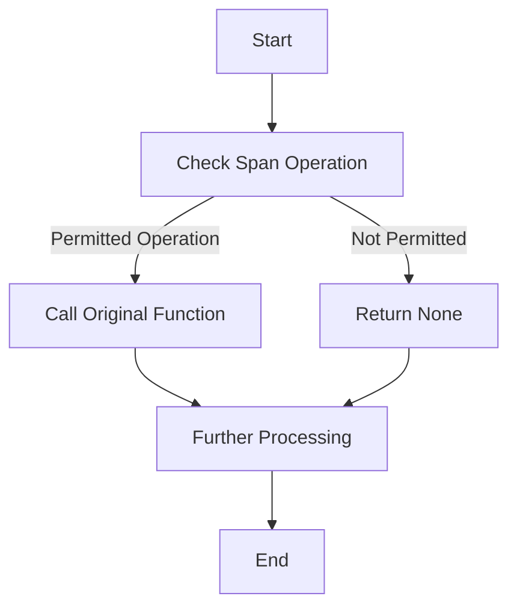

This document will cover the process of filtering spans with a wrapped function, which includes:

1. Understanding the purpose of the wrapped function
2. How the wrapped function filters spans
3. The impact on end users

Technical document: <SwmLink doc-title="Filtering Spans with Wrapped Function">[Filtering Spans with Wrapped Function](/.swm/filtering-spans-with-wrapped-function.137i3vhx.sw.md)</SwmLink>

# [Understanding the purpose of the wrapped function](https://app.swimm.io/repos/Z2l0aHViJTNBJTNBc2VudHJ5LWRlbW8tMSUzQSUzQVN3aW1tLURlbW8=/docs/137i3vhx#wrapped-function)

The wrapped function is designed to filter spans based on their operations before any further processing occurs. This means that only spans with specific, permitted operations are processed further, while others are ignored. This is particularly useful in scenarios where we want to focus on certain types of operations and exclude irrelevant ones.

# [How the wrapped function filters spans](https://app.swimm.io/repos/Z2l0aHViJTNBJTNBc2VudHJ5LWRlbW8tMSUzQSUzQVN3aW1tLURlbW8=/docs/137i3vhx#wrapped-function)

The wrapped function takes another function as an argument and returns a new function. This new function checks if a span's operation is in a list of permitted operations. If the operation is permitted, the original function is called with the span as an argument. If the operation is not permitted, the function returns None. This filtering mechanism ensures that only relevant spans are processed further, improving efficiency and focus.

# [The impact on end users](https://app.swimm.io/repos/Z2l0aHViJTNBJTNBc2VudHJ5LWRlbW8tMSUzQSUzQVN3aW1tLURlbW8=/docs/137i3vhx#wrapped-function)

For end users, this filtering mechanism means that the system can more efficiently process and analyze spans, focusing only on those that are relevant. This can lead to faster performance and more accurate monitoring and error tracking. By excluding irrelevant spans, the system reduces noise and provides clearer insights into the application's performance and issues.

&nbsp;

*This is an auto-generated document by Swimm AI 🌊 and has not yet been verified by a human*

<SwmMeta version="3.0.0" repo-id="Z2l0aHViJTNBJTNBc2VudHJ5LWRlbW8tMSUzQSUzQVN3aW1tLURlbW8=" repo-name="sentry-demo-1" doc-type="product-flows">Powered by [Swimm](/)</SwmMeta>
