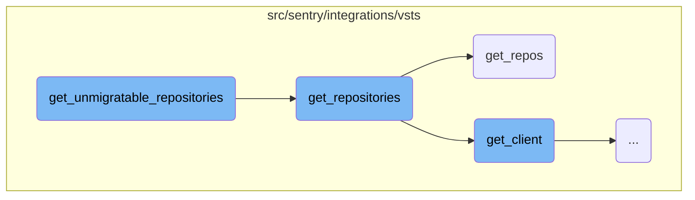
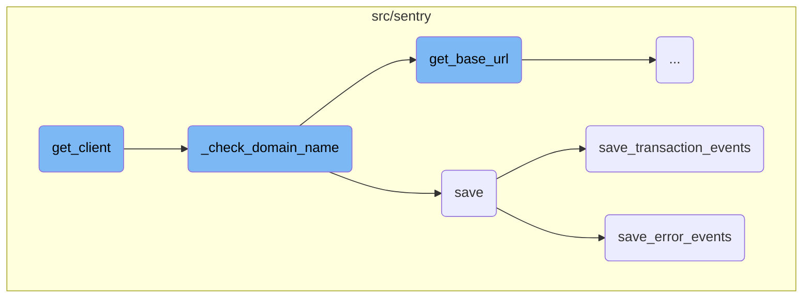
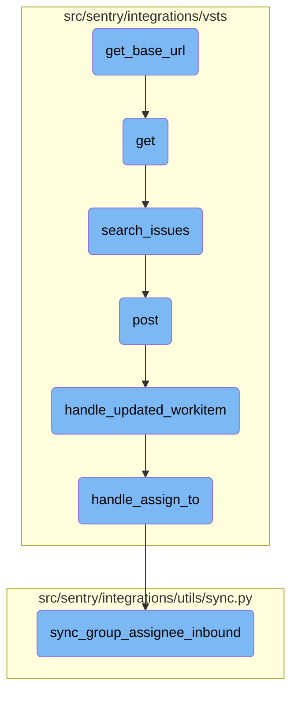

This document explains the process of filtering out repositories that have already been migrated. It involves retrieving all repositories associated with an organization, collecting identifiers of repositories to exclude, and returning a list of repositories that are not in the exclusion list.

The flow starts by getting all the repositories linked to an organization. Then, it gathers the identifiers of repositories that should be excluded. Finally, it returns a list of repositories that haven't been migrated yet by checking if their identifiers are not in the exclusion list.

Here is a high level diagram of the flow, showing only the most important functions:

```mermaid
graph TD;
      subgraph src/sentry/integrations/vsts
f4f5ec600d962ea68179dfc6a4562bd68c1e6f27f53210c75c63d7b2d307ced2(get_unmigratable_repositories):::mainFlowStyle --> cad6928b5d882a7edd3adbc25c5a0ba5b67661b9c076b930750c017e95770bc9(get_repositories):::mainFlowStyle
end

subgraph src/sentry/integrations/vsts
cad6928b5d882a7edd3adbc25c5a0ba5b67661b9c076b930750c017e95770bc9(get_repositories):::mainFlowStyle --> 0d5df30a77f81c7761642742c03d76fe21f73422aa773492ed9505dfcf14dfd2(get_repos)
end

subgraph src/sentry/integrations/vsts
cad6928b5d882a7edd3adbc25c5a0ba5b67661b9c076b930750c017e95770bc9(get_repositories):::mainFlowStyle --> 0929df67669e089b92a784392a4caa0c21baeadfd85263fa34c49a09c193b3d1(get_client):::mainFlowStyle
end

subgraph src/sentry/integrations/vsts
0929df67669e089b92a784392a4caa0c21baeadfd85263fa34c49a09c193b3d1(get_client):::mainFlowStyle --> 7f10adeb955518d0b9ce9a18ae73cf60c8e87d6b2b7bc87f5b2addc217981d21(_check_domain_name):::mainFlowStyle
end

subgraph src/sentry/event_manager.py
7f10adeb955518d0b9ce9a18ae73cf60c8e87d6b2b7bc87f5b2addc217981d21(_check_domain_name):::mainFlowStyle --> 5086692df24257d76a0adf892eba843feac14033d92b4a32022b125d5a725f9b(save)
end

subgraph src/sentry/integrations/vsts
7f10adeb955518d0b9ce9a18ae73cf60c8e87d6b2b7bc87f5b2addc217981d21(_check_domain_name):::mainFlowStyle --> 3a40802301e1642b0a2d0ce06ddee674da6a7fd8353ad71b1c436be19e6563d6(get_base_url):::mainFlowStyle
end

subgraph src/sentry/integrations/vsts
3a40802301e1642b0a2d0ce06ddee674da6a7fd8353ad71b1c436be19e6563d6(get_base_url):::mainFlowStyle --> c9f1b6abd5b86b248deafac3aa63eb8d055350bf49cbe100c54a0d94ee13361a(get):::mainFlowStyle
end

subgraph src/sentry/integrations/vsts
c9f1b6abd5b86b248deafac3aa63eb8d055350bf49cbe100c54a0d94ee13361a(get):::mainFlowStyle --> fc4a2a7e5f1b5a9d6230778920f9b62f4b7f3caa80ebd97c89444e007895b382(search_issues):::mainFlowStyle
end

subgraph src/sentry/integrations/vsts
fc4a2a7e5f1b5a9d6230778920f9b62f4b7f3caa80ebd97c89444e007895b382(search_issues):::mainFlowStyle --> a0445eff32744589c21cfe40b46d7b4346893653994134be4a340aaaf32b3f6d(post):::mainFlowStyle
end

subgraph src/sentry/integrations/vsts
a0445eff32744589c21cfe40b46d7b4346893653994134be4a340aaaf32b3f6d(post):::mainFlowStyle --> 66e049c83c1ca3a7a23933e320651f77196243d817b62c1a401dfd7205f9a929(handle_updated_workitem):::mainFlowStyle
end

subgraph src/sentry/integrations/vsts
66e049c83c1ca3a7a23933e320651f77196243d817b62c1a401dfd7205f9a929(handle_updated_workitem):::mainFlowStyle --> 66c307c65db74ab637ed0ed1623cc34d22110f0911938f86a52ccb8f5e8009dd(handle_assign_to):::mainFlowStyle
end

subgraph src/sentry/integrations/utils/sync.py
66c307c65db74ab637ed0ed1623cc34d22110f0911938f86a52ccb8f5e8009dd(handle_assign_to):::mainFlowStyle --> dd6f2c6555a3ad00a0aed3ab34055c7026063e3a2a74b2537fcf2a1223ffa577(sync_group_assignee_inbound):::mainFlowStyle
end


      classDef mainFlowStyle color:#000000,fill:#7CB9F4
classDef rootsStyle color:#000000,fill:#00FFF4
classDef Style1 color:#000000,fill:#00FFAA
classDef Style2 color:#000000,fill:#FFFF00
classDef Style3 color:#000000,fill:#AA7CB9

%% Swimm:
%% graph TD;
%%       subgraph <SwmPath>[src/sentry/integrations/vsts/](src/sentry/integrations/vsts/)</SwmPath>
%% f4f5ec600d962ea68179dfc6a4562bd68c1e6f27f53210c75c63d7b2d307ced2(get_unmigratable_repositories):::mainFlowStyle --> cad6928b5d882a7edd3adbc25c5a0ba5b67661b9c076b930750c017e95770bc9(get_repositories):::mainFlowStyle
%% end
%% 
%% subgraph <SwmPath>[src/sentry/integrations/vsts/](src/sentry/integrations/vsts/)</SwmPath>
%% cad6928b5d882a7edd3adbc25c5a0ba5b67661b9c076b930750c017e95770bc9(get_repositories):::mainFlowStyle --> 0d5df30a77f81c7761642742c03d76fe21f73422aa773492ed9505dfcf14dfd2(get_repos)
%% end
%% 
%% subgraph <SwmPath>[src/sentry/integrations/vsts/](src/sentry/integrations/vsts/)</SwmPath>
%% cad6928b5d882a7edd3adbc25c5a0ba5b67661b9c076b930750c017e95770bc9(get_repositories):::mainFlowStyle --> 0929df67669e089b92a784392a4caa0c21baeadfd85263fa34c49a09c193b3d1(get_client):::mainFlowStyle
%% end
%% 
%% subgraph <SwmPath>[src/sentry/integrations/vsts/](src/sentry/integrations/vsts/)</SwmPath>
%% 0929df67669e089b92a784392a4caa0c21baeadfd85263fa34c49a09c193b3d1(get_client):::mainFlowStyle --> 7f10adeb955518d0b9ce9a18ae73cf60c8e87d6b2b7bc87f5b2addc217981d21(_check_domain_name):::mainFlowStyle
%% end
%% 
%% subgraph <SwmPath>[src/sentry/event_manager.py](src/sentry/event_manager.py)</SwmPath>
%% 7f10adeb955518d0b9ce9a18ae73cf60c8e87d6b2b7bc87f5b2addc217981d21(_check_domain_name):::mainFlowStyle --> 5086692df24257d76a0adf892eba843feac14033d92b4a32022b125d5a725f9b(save)
%% end
%% 
%% subgraph <SwmPath>[src/sentry/integrations/vsts/](src/sentry/integrations/vsts/)</SwmPath>
%% 7f10adeb955518d0b9ce9a18ae73cf60c8e87d6b2b7bc87f5b2addc217981d21(_check_domain_name):::mainFlowStyle --> 3a40802301e1642b0a2d0ce06ddee674da6a7fd8353ad71b1c436be19e6563d6(get_base_url):::mainFlowStyle
%% end
%% 
%% subgraph <SwmPath>[src/sentry/integrations/vsts/](src/sentry/integrations/vsts/)</SwmPath>
%% 3a40802301e1642b0a2d0ce06ddee674da6a7fd8353ad71b1c436be19e6563d6(get_base_url):::mainFlowStyle --> c9f1b6abd5b86b248deafac3aa63eb8d055350bf49cbe100c54a0d94ee13361a(get):::mainFlowStyle
%% end
%% 
%% subgraph <SwmPath>[src/sentry/integrations/vsts/](src/sentry/integrations/vsts/)</SwmPath>
%% c9f1b6abd5b86b248deafac3aa63eb8d055350bf49cbe100c54a0d94ee13361a(get):::mainFlowStyle --> fc4a2a7e5f1b5a9d6230778920f9b62f4b7f3caa80ebd97c89444e007895b382(search_issues):::mainFlowStyle
%% end
%% 
%% subgraph <SwmPath>[src/sentry/integrations/vsts/](src/sentry/integrations/vsts/)</SwmPath>
%% fc4a2a7e5f1b5a9d6230778920f9b62f4b7f3caa80ebd97c89444e007895b382(search_issues):::mainFlowStyle --> a0445eff32744589c21cfe40b46d7b4346893653994134be4a340aaaf32b3f6d(post):::mainFlowStyle
%% end
%% 
%% subgraph <SwmPath>[src/sentry/integrations/vsts/](src/sentry/integrations/vsts/)</SwmPath>
%% a0445eff32744589c21cfe40b46d7b4346893653994134be4a340aaaf32b3f6d(post):::mainFlowStyle --> 66e049c83c1ca3a7a23933e320651f77196243d817b62c1a401dfd7205f9a929(handle_updated_workitem):::mainFlowStyle
%% end
%% 
%% subgraph <SwmPath>[src/sentry/integrations/vsts/](src/sentry/integrations/vsts/)</SwmPath>
%% 66e049c83c1ca3a7a23933e320651f77196243d817b62c1a401dfd7205f9a929(handle_updated_workitem):::mainFlowStyle --> 66c307c65db74ab637ed0ed1623cc34d22110f0911938f86a52ccb8f5e8009dd(handle_assign_to):::mainFlowStyle
%% end
%% 
%% subgraph <SwmPath>[src/sentry/integrations/utils/sync.py](src/sentry/integrations/utils/sync.py)</SwmPath>
%% 66c307c65db74ab637ed0ed1623cc34d22110f0911938f86a52ccb8f5e8009dd(handle_assign_to):::mainFlowStyle --> dd6f2c6555a3ad00a0aed3ab34055c7026063e3a2a74b2537fcf2a1223ffa577(sync_group_assignee_inbound):::mainFlowStyle
%% end
%% 
%% 
%%       classDef mainFlowStyle color:#000000,fill:#7CB9F4
%% classDef rootsStyle color:#000000,fill:#00FFF4
%% classDef Style1 color:#000000,fill:#00FFAA
%% classDef Style2 color:#000000,fill:#FFFF00
%% classDef Style3 color:#000000,fill:#AA7CB9
```



# Flow drill down

First, we'll zoom into this section of the flow:



<SwmSnippet path="/src/sentry/integrations/vsts/integration.py" line="310">

---

## Filtering unmigratable repositories

The function <SwmToken path="src/sentry/integrations/vsts/integration.py" pos="310:3:3" line-data="    def get_unmigratable_repositories(self) -&gt; list[RpcRepository]:">`get_unmigratable_repositories`</SwmToken> filters out repositories that have already been migrated. It first retrieves all repositories associated with the organization using <SwmToken path="src/sentry/integrations/vsts/integration.py" pos="311:5:7" line-data="        repos = repository_service.get_repositories(">`repository_service.get_repositories`</SwmToken>. Then, it collects the identifiers of repositories that should be excluded by calling <SwmToken path="src/sentry/integrations/vsts/integration.py" pos="314:19:23" line-data="        identifiers_to_exclude = {r[&quot;identifier&quot;] for r in self.get_repositories()}">`self.get_repositories()`</SwmToken>. Finally, it returns a list of repositories whose <SwmToken path="src/sentry/integrations/vsts/integration.py" pos="315:18:18" line-data="        return [repo for repo in repos if repo.external_id not in identifiers_to_exclude]">`external_id`</SwmToken> is not in the set of identifiers to exclude.

```python
    def get_unmigratable_repositories(self) -> list[RpcRepository]:
        repos = repository_service.get_repositories(
            organization_id=self.organization_id, providers=["visualstudio"]
        )
        identifiers_to_exclude = {r["identifier"] for r in self.get_repositories()}
        return [repo for repo in repos if repo.external_id not in identifiers_to_exclude]
```

---

</SwmSnippet>

<SwmSnippet path="/src/sentry/integrations/vsts/integration.py" line="295">

---

## Retrieving repositories

The function <SwmToken path="src/sentry/integrations/vsts/integration.py" pos="295:3:3" line-data="    def get_repositories(self, query: str | None = None) -&gt; Sequence[Mapping[str, str]]:">`get_repositories`</SwmToken> retrieves repositories from the VSTS client. It calls <SwmToken path="src/sentry/integrations/vsts/integration.py" pos="297:5:13" line-data="            repos = self.get_client().get_repos()">`self.get_client().get_repos()`</SwmToken> to get the list of repositories. If an error occurs during this process, it raises an <SwmToken path="src/sentry/integrations/vsts/integration.py" pos="299:3:3" line-data="            raise IntegrationError(self.message_from_error(e))">`IntegrationError`</SwmToken>. The function then processes the retrieved repositories, formatting their names and identifiers, and returns this data.

```python
    def get_repositories(self, query: str | None = None) -> Sequence[Mapping[str, str]]:
        try:
            repos = self.get_client().get_repos()
        except (ApiError, IdentityNotValid) as e:
            raise IntegrationError(self.message_from_error(e))
        data = []
        for repo in repos["value"]:
            data.append(
                {
                    "name": "{}/{}".format(repo["project"]["name"], repo["name"]),
                    "identifier": repo["id"],
                }
            )
        return data
```

---

</SwmSnippet>

<SwmSnippet path="/src/sentry/integrations/vsts/client.py" line="330">

---

### Fetching repositories from VSTS

The function <SwmToken path="src/sentry/integrations/vsts/client.py" pos="330:3:3" line-data="    def get_repos(self, project: str | None = None) -&gt; Response:">`get_repos`</SwmToken> in the VSTS client fetches repositories from the VSTS API. It constructs the API endpoint URL using the base URL and project name, and makes a GET request to this endpoint with a timeout of 5 seconds.

```python
    def get_repos(self, project: str | None = None) -> Response:
        return self.get(
            VstsApiPath.repositories.format(
                instance=self.base_url, project=f"{project}/" if project else ""
            ),
            timeout=5,
        )
```

---

</SwmSnippet>

Now, lets zoom into this section of the flow:



<SwmSnippet path="/src/sentry/integrations/vsts/integration.py" line="134">

---

## Initializing <SwmToken path="src/sentry/integrations/vsts/integration.py" pos="134:10:10" line-data="    def get_client(self) -&gt; VstsApiClient:">`VstsApiClient`</SwmToken>

The <SwmToken path="src/sentry/integrations/vsts/integration.py" pos="134:3:3" line-data="    def get_client(self) -&gt; VstsApiClient:">`get_client`</SwmToken> function initializes and returns a <SwmToken path="src/sentry/integrations/vsts/integration.py" pos="134:10:10" line-data="    def get_client(self) -&gt; VstsApiClient:">`VstsApiClient`</SwmToken> instance. It ensures that the necessary identity and integration details are set, checks the current Silo mode, and retrieves the default identity if not already set.

```python
    def get_client(self) -> VstsApiClient:
        base_url = self.instance
        if SiloMode.get_current_mode() != SiloMode.REGION:
            if self.default_identity is None:
                self.default_identity = self.get_default_identity()
            self._check_domain_name(self.default_identity)

        if self.org_integration is None:
            raise Exception("self.org_integration is not defined")
        if self.org_integration.default_auth_id is None:
            raise Exception("self.org_integration.default_auth_id is not defined")
        return VstsApiClient(
            base_url=base_url,
            oauth_redirect_url=VstsIntegrationProvider.oauth_redirect_url,
            org_integration_id=self.org_integration.id,
            identity_id=self.org_integration.default_auth_id,
        )
```

---

</SwmSnippet>

<SwmSnippet path="/src/sentry/integrations/vsts/integration.py" line="358">

---

## Validating Domain Name

The <SwmToken path="src/sentry/integrations/vsts/integration.py" pos="358:3:3" line-data="    def _check_domain_name(self, default_identity: RpcIdentity) -&gt; None:">`_check_domain_name`</SwmToken> function validates the domain name in the model's metadata. If the domain name doesn't match the expected pattern, it updates the domain name using the base URL retrieved from the <SwmToken path="src/sentry/integrations/vsts/integration.py" pos="362:5:5" line-data="        base_url = VstsIntegrationProvider.get_base_url(">`VstsIntegrationProvider`</SwmToken>.

```python
    def _check_domain_name(self, default_identity: RpcIdentity) -> None:
        if re.match("^https://.+/$", self.model.metadata["domain_name"]):
            return

        base_url = VstsIntegrationProvider.get_base_url(
            default_identity.data["access_token"], self.model.external_id
        )
        self.model.metadata["domain_name"] = base_url
        self.model.save()
```

---

</SwmSnippet>

<SwmSnippet path="/src/sentry/event_manager.py" line="448">

---

## Processing and Saving Events

The <SwmToken path="src/sentry/event_manager.py" pos="448:3:3" line-data="    def save(">`save`</SwmToken> function processes and saves events. It normalizes data if needed, handles different event types, and saves adjacent models such as releases and environments to the database.

```python
    def save(
        self,
        project_id: int | None,
        raw: bool = False,
        assume_normalized: bool = False,
        start_time: float | None = None,
        cache_key: str | None = None,
        skip_send_first_transaction: bool = False,
        has_attachments: bool = False,
    ) -> Event:
        """
        After normalizing and processing an event, save adjacent models such as
        releases and environments to postgres and write the event into
        eventstream. From there it will be picked up by Snuba and
        post-processing.

        We re-insert events with duplicate IDs into Snuba, which is responsible
        for deduplicating events. Since deduplication in Snuba is on the primary
        key (based on event ID, project ID and day), events with same IDs are only
        deduplicated if their timestamps fall on the same day. The latest event
        always wins and overwrites the value of events received earlier in that day.
```

---

</SwmSnippet>

<SwmSnippet path="/src/sentry/event_manager.py" line="3040">

---

## Saving Transaction Events

The <SwmToken path="src/sentry/event_manager.py" pos="3040:2:2" line-data="def save_transaction_events(jobs: Sequence[Job], projects: ProjectsMapping) -&gt; Sequence[Job]:">`save_transaction_events`</SwmToken> function handles the saving of transaction events. It performs various operations like setting measurements, creating releases, deriving tags, and recording metrics.

```python
def save_transaction_events(jobs: Sequence[Job], projects: ProjectsMapping) -> Sequence[Job]:
    organization_ids = {project.organization_id for project in projects.values()}
    organizations = {o.id: o for o in Organization.objects.get_many_from_cache(organization_ids)}

    for project in projects.values():
        try:
            project.set_cached_field_value("organization", organizations[project.organization_id])
        except KeyError:
            continue

    set_measurement(measurement_name="jobs", value=len(jobs))
    set_measurement(measurement_name="projects", value=len(projects))

    _get_or_create_release_many(jobs, projects)
    _get_event_user_many(jobs, projects)
    _derive_plugin_tags_many(jobs, projects)
    _derive_interface_tags_many(jobs)
    _calculate_span_grouping(jobs, projects)
    _materialize_metadata_many(jobs)
    _get_or_create_environment_many(jobs, projects)
    _get_or_create_release_associated_models(jobs, projects)
```

---

</SwmSnippet>

<SwmSnippet path="/src/sentry/event_manager.py" line="544">

---

## Saving Error Events

The <SwmToken path="src/sentry/event_manager.py" pos="544:3:3" line-data="    def save_error_events(">`save_error_events`</SwmToken> function processes and saves error events. It manages attachments, assigns events to groups, creates environments and releases, and records metrics.

```python
    def save_error_events(
        self,
        project: Project,
        job: Job,
        projects: ProjectsMapping,
        metric_tags: MutableTags,
        raw: bool = False,
        cache_key: str | None = None,
        has_attachments: bool = False,
    ) -> Event:
        jobs = [job]

        if is_sample_event(job):
            logger.info(
                "save_error_events: processing sample event",
                extra={
                    "event.id": job["event"].event_id,
                    "project_id": project.id,
                    "sample_event": True,
                },
            )
```

---

</SwmSnippet>

Now, lets zoom into this section of the flow:



<SwmSnippet path="/src/sentry/integrations/vsts/integration.py" line="542">

---

## Retrieving the base URL

The function <SwmToken path="src/sentry/integrations/vsts/integration.py" pos="554:8:8" line-data="        logger.info(&quot;vsts.get_base_url&quot;, extra={&quot;responseCode&quot;: response.status_code})">`get_base_url`</SwmToken> constructs the URL for the VSTS account lookup using the provided <SwmToken path="src/sentry/integrations/vsts/integration.py" pos="542:11:11" line-data="        url = VstsIntegrationProvider.VSTS_ACCOUNT_LOOKUP_URL % account_id">`account_id`</SwmToken>. It then makes an HTTP GET request to this URL with the provided <SwmToken path="src/sentry/integrations/vsts/integration.py" pos="548:11:11" line-data="                    &quot;Authorization&quot;: f&quot;Bearer {access_token}&quot;,">`access_token`</SwmToken> in the authorization header. If the response status is 200, it extracts and returns the <SwmToken path="src/sentry/integrations/vsts/integration.py" pos="552:10:10" line-data="            return response.json()[&quot;locationUrl&quot;]">`locationUrl`</SwmToken> from the JSON response. Otherwise, it logs the response code and returns `None`.

```python
        url = VstsIntegrationProvider.VSTS_ACCOUNT_LOOKUP_URL % account_id
        with http.build_session() as session:
            response = session.get(
                url,
                headers={
                    "Content-Type": "application/json",
                    "Authorization": f"Bearer {access_token}",
                },
            )
        if response.status_code == 200:
            return response.json()["locationUrl"]

        logger.info("vsts.get_base_url", extra={"responseCode": response.status_code})
        return None
```

---

</SwmSnippet>

&nbsp;

*This is an auto-generated document by Swimm AI 🌊 and has not yet been verified by a human*

<SwmMeta version="3.0.0" repo-id="Z2l0aHViJTNBJTNBc2VudHJ5LWRlbW8tMSUzQSUzQVN3aW1tLURlbW8=" repo-name="sentry-demo-1" doc-type="flows"><sup>Powered by [Swimm](/)</sup></SwmMeta>
