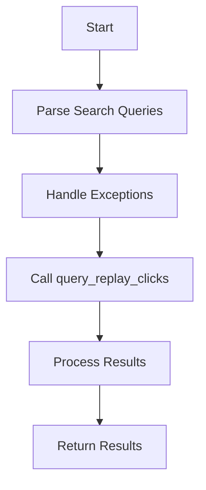

This document will cover the flow of the data_fn function, which includes:

1. Parsing search queries
2. Handling exceptions
3. Calling query_replay_clicks with appropriate parameters
4. Processing and returning results.

Technical document: <SwmLink doc-title="Flow of data_fn Function">[Flow of data_fn Function](/.swm/flow-of-data_fn-function.8w9nbfgp.sw.md)</SwmLink>

# [Parsing Search Queries](https://app.swimm.io/repos/Z2l0aHViJTNBJTNBc2VudHJ5LWRlbW8tMSUzQSUzQVN3aW1tLURlbW8=/docs/8w9nbfgp#data_fn-function)

The flow begins with parsing the search queries. This step involves extracting the search parameters from the user's request. These parameters are used to filter the data that will be queried later. For example, if a user is looking for replay clicks within a specific time frame, those details are captured here.

# [Handling Exceptions](https://app.swimm.io/repos/Z2l0aHViJTNBJTNBc2VudHJ5LWRlbW8tMSUzQSUzQVN3aW1tLURlbW8=/docs/8w9nbfgp#data_fn-function)

After parsing the search queries, the function handles any exceptions that might occur. This is important because invalid search queries can disrupt the flow. If an invalid query is detected, an error message is generated and returned to the user, ensuring they understand what went wrong and can correct their input.

# [Calling query_replay_clicks](https://app.swimm.io/repos/Z2l0aHViJTNBJTNBc2VudHJ5LWRlbW8tMSUzQSUzQVN3aW1tLURlbW8=/docs/8w9nbfgp#data_fn-function)

Once the search queries are parsed and validated, the function calls query_replay_clicks with the appropriate parameters. This step involves passing the necessary details such as project ID, replay ID, time frame, and search filters to the query_replay_clicks function. This function is responsible for performing the actual querying of replay clicks based on the provided parameters.

# [Processing Results](https://app.swimm.io/repos/Z2l0aHViJTNBJTNBc2VudHJ5LWRlbW8tMSUzQSUzQVN3aW1tLURlbW8=/docs/8w9nbfgp#query_replay_clicks-function)

The query_replay_clicks function processes the search filters and translates them into conditions for the Snuba query. This involves converting the search filters into a format that can be used to query the database. The results of this query are then processed to ensure they meet the criteria specified by the search filters.

# [Returning Results](https://app.swimm.io/repos/Z2l0aHViJTNBJTNBc2VudHJ5LWRlbW8tMSUzQSUzQVN3aW1tLURlbW8=/docs/8w9nbfgp#query_replay_clicks-function)

Finally, the processed results are returned to the user. This step involves formatting the results in a way that is easy for the user to understand and use. The results include details about the replay clicks that match the search criteria, providing the user with the information they were looking for.

&nbsp;

*This is an auto-generated document by Swimm AI 🌊 and has not yet been verified by a human*

<SwmMeta version="3.0.0" repo-id="Z2l0aHViJTNBJTNBc2VudHJ5LWRlbW8tMSUzQSUzQVN3aW1tLURlbW8=" repo-name="sentry-demo-1" doc-type="product-flows">Powered by [Swimm](/)</SwmMeta>
